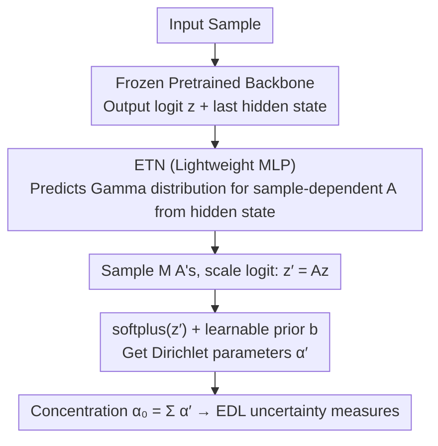

# Evidential Transformation Network: Turning Pretrained Models into Evidential Models for Post-hoc Uncertainty Estimation

**Conference**: CVPR 2026 Highlight  
**arXiv**: [2604.08627](https://arxiv.org/abs/2604.08627)  
**Code**: [GitHub](https://github.com/cyc9805/Evidential-Transformation-Network)  
**Area**: LLM Pretraining  
**Keywords**: Uncertainty Estimation, Evidential Deep Learning, Post-hoc Method, Dirichlet Distribution, LLMs

## TL;DR
The paper proposes the Evidential Transformation Network (ETN), a lightweight post-hoc module that transforms pretrained classifiers or LLMs into evidential models by learning sample-dependent affine transformations in the logit space, achieving reliable uncertainty estimation with minimal computational overhead.

## Background & Motivation

1.  **Background**: Pretrained models have become standard in vision and language fields but typically do not provide reliable confidence measures. Existing uncertainty estimation methods include Deep Ensembles, MC Dropout, and Laplace approximation. Evidential Deep Learning (EDL) offers an efficient alternative by modeling the Dirichlet distribution.
2.  **Limitations of Prior Work**: Deep Ensembles require training multiple models, MC Dropout requires multiple forward passes, and Laplace approximation requires Hessian computation—these methods are computationally expensive for large-scale pretrained models. While EDL is efficient, it requires training models from scratch to output evidence, which is inapplicable to existing pretrained networks.
3.  **Key Challenge**: Pretrained models are commonly trained with cross-entropy loss, which does not constrain the scale of logits (proven in Proposition 1), making it impossible to directly extract meaningful uncertainty. Simple fine-tuning often leads to overfitting and feature degradation due to small data regimes.
4.  **Goal**: Design a lightweight module to transform pretrained models into evidential models that output Dirichlet parameters without modifying original parameters or compromising prediction accuracy.
5.  **Key Insight**: Operates in the logit space by applying an affine transformation to logits and interpreting the transformed logits as Dirichlet parameters. The crucial innovation is that transformation parameters must be sample-dependent (since logit scales vary arbitrarily across samples under cross-entropy).
6.  **Core Idea**: A lightweight MLP predicts sample-dependent Gamma distribution parameters from the final hidden states of the pretrained model. Transformation parameters are sampled to scale the logits, and optimization is performed via ELBO to align the transformed Dirichlet distribution with the target evidence distribution.

## Method

### Overall Architecture
The problem ETN aims to solve is: given a classifier or LLM already trained with cross-entropy, how to output reliable uncertainty without modifying the model or increasing inference costs. The approach appends a lightweight post-hoc module in the logit space. Specifically, an input sample passes through a frozen pretrained backbone to obtain the logit vector $\mathbf{z}$ and the last hidden state. ETN is a small MLP that reads this hidden state and predicts sample-dependent affine transformation parameters $A$. These parameters $A$ scale the logit to $\mathbf{z}' = A\mathbf{z}$, which is then converted into positive Dirichlet parameters $\boldsymbol{\alpha}' = \text{softplus}(\mathbf{z}') + \mathbf{b}$. This preserves the original prediction probabilities (maintaining accuracy) while reinterpreting $\boldsymbol{\alpha}'$ as a Dirichlet posterior. A smaller total concentration $\alpha_0 = \sum_k \alpha'_k$ indicates higher uncertainty, enabling the direct use of EDL uncertainty measures.

### Key Designs

**1. Transformation parameters must be sample-dependent: Proof that global static transformations fail**

A natural idea is to use shared scaling parameters for all samples, but Proposition 1 invalidates this approach. It proves that under the assumptions of separable data and infinite capacity, cross-entropy loss is completely insensitive to logit scale—there exists a logit $\tilde{\mathbf{z}}$ where cross-entropy approaches 0 while the total concentration $\tilde{\alpha}_0$ remains finite, alongside another $\hat{\mathbf{z}}$ where the loss also approaches 0 but $\hat{\alpha}_0 \to \infty$. In other words, cross-entropy minimization only fixes the direction of the probability vector, not the magnitude of $\alpha_0$. Consequently, the logit scale for each sample is arbitrary. From a Bayesian perspective, EDL requires per-sample posterior Dirichlet distributions, while cross-entropy provides only a single probability vector—the information is inherently mismatched. This explains why $A$ cannot be global constants and must be determined per-sample from hidden states.

**2. Variational Inference Framework: Learning $A$ as a distribution**

Since the optimal scale varies per sample, ETN introduces a variational distribution $q_{\theta_{ETN}}(A|x)$ to approximate the true posterior rather than regressing a deterministic value. $A$ is modeled using a Gamma distribution, which supports positive real numbers to ensure monotonic scaling of logits. The training objective is derived from the ELBO, comprising two terms: a reconstruction term requiring the transformed Dirichlet distribution to approximate the target distribution $p^{(\nu)}(\boldsymbol{\pi}|y)$ determined by the label, and a KL term regularizing the variational distribution toward a prior $p(A)$. During inference, $M$ samples $A^{(m)}$ are drawn for Monte Carlo marginalization to obtain robust uncertainty estimates. The prior $\mathbf{b}$ is treated as a learnable parameter, relaxing the fixed prior assumption in Subjective Logic. Compared to deterministic temperature scaling like AdaTS, this probabilistic modeling characterizes the uncertainty distribution of each sample rather than collapsing it into a scalar.

**3. Using softplus instead of ReLU/exp: Ensuring stability and margin guarantees**

Converting $\mathbf{z}'$ into positive Dirichlet parameters requires an activation function $f$, but the choice is critical. ReLU creates "zero-evidence dead zones"—once a logit is negative, it is truncated to zero, losing information. The exponential function causes $\alpha_0$ to explode given the large logits common in pretrained models (where log-sum-exp stabilization is unavailable). softplus avoids both: it ensures positive output and grows linearly for large positive inputs, naturally constraining $\alpha_0$ to a reasonable range. Furthermore, Theorem 1 proves that under equal loss conditions, the classification margin of an EDL model is probabilistically larger than that of a cross-entropy model; this margin relationship is better guaranteed under softplus. This choice ensures both training stability and theoretical margin alignment.

### Loss & Training
The training target is the ELBO (Eq. 5): the reconstruction term is the expected KL divergence between the transformed Dirichlet and the target distribution, approximated via Monte Carlo, plus $\lambda$ times the KL regularization term to keep the variational distribution close to the prior. Only the parameters of the ETN MLP and the learnable prior $\mathbf{b}$ are updated; the backbone model remains frozen throughout. The required training data volume is significantly smaller than that used for pretraining.

## Key Experimental Results

### Main Results

**Uncertainty Estimation for Image Classification (ID + OOD Mean AUPR)**:

| Method | Uncertainty Performance | Accuracy Maintenance | Inference Overhead |
|------|-----------|-----------|---------|
| Deep Ensemble (5x) | High | ✓ | 5x inference time |
| MC Dropout (10x) | Medium | ✓ | 10x forward passes |
| Laplace Approx. | Medium | ✓ | Hessian computation |
| DMM | Medium-High | ✓ | Requires original training data |
| **Ours (ETN)** | **Highest** | **✓** | **~1x (Almost no overhead)** |

**Uncertainty Estimation for LLM Question Answering**:

| Method | ID AUPR | OOD AUPR | Inference Overhead |
|------|---------|----------|---------|
| Vanilla LLM | Low | Low | 1x |
| Ensemble | High | High | Nx |
| **Ours (ETN)** | **Highest** | **High** | **~1x** |

### Ablation Study

| Configuration | Uncertainty Performance | Description |
|------|-----------|------|
| ETN (Gamma, softplus) | Best | Full Method |
| Scalar A | Poor | Insufficient information |
| Vector A | Good | Independent scaling per class |
| Matrix A | Best | Inter-class interaction |
| Using ReLU | Poor | Zero-evidence dead zone |
| Using exp | Unstable | Numerical overflow |
| Fixed b=1 | Poor | Prior too strong |

### Key Findings
- **ETN achieves the best uncertainty estimation with almost zero additional inference overhead** (positioned top-right in Figure 1: high performance + low cost).
- **Influence of transformation parameter dimensions**: Matrix form > Vector form > Scalar form (Figure 2), as matrices allow for inter-class interactions.
- **Learnable prior b consistently improves performance**: Relaxing the fixed prior assumption of EDL is significant.

## Highlights & Insights
- **The insight from Proposition 1** is crucial: cross-entropy loss does not determine logit scale, hence meaningful uncertainty cannot be directly extracted from pretrained models. This concise theoretical result clearly explains "why sample-dependent transformation is necessary."
- **Operating in logit space** is a clever design choice: it avoids modifying the feature space (protecting pretrained representations), adds negligible inference cost (transformation is nearly free), and naturally interfaces with EDL’s Dirichlet parameterization.
- **Unified applicability from Vision to LLMs** is highly valuable: the same framework improves uncertainty estimation for both image classifiers and large language models, demonstrating the universality of logit-space transformations.

## Limitations & Future Work
- Dependent on the logit quality of the pretrained model—if the logits themselves are uninformative, the transformation cannot recover them.
- Monte Carlo sampling ($M$ times) in variational inference, while lightweight, still introduces a small additional overhead.
- Validated only on classification and QA tasks; lacking experiments on regression, segmentation, and other tasks.
- The choice of prior distribution (Gamma) is heuristic; other distribution families have not been fully explored.
- Future work could explore combining ETN with retrieval-augmented methods to further calibrate uncertainty using retrieval results.

## Related Work & Insights
- **vs Deep Ensembles**: Deep Ensembles estimate uncertainty via multi-model averaging, which is effective but costs $N \times$ computation. ETN requires only one lightweight module, costs approximately $1 \times$, and outperforms them on most metrics.
- **vs DMM (Dirichlet Meta Model)**: DMM requires access to original training data, and model size grows with the base model depth. ETN only needs small datasets to train a lightweight MLP, making it more suitable for large-scale pretrained models.
- **vs R-EDL**: R-EDL relaxes the strict EDL loss but still requires training from scratch. ETN is entirely post-hoc and applicable to any existing pretrained model.

## Rating
- Novelty: ⭐⭐⭐⭐ The idea of sample-dependent transformations in logit space is novel with clear theoretical motivation.
- Experimental Thoroughness: ⭐⭐⭐⭐ Covers Vision and LLMs, ID and OOD settings, and compares against multiple baselines.
- Writing Quality: ⭐⭐⭐⭐⭐ The logical flow from motivation to method and then to experiments is very clear.
- Value: ⭐⭐⭐⭐⭐ Provides a practical uncertainty estimation solution for large-scale pretrained models with broad application prospects.

<!-- RELATED:START -->

## Related Papers

- [\[NeurIPS 2025\] C-LoRA: Contextual Low-Rank Adaptation for Uncertainty Estimation in Large Language Models](../../NeurIPS2025/model_compression/c-lora_contextual_low-rank_adaptation_for_uncertainty_estimation_in_large_langua.md)
- [\[ICML 2026\] Quantifying the Uncertainty of Foundation Models with Singular Value Ensembles](../../ICML2026/model_compression/quantifying_the_uncertainty_of_foundation_models_with_singular_value_ensembles.md)
- [\[NeurIPS 2025\] Elastic ViTs from Pretrained Models without Retraining](../../NeurIPS2025/model_compression/elastic_vits_from_pretrained_models_without_retraining.md)
- [\[ICML 2026\] Post-Hoc Merging Is Not Enough: Many-Shot Model Merging with Loss-Gap Balancing](../../ICML2026/model_compression/post-hoc_merging_is_not_enough_many-shot_model_merging_with_loss-gap_balancing.md)
- [\[ICLR 2026\] Inlier-Centric Post-Training Quantization for Object Detection Models](../../ICLR2026/model_compression/inlier-centric_post-training_quantization_for_object_detection_models.md)

<!-- RELATED:END -->
