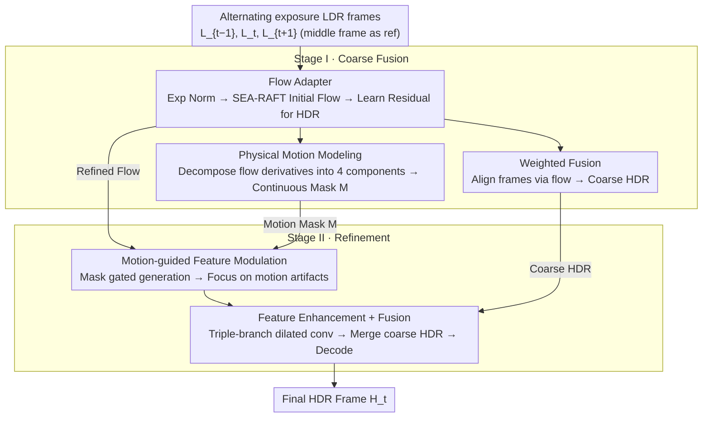

# F²HDR: Two-Stage HDR Video Reconstruction via Flow Adapter and Physical Motion Modeling

**Conference**: CVPR 2026  
**arXiv**: [2603.14920](https://arxiv.org/abs/2603.14920)  
**Code**: [https://github.com/wei1895/F2HDR](https://github.com/wei1895/F2HDR)  
**Area**: Model Compression  
**Keywords**: HDR video reconstruction, Flow Adapter, physical motion modeling, alternating exposure, two-stage reconstruction

## TL;DR
The authors propose F²HDR, a two-stage HDR video reconstruction framework. It employs a Flow Adapter to adapt general pre-trained optical flow to alternating exposure scenarios for robust alignment. It utilizes physical motion modeling to extract continuous motion masks from optical flow, guiding artifact removal in the second stage. It achieves SOTA performance on real HDR video benchmarks.

## Background & Motivation
Reconstructing HDR video from LDR frame sequences with alternating exposures is a cost-effective HDR acquisition solution. Long-exposure frames capture details in dark regions but are saturated in bright areas, while short-exposure frames preserve highlights but suffer from noise in shadows. Complementary fusion allows for the reconstruction of high dynamic range content.

**Key Challenge**: Cross-exposure frame alignment in dynamic scenes is extremely difficult. Large brightness differences between exposures and unreliable flow estimation in moving objects or occluded regions lead to ghosting and loss of detail in the fused results.

**Limitations of Prior Work**:

1.  **Insufficient alignment accuracy in the first stage**:
    *   Pre-trained general optical flow models perform poorly between frames with different exposures (matching is difficult in overexposed/underexposed regions).
    *   Task-specific flow models retrained for HDR can handle exposure variations but produce blurry edges because they are trained with HDR reconstruction loss rather than flow prediction loss.
    *   Root cause: Lack of suitable optical flow datasets for HDR reconstruction.

2.  **Lack of guidance for artifact removal in the second stage**:
    *   Existing methods simply fuse inputs of the same modality, lacking explicit modeling of "which regions contain motion artifacts."
    *   Shu et al. introduced exposure masks, but these only reflect highlights and not truly challenging motion regions.

**Core Idea**:
- Stage 1: Utilize the sharp edges of pre-trained flow + learn residual flow to adapt to HDR scenarios → **Best of both worlds**.
- Stage 2: Extract motion masks (translation, divergence, curl, shear) from flow physical decomposition → Accurately indicate artifact regions → Guide fusion.

## Method

### Overall Architecture
F²HDR decomposes the task of "HDR video reconstruction from alternating exposure LDR sequences" into two sequential stages. Given a sequence of three alternating exposure LDR frames $\{L_{t-1}, L_t, L_{t+1}\}$, with the middle frame $L_t$ as the reference, the goal is to output the corresponding HDR frame $H_t$.

The first stage (Coarse Fusion) performs alignment: exposure-normalized frames are fed into a pre-trained flow network to estimate initial flow. A Flow Adapter then adds a residual layer to adapt it to HDR scenarios. Neighboring frames are aligned and weighted-fused to obtain a coarse HDR image, while physical motion masks are computed from the flow. The second stage (Refinement) uses these motion masks as "artifact maps." LDR-domain and HDR-domain features are extracted separately, and mask-gated modulation focuses the network on motion artifact regions. After feature enhancement and fusion with the coarse HDR, the final result is decoded. The two stages are trained jointly end-to-end; gradients from the second stage backpropagate to the first-stage flow, enabling mutual optimization of alignment and de-ghosting.

### Key Designs

**1. Flow Adapter: Learning residuals on pre-trained flow instead of retraining from scratch**

Cross-exposure alignment is the hardest step. Existing approaches have major drawbacks: general pre-trained flow fails in over/underexposed regions, while flow models retrained specifically for HDR produce blurry edges due to supervision from reconstruction rather than flow. This work adopts both strengths—preserving the sharp boundaries of pre-trained flow while learning a residual to "bend" it toward the HDR scenario.

Specifically, exposure normalization aligns the reference frame's brightness to neighboring frames: $g_{t\to t-1}(L_t) = \text{clip}(((L_t^\gamma / e_t) e_{t-1})^{1/\gamma})$. Normalized pairs are fed into SEA-RAFT to get initial flow $f_{t\to t\pm1}$. The Flow Adapter is a shallow residual CNN with different dilation rates. Its input is a tensor $\mathbf{x}_t = [L_{t-1}, L_t, L_{t+1}, f/\lambda, f/\lambda]$ consisting of original frames and scaled flow. It outputs residuals $[\Delta f_{t\to t-1}, \Delta f_{t\to t+1}] = \mathcal{A}(\mathbf{x}_t)$, resulting in final flow $\tilde{f} = f + \lambda \Delta f$ ($\lambda=20$ is a fixed normalization factor). The key is joint training with the downstream HDR network, allowing the adapter to specifically correct pre-trained flow weaknesses in exposure changes and occlusions while maintaining sharp motion boundaries.

**2. Physical Motion Modeling: Decomposing spatial derivatives of flow into four physical motions to obtain continuous differentiable artifact masks**

The second stage needs to know "where motion artifacts are" for targeted de-ghosting. Existing binary masks (occlusion, SAM) only provide hard boundaries and fail to capture continuous physical features of motion. This work reads motion structures from first-order spatial derivatives of flow $f=[u,v]$, decomposing them into four physically interpretable components: Translation $\|f\|_2 = \sqrt{u^2 + v^2}$ (global displacement), Divergence $\nabla \cdot f = u_x + v_y$ (scaling motion, such as objects moving closer/further), Curl $\nabla \times f = v_x - u_y$ (rotational motion), and Shear $S = \frac{1}{2}(u_y + v_x)$ (local non-rigid deformation).

These four components are fused into a unified motion energy map using adaptive weights $w_t, w_d, w_c, w_s$ learned by a convolution block from the flow:

$$E_m = \frac{w_t \odot \|f\|_2 + w_d \odot |\nabla \cdot f| + w_c \odot |\nabla \times f| + w_s \odot |S|}{w_t + w_d + w_c + w_s + \epsilon}$$

To make motion edges more prominent, multi-scale contrast enhancement $E_s = E_m \odot (1 + 2 S_{multi})$ is applied at scales $\{1,2,4\}$. Finally, an adaptive Otsu threshold with sigmoid softening produces the mask $M = \frac{1}{2}[1 + \tanh(8(E_s - \tau))]$. The resulting $M \in [0,1]$ is continuous and differentiable, accurately indicating artifact-prone areas and enabling end-to-end training.

**3. Motion-guided Feature Modulation: Using motion masks as gates to concentrate computation on artifact regions**

With the motion mask, the second stage modulates aligned features. For each frame, LDR-domain features $F_{L_t}$ and HDR-domain features $F_{I_t}$ are extracted and fused via 1x1 convolution into $F_{LI_t} = \text{Conv}([F_{L_t}, F_{I_t}])$. Neighboring features are aligned using optical flow to $\tilde{F}_{LI_{t\pm1}}$. A gating signal $G_{t\pm1} = \sigma(\text{Conv}([\|\tilde{f}\|_2/\tilde{f}_{max}, M_{t\pm1}, \mathbf{1}]))$ is encoded from the normalized flow magnitude and motion mask. Finally, the gated modulation $\bar{F}_{LI_{t\pm1}} = G_{t\pm1} \odot \tilde{F}_{LI_{t\pm1}}$ emphasizes regions with significant motion while suppressing static areas. Enhanced features are then processed by triple-branch dilated convolutions before being fused with the coarse HDR.

### Loss & Training
- $\mu$-law tone mapping: $\mathcal{T}(H) = \frac{\log(1+\mu H)}{\log(1+\mu)}$, with $\mu=5000$
- $\ell_1$ reconstruction loss: $\mathcal{L} = \|\mathcal{T}(H_{final}) - \mathcal{T}(H_{gt})\|_1$
- Training Set: Vimeo-90K simulating alternating exposure
- Adam optimizer, initial LR $1 \times 10^{-4}$, halved every 10 epochs, 50 epochs total, batch size 16
- Trained on a single RTX 3090 GPU

## Key Experimental Results

### Main Results — DeepHDRVideo Dataset

| Method | PSNR_T↑ | SSIM_T↑ | HDR-VDP-2↑ |
|------|---------|---------|------------|
| Kalantari19 | 39.91 | 0.9329 | — |
| Chen21 | 43.32 | 0.9551 | 78.37 |
| HDRFlow | 43.03 | 0.9518 | 77.58 |
| NECHDR | 43.44 | 0.9558 | 77.28 |
| HDR-V-Diff | 42.07 | 0.9604 | — |
| **Ours (F²HDR)** | **43.87** | **0.9573** | **78.88** |

### Main Results — Real-HDRV Dataset

| Method | PSNR_T↑ | SSIM_T↑ | HDR-VDP-2↑ | PSNR_L↑ |
|------|---------|---------|------------|---------|
| Chen21 | 40.79 | 0.9510 | 76.50 | 50.30 |
| HDRFlow | 40.34 | 0.9481 | 75.82 | 49.72 |
| NECHDR | 40.88 | 0.9518 | 76.77 | 50.41 |
| **Ours (F²HDR)** | **41.01** | **0.9538** | **76.93** | **50.51** |

### Ablation Study

| Configuration | DeepHDRVideo PSNR_T | Real-HDRV PSNR_T |
|------|---------------------|------------------|
| Stage I w/o Flow Adapter | 43.06 | 40.29 |
| Stage I w/o FA + Stage II | 43.21 | 40.45 |
| Stage I (with FA) | 43.39 | 40.61 |
| Stage I w/o Mask + Stage II | 43.68 | 40.87 |
| Stage I w/ CNN Mask + Stage II | 43.76 | 40.93 |
| **Full (Stage I + Stage II)** | **43.87** | **41.01** |

### Optical Flow Quality Assessment (Real-HDRV)

| Method | EPE↓ | LDR Warping PSNR↑ | LDR Warping SSIM↑ |
|------|------|-------------------|-------------------|
| HDRFlow | 3.53 | 29.93 | 0.8763 |
| NECHDR | 3.30 | 30.31 | 0.8901 |
| Ours w/o FA | 1.81 | 30.39 | 0.8897 |
| **Ours** | **2.08** | **30.84** | **0.8922** |

### Key Findings
- Flow Adapter is the most critical component: removing it drops DeepHDRVideo PSNR by 0.81 dB (43.87→43.06).
- Physical motion masks contribute 0.19 dB, outperforming CNN-learned masks (0.11 dB), validating the value of physical priors.
- Interesting finding: Adding the Flow Adapter increases EPE (2.08 > 1.81) but improves warping quality because the adapter generates non-zero flow offsets for occluded regions, whereas pseudo-labels are zero in occlusions.
- The two-stage scheme significantly improves over single-stage alternatives.
- Inference speed (0.29s@1080p) sits between the fastest HDRFlow (0.076s) and the slowest LAN-HDR (0.905s).

## Highlights & Insights
- **Ingenious Flow Adapter design**: Instead of retraining flow, it learns residuals, balancing the sharp edges of pre-trained models with task-specific adaptation.
- **Physical motion decomposition** offers theoretical elegance: decomposing flow derivatives into four interpretable physical components for continuous masks proves superior to binary masks.
- Optimization in the second stage backpropagates to the first-stage flow, creating a mutually beneficial relationship.
- The exposure normalization trick (aligning to neighboring frame exposure before feeding into pre-trained flow) is simple yet effective.

## Limitations & Future Work
- The method is based on three-frame input ($t-1, t, t+1$); a longer temporal window might further improve stability.
- Flow Adapter is a shallow CNN, which may lack capacity for extremely large displacements.
- Training data is derived from Vimeo-90K simulated exposures; domain gap may affect generalization to real-world scenes.
- Physical motion decomposition is based on first-order derivatives; higher-order motion features (acceleration, etc.) are not considered.
- Inference speed has room for optimization (4x slower than HDRFlow).
- Lack of evaluation on video-level temporal consistency metrics (e.g., tOF, tLP).

## Related Work & Insights
- HDRFlow's lightweight task-specific flow vs. this work's adapter scheme: Both routes have pros and cons.
- Physical motion decomposition could be generalized to other video processing tasks requiring motion awareness (deblurring, stabilization, etc.).
- The Flow Adapter concept is similar to adapter tuning in NLP; the paradigm of adapting pre-trained models to downstream tasks is highly versatile.

## Rating
- Novelty: ⭐⭐⭐⭐ Both Flow Adapter (residual flow adaptation) and physical motion modeling are distinct technical contributions.
- Experimental Thoroughness: ⭐⭐⭐⭐ Two real datasets + flow quality assessment + complete ablation + inference speed comparison.
- Writing Quality: ⭐⭐⭐⭐ Clear motivation, with a strong correspondence between the two core problems and the two solutions.
- Value: ⭐⭐⭐⭐ A practical framework for HDR video reconstruction; the Flow Adapter idea is highly generalizable.

<!-- RELATED:START -->

## Related Papers

- [\[ICLR 2026\] S2R-HDR: A Large-Scale Rendered Dataset for HDR Fusion](../../ICLR2026/model_compression/s2r-hdr_a_large-scale_rendered_dataset_for_hdr_fusion.md)
- [\[CVPR 2026\] PRISM: Video Dataset Condensation with Progressive Refinement and Insertion for Sparse Motion](prism_video_dataset_condensation_with_progressive_refinement_and_insertion_for_s.md)
- [\[ACL 2026\] Two-Stage Regularization-Based Structured Pruning for LLMs](../../ACL2026/model_compression/two-stage_regularization-based_structured_pruning_for_llms.md)
- [\[CVPR 2026\] High Resolution Neural Video Coding with Bi-directional Confidence-Guided Reference Information Modeling](high_resolution_neural_video_coding_with_bi-directional_confidence-guided_refere.md)
- [\[CVPR 2026\] Towards Unified Human Perception and Machine Understanding: Token Flow Guided Compression Framework](towards_unified_human_perception_and_machine_understanding_token_flow_guided_com.md)

<!-- RELATED:END -->
