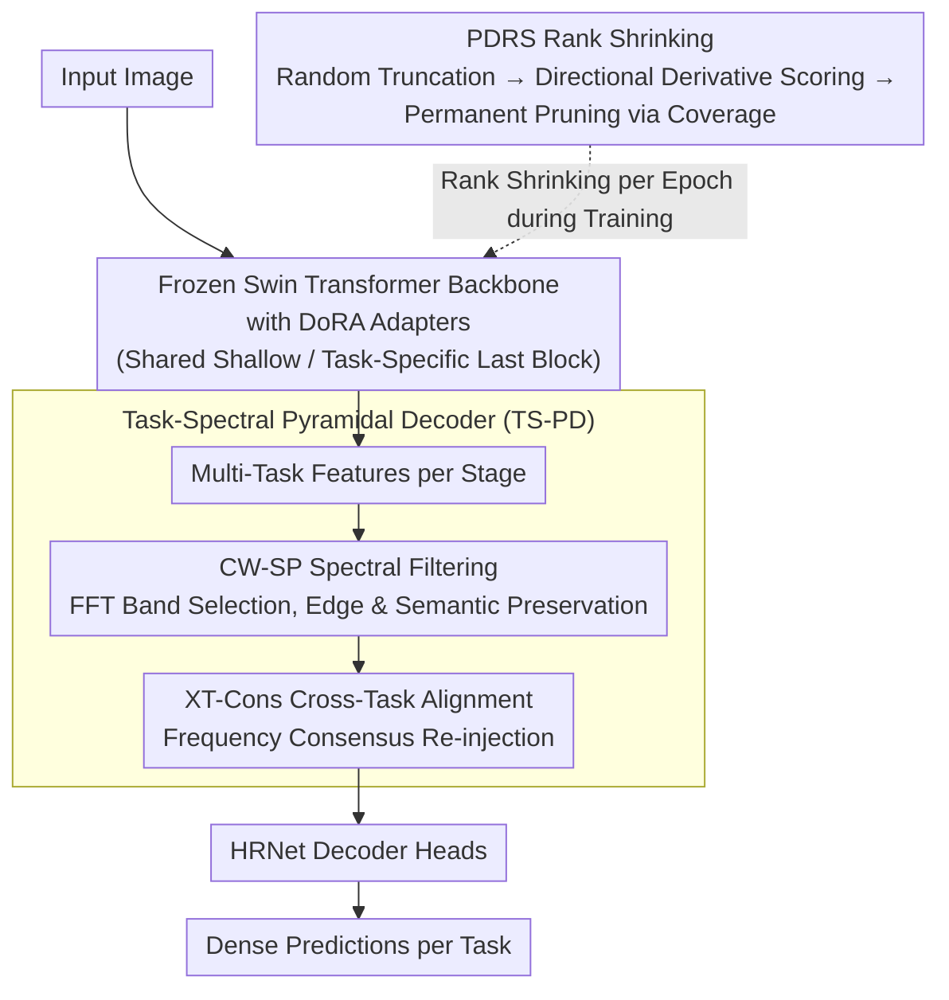

# FAAR: Efficient Frequency-Aware Multi-Task Fine-Tuning via Automatic Rank Selection

**Conference**: CVPR 2026  
**arXiv**: [2603.20403](https://arxiv.org/abs/2603.20403)  
**Code**: Available (as mentioned in the paper)  
**Area**: Parameter-Efficient Fine-Tuning / Multi-Task Learning  
**Keywords**: LoRA, Automatic Rank Selection, FFT, multi-task learning, PEFT

## TL;DR

FAAR is proposed as a frequency-aware multi-task parameter-efficient fine-tuning method. It dynamically selects the optimal rank for each task and layer through Performance-Driven Rank Shrinking (PDRS) and enhances spatial awareness and cross-task consistency using the Task-Spectral Pyramidal Decoder (TS-PD) with FFT frequency information. It achieves superior performance with only 1/9 of the parameters compared to traditional fine-tuning.

## Background & Motivation

Multi-task learning (MTL) aims to learn multiple tasks simultaneously, sharing representations to discover relationships and structures between tasks. As backbone model parameters grow, traditional full fine-tuning becomes increasingly infeasible. Parameter-efficient fine-tuning (PEFT), particularly methods based on Low-Rank Adaptation (LoRA), has become mainstream.

However, existing LoRA-based MTL methods face two core limitations:

**Fixed Rank Issue**: Current methods use a uniform rank for all layers and tasks. This is counter-intuitive, as different tasks may require different adaptation strengths, and different layers require varying degrees of fine-tuning flexibility. Deep layers often need stronger adaptation for task-specific fine-grained information, while shallow layers may only require minor adjustments.

**Lack of Spatial Inductive Bias**: Existing LoRA-based MTL strategies neglect the role of cross-task interactions in deep layers. For dense visual tasks such as semantic segmentation, depth estimation, and surface normal estimation, strong spatial awareness and cross-task geometric consistency are crucial, but low-rank adaptation inherently lacks this capability.

The approach of FAAR:
- Resolves the fixed rank issue via PDRS, allowing each task/layer to automatically find the optimal rank.
- Introduces cost-effective yet efficient spatial information and cross-task relationships via frequency analysis (TS-PD).

## Method

### Overall Architecture

FAAR addresses two intertwined challenges in dense visual multi-task fine-tuning: selecting appropriate ranks for each layer and task without manual tuning, and compensating for the lack of spatial awareness and cross-task consistency in low-rank adaptation. The overall pipeline is as follows: the input image passes through a **frozen** Swin Transformer backbone equipped with DoRA adapters—where the last block of each stage uses task-specific adapters and previous blocks share the same set of adapters. Multi-task features from the backbone are fed into the Task-Spectral Pyramidal Decoder (TS-PD) for frequency enhancement and cross-task alignment, finally producing dense predictions for each task via HRNet decoding heads. PDRS operates throughout training, gradually shrinking the adapter ranks from 64 down to single digits.

### Key Designs

**1. Performance-Driven Rank Shrinking (PDRS): Allowing Loss to Determine Rank Distribution**

The drawback of fixed ranks is the assumption of uniform adaptation strength across all layers and tasks. In reality, deep and task-specific layers require more fine-tuning capacity. PDRS dynamically removes ranks during training via a two-step process. During the forward pass, **Rank Masking** is performed by randomly sampling a prefix length $b \in \{1, ..., r_{curr}\}$ and constructing a binary mask to allow only the first $b$ rank components: $A^{eff} = \text{diag}(m) A$, $B^{eff} = B \text{diag}(m)$. This truncation forces important rank-1 updates to concentrate in lower dimensions. During the backward pass, **Coverage Selection** calculates an importance score for each active rank $i$ using the directional derivative of the MTL loss (inner product of gradients and parameters), reflecting the rank's contribution to loss reduction:

$$s_i = \frac{1}{2}\left(\left|\left\langle A_{:,i}^{eff}, \frac{\partial \mathcal{L}}{\partial A_{:,i}^{eff}} \right\rangle\right| + \left|\left\langle B_{i,:}^{eff}, \frac{\partial \mathcal{L}}{\partial B_{i,:}^{eff}} \right\rangle\right|+\right)$$

Scores are smoothed across batches using EMA: $\hat{s}_i \leftarrow \beta \hat{s}_{i-1} + (1-\beta) s_i$. At the end of each epoch, ranks are sorted by score, and the minimum number of ranks $K$ satisfying a coverage ratio $\rho$ is retained: $K = \min\{k : c(k) \geq \rho\}$. Remaining ranks are **permanently deleted**. Unlike AdaLoRA, which prunes based on singular values, the PDRS criterion is tied directly to the optimization objective, resulting in a rank distribution where deep/task-specific layers retain more capacity.

**2. DoRA Adapters: Decoupling Magnitude and Direction for Extreme Low Ranks**

PDRS shrinks ranks to extreme levels (global average $\approx 5$), where standard LoRA performance becomes unstable. FAAR utilizes DoRA, which decouples weight updates into a scalar magnitude $m_i$ and a normalized direction:

$$\text{Out}_i^{DoRA} = m_i \frac{W_i + \alpha B_i A_i}{\|W_i + \alpha B_i A_i\|_2} x + b_i$$

Learning magnitude and direction separately ensures that even if the directional subspace is constrained, the magnitude can be adjusted independently, maintaining update stability. This advantage is primarily realized in low-rank regimes—ablation studies show DoRA is less effective than LoRA at high ranks (+1.36 vs +2.55) but superior after PDRS shrinking (+4.92), indicating a synergistic effect between DoRA and PDRS.

**3. Task-Spectral Pyramidal Decoder (TS-PD): Compensating for Low-Rank Adaptation via FFT**

Low-rank adaptation lacks spatial inductive bias, which is essential for dense tasks like segmentation or depth estimation. TS-PD addresses this in the frequency domain, where edges (high frequency) and semantics (low frequency) are naturally separated, and operations are more efficient. It consists of two modules. **Channel-wise Spectral Filter (CW-SP)** performs FFT on task features and learns task/resolution-specific 2D spectral filters $W_t^{res}$. It selectively amplifies or suppresses frequency bands via element-wise multiplication $Y = W \odot FFT(I)$ before transforming back to spatial features. **Cross-Task Consensus Alignment (XT-Cons)** calculates an average spectrum $F_{avg}$ from all auxiliary tasks as a "consensus." It then computes the frequency difference between the main task and this consensus using low/high-frequency masks $M_{low}, M_{high}$:

$$\Delta_{low,high} = M_{low,high} * (F_{avg} - FFT(X_i^{main}))$$

Re-injecting this difference allows auxiliary task consensus to guide the geometric representation of the main task in the frequency domain cost-effectively.

### An Illustrative Example

Consider rank shrinking for an adapter in PASCAL-Context: the initial rank is $r_{init}=64$. During training, each batch randomly masks prefixes (e.g., $b=23$ then $b=51$), forcing effective updates into lower dimensions. Importance scores are calculated via directional derivatives and accumulated via EMA. After the first epoch, using a coverage ratio $\rho=0.95$, it might be found that the first 30 ranks account for 95% of the total importance; thus, the remaining 34 ranks are deleted. By convergence, shared shallow layers might retain only 3-4 ranks, while task-specific deep layers retain over a dozen, resulting in a global average of approximately 5.

### Loss & Training

The total objective is a weighted sum of task losses: $L_{MTL} = \sum_{i=1}^T w \times L_i$. Semantic and human parts segmentation use pixel-wise cross-entropy, depth and normals use L1 loss, and saliency uses balanced cross-entropy. The coverage ratio is set to $\rho_{shared} = \rho_{task} = 0.95$. The backbone is an ImageNet-1k pretrained Swin-Tiny, and the decoder is HRNet. Initial ranks of 64 are dynamically shrunk. Models are trained on a single NVIDIA A40 with a learning rate of $5 \times 10^{-4}$ and batch size of 32.

## Key Experimental Results

### Main Results

**PASCAL-Context Dataset** (4 tasks):

| Method | SemSeg (mIoU↑) | HumanParts (mIoU↑) | Saliency (mIoU↑) | Normals (rmse↓) | Δm (%) | Params (M) |
|------|----------------|---------------------|-------------------|-----------------|--------|-----------|
| Single Task | 67.21 | 61.93 | 62.35 | 17.97 | 0 | 112.62 |
| MTL Full FT | 67.56 | 60.24 | 65.21 | 16.64 | +2.23 | 30.06 |
| MTLoRA (r=64) | 67.90 | 59.84 | 65.40 | 16.60 | +2.55 | 8.34 |
| TADFormer (r=64) | 70.82 | 60.45 | 65.88 | 16.48 | +4.24 | 7.38 |
| **FAAR** | **72.02** | **61.25** | **66.11** | **16.35** | **+5.28** | **3.38** |

**NYUDv2 Dataset** (3 tasks):

| Method | SemSeg (mIoU↑) | Depth (rmse↓) | Normals (rmse↓) | Δm (%) | Params (M) |
|------|----------------|---------------|-----------------|--------|-----------|
| Single Task | 42.65 | 0.60 | 22.83 | 0 | 84.00 |
| MTL Full FT | 38.85 | 0.66 | 24.33 | -8.49 | 28.10 |
| TADFormer (r=64) | 40.85 | 0.64 | 27.48 | -10.42 | 8.90 |
| **FAAR** | **41.27** | **0.63** | **26.35** | **-7.88** | **2.85** |

### Ablation Study

Component ablation on PASCAL-Context:

| Config | SemSeg | HumanParts | Saliency | Normals | Δm |
|------|--------|------------|----------|---------|-----|
| MTLoRA (r=64) | 67.90 | 59.84 | 65.40 | 16.60 | +2.55 |
| + DoRA (High Rank) | 67.55 | 60.00 | 64.70 | 17.20 | +1.36 |
| + PDRS w/ LoRA | 68.11 | 59.93 | 65.54 | 16.50 | +2.83 |
| + PDRS w/ DoRA (1) | 71.35 | 61.02 | 65.92 | 16.42 | +4.92 |
| + TS-PD (2) | 70.73 | 60.95 | 65.92 | 16.40 | +4.63 |
| **FAAR (1+2)** | **72.02** | **61.25** | **66.11** | **16.35** | **+5.28** |

### Key Findings

1. **Rank Shrinking Patterns**: Task-specific and deep layers retain higher ranks to handle fine-grained information, while shared and shallow layers are significantly pruned.
2. **DoRA Superiority at Low Ranks**: While DoRA underperforms LoRA at high ranks (+1.36 vs +2.55), it provides massive gains when compressed by PDRS (+4.92).
3. **Robustness to Initial Rank**: Results are consistent for $r_{init} \in \{16, 32, 64\}$, indicating the search space of PDRS is sufficient.
4. **Effectiveness of XT-Cons**: Adds +0.8% Δm on top of TS-PD, validating the value of frequency-domain cross-task consistency.
5. **9x Parameter Savings**: FAAR (3.38M) vs MTL Full FT (30.06M) with improved performance.

## Highlights & Insights

- **Performance-Driven Shrinking**: Unlike AdaLoRA (singular values) or DyLoRA (rank robustness), PDRS uses directional derivatives of the MTL loss, aligning pruning directly with the optimization goal.
- **Frequency Domain as a Bridge**: This is the first work to utilize FFT in dense visual MTL. Frequency domains naturally separate edge/semantic information, providing a meaningful basis for task sharing.
- **DoRA + Extreme Low Rank Synergy**: Magnitude-direction decoupling becomes critical when ranks are dynamically compressed to extremely low values.
- **Universal Improvement**: FAAR improves performance across all tasks simultaneously without task-interference trade-offs.

## Limitations & Future Work

1. On NYUDv2, no MTL PEFT method surpassed single-task training, indicating lingering difficulties in small-dataset MTL.
2. The coverage parameter $\rho$ still requires manual setting (though 0.95 worked across datasets).
3. Only evaluated on Swin-Tiny; performance on larger backbones (Swin-Base/Large) or ViT is unexplored.
4. TS-PD spectral filters are learned per resolution and task, leading to parameter growth with more tasks.
5. Cross-task alignment is restricted to the frequency domain; spatial interactions might offer complementary benefits.

## Related Work & Insights

- **MTLoRA / TADFormer**: Baseline LoRA methods for MTL using fixed ranks.
- **AdaLoRA / AutoLoRA / DyLoRA**: Automatic rank selection in single-task settings, extended by FAAR to MTL.
- **FADA / NightAdapter**: Frequency adapters in domain generalization, inspiring TS-PD.
- **DiTASK**: Alternative using neural diffeomorphic adaptation for singular values.

## Rating

- Novelty: ⭐⭐⭐⭐
- Experimental Thoroughness: ⭐⭐⭐⭐
- Writing Quality: ⭐⭐⭐⭐
- Value: ⭐⭐⭐⭐

<!-- RELATED:START -->

## Related Papers

- [\[CVPR 2026\] Frequency Switching Mechanism for Parameter-Efficient Multi-Task Learning](frequency_switching_mechanism_for_parameter-ecient_multi-task_learning.md)
- [\[CVPR 2026\] TaskIT: Memory-Efficient Fine-Tuning of Multi-LoRA LLMs via Cross-Task Importance Transfer](taskit_memory-efficient_fine-tuning_of_multi-lora_llms_via_cross-task_importance.md)
- [\[CVPR 2026\] FAST: Topology-Aware Frequency-Domain Distribution Matching for Coreset Selection](fast_topology-aware_frequency-domain_distribution_matching_for_coreset_selection.md)
- [\[CVPR 2026\] Discovering Adaptive Task Dependencies for Efficient Multi-Task Representation Compression](discovering_adaptive_task_dependencies_for_efficient_multi-task_representation_c.md)
- [\[ACL 2026\] TLoRA: Task-aware Low Rank Adaptation of Large Language Models](../../ACL2026/model_compression/tlora_task-aware_low_rank_adaptation_of_large_language_models.md)

<!-- RELATED:END -->
