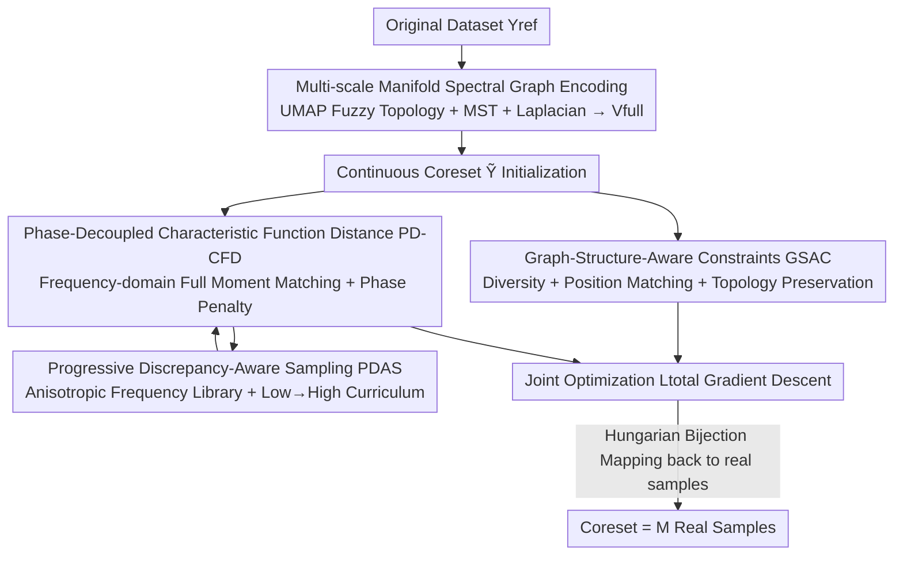

# FAST: Topology-Aware Frequency-Domain Distribution Matching for Coreset Selection

**Conference**: CVPR 2026  
**Paper**: [CVF Open Access](https://openaccess.thecvf.com/content/CVPR2026/html/Cui_FAST_Topology-Aware_Frequency-Domain_Distribution_Matching_for_Coreset_Selection_CVPR_2026_paper.html)  
**Code**: https://github.com/CAGResearch/FAST-Coreset-Selection  
**Area**: Model Compression / Dataset Compression  
**Keywords**: coreset selection, characteristic function distance, spectral graph theory, frequency-domain distribution matching, curriculum sampling

## TL;DR
FAST reformulates "selecting a small core subset from a large dataset" as a **continuous distribution matching optimization problem under spectral graph constraints**. It uses **Characteristic Function Distance (CFD)** to match all moment information of the original dataset order-by-order in the frequency domain. Topological constraints are then applied to pull continuous solutions back to real discrete samples. Without relying on any proxy DNN, it achieves an average accuracy 9.12% higher than the Prev. SOTA, with a 96.57% reduction in energy consumption and 2.2× speedup on CPU.

## Background & Motivation
**Background**: Coreset selection is a mainstream route for dataset compression—directly picking a small, representative subset of real samples from the original large dataset to train networks. Compared to dataset distillation, it avoids expensive nested gradient descent and is particularly suitable for edge deployment. Existing methods fall into two categories: (i) **DNN-based**, which use a proxy network to score samples based on "contribution" (loss, gradient, forgetting counts, etc.); (ii) **DNN-free**, which are entirely network-free, relying on geometric/heuristic criteria (e.g., grid sampling, manifold dimensionality reduction).

**Limitations of Prior Work**: DNN-based methods are strongly coupled with specific network architectures, introducing **architectural bias**—performance drops significantly when switching to a different downstream model, leading to poor generalization and high sampling overhead. DNN-free methods, while efficient and bias-free, are often heuristic, lack theoretical guarantees, and usually only match low-order statistics (mean, variance), resulting in poor stability. Crucially, **neither category explicitly constrains "distribution equivalence between the subset and the original set"**, leading to incomplete coverage in the selected subsets.

**Key Challenge**: Why isn't direct distribution matching used? Continuous distribution matching (e.g., continuous optimization in feature space via gradients) is generally considered **unsuitable for discrete dataset sampling**—points obtained through continuous optimization deviate from the real data manifold, making it impossible to find corresponding real samples. Furthermore, common distribution metrics (MSE, KL, CE, MMD) are limited by the choice of model families/kernels and **fail to capture high-order moment differences and multivariate correlations**, only aligning up to the second order.

**Goal**: (1) Enable "continuously optimized distribution matching" for discrete coreset selection for the first time; (2) Find a distribution metric capable of capturing **all moment information**; (3) Ensure matching converges stably with a minimal number of frequencies.

**Key Insight**: The authors observe that the **Characteristic Function (CF)** of a distribution—its Fourier transform—**uniquely encodes all moments and correlations** of that distribution in the frequency domain. By using the distance between CFs (CFD) as a metric, a rigorous guarantee of "complete distribution equivalence" is achieved. Spectral graph theory is then used to add topological constraints to the continuous optimization, anchoring continuous points back to real discrete samples one by one.

**Core Idea**: Replace low-order statistical metrics with frequency-domain Characteristic Function Distance to measure distribution equivalence, and use spectral graph topological constraints to nail continuous optimization solutions to the discrete data manifold—thereby integrating "DNN-free + complete distribution matching + discrete selection" for the first time.

## Method

### Overall Architecture
The input to FAST (Frequency-domain Aligned Sampling via Topology) is the original dataset $Y_{ref}$ ($N$ samples) and the target coreset size $M \ll N$; the output is $M$ real samples selected from the original set. The pipeline consists of three stages: **First, encoding the intrinsic manifold structure of the data into spectral graph features $V_{full}$** (Graph Encoder); **then, optimizing a continuous coreset representation $\tilde{Y} \in \mathbb{R}^{M \times d}$** to approximate the distribution of $V_{full}$ in the frequency domain (using the PD-CFD metric) while being pulled by topological constraints (GSAC) to ensure each continuous point corresponds to a real sample; **finally, mapping the optimized continuous coreset back to the original data space via a Graph Decoder**, using the Hungarian algorithm to solve the bijection and select the corresponding $M$ real samples.

Two parallel lines run during optimization: **PDAS (Progressive Discrepancy-Aware Sampling)** determines "which frequencies to use for CFD calculation at this step"—progressing from low to high frequencies in a curriculum fashion; **GSAC (Graph-Structure-Aware Constraints)** uses three constraints (diversity, position matching, and topology preservation) to prevent continuous optimization from collapsing multiple points together.

### Key Designs

**1. Multi-scale Manifold Spectral Graph Encoding: A stable "foundation" for continuous optimization**

To perform distribution matching, the first step is to establish a stable feature space reflecting the geometric structure of the original data. Instead of calculating directly on pixels/features, the authors construct a **multi-scale weighted undirected graph** $B \in \mathbb{R}^{N \times N}$ based on UMAP's fuzzy topology theory: for each data point $x_i$ and each neighbor scale $k$, the local connectivity distance $\rho_i$ and scale factor $\sigma_i$ are solved via $\sum_{j=1}^{k} \exp(-\max(0, d(x_i, x_{ij}) - \rho_i) / \sigma_i) = \log_2(k)$ to obtain directed edge weights; symmetry is achieved using the probabilistic t-conorm (fuzzy set union) $A_k = A_k + A_k^T - A_k \circ A_k^T$. Graphs across multiple scales are fused into a single $B$, and a Minimum Spanning Tree is merged $B = B \cup \text{MST}(B)$ to ensure global connectivity. Finally, $d$ ($d \ll N$) eigenvectors corresponding to the smallest non-zero eigenvalues of the symmetric normalized Laplacian $L_{sym} = I - D^{-1/2}BD^{-1/2}$ are extracted to form the manifold feature matrix $V_{full}$. These spectral embeddings are discrete approximations of the manifold Laplace-Beltrami operator, revealing the intrinsic geometry of the data and serving as the reference for all subsequent optimizations. This step is necessary because continuous optimization must accurately map back to discrete samples in a coordinate system **faithful to the topology of real samples**.

**2. Phase-Decoupled Characteristic Function Distance (PD-CFD): Capturing high-frequency details missed by standard CFD**

This is the core metric innovation. The standard empirical characteristic function is $\varphi_Y(t) = \frac{1}{|Y|} \sum_{y \in Y} e^{i \langle t, y \rangle}$. CFD integrates the squared difference between the CFs of two distributions over frequencies: $L_{CFD} = \mathbb{E}_{t \sim p(t)} [|\varphi_{\tilde Y}(t) - \varphi_{Y_{ref}}(t)|^2]$. Expanding this integrand in polar coordinates reveals a fatal issue—**Vanishing Phase Gradient**:

$$|\varphi_{\tilde Y} - \varphi_{Y_{ref}}|^2 = A_{\tilde Y}^2 + A_{Y_{ref}}^2 - 2A_{\tilde Y}A_{Y_{ref}} \cos(\theta_{\tilde Y} - \theta_{Y_{ref}})$$

The contribution of the phase difference $\Delta \theta$ is scaled by the product of amplitudes $A_{\tilde Y} A_{Y_{ref}}$. According to the Riemann–Lebesgue lemma, as frequency $\|t\| \to \infty$, the amplitude $A(t) \to 0$. This means that in medium-to-high frequency regions, phase information (which encodes the spatial arrangement of details like edges and textures) is flattened by the amplitude, making the optimizer blind to it. To address this, the authors **decouple** the phase and add a separate penalty term:

$$L_{CF}(\omega) = |\varphi_{Y_{ref}}(\omega) - \varphi_{\tilde Y}(\omega)|^2 + \lambda_\phi(\omega) (\theta_{Y_{ref}}(\omega) - \theta_{\tilde Y}(\omega))^2$$

The phase penalty $\lambda_\phi(\omega) = \frac{\lambda_p}{1 + \alpha \|\omega\|^2}$ decays adaptively with frequency—amplifying the phase signal at medium frequencies (where amplitude has decayed but phase is still reliable) and suppressing it at extremely high frequencies (where phase degenerates into noise). This compensates for the blind spot of standard CFD, explaining why FAST leads by 21.93% on texture/edge-rich datasets like DTD and RESISC45. The main loss is $L_{main} = \frac{1}{k} \sum_{j=1}^k L_{CF}(\omega_j)$.

**3. Graph-Structure-Aware Constraints (GSAC): Anchoring continuous solutions to discrete manifolds and preventing mode collapse**

Using only $L_{CF}$ for gradient descent leads to degradation—multiple continuous proxy points $\tilde y_i$ collapse onto the same mode, shrinking the effective coreset size. GSAC uses three complementary constraints to pull continuous solutions back to the real manifold: (i) **Diversity constraint** $L_{div} = -\log \det(K)$, where $K = \Psi \Psi^T + \delta I$ is the Gram matrix of random Fourier features of $\tilde Y$, acting as a Determinantal Point Process (DPP) to explicitly penalize feature redundancy and ensure coverage; (ii) **Position matching** $L_{match}$, where at each step, a bijection $\pi$ is solved using the Hungarian algorithm under a **graph-aware cost matrix** $C_{i,j} = \frac{\|y_i - v_j\|^2}{\deg(v_j) + \epsilon}$, pulling each $y_i$ toward its assigned real anchor $V_{full}[\pi(i)]$. Dividing by node degree prioritizes anchoring points to real samples at topological centers of the manifold; (iii) **Topology preservation** $L_{graph} = \text{Tr}(\tilde Y^T L_{sub} \tilde Y)$, where $L_{sub}$ is the $M \times M$ sub-Laplacian indexed by $\pi$, ensuring that anchors strongly connected on the original manifold maintain proximity in their continuous counterparts. Ablation studies show that removing any term destroys coverage, sampling quality, or local topology.

**4. Progressive Discrepancy-Aware Sampling (PDAS): A curriculum strategy for stable convergence with minimal frequencies**

The effectiveness of CFD depends heavily on "which frequencies are used for matching." The authors found that **introducing high frequencies too early** causes the optimization to become overly entangled with details, resulting in mismatched global structures and instability. PDAS solves this via curriculum learning: first, an **anisotropic frequency initialization** is performed—frequencies are divided into low, medium, and high bands based on $\|\omega\|$. For each band, an anisotropic scaling coefficient $s^*_{band} = \arg \max_s \mathbb{E}_{t \sim N(0, \text{diag}(s^2))} [L_{CF}(t) \mid t \in \text{Band}]$ is optimized, making the frequency space more sensitive to structural differences in the current data distribution, resulting in an Anisotropic Frequency Library (AFL). In the main optimization loop, a frequency upper bound $\tau_t$ increases with iteration $t$, gradually opening the candidate frequency pool $C_t = \{\omega \in \text{AFL} \mid \|\omega\| \le \tau_t\}$ from low to high frequencies. Within $C_t$, frequencies are sampled proportionally to a composite score $p_t(\omega) \propto L_{CF}(\omega) \cdot D(\omega)$, where $D(\omega)$ is a diversity term penalizing high correlation with already selected frequencies. This "match global statistics at low frequencies first, then refine local structures at high frequencies" approach enables stable and accurate alignment with very few frequencies.

### Loss & Training
The joint optimization objective combines the frequency-domain matching main loss with topological regularization:

$$L_{total} = L_{main} + \lambda_{div} L_{div} + L_{align}, \qquad L_{align} = \lambda_{match} L_{match} + \lambda_{graph} L_{graph}$$

The entire optimization is performed via gradient descent on the continuous representation $\tilde Y$. After convergence, $M$ real samples are obtained via the Hungarian bijection back to the original data space. Notably, the entire FAST pipeline **runs only on CPU** and does not require GPU.

## Key Experimental Results

### Main Results
On 6 datasets (CIFAR-10/100, SVHN, TinyImageNet, texture-rich DTD and RESISC-45) with retention rates of 10/20/30%, FAST consistently leads across all benchmarks: an average of 17.63% higher than DNN-based methods and 9.12% higher than the SOTA DNN-free method (NMS). On the texture/edge-rich DTD and RESISC-45, it leads by an average of 21.93%.

| Dataset (10% Retention) | FAST | NMS (DNN-free SOTA) | Full Dataset |
|--------|------|------|------|
| CIFAR-10 | **90.32** | 86.57 | 95.56 |
| CIFAR-100 | **66.61** | 55.13 | 80.59 |
| RESISC-45 | **85.00** | 74.26 | 94.01 |
| DTD | **45.77** | 38.63 | 71.65 |
| TinyImageNet | **34.55** | 31.41 | 66.35 |

Computational efficiency (CIFAR-10, 10% retention) is particularly impressive: FAST operates entirely on CPU with zero GPU overhead, using only 1.409 Wh of energy—a 96.57% reduction compared to DNN-based methods, with 2.2× average speedup. The edge version (RK3588, 4GB) consumes as little as 0.67 Wh with almost no drop in accuracy.

| Method | Time/s | Energy/Wh | Accuracy |
|------|--------|---------|------|
| FAST-CPU | 353.0 | **1.409** | **90.32** |
| FAST-EDGE | 960.0 | **0.67** | 90.31 |
| GraNd | 4403.0 | 402.4 | 54.6 |
| DQ | 426.3 | 34.57 | 85.2 |
| kCenter | 616.7 | 50.66 | 78.2 |

### Ablation Study

| Configuration | CIFAR-10 Accuracy | Description |
|------|---------|------|
| Full (PD-CFD) | **90.32** | Complete model |
| w/o $L_{align}$ | 89.26 | Points collapse to few samples, sampling quality drops |
| w/o $L_{graph}$ | 87.32 | Local topology destroyed, excessive clustering |
| w/o DPP ($L_{div}$) | 85.12 | Points attracted to high-density modes, poor coverage |
| Init. Only | 74.74 | Lower bound without matching |
| PD-CFD → KL | 83.17 | Fails to capture skewness/kurtosis, -7.15% |
| PD-CFD → CE | 85.59 | -4.73% |
| PD-CFD → MSE | 81.16 | Only aligns mean, -9.16% |

### Key Findings
- **Metric is the Root of Performance**: Replacing PD-CFD with MSE/KL/CE results in drops of 9.16/7.15/4.73%, respectively, confirming that low-order metrics cannot capture high-order moments. CFD's ability to capture the complete distribution structure directly correlates with downstream accuracy.
- **Three Complementary Graph Constraints**: Removing DPP leads to the largest drop (to 85.12%, coverage fails), followed by $L_{graph}$ (topology chaos), and $L_{align}$ (mode collapse)—together they bridge the "continuous-to-discrete gap."
- **PDAS for Fast and Stable Convergence**: Compared to fixed frequencies, collinear selection causes CFD failure, Top-K magnitude selection ignores distribution differences, and non-progressive strategies oscillate. Only the curriculum-based PDAS achieves stable convergence with fewer iterations and saturates with fewer frequencies than NCFM.
- **Strong Cross-Architecture Generalization**: Average drop of only 0.53% across ResNet/ShuffleNet/MobileNet/ViT, compared to 3.02%/8.68% for DNN-free/DNN-based baselines, confirming it pursues distribution equivalence rather than fitting a proxy model.
- **Value of Phase Penalty**: $\lambda_p=0.3$ is optimal for RESISC45. Directly applying this $\lambda_p$ to the dataset distillation method NCFM yielded a 19.12% improvement on CUB-200.

## Highlights & Insights
- **"Characteristic Function = Complete Frequency Fingerprint of Distribution" used for coreset selection for the first time**: Mixed partial derivatives of CF at the origin correspond to moments $\partial^\alpha \varphi(0) = i^{|\alpha|} \mathbb{E}[X^\alpha]$. Matching CF is equivalent to matching all moments—providing a more rigorous mathematical foundation for "distribution equivalence" than MSE, KL, or MMD.
- **Elegant Diagnosis of Vanishing Phase Gradient**: Polar expansion of $|\Delta \varphi|^2$ clearly shows the phase being suppressed by the amplitude product. Compensating with an adaptive decay penalty $1/(1 + \alpha \|\omega\|^2)$ is a perfect example of "diagnosing the pathology before applying the cure."
- **Spectral Graph Constraints Ground Continuous Optimization in Discrete Manifolds**: The graph-aware cost matrix $\|y_i - v_j\|^2 / (\deg(v_j) + \epsilon)$ is a clever detail, prioritizing anchoring to topological center nodes. This is transferable to any combinatorial optimization scenario involving "continuous relaxation → discrete projection."
- **Pure CPU, Edge-Ready**: Achieving 1.7GB memory usage, CPU-only operation, and a two-order-of-magnitude reduction in energy consumption in a fields dominated by GPUs highlights significant engineering value.

## Limitations & Future Work
- Validation primarily focused on classification datasets + limited LLM fine-tuning (Alpaca→LLaMA-7B); whether distribution matching remains as effective for structured tasks like detection/segmentation/multimodal remains to be seen.
- Spectral graph construction involves multi-scale kNN, Hungarian bijection, and eigen-decomposition; **scalability for ultra-large $N$** (e.g., full ImageNet-1k) was not fully stress-tested. The $O(MN)$ cost of the Hungarian algorithm might become a bottleneck for large $M$ ⚠️.
- PD-CFD introduces multiple hyperparameters ($\lambda_p, \alpha, \lambda_{div}, \lambda_{match}, \lambda_{graph}$); while ablations exist, tuning costs across datasets may not be negligible.
- Future directions: Turning AFL and PDAS curricula into learned schedulers or replacing spectral constraints with more scalable approximations (e.g., Nyström) to reduce overhead at scale.

## Related Work & Insights
- **vs NCFM (Distillation + Frequency Domain)**: NCFM is the only other work using frequency-domain features for dataset compression but is limited to synthesis-based distillation. It relies on DNNs for feature extraction/frequency selection (inheriting bias) and couples phase with amplitude (the vanishing gradient issue FAST addresses). FAST is entirely DNN-free and decouples phase—applying FAST's $\lambda_p$ idea back to NCFM actually improves its performance.
- **vs NMS (DNN-free SOTA, Manifold Reduction + Grid Sampling)**: NMS relies on heuristic grid sampling with no stability guarantees. FAST provides a theoretically grounded complete distribution matching via spectral graphs and CFD, averaging 9.12% higher and showing more stability across architectures.
- **vs DNN-based (GraNd / Forget / Glister / Craig, etc.)**: These are strongly coupled with proxy networks, have high architectural bias, and high sampling energy (GraNd reaches 402 Wh). FAST is network-independent, consumes two orders of magnitude less energy, and maintains accuracy across architectures.

## Rating
- Novelty: ⭐⭐⭐⭐⭐ First introduction of CFD + spectral graph constraints to discrete coreset selection, with a solid diagnosis/fix for Vanishing Phase Gradient.
- Experimental Thoroughness: ⭐⭐⭐⭐⭐ 6 datasets × 3 retention rates × 5 architectures + energy/edge/LLM + extensive ablations.
- Writing Quality: ⭐⭐⭐⭐ Clear derivations and progressive motivation; high density of abbreviations (GSAC/GUNN/AFL) requires cross-referencing diagrams.
- Value: ⭐⭐⭐⭐⭐ CPU-only, 96.57% energy reduction, and cross-architecture universality provide direct value for resource-constrained and Green AI deployment.

<!-- RELATED:START -->

- **NCFM**: Dataset Distillation via Factorized Frequency Matching (CVPR 2024 candidate/Related)
- **NMS**: Non-Monotonic Coreset Sampling on Manifolds (NeurIPS 2023)
- **DeepCore**: A Comprehensive Library for Coreset Selection in Deep Learning (CVPR 2023)

<!-- RELATED:END -->

## Related Papers

- [\[ICML 2026\] Target-Agnostic Calibration under Distribution Shift with Frequency-Aware Gradient Rectification](../../ICML2026/others/target-agnostic_calibration_under_distribution_shift_with_frequency-aware_gradie.md)
- [\[CVPR 2026\] Content-Aware Frequency Encoding for Implicit Neural Representations with Fourier-Chebyshev Features](content-aware_frequency_encoding_for_implicit_neural_representations_with_fourie.md)
- [\[ICLR 2026\] Noise-Aware Generalization: Robustness to In-Domain Noise and Out-of-Domain Generalization](../../ICLR2026/others/noise-aware_generalization_robustness_to_in-domain_noise_and_out-of-domain_gener.md)
- [\[CVPR 2026\] Plug-and-Play Incomplete Multi-View Clustering via Janus-Faced Affinity Learning with Topology Harmonization](plug-and-play_incomplete_multi-view_clustering_via_janus-faced_affinity_learning.md)
- [\[CVPR 2026\] Debiased Sample Selection for Learning with Noisy Labels](debiased_sample_selection_for_learning_with_noisy_labels.md)

<!-- RELATED:END -->
