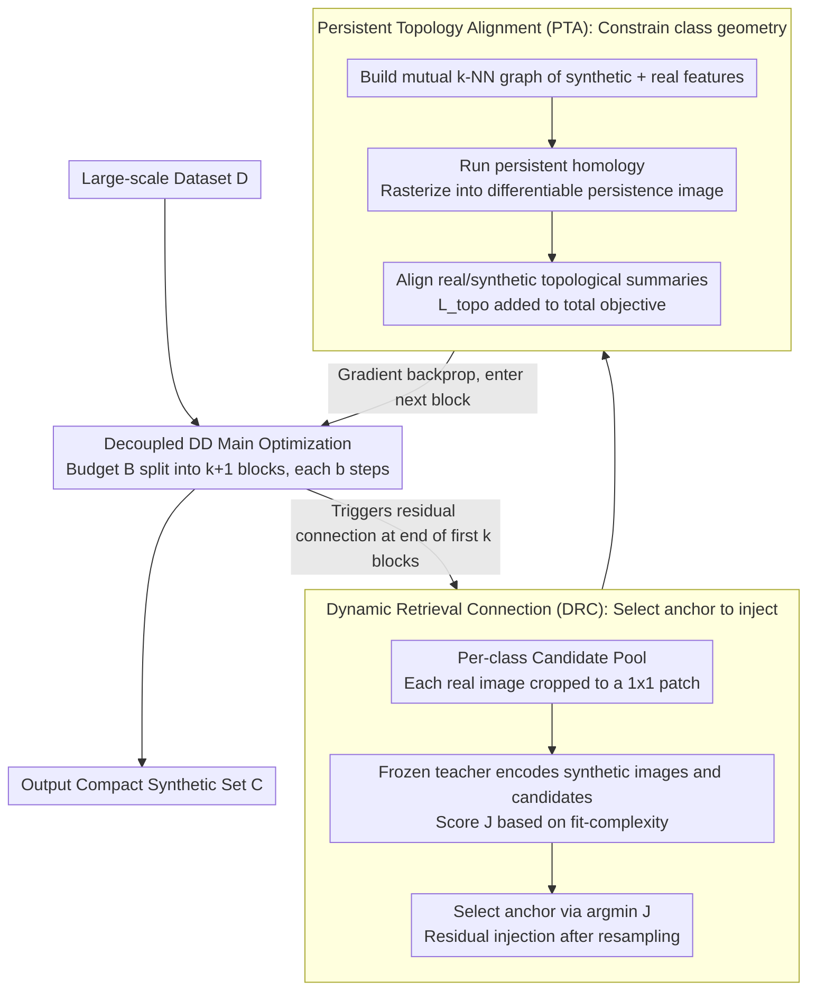

# Fixed Anchors Are Not Enough: Dynamic Retrieval and Persistent Homology for Dataset Distillation

**Conference**: CVPR 2026  
**arXiv**: [2602.24144](https://arxiv.org/abs/2602.24144)  
**Code**: To be confirmed  
**Area**: Dataset Distillation / Model Compression  
**Keywords**: dataset distillation, residual matching, persistent homology, topology alignment, dynamic retrieval

## TL;DR
RETA decouples two failure modes of residual matching in dataset distillation (fit-complexity gap and pull-to-anchor effect). It adaptively selects real patch anchors via Dynamic Retrieval Connection (DRC) and preserves intra-class diversity through Persistent Topology Alignment (PTA), achieving 64.3% on ImageNet-1K ResNet-18 IPC=50 (+3.1% vs. FADRM).

## Background & Motivation

**Background**: Dataset distillation (DD) aims to compress large datasets into a small number of synthetic images such that models trained on the synthetic set achieve performance close to those trained on the full set. Decoupled DD (e.g., SRe2L, EDC, FADRM) decouples supervision objectives and distribution alignment into two optimization streams, achieving better stability and scalability. FADRM further introduced residual matching—periodically injecting real patches into synthetic images via residual connections to prevent information vanishing caused by pure pixel updates.

**Limitations of Prior Work**: FADRM uses fixed, pre-selected real patches as anchors, leading to two coupled failure modes:
   - **(i) Fit-Complexity Gap**: Fixed patches may be misaligned with current synthetic features in the teacher space (large fit gap), or the patches themselves may have complex textures that inject high-frequency noise (complexity inflation), both of which hurt the generalization bound.
   - **(ii) Pull-to-Anchor Effect**: Each residual connection pulls synthetic features toward the nearest real sample in the teacher space. After repeated operations, intra-class synthetic feature distances contract $\|y_i' - y_j'\| \leq \alpha\|y_i - y_j\| + (1-\alpha)\|a_i - a_j\|$, leading to premature merging of distinct clusters and loss of intra-class diversity.

**Key Challenge**: Fixed anchors cannot adaptively minimize the fit gap and complexity across stages, nor can they reliably control the class topology—anchor selection is sub-optimal locally, and repeated anchoring destroys the global topological structure.

**Goal**
   - How to adaptively select residual anchors for each stage to simultaneously control fit gap and complexity?
   - How to maintain intra-class feature diversity and topological structure during repeated residual injections?

**Key Insight**: Starting from the generalization bound decomposition (Theorem 4.1), the post-connection risk is decomposed into fit and complexity terms to guide anchor selection strategies. Leveraging Topological Data Analysis (TDA), persistent homology is used to quantify class topological differences and construct differentiable regularization.

**Core Idea**: Use dynamic retrieval instead of fixed anchors to solve the fit-complexity tradeoff, and use persistent topology alignment regularization to counter the class topological collapse caused by the pull-to-anchor effect.

## Method

### Overall Architecture
RETA addresses the questions of "what to inject into synthetic images" and "what is destroyed after injection" in decoupled dataset distillation. It operates on the basis of decoupled DD: taking a large-scale training set $\mathcal{D}$ and outputting a compact synthetic set $\tilde{\mathcal{C}}$, with the optimization objective $\min_{\tilde{\mathcal{C}}} \mathcal{L}_{sup}(f_\theta; \tilde{\mathcal{C}}) + \beta \mathcal{R}_{align}(\tilde{\mathcal{C}}; \mathcal{D}, \mathcal{T})$ fitting both supervision signals and distribution alignment. The optimization splits the total budget $B$ into $k+1$ blocks, each running $b = \lfloor B/(k+1) \rfloor$ steps of standard optimization. At the end of the first $k$ blocks, a residual connection is performed—mixing a real patch into the synthetic image proportional to a ratio. RETA does not change the main optimization stream but inserts two modules at these residual connection "interfaces": DRC decides **which anchor to connect**, and PTA constrains the **geometric structure of the class** to prevent collapse after connection. One manages local injection targets, the other manages global topological preservation; the PTA topological loss is added to the total objective, and the gradient flows back into the next optimization block.

### Key Designs

**1. Dynamic Retrieval Connection (DRC): Adaptive anchors per stage**

Residual anchors in FADRM are pre-selected and fixed, causing coupled issues: fixed patches may drift from current synthetic features in teacher space (fit gap), or have excessive complexity that injects noise. DRC re-retrieves anchors at each residual stage. It builds a candidate pool $p_c$ for each class $c$ (cropping real images into $1 \times 1$ patches) and uses a frozen teacher $\phi(\cdot)$ to encode synthetic images and candidates. It scores them using a combined fit-complexity score:

$$J(o|\tilde{x}_t) = (1-\lambda)\|q(\tilde{x}_t) - z(o)\|_2^2 + \lambda \cdot c(o)$$

where $q(\tilde{x}_t) = \text{Norm}(\phi(\tilde{x}_t))$ and $z(o) = \text{Norm}(\phi(o))$. The first term is the fit gap—the distance between synthetic features and candidate patches in teacher space. The second term $c(o) = \text{Var}_{u \in \Omega_{D_t}}(\|\nabla(G_\sigma * o)(u)\|_2^2)$ is the complexity score, represent as the spatial variance of gradient magnitudes after Gaussian smoothing; higher values indicate more sharp high-frequency edges. $\lambda$ balances the two. Each synthetic image selects $o^* = \arg\min_{o \in p_c} J(o|\tilde{x}_t)$ and performs a residual update $\tilde{x}_t \leftarrow \alpha \tilde{x}_t + (1-\alpha)\,\text{Resample}(o^*, D_t)$ after resampling to the current resolution.

This scoring is theoretically grounded: Theorem 4.1 decomposes the generalization bound after residual connection into fit gap $\Delta$ and complexity gap $\mathfrak{R}_n(H \circ O) - \mathfrak{R}_n(H \circ \tilde{\mathcal{C}}_{pre})$. DRC leverages per-stage retrieval to minimize $\Delta$ while suppressing complexity via $c(o)$.

**2. Persistent Topology Alignment (PTA): Countering class collapse with persistent homology**

While DRC handles "who to inject," the residual connection itself has a side effect: repeated pulling of synthetic features toward real samples causes intra-class features to converge $\|y_i' - y_j'\| \leq \alpha\|y_i - y_j\| + (1-\alpha)\|a_i - a_j\|$, losing diversity and collapsing clusters—the pull-to-anchor effect. PTA monitors this via topology. For each class $c$, it takes the union of synthetic features $Z_c^{syn} = \{\phi(\tilde{x}_i)\}$ and real features $Z_c^{real} = \{\phi(x): x \in p_c\}$, constructs a class-balanced mutual $k$-NN graph, and computes persistent homology to obtain persistence diagrams $\mathcal{D}_c^{(q)}$ ($q=0$ for connected components, $q=1$ for loops). Since diagrams are non-differentiable, PTA rasterizes them into differentiable persistence images:

$$I^{(q)}(Z_c)[m] = \sum_{(b_j, p_j) \in \mathcal{D}_c^{(q)}} w_q(p_j) \exp\left(-\frac{\|u_m - (b_j, p_j)\|_2^2}{2\sigma^2}\right)$$

It then aligns the topological summaries of synthetic and real data:

$$\mathcal{L}_{topo} = \sum_c \left(\|I^{(0)}(Z_c^{syn}) - I^{(0)}(Z_c^{real})\|_2^2 + \gamma \|I^{(1)}(Z_c^{syn}) - I^{(1)}(Z_c^{real})\|_2^2\right)$$

The pull-to-anchor effect manifests specifically in Betti curves: a left-shift in $\mathcal{B}_0^{syn}$ indicates premature merging of components, and suppression of $\mathcal{B}_1^{syn}$ indicates vanishing loops. By incorporating these into $\mathcal{L}_{topo}$, gradients flow back through the teacher $\phi$ to the synthetic input, forcing synthetic features to maintain multi-scale connectivity and loop structures consistent with real data. PTA is simply added to the total goal $\mathcal{L} \leftarrow \mathcal{L} + \lambda_{topo} \mathcal{L}_{topo}$, complementing DRC to ensure local injection accuracy and global topological integrity.

### Loss & Training
- Based on FADRM protocol: Adam optimizer, lr=0.25, $(\beta_1, \beta_2) = (0.5, 0.9)$.
- Optimization budget $B \in \{300, 2000\}$, merge ratio $\alpha = 0.5$.
- DRC $\lambda = 0.1$ (default for fit-complexity tradeoff).
- PTA $\lambda_{topo} = 0.5$, $k \approx 10\text{-}20$, $32 \times 32$ PI grid.
- Feature cache refreshed periodically (every $T$ steps) to reduce overhead.
- Runnable on a single RTX 4090.

## Key Experimental Results

### Main Results (ResNet-18, IPC=10/50)

| Dataset | IPC | SRe2L | RDED | EDC | FADRM+ | **RETA** | **Gain** |
|--------|-----|-------|------|-----|--------|----------|-------|
| CIFAR-100 | 10 | 27.0 | 56.9 | 63.7 | 67.9 | **70.3** | +2.4 |
| CIFAR-100 | 50 | 50.2 | 66.8 | 68.6 | 67.9 | **70.3** | +1.7 |
| Tiny-ImageNet | 10 | 16.1 | 41.9 | 51.2 | 52.8 | **56.2** | +3.4 |
| ImageNette | 10 | 29.4 | 61.4 | - | 69.0 | **72.5** | +3.5 |
| ImageNet-1K | 10 | 21.3 | 42.0 | 48.6 | 50.9 | **53.2** | +2.3 |
| ImageNet-1K | 50 | 46.8 | 56.5 | 58.0 | 61.2 | **64.3** | +3.1 |

RETA achieves the best results across all datasets, IPC settings, and backbones (ResNet-18/50/101).

### Ablation Study (ResNet-18, IPC=10)

| DRC | PTA | CIFAR-100 | Tiny-ImageNet | ImageNette | ImageNet-1K |
|-----|-----|-----------|---------------|------------|-------------|
| × | × | 67.9 | 52.8 | 69.0 | 50.9 |
| ✓ | × | 69.0 (+1.1) | 54.5 (+1.7) | 70.9 (+1.9) | 51.8 (+0.9) |
| × | ✓ | 68.5 (+0.6) | 53.7 (+0.9) | 69.8 (+0.8) | 51.6 (+0.7) |
| ✓ | ✓ | **70.3 (+2.4)** | **56.2 (+3.4)** | **72.5 (+3.5)** | **53.2 (+2.3)** |

### Key Findings

- **DRC contributes more**: DRC alone provides larger gains than PTA across all datasets (1.1-1.9 vs. 0.6-0.9), indicating that anchor selection is the more critical bottleneck.
- **Super-additive complementarity**: The combined gain of DRC+PTA exceeds the sum of individual gains (e.g., Tiny-ImageNet: 1.7+0.9=2.6, actual +3.4), as they address coupled problems at different levels.
- **Cross-architecture generalization**: Consistently outperforms FADRM+ on EfficientNet/MobileNet/ShuffleNet/Swin-Tiny/DenseNet (+0.9~3.4).
- **Robustness**: On ImageNet-Subset-C (15 corruptions × 5 severities), RETA improves by +3.2% avg, thanks to DRC filtering noisy anchors and PTA stabilizing topology.
- **Moderate overhead**: Increases time by ~20% (1.31s vs. 1.09s/image) and memory by ~22% (13.4GB vs. 11.0GB) compared to FADRM+, much lower than G-VBSM/EDC.
- **Sensitivity of $\lambda$**: $\lambda=0.1$ is optimal; $\lambda=0$ yields 51.7% and $\lambda=1.0$ yields 50.8%, showing that moderate complexity control is necessary.
- **Sensitivity of $\lambda_{topo}$**: $\lambda_{topo}=0.5$ is optimal; too small fails to stop pull-to-anchor, too large competes with feature matching.

## Highlights & Insights

- **Theory-driven design**: The DRC fit-complexity score is directly derived from Theorem 4.1's generalization bound decomposition, rather than being an ad-hoc design. The use of persistent homology to quantify class topology differences is mathematically sound.
- **First application of TDA in DD**: Using persistence images as a differentiable topological regularization signal elegantly solves the inherent non-differentiability of persistent homology. This approach can migrate to any generation/compression task requiring topological consistency.
- **Effective simplicity of Complexity score**: $c(o) = \text{Var}(\|\nabla(G_\sigma * o)\|_2^2)$ captures "residual sharp edges" via simple gradient statistics—interpretable, effective, and computationally lightweight.

## Limitations & Future Work

- **Limitations acknowledged by authors**: Dependency on a frozen teacher, per-class retrieval pools, and several topological hyperparameters ($k$-NN construction, PI grid, $\lambda_{topo}$). PTA adds overhead during distillation.
- **Learnable complexity proxies**: Current $c(o)$ is based on manual gradient stats; a small network could learn a better complexity predictor.
- **Layer-wise topology alignment**: Currently PH is computed only in the final teacher layer; multi-layer topological alignment could preserve structure at different semantic levels.
- **Online Pool updates**: Per-class pools are currently fixed; dynamic updates (adding/removing candidate patches) during distillation could further improve retrieval quality.

## Related Work & Insights

- **vs. FADRM**: FADRM identified information vanishing and introduced fixed residual connections. RETA directly addresses FADRM's systematic flaws (fit-complexity gap and pull-to-anchor) and improves performance by +2-3.5% across the board.
- **vs. RDED/EDC/SRe2L**: These methods don't use residual connections and perform significantly worse on large-scale datasets. RETA's design builds specifically on the residual matching paradigm.
- **vs. Trajectory Matching (MTT, etc.)**: Trajectory matching Requires high computational cost due to inner-loop training. RETA, as a decoupled method, remains efficient and significantly outperforms MTT in corruption robustness.

## Rating
- Novelty: ⭐⭐⭐⭐ Deep diagnosis of failure modes, novel application of Persistent Homology in DD, and tight integration of theory and method.
- Experimental Thoroughness: ⭐⭐⭐⭐⭐ Comprehensive evaluation across 5 datasets, multiple IPCs/backbones, cross-architecture tests, robustness, and hyperparameter sensitivity.
- Writing Quality: ⭐⭐⭐⭐ Clear structure; the transition from theory to method to experiments is logical, though TDA might be challenging for some readers.
- Value: ⭐⭐⭐⭐ Achieves consistent SOTA in dataset distillation; the design principles (adaptive choice + topological preservation) have good generalizability.

<!-- RELATED:START -->

## Related Papers

- [\[CVPR 2026\] Dataset Distillation by Influence Matching](dataset_distillation_by_influence_matching.md)
- [\[CVPR 2026\] Mitigating The Distribution Shift of Diffusion-based Dataset Distillation](mitigating_the_distribution_shift_of_diffusion-based_dataset_distillation.md)
- [\[CVPR 2026\] IMS3: Breaking Distributional Aggregation in Diffusion-Based Dataset Distillation](ims3_breaking_distributional_aggregation_in_diffusion-based_dataset_distillation.md)
- [\[CVPR 2026\] Balanced Dataset Distillation via Modeling Multiple Visual Pattern Distribution](balanced_dataset_distillation_via_modeling_multiple_visual_pattern_distribution.md)
- [\[CVPR 2026\] Beyond Soft Label: Dataset Distillation via Orthogonal Gradient Matching](beyond_soft_label_dataset_distillation_via_orthogonal_gradient_matching.md)

<!-- RELATED:END -->
