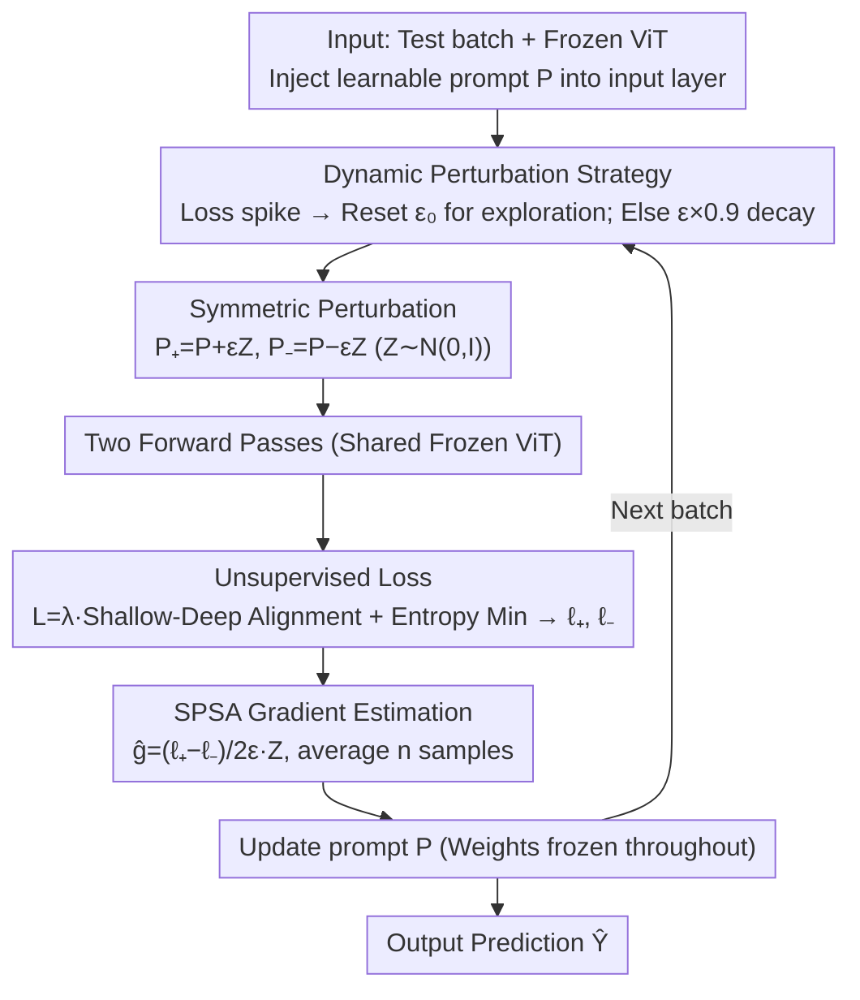

# FOZO: Forward-Only Zeroth-Order Prompt Optimization for Test-Time Adaptation

**Conference**: CVPR2026  
**arXiv**: [2603.04733](https://arxiv.org/abs/2603.04733)  
**Code**: [eVI-group-SCU/FOZO](https://github.com/eVI-group-SCU/FOZO)  
**Area**: Model Compression  
**Keywords**: Test-Time Adaptation, Zeroth-Order Optimization, Visual Prompt, Forward Propagation, Quantized Model Deployment

## TL;DR

Ours proposes FOZO, a forward-only zeroth-order prompt optimization paradigm. By utilizing SPSA gradient estimation, a dynamic perturbation strategy, and shallow-deep feature statistical alignment, FOZO achieves efficient TTA without modifying model weights. It outperforms all forward-only methods on ImageNet-C with 59.52% accuracy (surpassing FOA's 58.13%) and supports INT8 quantized models.

## Background & Motivation

**Distribution shifts are ubiquitous**: Deep learning models frequently encounter training-test distribution shifts during real-world deployment. TTA addresses this by dynamically adjusting models using unlabeled data at test time.

**High resource consumption of backpropagation (BP) methods**: Gradient-based TTA methods such as TENT, SAR, and EATA require backpropagation to update model weights, leading to high computational and memory overhead (e.g., TENT's 5495 MiB vs. FOZO's 831 MiB), which is unsuitable for low-power edge devices.

**Limited capacity of traditional gradient-free methods**: Methods like AdaBN, T3A, and LAME do not construct explicit optimization objectives, resulting in limited learning capacity and suboptimal adaptation performance (LAME achieves only 54.16% on ImageNet-C).

**Low efficiency of CMA-ES in high-dimensional optimization**: The recent forward-only method FOA uses the CMA-ES evolutionary strategy to update prompts; however, CMA-ES has $O(d^2)$ complexity and converges slowly in high-dimensional prompt spaces.

**ZOA modifies internal model parameters**: ZOA updates normalization layer parameters via zeroth-order optimization, limiting its applicability in scenarios where model weights are immutable (e.g., hardware-encoded or quantized models).

**Challenges from OOD data streams**: Data distributions change continuously in TTA, making zeroth-order gradient estimation potentially unreliable. Dedicated optimization strategies are required to ensure convergence stability.

## Method

### Overall Architecture

Ours aims to solve TTA in scenarios such as edge devices and quantized models where "weights are immutable and backpropagation budgets are unavailable." It injects a small number of learnable prompts $\mathbf{P} = \{\mathbf{p}^k \in \mathbb{R}^d | 1 \leq k \leq p\}$ (default $p=3$) into the input layer of a pre-trained ViT. Model weights remain frozen throughout, and only these prompts are updated for each test batch using forward propagation only. The cycle is as follows: dynamically adjust the perturbation scale $\epsilon_t$ based on the current data stream state → apply a pair of positive and negative symmetric perturbations to the prompt → perform one forward pass for each to calculate unsupervised losses ($\ell_+$ / $\ell_-$) based on shallow-deep feature statistical alignment and entropy minimization → estimate the SPSA gradient using the difference between the two losses → update the prompt and continue to the next batch. Three Key Designs address critical points in this loop: SPSA enables gradient estimation via forward passes, dynamic perturbation stabilizes zeroth-order estimation in shifting data streams, and the alignment loss provides a more reliable signal for unsupervised optimization than pure entropy.

### Key Designs

**1. SPSA Forward Gradient Estimation: Replacing BP with Loss Differences**

BP-based TTA (TENT, SAR, EATA) incurs significant memory overhead (TENT 5495 MiB vs. FOZO 831 MiB), making them infeasible for low-power devices. FOZO adopts SPSA zeroth-order estimation: applying symmetric perturbations $\mathbf{P}_+ = \mathbf{P} + \epsilon_t \mathbf{Z}$ and $\mathbf{P}_- = \mathbf{P} - \epsilon_t \mathbf{Z}$ (where $\mathbf{Z} \sim \mathcal{N}(0, I_d)$), obtaining losses $\ell_+$ and $\ell_-$ via forward passes, and estimating the projected gradient $\hat{g} = \frac{\ell_+ - \ell_-}{2\epsilon_t} \mathbf{Z}$. The prompt is updated after averaging $n$ SPSA samples. Compared to the CMA-ES used in FOA ($O(d^2)$ complexity, slow convergence), SPSA requires only two forward passes per step, and its convergence rate theoretically depends on the effective Hessian rank $r$ rather than the parameter dimension $d$ (Theorem 2), making it more efficient in high-dimensional prompt spaces.

**2. Dynamic Perturbation Strategy: Switching Between Exploration and Precision**

The accuracy of zeroth-order estimation is tied to the perturbation scale $\epsilon_t$. Convergence analysis (Theorem 1) indicates that the bias term $C\eta\ell\epsilon_t^2 r$ requires $\epsilon_t \to 0$ for precise convergence. However, since TTA data distributions change continuously, large perturbations are needed to re-explore when domain shifts occur or optimization stalls. FOZO uses an adaptive decay mechanism to balance both:

$$\epsilon_t = \begin{cases} \epsilon_0 & \text{if } L_t > \tau \cdot \bar{L}_t \\ \max(\epsilon_{\min}, \epsilon_{t-1} \cdot \alpha) & \text{otherwise} \end{cases}$$

If a loss spike is detected (indicating a domain shift or stagnation), $\epsilon_t$ is reset to $\epsilon_0$ to increase exploration. Otherwise, it gradually decreases with a decay factor $\alpha=0.9$ toward precise convergence; the convergence rate depends on the effective Hessian rank $r$ rather than the parameter dimension $d$ (Theorem 2).

### Loss & Training

**Shallow-Deep Feature Statistical Alignment $\mathcal{L}_{stats}$**: Activation statistics (mean $\mu$, standard deviation $\sigma$) of the [CLS] token are collected from shallow ($1 \sim N/2$) and deep ($N/2+1 \sim N$) layers of the ViT. These are aligned with pre-computed source domain statistics. Shallow layers capture low-level textures while deep layers manage semantics; separate alignment better fits the structure of distribution shifts:

$$\mathcal{L}_{stats} = \sum_{k \in \{shallow, deep\}} (\|\mu_k^T - \mu_k^S\|_2 + \|\sigma_k^T - \sigma_k^S\|_2)$$

**Entropy Minimization $\mathcal{L}_{ent}$**: Encourages the model to produce high-confidence predictions on the target domain. The total loss is $\mathcal{L} = \lambda \mathcal{L}_{stats} + \mathcal{L}_{ent}$, where $\lambda = 0.4$.

## Key Experimental Results

### Main Results

**Comparison of Forward-Only Methods on ImageNet-C (5K, level 5, 2 forward passes)**:

| Method | FP | Avg Acc(%) | Time(s) | Memory(MiB) | #Params |
|---|---|---|---|---|---|
| NoAdapt | 1 | 55.57 | 94 | 819 | 0 |
| LAME | 1 | 54.16 | 97 | 819 | 0 |
| T3A | 1 | 53.76 | 311 | 823 | 0 |
| FOA | 2 | 58.13 | 224 | 831 | 2304 |
| ZOA | 2 | 58.56 | 198 | 859 | 26145 |
| **FOZO** | **2** | **59.52** | **179** | **831** | **2304** |

**Comparison with Backpropagation Methods (28 forward passes)**:

| Method | Avg Acc(%) | Time(s) | Memory(MiB) |
|---|---|---|---|
| TENT | 58.32 | 208 | 5495 |
| EATA | 61.35 | 218 | 5496 |
| SAR | 60.36 | 393 | 5495 |
| DEYO | 60.76 | 282 | 5499 |
| **FOZO (FP=26)** | **62.60** | **2102** | **831** |

### Ablation Study

| Configuration | Acc(%) | Gain |
|---|---|---|
| NoAdapt | 55.1 | - |
| Base FOZO (ZO + Entropy) | 57.3 | +2.2 |
| + Deep-Shallow Alignment | 60.1 | +2.8 |
| + Dynamic Perturbation (Full) | 62.7 | +2.6 |

Shallow-deep feature alignment contributes the most (+2.8%), followed closely by the dynamic perturbation strategy (+2.6%).

### Key Findings

- **Strong Applicability to Quantized Models**: On INT8 PTQ4ViT, FOZO reaches 58.00% vs. FOA's 57.07% and ZOA's 56.91%, demonstrating the advantage of forward-only methods in quantization scenarios.
- **High Memory Efficiency**: FOZO requires only 831 MiB, on par with the NoAdapt baseline, and approximately 15% of the memory used by BP methods (831 vs. 5495 MiB).
- **Parameter Efficiency**: Only 2304 prompt parameters are updated, which is 8.8% of the parameters updated by ZOA (26145).
- **Convergence Speed**: The time required for FOZO to reach 65% accuracy is only 66% of that for FOA/ZOA.
- **Cross-dataset Generalization**: Ours outperforms all forward-only methods on ImageNet-R (64.1%) and ImageNet-Sketch (50.5%).

## Highlights & Insights

- **Solid Theory**: Convergence is strictly proven based on SPSA and the local effective rank hypothesis; the convergence rate correlates with the effective Hessian rank $r$ rather than the parameter dimension $d$.
- **High Practicality**: Pure forward propagation + no weight modification + low memory usage makes it directly applicable to edge devices and quantized models.
- **Sophisticated Dynamic Perturbation**: Automatically detects domain shifts and resets the perturbation scale, balancing exploration and convergence.
- **Comprehensive Experiments**: Covers full-precision/quantized models, multiple datasets, and continuous adaptation scenarios with clear ablations.

## Limitations & Future Work

- **Longer Runtime**: With multiple forward passes (FP=26/28), the adaptation time (2102s) is significantly higher than that of BP methods (208-393s). This trade-off between speed and memory might be disadvantageous in time-sensitive scenarios.
- **Validated Only on ViT**: CNNs or other architectures were not tested; prompt injection relies on ViT's token concatenation mechanism.
- **Dependency on Source Statistics**: Pre-calculated feature statistics from the source validation set are required, which might be unavailable in purely black-box scenarios.
- **Sensitivity to Prompt Count and Batch Size**: While 3 prompts and a batch size of 64 are robust, performance drops significantly with small batches (4/8).
- **Classification as Human Understanding**: While the core is a general TTA method, it is applied here to general vision models rather than specific human understanding tasks.

## Related Work & Insights

- **FOA** (CVPR 2024): The first forward-only prompt optimization for TTA, using CMA-ES. FOZO replaces CMA-ES with SPSA to resolve its $O(d^2)$ complexity issues.
- **ZOA** (ACM MM 2025): Zeroth-order optimization for TTA that updates normalization layer parameters (26,145 params). FOZO only updates prompts (2,304 params) without modifying the model.
- **TENT** (ICLR 2021): A landmark in entropy minimization for TTA, requiring backpropagation to update BN parameters. FOZO adopts its entropy loss concept but eliminates BP.
- **MeZO** (NeurIPS 2023): Proposed the local effective rank hypothesis to prove the feasibility of zeroth-order optimization. FOZO extends this theory to TTA scenarios.
- **Visual Prompt Tuning** (ECCV 2022): The original method for injecting learnable prompts into ViT input layers. FOZO adapts it for BP-free test-time scenarios.

## Rating

- Novelty: ⭐⭐⭐⭐ — Replacing CMA-ES with SPSA for TTA prompt optimization is a logical and novel combination; the dynamic perturbation design is theoretically supported.
- Experimental Thoroughness: ⭐⭐⭐⭐ — Includes multiple datasets, quantized models, continuous adaptation, and detailed ablation/hyperparameter analysis, though it lacks non-ViT architecture experiments.
- Writing Quality: ⭐⭐⭐⭐ — The structure is clear, theoretical derivations are complete, and motivations are well-articulated.
- Value: ⭐⭐⭐⭐ — Provides a highly competitive solution for the practical scenarios of edge deployment and quantized model TTA.

<!-- RELATED:START -->

## Related Papers

- [\[ICLR 2026\] Fine-tuning Quantized Neural Networks with Zeroth-order Optimization](../../ICLR2026/model_compression/fine-tuning_quantized_neural_networks_with_zeroth-order_optimization.md)
- [\[CVPR 2026\] TALON: Test-time Adaptive Learning for On-the-Fly Category Discovery](talon_test-time_adaptive_learning_for_on-the-fly_category_discovery.md)
- [\[CVPR 2026\] Cross-Architecture Adaptation: Cloud-Edge Continual Test-Time Adaptation with Dynamic Sampling and Heterogeneous Distillation](cross-architecture_adaptation_cloud-edge_continual_test-time_adaptation_with_dyn.md)
- [\[ICML 2026\] Turning Stale Gradients into Stable Gradients: Coherent Coordinate Descent with Implicit Landscape Smoothing for Lightweight Zeroth-Order Optimization](../../ICML2026/model_compression/turning_stale_gradients_into_stable_gradients_coherent_coordinate_descent_with_i.md)
- [\[CVPR 2026\] Test-time Sparsity for Extreme Fast Action Diffusion](test-time_sparsity_for_extreme_fast_action_diffusion.md)

<!-- RELATED:END -->
