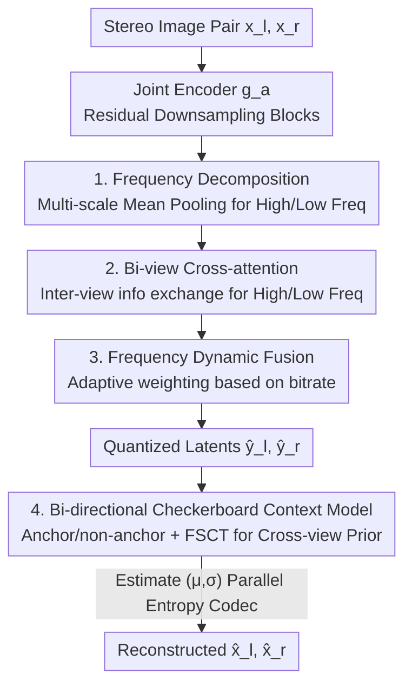

# FreqSIC: Frequency-aware Stereo Image Compression with Bi-directional Checkerboard Context Model

**Conference**: CVPR 2026  
**Paper**: [CVF Open Access](https://openaccess.thecvf.com/content/CVPR2026/html/Qin_FreqSIC_Frequency-aware_Stereo_Image_Compression_with_Bi-directional_Checkerboard_Context_Model_CVPR_2026_paper.html)  
**Code**: None  
**Area**: Model Compression / Image Compression / Stereo Vision  
**Keywords**: Stereo Image Compression, Frequency Domain Decomposition, Cross-view Attention, Checkerboard Context, Entropy Coding  

## TL;DR
Addressing the two pain points of learned stereo image compression—"loss of high-frequency details" and "slow autoregressive entropy models"—FreqSIC introduces the Frequency-aware Stereo Context Transfer (FSCT) module. This module models left-right view redundancy separately on high and low-frequency components with adaptive weighting. Furthermore, it replaces the cumbersome spatial autoregressive entropy model with a bi-directional checkerboard context model embedded with FSCT. FreqSIC achieves SOTA rate-distortion performance on InStereo2K and Cityscapes while reducing codec latency to 1.62s (approximately 48 times faster than BiSIC's 78.6s).

## Background & Motivation

**Background**: The goal of Stereo Image Compression (SIC) is to jointly compress image pairs of the same scene from two viewpoints, utilizing inter-view redundancy to achieve higher coding efficiency than independent view compression. As the demand for binocular data in autonomous driving and AR/VR grows, learned SIC has become mainstream. Recent works (BiSIC, BCSIC, LDMIC) generally adopt a **bi-directional coding framework + cross-attention** to eliminate inter-view redundancy in the spatial domain, using **spatial autoregressive entropy models** for precise probability estimation.

**Limitations of Prior Work**: The authors point out two major flaws in this paradigm. First, performing stereo transfer in the spatial domain **entangles** fine-grained high-frequency textures with coarse-grained image structures, making it difficult for the network to preserve details. Spectrum analysis (Figure 1) demonstrates that after the mutual attention module of BiSIC is applied, low frequencies at the center of the 2D spectrum are strengthened while high frequencies at the edges are suppressed, leading to detail loss in reconstructed images. Second, the spatial autoregressive entropy model performs element-wise serial decoding, resulting in immense computational overhead—BiSIC takes 78.6s to encode and decode a pair of images, making it impractical for deployment.

**Key Challenge**: There is an inability to balance rate-distortion performance (which relies on precise inter-view modeling and strong entropy models) with inference efficiency (autoregression is too slow, and spatial domain transfer harms high frequencies). Once high-frequency information is smoothed out during the transfer stage, even precise entropy coding cannot recover the details.

**Goal**: (1) Explicitly preserve high-frequency information during inter-view context transfer; (2) Utilize a non-autoregressive fast entropy model while maintaining probability estimation accuracy via inter-view priors.

**Key Insight**: Since the problem stems from "spatial domain transfer confusing different frequency components," the solution is to **shift to the frequency domain**. Features are explicitly split into high and low-frequency paths for separate transfer, with weights dynamically determined by the current bitrate. For the entropy model, the parallel checkerboard paradigm from single-image compression is adopted to replace autoregression, extending it from using only "intra-view priors" to incorporating "inter-view priors."

**Core Idea**: Replace the spatial domain transfer module with the Frequency-aware Stereo Context Transfer (FSCT) module to preserve high frequencies. This same FSCT module is embedded within the bi-directional checkerboard entropy model to provide cross-view priors, simultaneously achieving high fidelity and low latency.

## Method

### Overall Architecture
FreqSIC consists of two main parts: a **joint codec** and a **bi-directional checkerboard context model**. Given a stereo image pair $x_l, x_r \in \mathbb{R}^{3\times H\times W}$, the joint encoder $g_a$ extracts latent variables $y_l, y_r \in \mathbb{R}^{M\times \frac{H}{16}\times \frac{W}{16}}$, quantized as $\{\hat y_l, \hat y_r\}$. The decoder shares a synthesis transform $g_s$ to reconstruct $\{\hat x_l, \hat x_r\}$. Critically, **multiple FSCT modules are interspersed** between the residual blocks of the encoder/decoder to capture inter-view dependencies (replacing previous spatial attention), while the entropy coding side uses the checkerboard context model to estimate Gaussian distribution parameters $(\mu, \sigma)$ for each latent element.

The FSCT module contains a three-stage pipeline: first, **frequency decomposition** splits left-right features into high/low frequencies; second, **bi-view cross-attention** exchanges information across both frequency bands; finally, **frequency dynamic fusion** adaptively weights and merges the two paths based on the bitrate. The same FSCT module is reused in the entropy model to transform intra-view priors into inter-view priors.

### Key Designs

**1. Frequency Decomposition: Learnable and content-adaptive splitting using multi-scale mean pooling**

Stereo transfer harms high frequencies because it treats high and low frequencies mixed in the spatial domain. The first step of FSCT explicitly splits left-right features $\{f_l, f_r\}$ into low frequencies $\{f_l^L, f_r^L\}$ and high frequencies $\{f_l^H, f_r^H\}$. The authors intentionally **avoid Fourier and Wavelet transforms**: Fourier transforms discard spatial information and are not learnable, while Wavelets rely on fixed basis functions that are not adaptive and require independent computation of four sub-bands. FreqSIC adopts a lightweight approach: utilizing the fact that "mean pooling is a low-pass filter," it uses $3\times3$, $5\times5$, and $7\times7$ multi-scale mean pooling to extract low frequencies, fused via linear projection. High frequencies are obtained by subtracting the low frequencies from the original features $f^H = f - f^L$, isolating fine-grained variations. Finally, original features are concatenated with frequency components to enhance the representation.

**2. Bi-view Cross-attention: Efficient inter-view information transfer on separate frequency bands**

Considering that high and low frequencies carry different levels of information, FSCT uses **two independent sets of multi-head cross-attention** for the two bands. Features pass through residual blocks before being projected into low-dimensional query/key $Q,K\in\mathbb{R}^{B\times N\times d_1}$ and value $V\in\mathbb{R}^{B\times N\times d_2}$ (where $N=H\times W$). To suppress computational overhead at high resolutions, efficient attention is used: keys are reinterpreted as $d_1$ single-channel feature maps rather than $N$-dimensional vectors, shrinking the attention map to $d_1\times d_2$. Cross-attention extracts complementary information by using keys/values from one view and queries from the other:

$$f_{l\to r}^{L} = \sigma(Q_l^{L}) \times \big(\sigma(K_r^{L})^{T} \times V_r^{L}\big), \quad f_{r\to l}^{L} = \sigma(Q_r^{L}) \times \big(\sigma(K_l^{L})^{T} \times V_l^{L}\big)$$

The same applies to the high-frequency path. These represent "complementary information required by the current view inferred from the other view." After fusion with initial components via residual blocks, more informative $\{\hat f_l^L, \hat f_r^L\}$ and $\{\hat f_l^H, \hat f_r^H\}$ are obtained.

**3. Frequency Dynamic Fusion: Adaptive weighting based on target bitrate**

The proportion of high and low-frequency content in image compression is strongly correlated with the target bitrate: low bitrates often discard high frequencies for compression ratios, while high bitrates allocate bits to details. Fixed-weight merging is unsuitable. Frequency Dynamic Fusion (FDF) aggregates $\{\hat f_l^L, \hat f_r^L\}$ and $\{\hat f_l^H, \hat f_r^H\}$, applies global max pooling to obtain channel descriptors $\{s_l, s_r\}$, and generates adaptive weights $\{\alpha^L, \alpha^H\}$ via an MLP + softmax:

$$\big(\alpha_l^{L}, \alpha_l^{H}\big) = \sigma\big(w_{\text{mlp1}}(s_l),\, w_{\text{mlp2}}(s_l)\big)$$

The final output is modulated by these weights. Experiments (Figure 7) confirm that as the Lagrange multiplier $\lambda$ increases (larger bitrate budget), the learned high-frequency weight $\alpha^H$ rises and the low-frequency weight $\alpha^L$ falls—the model actively emphasizes high-frequency details when bitrate is sufficient.

**4. Bi-directional Checkerboard Context Model: Embedding FSCT into the checkerboard entropy model for parallel cross-view priors**

The precision of the entropy model determines coding efficiency, but serial autoregression is too slow. While the checkerboard paradigm allows parallel decoding in single-image compression, it traditionally only uses intra-view priors. FreqSIC partitions quantized latents spatially into anchor $\{\hat y^a\}$ and non-anchor $\{\hat y^{na}\}$ (checkerboard), and further slices them along channels. Probability is modeled as a Gaussian $p(\hat y^a_{l,i}\mid \Phi^{a,\text{tra}}_{l,i}, \Phi^{a,\text{ter}}_{l,i})\sim \mathcal{N}(\mu, \sigma^2)$. Crucially, the intra-view prior $\Phi^{\text{tra}}$ is estimated from the hyper-prior $\hat z$ and decoded slices, then the **FSCT module** $F$ processes these into inter-view priors:

$$\Phi^{a,\text{ter}}_{l,i}, \Phi^{a,\text{ter}}_{r,i} = F_i^{a}\big(e_i^{a}(\Phi^{a,\text{tra}}_{l,i}),\, e_i^{a}(\Phi^{a,\text{tra}}_{r,i})\big)$$

The checkerboard partition ensures parallelism (low latency), while the inter-view priors provided by FSCT ensure accuracy.

### Loss & Training
Joint rate-distortion optimization is used, with anchor and non-anchor bitrates calculated independently:

$$L = \sum_{l,r} \Big(\lambda \cdot D(x_i, \hat x_i) + \big(R(\hat y_i^{a}) + R(\hat y_i^{na}) + R(\hat z_i)\big)\Big)$$

$\lambda$ controls the rate-distortion trade-off, where distortion $D$ is MSE or MS-SSIM. Training utilizes mixed quantization (additive uniform noise for bitrate estimation and straight-through estimator for gradients). Channels are set to $N=128, M=320$, optimized with Adam on NVIDIA 3090 GPUs.

## Key Experimental Results

### Main Results
Datasets: InStereo2K, Cityscapes. Metrics reported against BPG as the anchor: BD-PSNR / BD-MSSSIM / BD-Rate (negative is better).

| Dataset | Method | BD-PSNR | BD-Rate (PSNR) | BD-MSSSIM | BD-Rate (MSSSIM) |
|--------|------|---------|----------------|-----------|------------------|
| InStereo2K | VVC | 0.84dB | -35.31% | 0.92dB | -31.05% |
| InStereo2K | BiSIC (Prev. SOTA) | 1.63dB | -48.07% | 2.95dB | -61.13% |
| InStereo2K | **FreqSIC (Ours)** | **1.78dB** | **-52.43%** | **2.97dB** | **-62.48%** |
| Cityscapes | VVC | 2.98dB | -56.25% | 1.92dB | -44.04% |
| Cityscapes | BiSIC (Prev. SOTA) | 3.34dB | -57.49% | 4.21dB | -67.98% |
| Cityscapes | **FreqSIC (Ours)** | **3.57dB** | **-60.23%** | **4.38dB** | **-69.85%** |

FreqSIC outperforms all baselines across datasets and metrics. On InStereo2K, the BD-Rate is 17.12% (PSNR) and 31.43% (MS-SSIM) lower than VVC, and 2.74%–4.36% lower than BiSIC.

Latency Comparison (InStereo2K, RTX 3090, including entropy codec time):

| Method | Context Model Type | Encoding(s) | Decoding(s) | Total(s)↓ |
|------|----------------|---------|---------|----------|
| BiSIC | Autoregressive | 32.82 | 45.78 | 78.60 |
| LDMIC | Autoregressive | 11.38 | 27.84 | 39.23 |
| CAMSIC | Hyperprior | 0.93 | 0.81 | 1.75 |
| **FreqSIC (Ours)** | Checkerboard | **0.63** | **0.98** | **1.62** |

FreqSIC is orders of magnitude faster than autoregressive methods (approx. 48× faster than BiSIC) and faster than hyperprior-based methods.

### Ablation Study
BD-PSNR loss measured against the full model (negative values indicate performance drops).

| Variant | InStereo2K | Cityscapes | Description |
|------|-----------|-----------|------|
| Ours (Full) | 0 | 0 | — |
| (V1) Replace FSCT with SCA | -0.251dB | -0.219dB | No frequency decomposition, cross-attention only |
| (V2) Remove FDF fusion | -0.178dB | -0.114dB | Direct addition of bands without weights |
| (V3) Haar Wavelet | -0.906dB | -0.993dB | Replace pooling with fixed wavelets (largest drop) |
| (V6) No Inter-view Prior | -0.648dB | -0.731dB | Entropy model uses intra-view prior only |

### Key Findings
- **Frequency decomposition is critical**: Replacing learnable multi-scale pooling with fixed Haar wavelets (V3) caused the largest performance drop, confirming that fixed bases cannot adapt to feature content.
- **Inter-view priors are essential for entropy coding**: Removing inter-view priors (V6) led to a significant drop; bit allocation maps show that inter-view priors allow for fewer bits at the same locations.
- **FSCT enhances high frequencies**: Spectrum comparisons (Figure 6) show increased high-frequency magnitude after FSCT, validating its effectiveness against high-frequency loss.

## Highlights & Insights
- **Economic Design**: FSCT serves dual purposes—preserving high frequencies in the codec and generating inter-view priors in the entropy model.
- **Pragmatic Frequency Decomposition**: By avoiding Fourier or Wavelet transforms in favor of "mean pooling = low-pass," the authors achieved a lightweight, content-adaptive decomposition.
- **Parallel Context Modeling in SIC**: Successful extension of the single-image checkerboard paradigm to stereo, combining the speed of parallel decoding with the precision of inter-view priors.

## Limitations & Future Work
- The source code was not available at the time of the note, making reproduction of multi-scale pooling parameters and efficient attention details difficult.
- Evaluation was limited to InStereo2K and Cityscapes with rectified stereo pairs; performance on large baselines or multi-view scenarios (MVC) remains unverified.
- While 1.62s is significantly improved, it remains insufficient for real-time video streaming in autonomous driving.

## Related Work & Insights
- **vs BiSIC**: BiSIC uses spatial domain attention and autoregression; FreqSIC introduces frequency-band transfer and checkerboard models, improving RD and reducing latency by 48×.
- **vs BCSIC / LDMIC**: These use autoregressive models (39–43s); FreqSIC proves that checkerboard parallelization combined with FSCT inter-view priors is superior in both speed and accuracy (as seen in Ablation V7).

## Rating
- Novelty: ⭐⭐⭐⭐ 
- Experimental Thoroughness: ⭐⭐⭐⭐ 
- Writing Quality: ⭐⭐⭐⭐ 
- Value: ⭐⭐⭐⭐ 

<!-- RELATED:START -->

## Related Papers

- [\[CVPR 2026\] MambaSIC: Mamba-based Stereo Image Compression with Bi-directional Multi-reference Entropy Model](mambasic_mamba-based_stereo_image_compression_with_bi-directional_multi-referenc.md)
- [\[CVPR 2026\] On the Robustness of Diffusion-Based Image Compression to Bit-Flip Errors](on_the_robustness_of_diffusion-based_image_compression_to_bit-flip_errors.md)
- [\[CVPR 2026\] Block-based Learned Image Compression without Blocking Artifacts](block-based_learned_image_compression_without_blocking_artifacts.md)
- [\[CVPR 2026\] CADC: Content Adaptive Diffusion-Based Generative Image Compression](cadc_content_adaptive_diffusion-based_generative_image_compression.md)
- [\[CVPR 2026\] Bridging Domains through Subspace-Aware Model Merging](bridging_domains_through_subspace-aware_model_merging.md)

<!-- RELATED:END -->
