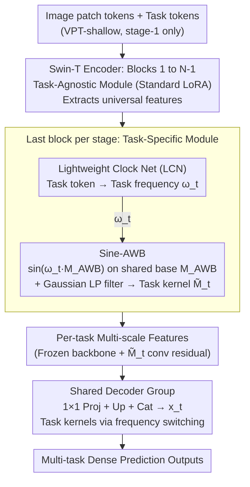

# Frequency Switching Mechanism for Parameter-Efficient Multi-Task Learning

**Conference**: CVPR 2026  
**arXiv**: [2603.21111](https://arxiv.org/abs/2603.21111)  
**Code**: [https://casperliuliuliu.github.io/projects/Free-Sinewich](https://casperliuliuliu.github.io/projects/Free-Sinewich)  
**Area**: Multi-Task Learning / Parameter-Efficient Fine-Tuning  
**Keywords**: Parameter-Efficient Fine-Tuning, Multi-Task Learning, Frequency Switching, Sine Transformation, LoRA

## TL;DR
Free Sinewich proposes a parameter-efficient multi-task learning framework based on frequency switching. By applying sine transformations $M_t = \sin(\omega_t \cdot M_{AWB})$ with different task-specific frequencies to a shared low-rank base matrix, it achieves true parameter reuse and task specialization at near-zero cost, reaching SOTA on dense prediction benchmarks with minimal trainable parameters.

## Background & Motivation

1. **Background**: Multi-task learning (MTL) requires a single model to handle multiple tasks simultaneously. Parameter-efficient fine-tuning (PEFT), such as LoRA, has succeeded in single-task adaptation. Recent PEFT-MTL methods like MTLoRA, DiTASK, and TADFormer balance sharing and specialization through combinations of task-agnostic/task-specific adapters, SVD transformations, or dynamic task filters.
2. **Limitations of Prior Work**: Although existing PEFT-MTL methods claim parameter sharing, they essentially route information to different paths through auxiliary adapters, resulting in "pseudo-sharing"—where each task still possesses an independent set of parameters. The lack of true parameter reuse prevents models from fully utilizing shared knowledge across tasks, leading to redundant computation and insufficient generalization.
3. **Key Challenge**: How to maintain parameter efficiency while allowing the same set of shared weights to exhibit different behaviors for different tasks?
4. **Goal**: Achieve true reuse of the same parameter set across multiple tasks rather than assigning independent parameters to each task.
5. **Key Insight**: Inspired by neuroscience, the thalamo-cortical system achieves selective communication through oscillatory multiplexing, where the same neural population performs different functions by switching oscillation frequencies, thereby reusing the physical "hardware." Analogously in deep networks: can task-specific functions be achieved by switching the frequency response of the same weights?
6. **Core Idea**: Apply sine transformations to a shared low-rank base matrix using task-specific frequencies $\omega_t$, where the same parameters generate different task-specialized weights at different frequencies.

## Method

### Overall Architecture
The objective is to enable the same set of shared weights to exhibit distinct behaviors for different tasks, moving beyond the pseudo-sharing of "one adapter per task" in previous PEFT-MTL. The pipeline is built on a Swin Transformer Tiny encoder: a set of learnable task tokens is concatenated with image patch tokens. The first $N-1$ blocks of each encoder stage utilize a Task-Agnostic Module (standard LoRA) to extract universal features, while the final block is replaced by a Task-Specific Module with frequency switching to extract task-specific features. The core transformation occurs in this module: a lightweight Clock Net calculates a task-specific frequency $\omega_t$ from the task token, and Sine-AWB uses this frequency to modulate a base matrix **shared across all tasks** to generate the task-specific weights. Similarly, the decoder uses frequency switching to allow multi-task sharing of a single decoder base matrix.

### Key Designs

**1. Lightweight Clock Net (LCN): Mapping task tokens to a bounded modulation frequency**

The task frequency $\omega_t$ acts as the "switch" for the pipeline—only with this value can Sine-AWB modulate the shared base matrix for a specific task. To ensure stable sine modulation, frequencies must be bounded. The LCN is a single-layer MLP that maps the task token $\boldsymbol{p}_t \in \mathbb{R}^C$ to a scalar frequency:

$$\omega_t = s \cdot \big(\tanh(W_q\,\text{ReLU}(\boldsymbol{p}_t)) + c\big)$$

where $s, c$ are learnable scale and shift parameters. The $\tanh$ function constrains the output to a bounded interval, stabilizing the training of sine modulation and preventing extreme oscillations. LCN parameters are shared across tasks; the differentiation is driven by the learned differences in task tokens.

**2. Sine-AWB: Phase modulation of the shared base matrix**

After obtaining $\omega_t$, Sine-AWB generates the task-specific weights. In PEFT-MTL, efficiency and specialization are often at odds. Sine-AWB first merges the LoRA factors $A, B$ and the intermediate convolutional kernel $W$ into a single equivalent kernel $M_{AWB} = AWB^\top$, and then applies a task-specific sine transformation:

$$M_t = \sin(\omega_t \cdot M_{AWB})$$

Since sine mapping significantly increases the effective rank of low-rank matrices, different $\omega_t$ values correspond to different sine waves and unique non-linear mappings $\mathcal{F}_{\omega_t}$. Thus, the same $M_{AWB}$ is mapped into distinct task-specific weight spaces, achieving true parameter reuse. The "fusion before sine" sequence is critical because $\sin(AWB) \neq \sin(A)\sin(W)\sin(B)$; sine is not multiplicatively homomorphic. Finally, a Gaussian low-pass filter ($K=7, \sigma=1$) smooths $M_t$ into $\widetilde{M}_t$ to suppress high-frequency noise. This $\widetilde{M}_t$ is added to the frozen backbone output via depthwise convolution: $\boldsymbol{f}_{i+1}^t = \Phi_i(\boldsymbol{f}_i^t) + \widetilde{M}_t * \boldsymbol{f}_i^t$.

**3. Shared Decoder Group: Applying frequency switching to the decoder**

Traditional MTL assigns an independent decoder $\phi_t$ per task, causing parameters to scale linearly with the number of tasks $T$. This method applies the same frequency switching logic: sharing one $M_{AWB}$ and modulating it with task frequencies to obtain individual decoders:

$$\boldsymbol{h}_t = \widetilde{M}_t * \boldsymbol{x}_t + \boldsymbol{b}_t$$

Only a task-specific bias $\boldsymbol{b}_t$ and standard BN-ReLU-Conv layers are maintained for each task. This reduces the multi-task decoder overhead from $T$ full convolutional sets to one base matrix plus $T$ scalar frequencies and biases, making costs nearly independent of $T$.

### Loss & Training
Training utilizes the standard multi-task weighted objective $\mathcal{L}_{MTL} = \sum_t w_t \mathcal{L}_t$. Only the TA-Module (LoRA), TS-Module (Sine-AWB + LCN), and task tokens are trainable, while the backbone is frozen. Task tokens are introduced only in the first stage (VPT-shallow).

## Key Experimental Results

### Main Results (PASCAL-Context, Swin-T ImageNet-1K)

| Method | SemSeg↑ | Human Parts↑ | Saliency↑ | Normals(rmse)↓ | Δm(%)↑ | Params(M) |
|------|---------|-------------|-----------|----------------|--------|---------|
| Single Task | 67.21 | 61.93 | 62.35 | 17.97 | 0 | 112.62 |
| MTLoRA (r=64) | 67.90 | 59.84 | 65.40 | 16.60 | +2.55 | 8.34 |
| TADFormer (r=64) | 70.82 | 60.45 | 65.88 | 16.48 | +4.24 | 7.38 |
| **Free Sinewich (r=64)** | **71.25** | **61.38** | **66.24** | **16.14** | **+5.39** | **6.53** |
| **Free Sinewich (r=32)** | **71.02** | **60.75** | **65.94** | **16.44** | **+4.51** | **4.04** |

### Ablation Study

| Config | SemSeg↑ | Human Parts↑ | Saliency↑ | Normals↓ | Δm(%)↑ | Params(M) |
|------|---------|-------------|-----------|----------|--------|---------|
| Free Sinewich (Full) | 71.25 | 61.38 | 66.24 | 16.14 | +5.39 | 6.53 |
| w/o LCN | 70.83 | 61.37 | 66.09 | 16.17 | +5.12 | 6.51 |
| w/o Low-pass filter | 70.95 | 61.33 | 65.44 | 16.22 | +4.82 | 6.53 |
| w/o Sine | 69.68 | 60.69 | 64.91 | 16.37 | +3.67 | 6.53 |
| Shared Base | 71.25 | 61.38 | 66.24 | 16.14 | +5.39 | 6.53 |
| Independent Base | 70.81 | 61.56 | 65.42 | 16.09 | +5.03 | 10.22 |
| Independent Decoder | 70.91 | 61.57 | 66.03 | 16.10 | +5.31 | 7.41 |

### Key Findings
- **Sine transformation is the core driver**: Removing it drops Δm from +5.39 to +3.67 (the largest drop of -1.72), proving the frequency switching mechanism is the primary source of gain.
- **Shared base outperforms independent base**: Shared Base (+5.39, 6.53M) vs. Independent Base (+5.03, 10.22M) shows better performance with fewer parameters, confirming true parameter reuse provides a regularization effect.
- **r=32 Free Sinewich (+4.51) surpasses r=64 TADFormer (+4.24)** with nearly half the parameters (4.04M vs 7.38M), as frequency modulation compensates for lower rank.
- LCN and low-pass filters provide minor contributions but serve a stabilizing role.
- In the shared decoder configuration, Free Sinewich decoder parameters are only 1.07M (vs. 1.94M for TADFormer).
- On NYUDv2, r=64 reaches -0.52 Δm, nearly matching full fine-tuning performance.

## Highlights & Insights
- **Brain-inspired frequency reuse**: Adapting the neuroscience principle of oscillatory multiplexing to parameter sharing, where the same parameters "oscillate" into different functions via frequencies, is conceptually elegant.
- **Mathematical insight on "Fusion then Sine"**: The non-homomorphic nature of sine requires that transformations occur after fusing $AWB$ to correctly expand the effective rank.
- **Validation of true parameter reuse**: Through Shared vs. Independent Base ablations, it clearly demonstrates that shared effect > independent effect, challenging the intuition that independent parameters are always more flexible.

## Limitations & Future Work
- The frequency $\omega_t$ is currently a global scalar, consistent across all layers and spatial locations. Exploring spatially or temporally varying frequencies is a future direction.
- Performance on NYUDv2 remains slightly below the single-task baseline (Δm=-0.52), indicating room for improvement in scenarios with highly heterogeneous tasks like depth and edges.
- Non-linearity introduced by sine transformations may lead to optimization difficulties in certain task combinations.
- Validated only on Swin Transformer; effectiveness on ViT and CNN backbones remains to be explored.

## Related Work & Insights
- **vs. MTLoRA**: MTLoRA splits LoRA into task-agnostic and task-specific branches with independent parameters per task; Free Sinewich achieves true reuse via frequency switching.
- **vs. TADFormer**: TADFormer uses dynamic filters to condition convolutions but requires more parameters (7.38M vs 6.53M) and uses pseudo-sharing.
- **vs. Sine-LoRA**: Sine-LoRA uses sine to improve single-task effective rank; Free Sinewich parameterizes the frequency to enable a single base matrix to serve multiple tasks.
- **vs. DiTASK**: DiTASK uses differentiable transformations of SVD singular values for task adaptation; Free Sinewich applies sine modulation directly in the weight space, which is more concise.

## Rating
- Novelty: ⭐⭐⭐⭐⭐ Original idea of frequency switching for parameter reuse with compelling biological analogies.
- Experimental Thoroughness: ⭐⭐⭐⭐ Extensive ablations and baseline comparisons across two benchmarks, though NYUDv2 Δm remains negative.
- Writing Quality: ⭐⭐⭐⭐ Clear motivation, complete mathematical derivation, and targeted ablation design.
- Value: ⭐⭐⭐⭐ Significant contribution to PEFT-MTL with an insightful demonstration of true parameter reuse.

<!-- RELATED:START -->

## Related Papers

- [\[CVPR 2026\] FAAR: Efficient Frequency-Aware Multi-Task Fine-Tuning via Automatic Rank Selection](faar_efficient_frequency-aware_multi-task_fine-tuning_via_automatic_rank_selecti.md)
- [\[CVPR 2025\] TADFormer: Task-Adaptive Dynamic Transformer for Efficient Multi-Task Learning](../../CVPR2025/model_compression/tadformer_task-adaptive_dynamic_transformer_for_efficient_multi-task_learning.md)
- [\[ACL 2025\] MoRE: A Mixture of Low-Rank Experts for Adaptive Multi-Task Learning](../../ACL2025/model_compression/more_a_mixture_of_low-rank_experts_for_adaptive_multi-task_learning.md)
- [\[CVPR 2026\] Discovering Adaptive Task Dependencies for Efficient Multi-Task Representation Compression](discovering_adaptive_task_dependencies_for_efficient_multi-task_representation_c.md)
- [\[CVPR 2026\] Parallax to Align Them All: An OmniParallax Attention Mechanism for Distributed Multi-View Image Compression](parallax_to_align_them_all_an_omniparallax_attention_mechanism_for_distributed_m.md)

<!-- RELATED:END -->
