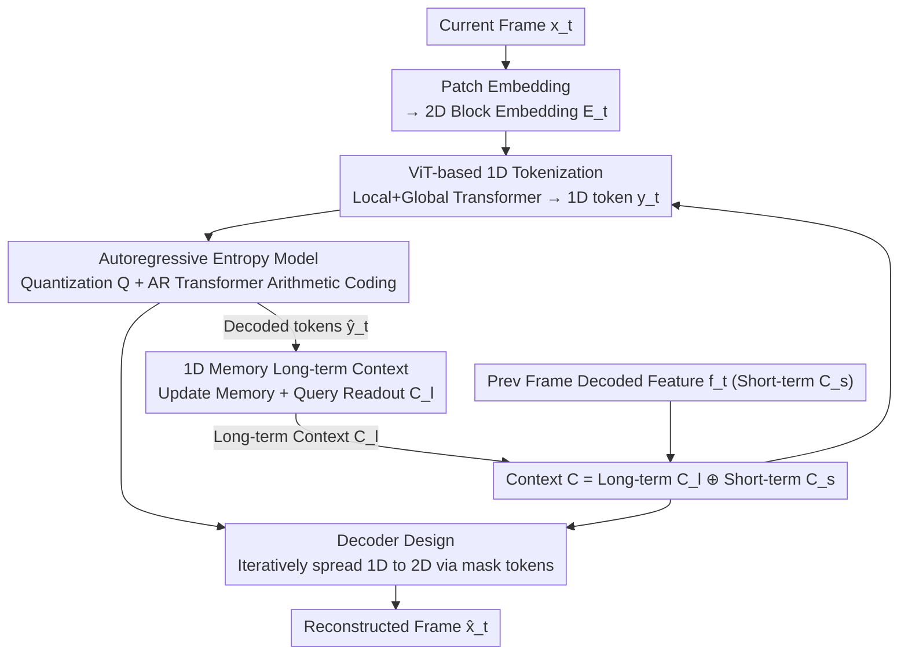

# Generative Video Compression with One-Dimensional Latent Representation

**Conference**: CVPR 2026  
**arXiv**: [2603.15302](https://arxiv.org/abs/2603.15302)  
**Code**: [https://gvc1d.github.io/](https://gvc1d.github.io/)  
**Area**: Model Compression  
**Keywords**: Video compression, 1D latent representation, generative codec, long-term memory, Token compression

## TL;DR

Ours proposes GVC1D, which for the first time replaces the 2D grid latent representation in video compression with a compact 1D token sequence. Combined with a 1D memory module for modeling long-term temporal context, it achieves over 60% bitrate savings in perceptual quality metrics.

## Background & Motivation

**Background**: Conventional and neural video codecs typically encode frames as **2D latent grids** (e.g., 2D feature maps or blocks).  
**Limitations of Prior Work**: This paradigm suffers from two core flaws:
- **Difficulty in Spatial Redundancy Elimination**: The rigid structure of 2D grids forces a fixed number of tokens per image patch. Assigning the same capacity to both simple and complex regions results in significant redundancy.
- **Limited Temporal Modeling**: 2D representations focus more on spatial variations than semantic dynamics, making it difficult to aggregate common content across time intervals, which limits the utilization of long-term context.

**Key Insight**: Although Generative Video Codecs (GVC) enhance perceptual quality through powerful generative models, they remain constrained by these 2D representation limitations. 1D tokenization has shown potential for compact semantic compression in image generation (TiTok) and image compression (DLF) but has not yet been applied to video compression.

## Method

### Overall Architecture

GVC1D aims to break the convention of video codecs "encoding frames into 2D latent grids"—where 2D grids allocate the same number of tokens to simple and complex regions, making redundancy difficult to eliminate and emphasizing spatial changes over cross-frame semantic aggregation. The **Core Idea** is to replace the latent representation with a minimal sequence of 1D tokens. The encoder compresses the current frame $x_t \in \mathbb{R}^{3 \times H \times W}$ into 1D latent tokens $y_t$. An autoregressive Transformer entropy model performs probability modeling and arithmetic coding on these tokens, and the decoder reconstructs $\hat{x}_t$ from the tokens. A context model permeates all three stages, concatenating short-term context (previous frame decoded features $C_s$) and long-term context (provided by 1D Memory $C_l$) into $C$ to feed the codec. The 1D Memory is updated via the decoded tokens $\hat{y}_t$, forming cross-frame temporal feedback.

### Key Designs

**1. ViT-based 1D Tokenization: Decoupling token count from spatial resolution**  
The rigid structure of 2D grids forcing a fixed number of tokens per patch is the root of redundancy. GVC1D converts input frame patches into embeddings $E_t \in \mathbb{R}^{D \times (h \cdot w)}$, which are concatenated with learnable 1D latent tokens $L \in \mathbb{R}^{D \times (N \cdot 32)}$ and fed into the encoder. The encoder consists of alternating Local Transformers (parallel within windows) and Global Transformers (global interaction across windows): $y_t = \text{Enc}(E_t \oplus L \oplus C)$, where $C = C_l \oplus C_s$ represents long and short-term context. The **Mechanism** ensures 1D tokens are not bound to fixed spatial locations, allowing adaptive capacity allocation to semantic regions. With only 32 tokens per window (compared to $16 \times 16 = 256$ patches in 2D), spatial redundancy is fundamentally reduced.

**2. Autoregressive Entropy Model: Low-cost AR modeling for few tokens**  
The entropy model uses an AR Transformer to sequentially predict probability distributions for quantized 1D tokens $Q(y_t)$. While AR is typically slow, having only 32 tokens per frame with parallelizable windows makes the overhead manageable. In contrast, 2D grid entropy models must handle $h \times w$ tokens, where AR complexity is higher by 1–2 orders of magnitude. This fundamental difference in token count turns sequential modeling into a viable choice.

**3. Decoder Design: Redistributing 1D information to 2D space using mask tokens**  
The decoder uses a symmetric architecture to the encoder, introducing learnable mask tokens $M \in \mathbb{R}^{D \times (h \cdot w)}$. These are concatenated with decoded 1D tokens $\hat{y}_t$ and context $C$ to iteratively extract information, followed by a convolutional output head for frame reconstruction: $\hat{x}_t = \text{Out}(\text{Dec}(\hat{y}_t \oplus M \oplus C))$. During decoding, mask tokens "read" content from 1D tokens to restore the compact 1D representation into full 2D spatial features.

**4. 1D Memory Long-term Context Module: Longer temporal memory with compact tokens**  
Video requires long-term context, but 2D features quickly fill a fixed-size memory. 1D Memory maintains a fixed-size state operating in two stages: an update stage using a small number of decoded 1D tokens $\hat{y}_t$ to refresh memory, and a readout stage where learnable query tokens retrieve long-term context $C_l$ via a simple Transformer. Due to the high semantic density and low count of 1D tokens, the same memory capacity can store more information, alleviating forgetting. It supplements short-term context $C_s$ (from the previous frame) to form $C$, providing complementary fine-grained structure and global semantics.

### Loss & Training

A rate-distortion optimization $\mathcal{L} = R + \lambda D$ is used, where $\lambda$ is log-uniformly sampled across 8 points in the range $[0.07, 1.5]$ to train a variable bitrate model. Training is performed on Vimeo and OpenVid-HD datasets, supplemented by perceptual loss to enhance visual quality.

## Key Experimental Results

### Main Results

| Dataset | Metric | GVC1D (**Ours**) | GLC-Video | BD-Rate **Gain** |
|--------|------|-------------|-----------|-------------|
| HEVC-B | LPIPS | Best | Baseline | **-60.4%** |
| HEVC-B | DISTS | Best | Baseline | **-68.8%** |
| UVG | LPIPS | Best | Baseline | **-66.0%** |
| MCL-JCV | LPIPS | Best | Baseline | **-62.1%** |
| HEVC-B | PSNR | Best | Baseline | **-53.8%** |
| HEVC-B | MS-SSIM | Best | Baseline | **-45.1%** |

### Ablation Study

| Configuration | HEVC-B BD-Rate | UVG BD-Rate | Description |
|------|---------------|-------------|------|
| w/o AR + w/o Memory | +67.8% | +67.4% | Base configuration |
| w/ AR + w/o Memory | +20.1% | +40.6% | AR effectively reduces inter-token redundancy |
| w/ AR + 2D Memory | +11.5% | +16.8% | Limited effectiveness of 2D memory management |
| w/ AR + 1D Memory (**Ours**) | 0.0% | 0.0% | Optimal memory management via 1D |

Token size ablation: $32 \times 16$ (count $\times$ channel) is the optimal configuration; too few tokens lack capacity, while too many increase the bitrate.

### Key Findings

- 1D tokens consistently **track the same semantic regions** across frames (e.g., a horse's front leg), even under large movements.
- When new objects appear, 1D token attention weights **dynamically reallocate** to the new content.
- Encoding time is 0.262s, and decoding is 0.207s (1080P@A100), comparable to GLC-Video speed.

## Highlights & Insights

- **Novelty**: First to demonstrate that 1D latent representations outperform traditional 2D grids in video compression, opening a new direction.
- **Elegant Redundancy Removal**: Decoupling token count from spatial resolution naturally achieves adaptive bitrate allocation.
- **Value**: Clever 1D memory design leverages the compactness and semantic richness of 1D tokens to achieve effective long-term context modeling with a simple Transformer.

## Limitations & Future Work

- With only 32 tokens per frame, information capacity is limited; **Ours** currently only applies to **low-bitrate lossy compression**, and the authors acknowledge it cannot scale to lossless scenarios.
- The token count is fixed; the possibility of **dynamically adjusting token counts** based on frame complexity—using fewer tokens for simple frames (e.g., static backgrounds) and more for complex frames (rapid motion/scene cuts)—remains unexplored.
- Generative decoders may still produce **hallucinated details** in certain scenarios that are semantically inconsistent; failure cases were not shown in visual comparisons.
- Scalability to 4K+ ultra-high resolution is unverified, as experiments were limited to 1080p.
- Performance on domain-specific videos (e.g., medical imaging, remote sensing) is unknown since training used general videos.

## Related Work & Insights

- **vs GLC-Video [ECCV24]**: GLC-Video uses VQ-VAE to encode video into 2D latent grids, limited by VQ-VAE capacity and 2D redundancy. GVC1D bypasses 2D constraints using continuous 1D tokens, reducing BD-Rate by 60-68%.
- **vs DiffVC**: DiffVC uses pre-trained diffusion models for perceptual quality but at higher bitrates. GVC1D achieves high perceptual quality at extremely low bitrates via 1D representation and long-term context.
- **vs DCVC-FM/DCVC-RT**: The DCVC series uses PSNR-oriented conditional encoding with only short-term context. GVC1D's 1D Memory could complement DCVC’s conditional encoding.
- **vs DLF [Image Compression]**: DLF first used discrete 1D tokens for images, but discrete formats disrupt temporal consistency. GVC1D's continuous 1D tokens are better suited for video.
- **vs TiTok/TA-TiTok**: 1D tokenization proved valuable in image generation; GVC1D extends this to video compression effectively.
- **Insight**: Could the flexibility and semantic richness of 1D representations be extended to downstream tasks like video understanding or action recognition? The semantic tracking property of 1D tokens might naturally suit object tracking.

## Rating

- **Novelty**: ⭐⭐⭐⭐⭐ Paradigm-level innovation introducing 1D latent representations to video compression.
- **Experimental Thoroughness**: ⭐⭐⭐⭐ Multi-dataset comparisons and extensive ablations/visualizations, though lacking speed-quality Pareto curves.
- **Writing Quality**: ⭐⭐⭐⭐ Clear motivation, high-quality diagrams, and in-depth analysis.
- **Value**: ⭐⭐⭐⭐⭐ Over 60% bitrate savings significantly advances the field of video compression.

<!-- RELATED:START -->

## Related Papers

- [\[CVPR 2026\] CADC: Content Adaptive Diffusion-Based Generative Image Compression](cadc_content_adaptive_diffusion-based_generative_image_compression.md)
- [\[CVPR 2026\] Ultra-Fast Neural Video Compression](ultra-fast_neural_video_compression.md)
- [\[ICCV 2025\] DLF: Extreme Image Compression with Dual-generative Latent Fusion](../../ICCV2025/model_compression/dlf_extreme_image_compression_with_dual-generative_latent_fusion.md)
- [\[CVPR 2026\] ProGIC: Progressive and Lightweight Generative Image Compression with Residual Vector Quantization](progic_progressive_and_lightweight_generative_image_compression_with_residual_ve.md)
- [\[CVPR 2026\] Differentiable Vector Quantization for Rate-Distortion Optimization of Generative Image Compression](differentiable_vector_quantization_for_rate-distortion_optimization_of_generativ.md)

<!-- RELATED:END -->
