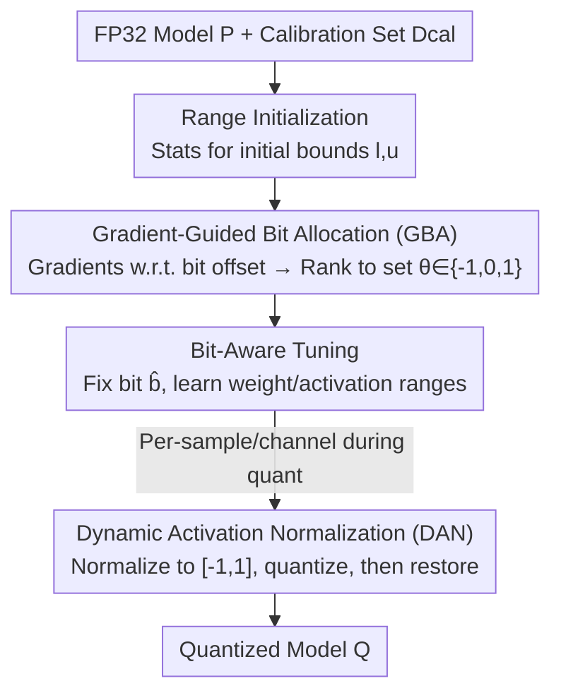

# Gradient Knows Best: Mixed-Precision Quantization via Gradient-Guided Bit Allocation for Super-Resolution

**Conference**: CVPR 2026  
**Paper**: [CVF Open Access](https://openaccess.thecvf.com/content/CVPR2026/html/Kim_Gradient_Knows_Best_Mixed-Precision_Quantization_via_Gradient-Guided_Bit_Allocation_for_CVPR_2026_paper.html)  
**Code**: To be confirmed  
**Area**: Model Compression  
**Keywords**: Super-Resolution, Mixed-Precision Quantization, Post-Training Quantization, Gradient-Guided Bit Allocation, Activation Normalization  

## TL;DR
For post-training mixed-precision quantization (PTQ-MPQ) of super-resolution (SR) models, this paper moves beyond using static statistics like activation standard deviation for layer-wise sensitivity estimation. Instead, it directly uses the "gradient of loss with respect to bit-width" for bit allocation, paired with a non-learning Dynamic Activation Normalization (DAN) to solve the activation range drift caused by the removal of BN in SR. It achieves a 1.26 dB higher PSNR on Urban100 compared to previous PTQ-MPQ methods and is 1.9$\times$ faster for 3-bit EDSR$\times$4.

## Background & Motivation
**Background**: Deep SR models achieve high reconstruction quality but have increasing depth and channel counts, making them difficult to deploy on compute-limited platforms like mobile or edge devices. Quantization is a mainstream lightweighting technique that approximates floating-point weights and activations as fixed-point integers. Mixed-Precision Quantization (MPQ) balances compute and quality by assigning different bit-widths to layers, while Post-Training Quantization (PTQ) is more practical for deployment as it requires only a small calibration set and no full retraining.

**Limitations of Prior Work**: When combining MPQ and PTQ for SR, the state-of-the-art method (AdaBM) has two major flaws. First, it uses the **standard deviation of activations** as a proxy for quantization sensitivity—assuming larger standard deviation implies larger error. However, activation functions produce outliers and asymmetric distributions that bias the standard deviation. Paper Fig.2 uses SQNR (Signal-to-Quantization-Noise Ratio) to show that standard deviation **does not positively correlate** with actual quantization error. This static statistic fails to capture how bit-width changes affect reconstruction loss and ignores inter-layer dependencies. Second, SR models often **remove BN** to preserve high-frequency details, causing activation ranges to fluctuate wildly across samples, which leads to severe clipping when using fixed quantization ranges.

**Key Challenge**: The true sensitivity of quantization lies in "reconstruction loss change caused by bit-width variation + inter-layer dependency," which static statistics cannot capture. Meanwhile, the high-frequency details gained by removing BN conflict with fixed quantization ranges.

**Goal & Key Insight**: Since "sensitivity of loss to bit-width" is required, the paper **directly computes gradients with respect to bit-width**. Gradients inherently carry information about how bit changes affect loss and cross-layer coupling. Range drift is addressed not by re-introducing BN (which hurts SR quality), but by temporarily normalizing activations into a fixed interval per sample and per channel during quantization, then restoring them.

**Core Idea**: Replace "activation standard deviation" with "gradient of loss relative to layer-wise bit-width" for bit allocation, and use a training-free Dynamic Activation Normalization (DAN) to compensate for range instability.

## Method

### Overall Architecture
The method is a three-stage serial PTQ-MPQ pipeline. Inputs are a pre-trained FP32 model $\mathcal{P}$ and a calibration set $\mathcal{D}_{cal}$ of 100 LR images; the output is a quantized model $\mathcal{Q}$ with determined bit-widths and optimized ranges. No **Ground Truth (GT) supervision** is required (using $\mathcal{P}$'s output as the teacher).

The three stages are: ① **Range Initialization**—feeding the calibration set to $\mathcal{P}$, gathering statistics for weights/activations to set initial bounds $l_k^{(*)}, u_k^{(*)}$ and building the initial $\mathcal{Q}$; ② **Gradient-Guided Bit Allocation (GBA)**—fixing ranges and adding a learnable continuous bit offset $s_k$ to each layer, accumulating the gradient $g_k$ of loss w.r.t. $s_k$ to measure sensitivity, then mapping $g_k$ to discrete offsets $\theta_k\in\{-1,0,1\}$ added to the base bit $b_{base}$; ③ **Bit-Aware Tuning**—fixing $\hat b_k$ and treating bounds $[l_k,u_k]$ as learnable parameters for final optimization. **DAN** is applied during the third stage to counteract sample-wise range drift.

To make quantization differentiable, the pipeline uses **fake quantization**:

$$\hat{x} = \Delta \cdot \mathrm{round}\Big(\frac{\mathrm{clip}(x, l, u) - l}{\Delta}\Big) + l, \quad \Delta = \frac{u - l}{2^{b} - 1}$$

### Key Designs

**1. Gradient-Guided Bit Allocation (GBA): Sensitivity by Gradients, Not Std. Dev.**

This addresses the failure of static statistics. A **learnable continuous bit offset** $s_k^{(*)}$ ($*\in\{w,a\}$) is introduced for each layer $k$ as a "sensitivity probe." The optimization objective is the reconstruction and feature alignment loss between the quantized model and FP32 teacher:

$$\mathcal{L}_{grad} = \mathcal{L}_{rec} + \lambda_{feat}\,\mathcal{L}_{feat}$$

$\mathcal{L}_{rec}$ is the $L_1$ loss of outputs, and $\mathcal{L}_{feat}$ is the MSE alignment of normalized intermediate features. Using Straight-Through Estimation (STE), the forward pass uses $\theta_k=\mathrm{round}(s_k)$ while the backward pass uses $\theta_k=\tanh(s_k)$. Sensitivity is defined by the average accumulated gradient:

$$g_k^{(*)} = \frac{1}{T}\sum_{t=1}^{T}\frac{\partial \mathcal{L}_{grad}}{\partial s_{k,t}^{(*)}}$$

Smaller $g_k$ implies the current bit-width is **insufficient** to lower the loss further, requiring more bits. Gradients $g_k$ are ranked $r_k\in\{0,\dots,K-1\}$ in descending order and mapped back to offsets:

$$s_k^{(*)} = 2\cdot\frac{r_k}{K-1+\varepsilon} - 1 \in [-1, +1]$$

The discrete offset $\theta_k^{(*)}\in\{-1,0,1\}$ is then added to the base bit: $\hat b_k^{(*)} = b_{base}^{(*)} + \theta_k^{(*)}$.

**2. Bit-Aware Tuning: Learning Ranges Only**

After GBA determines the bits, the range bounds are refined. Bits $\hat b_k^{(*)}$ are **frozen**, and bounds $[l_k^{(*)}, u_k^{(*)}]$ are optimized as learnable parameters using $\mathcal{L}_{FT}$. **Weight and activation ranges are optimized separately**, ensuring each layer achieves the best representation within its allocated bit budget. This converges within 2 epochs.

**3. Dynamic Activation Normalization (DAN): Counteracting Range Drift**

DAN is a **non-learned** preprocessing step: normalize activations into $[-1,1]$ per sample/channel before quantization, then restore the original scale. For activation $x^{n,c}$:

$$\tilde{x}^{n,c} = \frac{2\big(x^{n,c} - x_{\min}^{n,c}\big)}{x_{\max}^{n,c} - x_{\min}^{n,c}} - 1$$

Quantize $\hat{x}^{n,c} = Q(\tilde{x}^{n,c})$, then de-normalize:

$$x_q^{n,c} = \frac{\hat{x}^{n,c} + 1}{2}\cdot\big(x_{\max}^{n,c} - x_{\min}^{n,c}\big) + x_{\min}^{n,c}$$

Unlike BN, DAN does not modify the statistics permanently and allows for exact scale restoration, helping quantization without hurting reconstruction.

### Loss & Training
Uses self-supervision from the FP32 model $\mathcal{P}$. Both GBA and tuning use $\mathcal{L}_{rec}+\lambda_{feat}\mathcal{L}_{feat}$ with $\lambda_{feat}=10$. Batch sizes for the three stages are 16 / 2 / 2, with epochs 1 / 2 / 2. Learning rates are 0.1 for GBA and 0.01 for tuning using Adam. Calibration uses 100 LR images from DIV2K.

## Key Experimental Results

### Main Results
Comparison on ×4 SR, 4-bit/3-bit PTQ methods. ⋆ denotes MP for both weight and activation.

| Model / Setting | Method | W/A | Time | Urban100 PSNR | Set5 PSNR |
|------|------|-----|------|------|------|
| EDSR ×4 4-bit | AdaBM (CVPR'24) | 4/4MP | 50 s | 25.36 | 31.19 |
| EDSR ×4 4-bit | **Ours⋆** | 4MP/4MP | **26 s** | **25.61** | **31.67** |
| EDSR ×4 3-bit | AdaBM | 3/3MP | 50 s | 23.63 | 29.14 |
| EDSR ×4 3-bit | **Ours⋆** | 3MP/3MP | **26 s** | **24.79** | **30.68** |
| RDN ×4 4-bit | AdaBM | 4/4MP | 167 s | 23.44 | 28.76 |
| RDN ×4 4-bit | **Ours⋆** | 4MP/4MP | 87 s | **25.87** | **31.83** |

On RDN ×4 4-bit, Ours outperforms AdaBM by **2.43 dB** on Urban100. On SwinIR (Transformer):

| Method | W/A | Time | Set5 PSNR | Urban100 PSNR |
|------|-----|------|------|------|
| 2DQuant (NeurIPS'24) | 4/4 | 2 hrs | 31.77 | 25.71 |
| AdaBM | 4/4MP | 133 s | 31.64 | 25.24 |
| **Ours⋆** | 4MP/4MP | **73 s** | **32.15** | 25.73 |

Ours is significantly faster than 2DQuant (73s vs 2hrs).

### Ablation Study
EDSR 4-bit ×4 (Gain relative to baseline):

| Weight GBA | Act GBA | DAN | Set5 PSNR | Urban100 PSNR |
|:--:|:--:|:--:|------|------|
| ✗ | ✗ | ✗ | 29.06 | 23.54 |
| ✓ | ✗ | ✗ | 29.54 (+0.48) | 24.35 (+0.81) |
| ✗ | ✓ | ✗ | 31.16 (+2.10) | 25.35 (+1.81) |
| ✗ | ✗ | ✓ | 31.21 (+2.15) | 25.36 (+1.82) |
| ✗ | ✓ | ✓ | 31.52 (+2.46) | 25.57 (+2.03) |
| ✓ | ✓ | ✓ | **31.67 (+2.61)** | **25.61 (+2.07)** |

### Key Findings
- **Activations contribute more than weights**: Act-GBA provides a +1.81 dB gain on Urban100, while Weight-GBA provides +0.81 dB.
- **DAN and GBA are complementary**: DAN alone provides +1.82 dB, and combining it with Act-GBA further improves performance (25.35 to 25.57).
- **Efficiency**: Speed comes from PTQ and range-only tuning. Better quality at lower bits (3-bit) compared to competitors.

## Highlights & Insights
- **Gradient w.r.t. bit-width**: A clever perspective. By using $s_k$ + STE, the authors turn a discrete parameter into a "sensitivity probe." This "continuous probe for discrete resources" approach is transferable.
- **DAN as zero-cost patch**: Specifically targets the lack of BN in SR. Its per-sample/channel normalization provides massive gains (+1.82 dB) without learnable parameters.
- **Self-distillation PTQ**: Relying on FP32 teacher instead of GT makes mixed-precision quantization possible in seconds, highlighting practicality for deployment.

## Limitations & Future Work
- Task specificity: The motivation for DAN is tied to "SR without BN." Generality to classification/detection models with BN is unverified.
- Fixed offset range: GBA limits bits to $b_{base}\pm1$, which might constrain flexibility if a layer needs significantly more or fewer bits.
- Sensitivity to calibration: Bit allocation relies on a one-time gradient estimate from a small set (100 images).

## Related Work & Insights
- **vs AdaBM**: AdaBM uses activation std. dev. and focuses on activation MP. Ours uses "gradient w.r.t. bits" for both weights/activations and adds DAN. Results show massive PSNR leads (+2.43 dB for RDN).
- **vs 2DQuant**: 2DQuant takes 2 hours for single-precision tuning; Ours is a multi-precision framework taking minutes with better results on Transformer architectures.
- **vs CADyQ/CABM (QAT)**: These require 16–30 hours and GT data. Ours is post-training, uses no GT, and takes 20 seconds while matching or exceeding reconstruction quality at low bits.

## Rating
- Novelty: ⭐⭐⭐⭐ Using bit-width gradients for SR mixed-precision sensitivity is a strong and targeted perspective.
- Experimental Thoroughness: ⭐⭐⭐⭐ Covers various SR models, bit-widths, and comprehensive comparisons, though limited to SR tasks.
- Writing Quality: ⭐⭐⭐⭐ Clear motivation and well-defined three-stage process.
- Value: ⭐⭐⭐⭐ Seconds-level, GT-free MPQ is highly practical for SR edge deployment.

<!-- RELATED:START -->

## Related Papers

- [\[ICLR 2026\] SPR$^2$Q: Static Priority-based Rectifier Routing Quantization for Image Super-Resolution](../../ICLR2026/model_compression/spr2q_static_priority-based_rectifier_routing_quantization_for_image_super-resol.md)
- [\[AAAI 2026\] KVmix: Gradient-Based Layer Importance-Aware Mixed-Precision Quantization for KV Cache](../../AAAI2026/model_compression/kvmix_gradient-based_layer_importance-aware_mixed-precision_.md)
- [\[AAAI 2026\] QuantVSR: Low-Bit Post-Training Quantization for Real-World Video Super-Resolution](../../AAAI2026/model_compression/quantvsr_low-bit_post-training_quantization_for_real-world_video_super-resolutio.md)
- [\[ICLR 2026\] STaMP: Sequence Transformation and Mixed Precision for Low-Precision Activation Quantization](../../ICLR2026/model_compression/stamp_sequence_transformation_and_mixed_precision_for_low-precision_activation_q.md)
- [\[CVPR 2026\] Beyond Soft Label: Dataset Distillation via Orthogonal Gradient Matching](beyond_soft_label_dataset_distillation_via_orthogonal_gradient_matching.md)

<!-- RELATED:END -->
## Related Papers

- [\[AAAI 2026\] KVmix: Gradient-Based Layer Importance-Aware Mixed-Precision Quantization for KV Cache](../../AAAI2026/model_compression/kvmix_gradient-based_layer_importance-aware_mixed-precision_.md)
- [\[AAAI 2026\] QuantVSR: Low-Bit Post-Training Quantization for Real-World Video Super-Resolution](../../AAAI2026/model_compression/quantvsr_low-bit_post-training_quantization_for_real-world_video_super-resolutio.md)
- [\[CVPR 2026\] Beyond Soft Label: Dataset Distillation via Orthogonal Gradient Matching](beyond_soft_label_dataset_distillation_via_orthogonal_gradient_matching.md)
- [\[ICML 2026\] GEMQ: Global Expert-Level Mixed-Precision Quantization for MoE LLMs](../../ICML2026/model_compression/gemq_global_expert-level_mixed-precision_quantization_for_moe_llms.md)
- [\[CVPR 2026\] LS-ViT: Least-Squares Hessian Based Block Reconstruction for Low-Bit Post-Training Quantization of Vision Transformers](ls-vit_least-squares_hessian_based_block_reconstruction_for_low-bit_post-trainin.md)

<!-- RELATED:END -->
