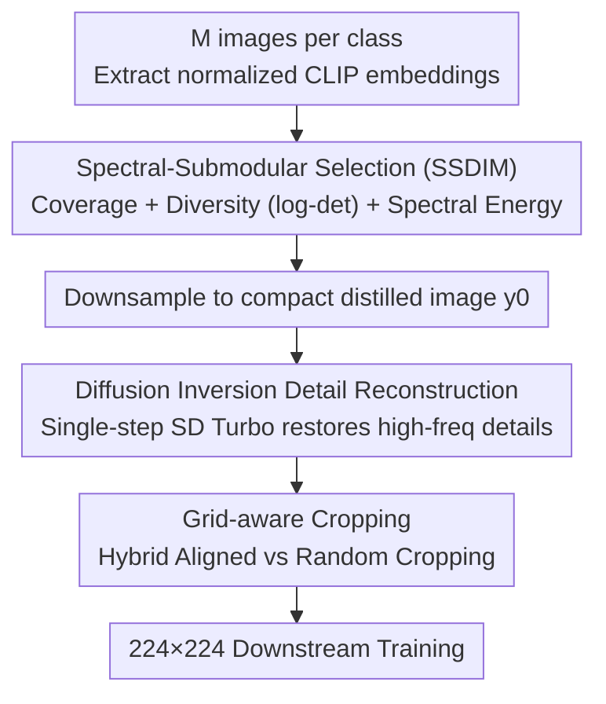

# Grid Distillation: Compositional Image Distillation via Structured Generative Grids

**Conference**: CVPR 2026  
**Paper**: [CVF Open Access](https://openaccess.thecvf.com/content/CVPR2026/html/Das_Grid_Distillation_Compositional_Image_Distillation_via_Structured_Generative_Grids_CVPR_2026_paper.html)  
**Code**: TBD  
**Area**: Dataset Distillation / Model Compression  
**Keywords**: Dataset Distillation, Submodular Optimization, Spectral Decomposition, Diffusion Inversion, Grid Composition

## TL;DR
Grid Distillation compresses an entire image class into a "structured generative grid": it first uses Spectral-Submodular Image Selection (SSDIM) to select $L^2$ representative images from CLIP embeddings—balancing coverage, diversity, and manifold geometry—to form a grid which is then downsampled. Subsequently, a single-step diffusion inversion (based on SD Turbo) restores high-frequency details lost during downsampling, followed by grid-aware cropping for training augmentation. The method significantly outperforms existing dataset distillation approaches across ImageWoof, ImageNette, ImageIDC, and ImageNet-1K, achieving 65.5% on ImageWoof IPC=10 (compared to 39.9% for VLCP).

## Background & Motivation
**Background**: Dataset Distillation (DD) aims to compress massive datasets into a small set of information-dense synthetic samples, allowing models trained on these synthetic sets to approximate full-data performance, thereby saving storage, compute, and facilitating privacy/copyright-friendly data sharing. Early methods focused on optimization (meta-learning, gradient/feature distribution matching), while recent trends shifted towards generative approaches—synthesizing realistic samples in latent space using strong priors like diffusion (e.g., Minimax, D4M).

**Limitations of Prior Work**: The authors identify two complementary flaws. First, **grid/patch-based** methods (e.g., RDED) are efficient but operate on **disjoint cropped patches**, losing global spatial layout and contextual relations within patches, while being limited in the number of spatial units and intra-class diversity. Second, **diffusion prototype** methods (e.g., VLCP) leverage diffusion priors to synthesize semantically rich samples but **generate each image independently**, failing to encode inter-instance or contextual dependencies without structured spatial composition. Consequently, neither paradigm captures **both** compositional structure and world knowledge simultaneously, resulting in distilled data that is either spatially fragmented or semantically shallow.

**Key Challenge**: Compositional structure and world knowledge are decoupled in existing paradigms—optimization-based methods provide good coverage but lack prior utilization, while generative methods have priors but lack structured composition. Furthermore, optimization-based methods are computationally prohibitive at high resolutions or large IPC due to pixel-wise iterations.

**Goal**: Design a unified framework that ensures intra-class diversity and compositional integrity through structured selection, while injecting world knowledge and restoring compressed details via fast diffusion priors, scalable to high resolution and large IPC.

**Key Insight**: Rather than synthesizing individual samples, the authors propose **synthesizing grid layouts**. This treats the selection and arrangement of diverse visual patterns as a theoretically grounded submodular selection problem. The downsampling process is then viewed as an "inverse super-resolution problem," solved by single-step diffusion inversion to recover details.

**Core Idea**: A three-part pipeline: Spectral-Submodular grid selection + Single-step diffusion inversion + Grid-aware cropping. This compresses a class into a structured generative grid that accounts for coverage, diversity, composition, and world knowledge.

## Method

### Overall Architecture
The input consists of $M$ images from a class, and the output is a small set of "distilled grid images" used for downstream training. The pipeline involves three steps: ① Spectral-Submodular Image Selection (SSDIM) selects $L^2$ representative images from CLIP embeddings to form an $L\times L$ grid, downsampled into a compact distilled image $y_0$; ② During training, single-step diffusion inversion (SD Turbo) restores high-frequency details and injects world knowledge to produce a detail-enhanced grid $x_0$; ③ Grid-aware cropping feeds these into standard 224×224 classification training, preserving grid unit semantics while adding stochastic perturbations.

### Key Designs

**1. Spectral-Submodular Image Selection (SSDIM): Compressing Class Diversity into a Grid**

Random sampling or clustering often over-represents dense patterns while missing rare but informative variations. The authors model grid construction as a **submodular selection** problem. Given $M$ CLIP embeddings $\{e_i\}$ ($\|e_i\|_2=1$), an affinity kernel $K_{ij}=e_i^\top e_j$ is constructed. Spectral decomposition $K=U\Lambda U^\top$ yields **spectral energy scores** $s_i=\sum_{k=1}^r \lambda_k u_{ik}^2$ (measuring image $i$'s contribution to the top $r$ manifold modes). The objective function maximizes: $F(S)=\alpha\sum_{i\in U}\max_{j\in S}K_{ij}+\beta\log\det(K_{S,S}+\epsilon I)+\gamma\sum_{i\in S}s_i$. The **coverage term** ($\alpha$) ensures each candidate is represented; the **diversity term** ($\beta$, log-det) ensures selected embeddings span a large volume to avoid redundancy; and the **spectral term** ($\gamma$) favors high-energy samples aligned with the class manifold's principal directions. Optimization is solved via a three-stage SSDIM approximation: Frank-Wolfe continuous relaxation, spectral regularization, and greedy refinement.

**2. Diffusion Inversion Detail Reconstruction: Restoring High-Frequency Details**

Downsampling compacts the grid but loses high-frequency textures. The authors treat this as an "inverse super-resolution" task, borrowing from diffusion inversion (InvSR). A noise prediction model $f_w$, conditioned on the low-res grid $y_0$ and class/text embeddings $p$, predicts noise to construct an initial latent $x_{\tau_S}=\sqrt{\bar\alpha_{\tau_S}}\,y_0+\sqrt{1-\bar\alpha_{\tau_S}}\,f_w(y_0,p,\tau_S)$. A single-step reverse diffusion (SD Turbo) $x_0=g_\theta(x_{\tau_S},\tau_S)$ then reconstructs the detail-enhanced grid. This process injects world knowledge in a class-aware manner while maintaining efficiency (approx. 148ms for inversion).

**3. Grid-aware Cropping: Preserving Grid Semantics**

To utilize the compositional structure during training, grid-aware cropping is introduced. A grid $I$ with $L^2$ units of size $h\times w$ is cropped using a mixture of aligned and random strategies: $C(I;p_{\text{align}})=\mathrm{AlignedCrop}(I)$ with probability $p_{\text{align}}$ (starting from integer multiples of $h,w$) and $\mathrm{RandomCrop}(I)$ otherwise. This mixture ensures the patches maintain semantic coherence within units while remaining robust to perturbations and compatible with standard 224×224 testing.

### Loss & Training
Experiments were conducted on a single A6000 (48GB). Submodular weights were set to $\alpha=1.0, \beta=0.6, \gamma=0.3$ with $p_{\text{align}}=0.6$. Grid size was $L=4$, and spectral modes $r=32$. For ImageNet-1K, the分辨率 was 256×256 (following Minimax) or 224×224 (following RDED). SSDIM takes approx. 18s to build the kernel for ~1300 images per class, and enhancement takes 57s per class.

## Key Experimental Results

### Main Results
Evaluation across ImageWoof, ImageNette, ImageIDC, and ImageNet-1K shows that Grid-Distil leads across all IPC settings and backbones. The gain in low-data regimes (IPC=10) is particularly significant:

| Dataset / Backbone | IPC | Grid-Distil (Ours) | VLCP (Next Best) | Minimax | RDED/Random |
|--------|------|------|------|------|------|
| ImageWoof / ResNet-18 | 10 | **65.5** | 39.9 | 35.7 | 27.7 (Rand) |
| ImageWoof / ResNet-18 | 50 | **84.3** | 58.9 | 48.3 | 47.9 (Rand) |
| ImageWoof / ResNetAP-10 | 20 | **73.7** | 44.5 | 43.3 | 32.7 (Rand) |
| ImageNette / ResNetAP-10 | 10 | **83.3** | 64.8 | 57.7 | 54.2 (Rand) |

On ImageNet-1K (IPC=10, ResNet-18), the detail-enhanced version reaches 50.01%, significantly exceeding VLCP (46.7%):

| Method | Source | Mean | Std |
|------|------|------|------|
| RDED | CVPR'24 | 42.0 | 0.1 |
| Minimax | CVPR'24 | 44.3 | 0.5 |
| VLCP | ICCV'25 | 46.7 | 0.4 |
| **Ours (Bilinear)** | – | 35.40 | 0.25 |
| **Ours (Detail Enhancement)** | – | **50.01** | 0.29 |

### Ablation Study

| Configuration | Metric | Description |
|------|---------|------|
| Bilinear Upsampling | ImageNette IPC=50: 91.5 | Without diffusion enhancement |
| Diffusion Enhancement | ImageNette IPC=50: 92.7 | Stable gain on high-variance datasets |
| Bilinear | ImageIDC IPC=10: 74.7 | Slightly higher on low-frequency data |
| Diffusion Enhancement | ImageIDC IPC=10: 73.5 | Limited gain for low-frequency content |

### Key Findings
- **Detail enhancement gain depends on spectral characteristics**: Diffusion enhancement is effective for high intra-class variance datasets like ImageWoof, but offers limited or even negative gain on low-frequency compositional datasets like ImageIDC.
- **SSDIM is a major driver**: Even the Bilinear version (without diffusion) outperforms or matches prior diffusion-based distillers on large datasets, proving the strength of the coverage/diversity/spectral selection.
- **Efficiency**: One-time overhead of ~16.9% relative to training time, with single-step inversion being fast enough for practical use.

## Highlights & Insights
- **Formulating grid construction as a submodular problem**: Combining coverage, log-det diversity, and spectral energy provides a theoretically grounded way to pick representative samples, superior to simple clustering.
- **Diffusion inversion as a "Detail Filler"**: Repurposing InvSR with class-specific text priors allows single-step high-frequency restoration and world knowledge injection without full generative costs.
- **Grid-aware cropping**: A simple stochastic mixture maintains semantic coherence of grid units while ensuring generalization to standard test inputs.

## Limitations & Future Work
- Grid size ($L=4$) and spectral modes ($r=32$) were fixed; adaptive parameters per dataset could yield better results.
- Dependence on CLIP and SD Turbo priors means the distillation inherits the biases of these pre-trained models.
- Scalability of the SSDIM greedy refinement on extremely large candidate pools (thousands per class) needs further optimization.

## Related Work & Insights
- **vs RDED**: RDED uses disjoint patches; **Ours** uses a structured grid with global selection, improving diversity.
- **vs VLCP/Minimax**: They generate independent samples; **Ours** explicitly encodes spatial dependencies via grids.
- **vs Optimization-based DD**: Optimization methods are too slow for high-res/high-IPC; **Ours** uses one-time selection and enhancement, making it far more scalable.

## Rating
- Novelty: ⭐⭐⭐⭐⭐ (Integrates submodular optimization and diffusion inversion for grid composition)
- Experimental Thoroughness: ⭐⭐⭐⭐ (Extensive benchmarks, though IPC is capped at 10 for ImageNet-1K)
- Writing Quality: ⭐⭐⭐⭐ (Clear motivation and methodical explanation)
- Value: ⭐⭐⭐⭐⭐ (Significant SOTA improvements and highly efficient)

<!-- RELATED:START -->

## Related Papers

- [\[CVPR 2026\] HierAmp: Coarse-to-Fine Autoregressive Amplification for Generative Dataset Distillation](hieramp_coarse-to-fine_autoregressive_amplification_for_generative_dataset_disti.md)
- [\[CVPR 2026\] CADC: Content Adaptive Diffusion-Based Generative Image Compression](cadc_content_adaptive_diffusion-based_generative_image_compression.md)
- [\[CVPR 2026\] ProGIC: Progressive and Lightweight Generative Image Compression with Residual Vector Quantization](progic_progressive_and_lightweight_generative_image_compression_with_residual_ve.md)
- [\[CVPR 2026\] Differentiable Vector Quantization for Rate-Distortion Optimization of Generative Image Compression](differentiable_vector_quantization_for_rate-distortion_optimization_of_generativ.md)
- [\[CVPR 2026\] Dataset Distillation by Influence Matching](dataset_distillation_by_influence_matching.md)

<!-- RELATED:END -->
