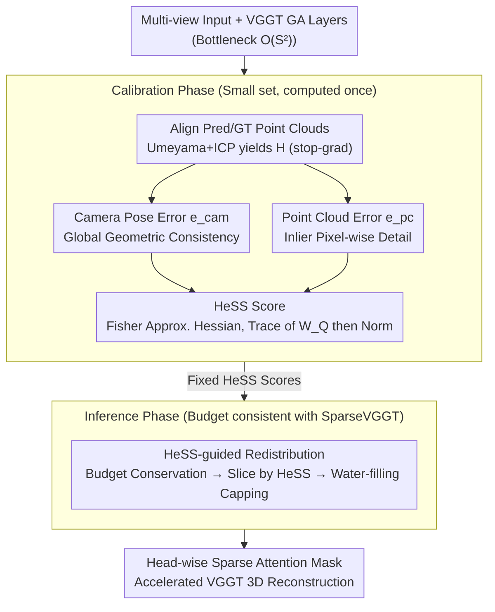

# HeSS: Head Sensitivity Score for Sparsity Redistribution in VGGT

**Conference**: CVPR 2026  
**arXiv**: [2603.25336](https://arxiv.org/abs/2603.25336)  
**Code**: [https://github.com/libary753/HeSS](https://github.com/libary753/HeSS)  
**Area**: Model Compression  
**Keywords**: Attention Sparsification, VGGT, Head Sensitivity, Fisher Information Matrix, 3D Reconstruction Acceleration

## TL;DR

HeSS proposes the Head Sensitivity Score to quantify the sensitivity of each attention head in the global attention layers of VGGT to sparsification. Based on this score, it redistributes the attention budget from insensitive heads to sensitive ones, significantly outperforming the uniform sparsification method SparseVGGT at high sparsity levels with almost no additional runtime overhead.

## Background & Motivation

1. **Background**: VGGT (Visual Geometry Grounded Transformer) is a powerful foundation model for multi-view 3D reconstruction, unifying traditional SfM and MVS tasks through interleaved Global Attention (GA) and Frame Attention (FA) layers. GA layers allow interaction between tokens from all frames, which is critical for understanding global scene structure.

2. **Limitations of Prior Work**: The computational complexity of self-attention in GA layers grows quadratically $O(S^2)$ with the number of input views. This leads to a sharp increase in GPU memory and computational costs for large-scale inputs, limiting the application of VGGT in real-time and large-scale scenarios.

3. **Key Challenge**: Existing acceleration methods (e.g., SparseVGGT) apply a uniform sparsity pattern (the same CDF threshold $\tau$ and sparsity ratio $\rho$) to all attention heads. However, different heads exhibit varying sensitivities to sparsification—some heads cause dramatic performance drops when over-sparsified, while others remain unaffected even with significant sparsification.

4. **Goal**: (1) How to quantify the sensitivity of each attention head to sparsification? (2) How to adaptively allocate the attention budget based on sensitivity differences? (3) How to significantly reduce performance degradation under high sparsity through budget redistribution while keeping total computation constant?

5. **Key Insight**: The authors hypothesize that the root cause of performance degradation is the sensitivity heterogeneity of attention heads—uniform sparsification inevitably over-compresses critical heads. The sensitivity score is calculated by approximating the Hessian using the Fisher Information Matrix, combining two error signals specific to 3D reconstruction tasks: camera pose and point cloud errors.

6. **Core Idea**: Each attention head's sensitivity is quantified using the Fisher Information Matrix approximation of the Hessian for camera pose and point cloud errors. The total attention budget is then redistributed proportionally to these sensitivities, retaining more attention for sensitive heads and applying stronger sparsification to robust ones.

## Method

### Overall Architecture

The GA layers of VGGT facilitate interaction between all frame tokens, with quadratic complexity serving as the main bottleneck. While SparseVGGT uses a set of uniform thresholds, HeSS treats the problem as a sensitivity-based budget allocation, recognizing the vast differences in head tolerance.

The pipeline consists of two stages: The **Calibration Phase** computes HeSS sensitivity scores for each head in every GA layer on a small calibration set, which are then fixed. The **Inference Phase** maintains the same total budget as SparseVGGT but redistributes this fixed budget between heads based on HeSS scores—sensitive heads receive more attention blocks, while robust heads receive fewer. This process requires no training and does not modify weights.

### Key Designs

**1. Camera Pose Error $e_{\text{cam}}$: Global Consistency as the First Signal**

To measure sensitivity, an error metric reflecting "3D reconstruction quality" is needed. Camera poses form the geometric skeleton of the prediction; if poses are skewed, all downstream results will be erroneous. After aligning predicted and ground-truth point clouds via Umeyama + ICP to get the transformation $\mathbf{H}$, the MSE of predicted camera positions is calculated:

$$e_{\text{cam}} = \frac{1}{2N}\sum_{i=1}^N \|\text{sg}(\mathbf{H})\hat{\mathbf{t}}_i - \mathbf{t}_i\|_2^2$$

A stop-gradient ($\text{sg}(\cdot)$) is applied to $\mathbf{H}$ to ensure it only serves as an alignment step and does not contaminate sensitivity estimates.

**2. Point Cloud Error $e_{\text{pc}}$: Pixel-wise Details**

Camera poses only capture global geometry. A head might estimate poses correctly but produce blurry local structures. $e_{\text{pc}}$ addresses this by filtering credible inliers $\mathcal{I}$ (distance to ground truth $<\epsilon=0.05$) and calculating their average distance to the nearest point in the ground-truth cloud:

$$e_{\text{pc}} = \frac{1}{2|\mathcal{I}|}\sum_{j \in \mathcal{I}} \min_{\mathbf{p} \in P}\|\text{sg}(\mathbf{H})\hat{\mathbf{p}}_j - \mathbf{p}\|_2^2$$

This metric captures local geometric details by requiring accurate pixel projection into 3D space.

**3. HeSS Score: Quantifying Sensitivity via Fisher Information**

True sensitivity corresponds to the second-order curvature (Hessian) of the error with respect to head parameters. The Fisher Information Matrix (FIM) is used as an efficient approximation. For each head $h$, $\mathbf{F}_{\text{cam}}^h$ and $\mathbf{F}_{\text{pc}}^h$ are calculated with respect to the Query weights $W_Q^h$. These are traced, normalized across the layer, and combined:

$$\text{HeSS}_{\text{cam}}(h) = \frac{\text{tr}(\mathbf{F}_{\text{cam}}^h)}{\sum_h \text{tr}(\mathbf{F}_{\text{cam}}^h)}, \qquad \text{HeSS}(h) = \lambda\,\text{HeSS}_{\text{cam}}(h) + (1-\lambda)\,\text{HeSS}_{\text{pc}}(h)$$

The default is $\lambda = 0.5$. Query weights are used because they provide the most reliable estimates. The two signals are combined as $e_{\text{cam}}$ dominates at low sparsity and $e_{\text{pc}}$ becomes critical at high sparsity.

**4. HeSS-guided Budget Redistribution: Iterative Water-filling**

The total budget $C_{\text{total}}$ is redistributed using normalized HeSS weights $w_h$. Since the idealized budget $c_h' = C_{\text{total}} \cdot w_h$ might exceed the maximum physically possible blocks ($C_{\max}$), an iterative water-filling algorithm is applied. It caps overflowing heads at $C_{\max}$ and redistributes the excess budget to remaining heads until all constraints are met.

### Loss & Training

HeSS involves no training loss and no weight updates. Calibration is performed on a small dev split (e.g., CO3Dv2 dev split, 20 views per scene) to fix HeSS scores. The method is a pure inference-time budget redistribution.

## Key Experimental Results

### Main Results

Comparison on CO3Dv2 (pose) and DTU (MVS):

| Method | Sparsity | CO3Dv2 AUC@30↑ | DTU Chamfer↓ | Runtime (s) |
|--------|----------|---------------|-------------|-------------|
| VGGT (Original) | 0% | Baseline | Baseline | 10.35 |
| SparseVGGT | 43% | Noticeable drop | Noticeable drop | 8.42 |
| **HeSS (Ours)** | **43%** | **Near Original** | **Near Original** | **8.37** |
| SparseVGGT | 73% | Severe degradation| Severe degradation| 6.59 |
| **HeSS (Ours)** | **73%** | **Significantly better**| **Significantly better**| **6.58** |

### Ablation Study

| Configuration | DTU Chamfer↓ | Acc.↓ | Comp.↓ | Note |
|---------------|-------------|-------|--------|------|
| Ours ($W_Q^h$) | **1.603** | **2.839** | **0.367** | Using Query Hessian |
| $W_K^h$ | 1.917 | 3.450 | 0.384 | Using Key, worse |
| $W_V^h$ | 1.966 | 3.540 | 0.392 | Using Value, even worse |
| No Norm (Linear) | 1.840 | 3.272 | 0.408 | No sum-normalization |
| Reversed HeSS | Catastrophic | — | — | Pruning sensitive heads first |

### Key Findings

- Visualization of HeSS distributions confirms high heterogeneity; most heads are robust while a few are critical (e.g., GA19 H5).
- Some heads show task preferences—GA13 H13 is more sensitive to camera poses, while GA19 H5 is more sensitive to point clouds.
- $\lambda$ ablation shows error complementarity: using only $e_{\text{cam}}$ degrades high-sparsity results, while only $e_{\text{pc}}$ hurts low-sparsity results. 
- Removing iterative capping leads to significant degradation as unused budget is wasted.
- The method generalizes to $\pi^3$ models, though $\lambda$ needs adjustment ($\lambda=0$ is optimal there).

## Highlights & Insights

- **Zero-cost performance gain**: HeSS improves performance at high sparsity levels without increasing total computation (sometimes even improving efficiency) by smarter budget allocation.
- **3D-Task specific sensitivity**: Unlike generic ViT pruning using classification loss Hessians, HeSS defines complementary error terms for camera pose and point clouds, leading to more accurate sensitivity measurements for 3D tasks.
- **Sanity check via Reversed HeSS**: The catastrophic failure when pruning sensitive heads first strongly validates that HeSS correctly identifies critical components.

## Limitations & Future Work

- HeSS currently treats all GA layers uniformly, but cross-layer FIM scales are not directly comparable. Inter-layer sensitivity metrics are a potential future direction.
- The method focuses on inference-time sparsification; training-time adaptation could potentially push compression ratios further.
- The sensitivity of $\lambda$ across models ($\pi^3$ vs. VGGT) suggests a need for automated searching mechanisms.

## Related Work & Insights

- **vs SparseVGGT**: While SparseVGGT provides the block-sparse mechanism, HeSS adds the head-level intelligence, achieving better performance with the same budget.
- **vs Generic Head Pruning**: Standard pruning usually collapses beyond 50% sparsity due to loss of geometric priors. HeSS maintains spatial token structures, preserving fidelity at 75% sparsity.
- **Transferable Insight**: The strategy of using task-specific error Hessians to guide head-level resource allocation could be extended to other architectures, such as KV-cache compression in LLMs.

## Rating

- Novelty: ⭐⭐⭐⭐
- Experimental Thoroughness: ⭐⭐⭐⭐
- Writing Quality: ⭐⭐⭐⭐
- Value: ⭐⭐⭐⭐

<!-- RELATED:START -->

## Related Papers

- [\[CVPR 2026\] HTTM: Head-wise Temporal Token Merging for Faster VGGT](httm_head-wise_temporal_token_merging_for_faster_vggt.md)
- [\[CVPR 2026\] Batch Loss Score for Dynamic Data Pruning](batch_loss_score_for_dynamic_data_pruning.md)
- [\[CVPR 2026\] LiteVGGT: Boosting Vanilla VGGT via Geometry-aware Cached Token Merging](litevggt_boosting_vanilla_vggt_via_geometry-aware_cached_token_merging.md)
- [\[CVPR 2026\] Test-time Sparsity for Extreme Fast Action Diffusion](test-time_sparsity_for_extreme_fast_action_diffusion.md)
- [\[CVPR 2026\] SODA: Sensitivity-Oriented Dynamic Acceleration for Diffusion Transformer](soda_sensitivity-oriented_dynamic_acceleration_for_diffusion_transformer.md)

<!-- RELATED:END -->
