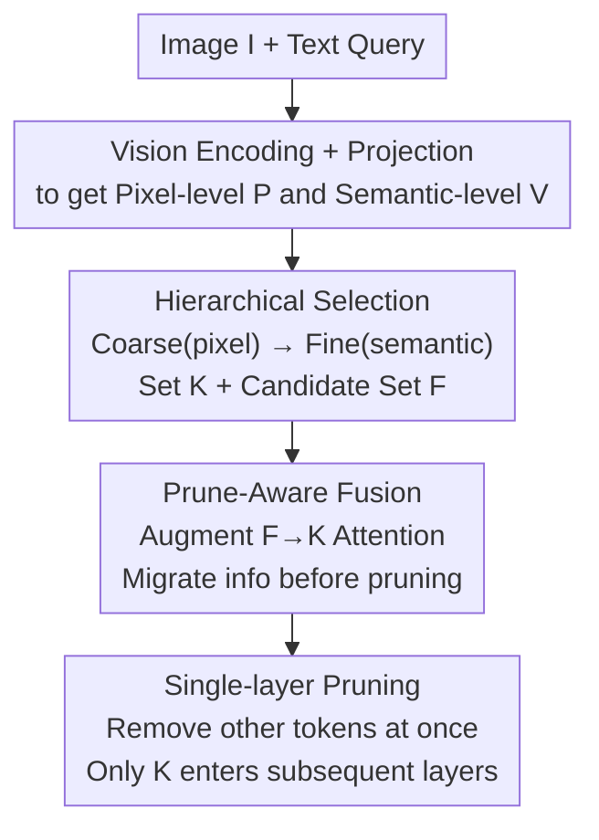

# Hi-Lo Prune: Look at What You'll Lose before Pruning with Hierarchical Token Selection  

**Conference**: CVPR 2026  
**Paper**: [CVF Open Access](https://openaccess.thecvf.com/content/CVPR2026/html/Sun_Hi-Lo_Prune_Look_at_What_Youll_Lose_before_Pruning_with_CVPR_2026_paper.html)  
**Code**: https://github.com/sealost/Hi-Lo_Prune  
**Area**: Model Compression / Multimodal VLM / Inference Acceleration  
**Keywords**: Visual token pruning, training-free, multimodal large models, attention fusion, inference acceleration  

## TL;DR  
To address the high inference cost caused by excessive visual tokens in Multimodal Large Language Models (MLLMs), this paper proposes a training-free pruning method, Hi-Lo Prune. Following the core philosophy of "look at what you'll lose before pruning," it employs a coarse-to-fine hierarchical selection to define a preserved token set and a "most valuable discarded token" candidate set. Prune-Aware Fusion then migrates information from the candidate set to the preserved set in shallow layers via augmented attention, followed by a one-time removal of remaining tokens at a designated layer. This approach consistently outperforms existing methods on Qwen2/2.5/3-VL and LLaVA, even when pruning 90% of tokens.  

## Background & Motivation  
**Background**: MLLMs (such as Qwen-VL and LLaVA) combine vision encoders with LLMs for image-text understanding. However, high-resolution images or long videos generate thousands of visual tokens, leading to exploding inference costs due to the quadratic complexity of Transformers. Training-free visual token pruning is a primary acceleration strategy—enabling significant speedups by pruning 50%–90% of tokens in pre-trained models without fine-tuning, while maintaining generalization across datasets and architectures.  

**Limitations of Prior Work**: Most training-free methods perform pruning in **shallow layers**. At these stages, the model has not fully processed visual content, and information from discarded tokens is lost before it can be absorbed by preserved tokens, leading to performance degradation at high pruning rates. Existing approaches have distinct drawbacks: 1) Importance-based methods (FastV, SparseVLM, PyramidDrop) rely on text-visual attention scores, but recent findings suggest "attention drift" fundamentally weakens these metrics; 2) Diversity-based methods (DART, DivPrune, CDPruner) use clustering or semantic distance to retain complementary tokens but make pruning decisions solely based on token features—once discarded, the information is gone. Even post-hoc fusion (e.g., SparseVLM) acts only as a remedy after pruning and often introduces extra overhead or retains more tokens.  

**Key Challenge**: The direct conflict between "early pruning to save computation" and "minimizing information loss"—performing aggressive pruning in shallow layers while ensuring critical information is not wasted.  

**Goal**: 1) Achieve aggressive pruning in shallow layers with minimal information loss; 2) Maintain a fully training-free, plug-and-play workflow that supports FlashAttention.  

**Key Insight**: An overlooked yet simple principle—**look at what you will lose**. Instead of direct deletion, identify which tokens are about to be discarded and allow preserved tokens to "absorb" their critical information before the actual removal.  

**Core Idea**: Use hierarchical token selection to define a "preserved set $\mathcal{K}$" and a "candidate set for fusion $\mathcal{F}$." Then, utilize Prune-Aware Fusion to migrate information from $\mathcal{F}$ to $\mathcal{K}$ via augmented attention in layers preceding the pruning point.  

## Method  

### Overall Architecture  
Given an input image $I$, a text query, and a target pruning rate $r$, Hi-Lo Prune operates in three stages before LLM decoding: (1) **Hierarchical Selection** uses a coarse-to-fine two-step process to define the final preserved set $\mathcal{K}$ (size $K=(1-r)N$) and a **fusion candidate set** $\mathcal{F}$ (roughly 30% of total tokens), representing the most important tokens among those slated for removal; (2) **Prune-Aware Fusion** augments attention in shallow layers before pruning to migrate information from $\mathcal{F}$ to $\mathcal{K}$; (3) **Single-layer Pruning** removes all tokens except those in $\mathcal{K}$ at a specified Transformer layer, ensuring subsequent layers only process $K$ tokens. The pruning objective is formalized as selecting $\hat{V}\subseteq V,\ |\hat{V}|=K$ while minimizing the model output discrepancy $\mathcal{D}$.  

### Key Designs  

**1. Hierarchical Token Selection: Coarse-to-Fine and the Derivation of the "Discarded Candidate Set" $\mathcal{\mathcal{F}}$**  

Selecting tokens based on a single feature type often misses either texture details or semantic meanings. Inspired by the fact that "shallow features capture texture while deep features capture semantics," Hi-Lo Prune uses two complementary stages: images are patched ($p\times p$) to obtain **pixel-level features** $P\in\mathbb{R}^{N\times D_p}$, while the encoder-projection pipeline yields **semantic-level tokens** $V=f_p(f_v(I))$. Selection follows two steps (Algorithm 1): The coarse selection uses $P$ to pick $\alpha K$ candidates (relaxation factor $\alpha>1$) to filter globally redundant patches; the fine selection uses $V$ to refine these candidates into the final $K$ preserved tokens. Both steps utilize a **greedy maximum diversity** algorithm—iteratively selecting tokens with the furthest cosine distance ($d(x_i,x_j)=1-\frac{x_i\cdot x_j}{\|x_i\|\|x_j\|}$) to the already selected set, ensuring broad coverage.  

The most critical byproduct is the fusion candidate set $\mathcal{F}=\mathcal{S}_{coarse}\setminus\mathcal{S}$—tokens selected during coarse selection but eliminated during fine selection. Representing roughly 30% of original tokens, these are "about to be lost but relatively important," forming the targets for the "look at what you'll lose" strategy.  

**2. Prune-Aware Fusion (PA-Fusion): Information Migration Before Deletion**  

To prevent information loss in shallow pruning, PA-Fusion modifies the attention mechanism in layers prior to pruning, allowing information from $\mathcal{F}$ to flow into $\mathcal{K}$. Specifically, letting the attention logits in layer $\ell$ be $A=QK^T\in\mathbb{R}^{q\times k}$, the attention is adaptively augmented for positions where a preserved token/text token acts as the query ($i\notin\mathcal{F}$) and a discarded token acts as the key ($j\in\mathcal{F}$):  

$$\tilde{A}_{ij} = A_{ij} + \lambda\cdot A_{ij}\cdot \mathbb{1}\big[\mathrm{softmax}(A)_{ij}>\tau \ \wedge\ j\in \text{Top-}k_i\big],$$  

where $\lambda$ is the fusion strength, $\tau$ is an adaptive threshold, and $\text{Top-}k_i$ denotes the top-$k$ keys for query $i$. Augmentation is proportional to the original attention affinity—connections are significantly strengthened only if a discarded token is already highly relevant to a preserved token. Irrelevant pairs remain unchanged. Since fusion is calculated only on the subset $\mathcal{F}$, it can run in **parallel** with standard self-attention (e.g., via FlashAttention) with minimal latency. Analysis of logit distributions (PCA to 2D) confirms that while aggressive 90% pruning shifts logits away from the origin, PA-Fusion "pulls them back" (Tab.2: L2 distance decreased by 4.09%–12.29%), restoring lost information.  

### Mechanism in Action: A 90% Pruning Example  
For Qwen2-VL-2B with 10% retention: Image encoding yields $N$ tokens → Coarse selection keeps $\alpha K$ tokens → Fine selection refines this to $K=0.1N$ preserved tokens. The ~30% tokens discarded during fine selection form $\mathcal{F}$. In layers 1–2 (pre-pruning), PA-Fusion migrates relevant info from $\mathcal{F}$ into the 10% preserved tokens via augmented attention. At layer 2, $\mathcal{F}$ and other tokens are removed. Consequently, for questions requiring fine details (e.g., "Where is the red panda?"), the answer remains correct because the target area's information was integrated into the kept tokens, whereas baselines like FastV or CDPruner fail at the same pruning rate.  

### Loss & Training  
**Ours is fully training-free, requiring no loss functions or fine-tuning.** All operations are plug-and-play modifications to the inference forward pass. In implementation, single-layer pruning occurs at layer 2; PA-Fusion performs migration in the first two pruned layers. Hyperparameters include fusion strength $\lambda$, threshold $\tau$, and relaxation factor $\alpha$.  

## Key Experimental Results  

### Main Results  
Evaluated on Qwen2-VL-2B / Qwen2.5-VL-7B / Qwen3-VL-8B using single-layer pruning across 8 benchmarks. Normalized average scores are reported relative to the vanilla model (100%).  

| Model | Budget | FastV | DART | DivPrune | CDPruner | Hi-Lo Prune |  
|------|------|------|------|----------|----------|-------------|  
| Qwen2-VL-2B | 20% | 88.57 | 83.11 | 91.39 | 85.61 | **93.97** |  
| Qwen2-VL-2B | 10% | 78.16 | 75.49 | 83.94 | 79.00 | **88.26** |  
| Qwen2.5-VL-7B | 20% | 89.55 | 83.24 | 91.84 | 84.18 | **95.04** |  
| Qwen2.5-VL-7B | 10% | 82.61 | 79.76 | 92.42 | 83.87 | **93.51** |  
| Qwen3-VL-8B | 10% | 73.01 | 69.58 | 84.57 | 85.38 | **87.17** |  

Ours achieves the highest average score across all models. The lead is more pronounced under aggressive pruning (10% budget). It also yields optimal results on LLaVA 1.5-7B (93.88% at 90% pruning), outperforming multi-layer pruning baselines like SparseVLM without requiring additional token recovery steps.  

### Ablation Study  
| Config | Metric | Description |  
|------|---------|------|  
| Hi-Lo Prune (Full) | See Main Table | Hierarchical Selection + PA-Fusion |  
| Pruning only vs. +PA-Fusion | L2 reduced 4.09%–12.29% | PA-Fusion restores logits toward full token distribution |  
| CDPruner + PA-Fusion | ScienceQA +0.45% | PA-Fusion can benefit other pruning methods |  
| DivPrune + PA-Fusion | MME +67.96 pts | Universal performance gain |  
| Hi-Lo + PA-Fusion | ChartQA +1.28% | Specific gain of PA-Fusion on the proposed method |  

### Key Findings  
- **PA-Fusion is a transferable universal plugin**: Integrating it with other methods like CDPruner or DivPrune results in consistent gains, proving that "migrating information before removal" is a strategy-independent mechanism.  
- **Advantage scales with pruning aggressiveness**: While baselines suffer significantly at 90% pruning, Hi-Lo Prune remains stable by mitigating the "shallow pruning" information bottleneck.  
- **Efficiency-Accuracy Pareto front**: On Qwen3-VL-8B, 90% pruning reduces FLOPs from 2.576T to 0.377T (-85.35%) and prefill time by -49.79%, while MME remains at 2042.58 (only 14.6% drop), the highest among all pruning methods.  

## Highlights & Insights  
- **Turns discarded tokens from a burden into assets**: Unlike previous methods that either discard or recover after-the-fact, ours creates an explicit candidate set $\mathcal{F}$ to migrate information *before* the loss occurs.  
- **Natural derivation of $\mathcal{F}$**: By using the difference between coarse and fine selection, the method identifies tokens that are "important enough for texture but redundant for semantics," which are precisely the best targets for fusion.  
- **Engineering-friendly parallelism**: Since PA-Fusion only modifies a subset of the attention matrix and preserves original affinity patterns, it is compatible with FlashAttention and introduces nearly zero additional latency.  

## Limitations & Future Work  
- **Fixed hyperparameters**: Pruning layers and rates are currently manually set; an adaptive selection strategy across different tasks was not explored.  
- **Limited gains on dense visual tasks**: Tasks like ChartQA requiring extreme detail still see performance drops, suggesting a fundamental ceiling for aggressive pruning in high-density scenarios.  
- **Candidate set size**: The scale of $\mathcal{F}$ is currently an empirical value; optimizing its size based on task complexity remains future work.  

## Related Work & Insights  
- **vs. Importance-based (FastV, etc.)**: These rely on attention scores prone to "attention drift"; Ours uses greedy diversity and pre-discard migration, offering more stability at high pruning rates.  
- **vs. Diversity-based (DART, etc.)**: These use feature diversity but treat deletion as permanent; Ours leverages those features to "absorb" info before deletion.  
- **vs. SparseVLM**: SparseVLM performs fusion *after* pruning; Ours performs it *before*, avoiding complex token recovery steps and maintaining higher efficiency.  

## Rating  
- Novelty: ⭐⭐⭐⭐ The "migrate before loss" concept is clear and modular, though the individual components have related precedents.  
- Experimental Thoroughness: ⭐⭐⭐⭐⭐ Comprehensive coverage across models (Qwen variants, LLaVA), benchmarks, and detailed logit/efficiency analyses.  
- Writing Quality: ⭐⭐⭐⭐ Clear three-stage process, though the relationship between $\mathcal{S}$ and $\mathcal{F}$ is best understood through the algorithm pseudocode.  
- Value: ⭐⭐⭐⭐⭐ Fully training-free and effective at 90% pruning, making it highly practical for MLLM deployment.  

<!-- RELATED:START -->

## Related Papers

- [\[CVPR 2026\] IF-Prune: Information-Flow Guided Token Pruning for Efficient Vision-Language Models](if-prune_information-flow_guided_token_pruning_for_efficient_vision-language_mod.md)
- [\[CVPR 2026\] SCoRe: Salience-Coverage Reduction for Vision Token Pruning in Vision-Language Models](score_salience-coverage_reduction_for_vision_token_pruning_in_vision-language_mo.md)
- [\[CVPR 2026\] One Layer's Trash is Another Layer's Treasure: Adaptive Layer-wise Visual Token Selection in LVLMs](one_layers_trash_is_another_layers_treasure_adaptive_layer-wise_visual_token_sel.md)
- [\[CVPR 2026\] Accelerating Streaming Video Large Language Models via Hierarchical Token Compression](accelerating_streaming_video_large_language_models_via_hierarchical_token_compre.md)
- [\[ACL 2026\] Adaptive Layer Selection for Layer-Wise Token Pruning in LLM Inference](../../ACL2026/model_compression/adaptive_layer_selection_for_layer-wise_token_pruning_in_llm_inference.md)

<!-- RELATED:END -->
