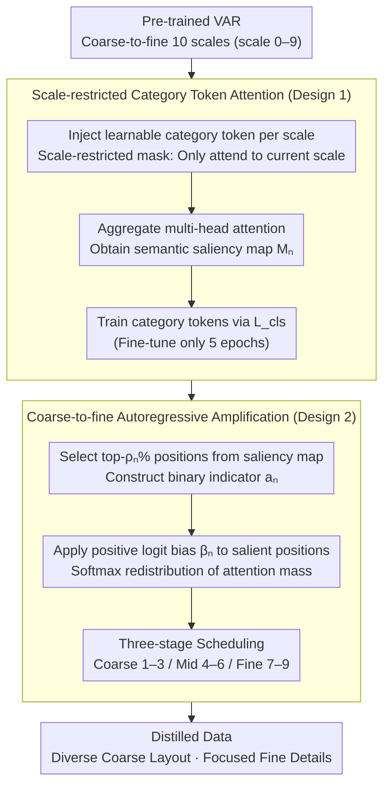

# HierAmp: Coarse-to-Fine Autoregressive Amplification for Generative Dataset Distillation

**Conference**: CVPR2026  
**arXiv**: [2603.06932](https://arxiv.org/abs/2603.06932)  
**Code**: [Oshikaka/HIERAMP](https://github.com/Oshikaka/HIERAMP)  
**Area**: Model Compression / Dataset Distillation  
**Keywords**: Dataset Distillation, Visual Autoregressive Models, Hierarchical Semantic Amplification, Coarse-to-fine generation, codebook token diversity

## TL;DR

Ours proposes HierAmp, which injects learnable category tokens into the coarse-to-fine generation process of Visual Autoregressive (VAR) models to identify semantically salient regions. By amplifying attention in these regions through positive logit bias, the distilled data achieves richer layout diversity at coarse scales and focuses on category-related details at fine scales, reaching SOTA performance on multiple dataset distillation benchmarks.

## Background & Motivation

1. **Limitations of Prior Work**: Existing methods primarily optimize for global distribution proximity (gradient matching, trajectory matching, distribution matching) but fail to directly focus on the discriminative semantic information required for downstream classification.
2. **Hierarchical Semantics Ignored**: Object semantics are naturally hierarchical—global layout constrains local structure, and local structure constrains texture details. However, existing distillation methods model on a single latent space and ignore this hierarchy.
3. **Poor Visual Quality**: Optimization-based distillation methods generate images that lack visual fidelity, appearing as feature abstractions rather than natural images.
4. **Insufficient Diversity in GANs**: While early GAN-based distillation improved visual quality, the generation diversity was limited.
5. **High Cost of Diffusion Models**: Diffusion models offer high quality but suffer from long denoising chains and high computational overhead.
6. **Key Insight**: The coarse-to-fine generation paradigm of Visual Autoregressive (VAR) models naturally aligns with the hierarchical structure of object semantics—early scales generate global structures while subsequent scales supplement details—providing an ideal framework for hierarchical semantic amplification.

## Method

### Overall Architecture

HierAmp aims to make distilled data directly serve the discriminative semantics needed for downstream classification, rather than solely pursuing global distribution proximity. The **Key Insight** is that the coarse-to-fine generation of VAR models—where early scales determine global layout and later scales fill in details—exactly corresponds to the "Global Layout $\rightarrow$ Local Structure $\rightarrow$ Texture Details" semantic hierarchy of objects. Based on a pre-trained VAR (10 scales, scale 0–9), the method injects a learnable category token at each scale. This token is first trained via a classification objective to capture the semantics of that scale, and then its attention map is used to identify and amplify salient regions, ensuring the distilled data is "more diverse at coarse scales and more focused at fine scales."

### Key Designs

**1. Scale-restricted Category Token Attention: Generating Scale-specific Semantic Saliency Maps**

To amplify salient regions, the model must first identify "where semantics are important" at each scale. HierAmp appends a learnable category token $[c]_n$ at each scale $n$ and uses a scale-restricted attention mask to constrain it to attend only to image tokens of the current scale (shielding cross-scale connections). This ensures semantic judgments at each scale do not interfere with others. After aggregating multi-head attention, a semantic saliency map $\mathbf{M}_n \in \mathbb{R}^{h_n \times w_n}$ is obtained. The category tokens are trained via classification loss $\mathcal{L}_{cls} = \frac{1}{N}\sum_{n=1}^{N}(-\log p_n(\mathbf{c}_n^e))$, ensuring the saliency maps truly correspond to category-related regions.

**2. Coarse-to-Fine Autoregressive Amplification: Pushing Attention Mass to Semantic Regions**

With the saliency maps, probability mass at those positions is directly amplified during autoregressive generation. A saliency set $\mathcal{S}_n$ is formed by taking the top-$\rho_n\%$ positions from the attention map $\mathbf{m}_n$, and a binary indicator vector $\mathbf{a}_n$ is constructed. A positive logit bias $\beta_n$ is added to these salient positions:

$$\tilde{\mathbf{L}}_n^{(h)} = \mathbf{L}_n^{(h)} + \beta_n \cdot \mathbf{1} \cdot \mathbf{a}_n^\top$$

The modified attention $\tilde{\boldsymbol{\alpha}}_n^{(h)} = \text{softmax}(\tilde{\mathbf{L}}_n^{(h)})$ pushes more probability density to semantically relevant areas. Amplification follows a three-stage schedule—Coarse (scale 1–3), Mid (scale 4–6), and Fine (scale 7–9)—using independent $\rho$ parameters. Consequently, coarse-scale amplification results in richer layout diversity, while fine-scale amplification brings focus to category-specific textures, creating a complementary effect.

### Loss & Training

The training objective includes the original cross-entropy loss of the VAR (teacher forcing) and the classification loss $\mathcal{L}_{cls}$ for the category tokens. The entire process requires only 5 epochs of fine-tuning to train the category tokens, with minimal additional overhead during inference.

## Key Experimental Results

### Main Results: Comparison with SOTA Methods (Table 1)

| Dataset | IPC | ResNet-18 Best | Comparison Methods |
|---|---|---|---|
| CIFAR-10 | 10 | **44.3%** | D3HR 41.3%, RDED 37.1% |
| CIFAR-100 | 10 | **52.0%** | D3HR 49.4%, RDED 42.6% |
| ImageNet-Woof | 10 | **45.8%** | CaO2 45.6%, RDED 38.5% |
| ImageNet-100 | 50 | **68.1%** | CaO2 68.0%, RDED 61.6% |
| ImageNet-1K | 10 | **47.6%** | CaO2 46.1%, D3HR 44.3% |
| ImageNet-1K | 50 | **60.8%** | CaO2 60.0%, D3HR 59.4% |
| ImageNet-1K | 100 | **62.7%** | D3HR 62.5% |

Ours achieves the highest accuracy across almost all datasets and IPC settings, notably leading the runner-up CaO2 by 1.5% on ImageNet-1K IPC=10.

### Cross-architecture Generalization (Table 2, ImageNet-1K IPC=10)

| Teacher $\rightarrow$ Student | HierAmp | RDED | D3HR |
|---|---|---|---|
| MobileNet-V2 $\rightarrow$ ResNet-18 | **46.2%** | 34.4% | 43.4% |
| ResNet-18 $\rightarrow$ EfficientNet-B0 | **38.7%** | 36.6% | 38.3% |
| EfficientNet-B0 $\rightarrow$ EfficientNet-B0 | **28.7%** | 23.5% | 28.1% |

Cross-architecture generalization performance is consistently superior to RDED and D3HR.

### Ablation Study (Table 3, ImageNet-1K IPC=10)

- Baseline (No Amplification): 45.6%
- Coarse-only Amplification ($\beta=5, \rho=50\%$): **47.6%** (Largest Gain)
- Mid-only Amplification: 46.9%
- Fine-only Amplification: 46.5%
- All-scale Amplification: **47.6%**

**Key Findings**: Coarse-scale amplification contributes the most as it establishes the global structure and influences the semantic richness of subsequent scales.

### Key Findings: Token Distribution Analysis

- **Coarse-scale Amplification** $\rightarrow$ Increased token entropy and coverage (more diverse layout combinations).
- **Fine-scale Amplification** $\rightarrow$ Concentrated token usage (focusing on category-related texture details).
- This symmetric effect explains why hierarchical amplification outperforms single-scale amplification.

## Highlights & Insights

- **Novel Perspective**: This is the first work to analyze dataset distillation from the perspective of hierarchical semantic amplification, revealing the symmetric effect of coarse-scale diversity vs. fine-scale focus.
- **Elegant Design**: Requires only the injection of lightweight category tokens and positive logit bias, without external segmentation tools, resulting in minimal inference overhead.
- **Strong Interpretability**: Provides clear mechanistic explanations through token entropy/coverage analysis and attention visualization.
- **Consistent SOTA**:全面 leading across CIFAR-10/100 and ImageNet-Woof/100/1K.
- **Cross-architecture Generalization**: Distilled data demonstrates stable performance across different teacher-student architecture combinations.

## Limitations & Future Work

- It relies on pre-trained VAR models and cannot be directly transferred to other generative frameworks (e.g., Diffusion models, GANs).
- The stage scheduling for $\rho$ and $\beta$ requires manual configuration and lacks an adaptive mechanism.
- Validated only on classification tasks; distillation effects on downstream tasks like detection and segmentation have not been explored.
- Training category tokens requires additional class labels, making it unsuitable for unsupervised distillation scenarios.
- Some ResNet-101 results in Table 1 (e.g., ImageNet-1K IPC=10) do not surpass D3HR.

## Related Work & Insights

| Method | Base Model | Core Strategy | Limitations |
|---|---|---|---|
| RDED | No Generative Model | Crop informative regions from real images | Limited by raw data quality |
| D3HR | DDIM | Inversion + Distribution Matching | High computational cost for high-res |
| CaO2 | Diffusion | Probabilistic Sampling + Latent Optimization | Long inference chain |
| Minimax | Diffusion | Minimax Optimization | Limited scalability |
| **HierAmp** | **VAR** | **Hierarchical Semantic Amplification** | **Dependent on VAR pre-training** |

## Rating

- Novelty: ⭐⭐⭐⭐ — The hierarchical semantic amplification perspective is novel; the category token + logit bias design is concise.
- Experimental Thoroughness: ⭐⭐⭐⭐ — Comprehensive across multiple datasets, IPCs, cross-architectures, ablations, and analyses.
- Writing Quality: ⭐⭐⭐⭐ — Clear structure; the analysis sections (token entropy/coverage) provide good interpretability.
- Value: ⭐⭐⭐⭐ — Provides a new hierarchical semantic understanding for dataset distillation with strong practicality.

<!-- RELATED:START -->

## Related Papers

- [\[CVPR 2025\] Curriculum Coarse-to-Fine Selection for High-IPC Dataset Distillation](../../CVPR2025/model_compression/curriculum_coarse-to-fine_selection_for_high-ipc_dataset_distillation.md)
- [\[CVPR 2026\] Grid Distillation: Compositional Image Distillation via Structured Generative Grids](grid_distillation_compositional_image_distillation_via_structured_generative_gri.md)
- [\[CVPR 2026\] Dataset Distillation by Influence Matching](dataset_distillation_by_influence_matching.md)
- [\[CVPR 2026\] Mitigating The Distribution Shift of Diffusion-based Dataset Distillation](mitigating_the_distribution_shift_of_diffusion-based_dataset_distillation.md)
- [\[CVPR 2026\] IMS3: Breaking Distributional Aggregation in Diffusion-Based Dataset Distillation](ims3_breaking_distributional_aggregation_in_diffusion-based_dataset_distillation.md)

<!-- RELATED:END -->
