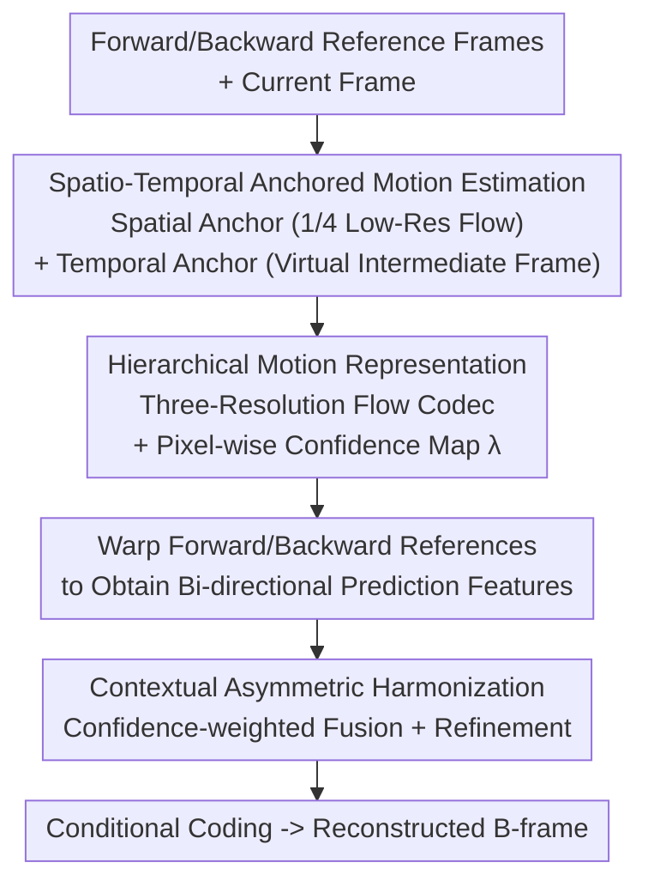

# High Resolution Neural Video Coding with Bi-directional Confidence-Guided Reference Information Modeling

**Conference**: CVPR 2026  
**Paper**: [CVF Open Access](https://openaccess.thecvf.com/content/CVPR2026/html/Ye_High_Resolution_Neural_Video_Coding_with_Bi-directional_Confidence-Guided_Reference_Information_CVPR_2026_paper.html)  
**Code**: To be confirmed  
**Area**: Model Compression / Neural Video Coding  
**Keywords**: Neural Video Coding, B-frame Compression, Bi-directional Reference, Confidence-guided Fusion, 4K Video

## TL;DR
HR-NVC reorganizes bi-directional (B-frame) neural video compression into three tasks of "reference information modeling"—namely, motion representation, context translation, and cross-direction harmonization. By employing spatial/temporal anchors to stabilize optical flow estimation under large displacements, utilizing hierarchical motion representation to simultaneously encode multi-scale optical flow and pixel-wise confidence maps, and applying confidence-guided asymmetric fusion to suppress unreliable references, HR-NVC becomes the first end-to-end neural video codec evaluated on 4K sequences, achieving state-of-the-art (SOTA) performance in neural B-frame coding.

## Background & Motivation
**Background**: End-to-end neural video compression (NVC) has made significant progress in unidirectional P-frame coding in recent years, demonstrating the capability to learn complex spatio-temporal priors. Theoretically, bi-directional B-frame coding should yield higher compression efficiency as it leverages both forward and backward reference frames for richer context—a primary reason why B-frames significantly outperform P-frames in traditional coding standards (HEVC/VVC).

**Limitations of Prior Work**: However, existing neural B-frame codecs exhibit limited gains, particularly in **high-resolution + large-motion** scenarios, where they suffer from texture drift, ghosting, and temporal inconsistency. There are two primary root causes: first, optical flow estimation becomes highly unreliable under large displacements; second, "balanced fusion" (directly concatenating the forward and backward references) introduces severe distortions at occlusions or scene changes.

**Key Challenge**: Traditional codecs decompose motion representation, prediction, and compensation into **interpretable and regularized** modules (such as AMC, HMVP, and AMVR) to collaboratively guarantee precise alignment. Conversely, existing neural B-frame codecs merely "re-skin" these modules—replacing hand-crafted components with independent neural modules that operate in isolation without mutual interaction. This leads to representation entanglement, unstable alignment, and temporal jitter. The core issue is not the insufficiency of individual modules, but rather the **lack of a unified organization of the "reference information" itself**.

**Goal**: To re-evaluate B-frame coding from a holistic perspective and propose **Reference Information Modeling**, treating all signals connecting bi-directional contexts as structured "reference information" and dividing them into three dimensions: **Representation** of motion and temporal priors, **Translation** of these priors into aligned context, and **Harmonization** across directions and scales.

**Key Insight**: Instead of performing localized optimization on a single stage (motion or context), reference information modeling is systematically enhanced across these three dimensions: stabilizing the foundational representation of motion estimation, constructing multi-scale motion translation that preserves spatial hierarchies, and conducting bi-directional harmonization through confidence-aware alignment.

**Core Idea**: By adopting a three-step approach—stabilizing motion with spatio-temporal anchors, encoding confidence alongside hierarchical motion representation, and executing confidence-guided asymmetric fusion—the codec can utilize bi-directional references **non-uniformly**, suppressing unreliable regions to achieve robust and highly efficient B-frame compression under high-resolution and large-motion conditions.

## Method

### Overall Architecture
The coding pipeline of HR-NVC employs SPyNet as the optical flow backbone, and the compression of a B-frame consists of three sequential stages. **First**, a spatial anchor (low-resolution optical flow computed by downsampling the original frame to 1/4) and a temporal anchor (a "virtual intermediate frame" interpolated from the forward and backward references) are utilized to provide a reliable initialization for motion estimation, avoiding optical flow collapse under large displacements. **Second**, instead of compressing optical flow at a single scale, motion is organized into a three-resolution pyramid for hierarchical coding, from which the decoder simultaneously reconstructs multi-scale optical flow **and pixel-wise confidence maps** to quantify the reliability of motion-compensated prediction features. **Third**, after warping the forward and backward reference features into prediction features using the reconstructed motion, they are fused via confidence-guided asymmetric weighted fusion (rather than direct concatenation) to suppress unreliable directions and preserve reliable ones, followed by lightweight refinement to generate a compact, high-quality context for conditional coding.

These three stages correspond closely to the three dimensions of reference information modeling: Representation (Spatio-Temporal Anchored Motion Estimation) $\rightarrow$ Translation (Hierarchical Motion Representation) $\rightarrow$ Harmonization (Contextual Asymmetric Harmonization).

### Key Designs

**1. Spatio-Temporal Anchored Motion Estimation: Anchor Large-Displacement Flow with Lightweight Priors Instead of Expensive Online Optimization**

The pain point is concrete: hierarchical B-frame structures introduce long time intervals and large inter-frame displacements that often exceed the receptive field of SPyNet's top pyramid level. Once the zero-initialization at the top level collapses, errors propagate and amplify through the coarse-to-fine levels, distorting the entire optical flow field. Existing adaptive schemes (such as OMRA, which dynamically scales down input resolutions at inference time) are effective but rely on expensive online optimization, making them unsuitable for real-time application. In contrast, this paper poses the question: can stability be achieved **by design rather than by online adaptation**? Consequently, two types of anchors are introduced. **Spatial Anchor**: The frame is first downsampled to 1/4 of its original resolution, reducing large motions significantly to allow the optical flow network to yield a stable coarse flow. This is injected as a spatial prior into the original-resolution motion estimation, acting as an initial global motion hypothesis to constrain the early search space and mitigate convergence instability and error propagation. **Temporal Anchor**: A "virtual intermediate frame" is interpolated from the downsampled forward and backward reference frames, and bi-directional optical flows from the references to this virtual frame are calculated. This provides intermediate motion trends and occlusion prediction clues, enhancing robustness against non-translational, complex motions. Both anchors initialize the coarse motion field and supply intermediate trends while **keeping the optical flow backbone lightweight and unchanged**—avoiding stacked refinement modules to deliver high-fidelity motion fields across resolutions with low computational overhead.

**2. Hierarchical Motion Representation: Hierarchical Coding of Motion and Its "Reliability" to Dominate Reliable Regions and Suppress Unreliable Ones**

Most neural codecs estimate and compress motion at a single scale (directly encoding the motion field or motion residuals). High-resolution content contains both large global displacements and subtle local deformations; a single-scale latent representation tends to overfit local details and lose long-range dependencies, leading to unstable alignment, bit-rate waste, and temporal inconsistency. This design organizes motion features into a coarse-to-fine pyramid: coarse layers encode global displacements and long-range structures, while fine layers focus on local alignment and detailed corrections. The encoding is conditioned **on the anchored prior and the previously reconstructed optical flow**. To save computation, two trade-offs are made: since the spatial anchor sufficiently guides high-resolution optical flow, $\{m^2_{f\to t}, m^2_{b\to t}\}$ are not sent to the motion encoder for compression, and $\{m^0_{ref\,f}, m^0_{ref\,b}\}$ are neither calculated nor inputted. More importantly, **confidence-guided reliability modeling** is introduced: besides reconstructing three-resolution optical flows, the motion decoder outputs an additional single-channel confidence map $\lambda$ to quantify the reliability of the corresponding motion representation. This map $\lambda$ is generated sequentially across three resolutions alongside the motion, requiring no separate bitstream overhead for reliability. This naturally propagates "where to trust" into subsequent fusion steps, preserving structural consistency across small local offsets and large global displacements.

**3. Contextual Asymmetric Harmonization: Weighted Fusion by Confidence, Acknowledging the "Asymmetric" Reliability of Reference Frames**

Most neural codecs simply warp and concatenate bi-directional reference features, implicitly assuming equal contributions from both references at every spatial location. In reality, occlusions, motion discontinuities, and compression artifacts introduce strong directional asymmetry—one reference may be far more reliable than the other in certain regions, and naive concatenation mixes inconsistent cues, introducing reconstruction noise. This module replaces uniform aggregation with **confidence-guided harmonization**: weighted fusion is first performed as
$$F^i_{harm} = \ddot{\lambda}^i_f \cdot F^i_{fwarp} + \ddot{\lambda}^i_b \cdot F^i_{bwarp},\quad i = 0,1,2,$$
where $\ddot{\lambda}_f, \ddot{\lambda}_b$ are normalized weights derived from the forward and backward confidence maps $\lambda_f, \lambda_b$, allowing each direction to contribute proportionally to its inferred trustworthiness. This dynamically emphasizes reliable references and suppresses low-confidence ones at the feature level, serving a denoising and harmonizing function. The fused $F_{harm}$ is then refined by a lightweight enhancement module to restore fine-grained temporal and structural consistency. This mechanism bridges bi-directional context fusion and adaptive reliability modeling, providing a stable, clean representation for final reconstruction, which significantly improves quality in complex motion and occlusion scenarios.

### Loss & Training
The model is first pre-trained on 7-frame sequences from the Vimeo-90K dataset, and then fine-tuned on 9,000 video segments (each containing 33 frames) collected from original Vimeo videos, following a multi-stage training protocol. The AdamW optimizer is used with a batch size of 8. During testing, standard NVC configurations are followed (GOP=32, intra-period=32) to compress the first 97 frames of each sequence. To verify long-term stability, full-sequence testing is also conducted on the JCT-VC dataset (e.g., encoding all 481 frames of a 500-frame video using a complete GOP structure). All methods are evaluated in the RGB domain (YUV420 to RGB conversion is performed via BT.709 conventions if necessary).

## Key Experimental Results

### Main Results
BD-rate (%) is computed relative to the HM-16.20-LDB anchor, **where more negative values indicate greater bit-rate savings at comparable quality**. The table below shows the PSNR BD-rate on 97 frames across various JCT-VC classes, UVG, and MCL-JCV datasets (Table 1). HR-NVC consistently outperforms existing B-frame NVC methods on all benchmarks, achieving an overall average of -44.27% compared to the second-best neural method, DCVC-B, at -39.50%. On JCT-VC Class A, its performance of -51.87% even surpasses the strong traditional baseline VTM-RA (-48.41%).

| Method | JCT-VC Avg | UVG | MCL-JCV | Overall Avg |
|--------|------|------|---------|-------------|
| VTM-RA (Strong traditional baseline) | -48.41 | -46.25 | -48.53 | -48.12 |
| B-CANF (Neural B-frame) | -19.16 | -6.34 | 1.69 | -14.35 |
| DCVC-B (SOTA Neural B-frame) | -44.39 | -26.82 | -27.68 | -39.50 |
| **Ours (HR-NVC)** | **-49.25** | **-33.39** | **-30.25** | **-44.27** |

Full-sequence evaluations (Table 2) further validate temporal stability. HR-NVC maintains its lead across all classes, with an average BD-rate of -49.53%, significantly outperforming DCVC-B (-44.97%) and surpassing the unidirectional P-frame SOTA (DCVC-FM at -42.43%). On 4K evaluation (Table 3, JVET Class A1/A2, where VVenC Slow is used as an efficient reference due to HM’s high computational cost), HR-NVC achieves the best performance at -31.84%. The authors emphasize that this is **the first end-to-end neural B-frame codec evaluated on 4K sequences**.

| 4K Method (JVET, 97 frames) | Class A1 | Class A2 | Average |
|------|----------|----------|---------|
| VVenC (Slow) | -5.49 | 2.57 | -1.46 |
| HM-RA | -12.44 | -17.49 | -14.97 |
| DCVC-B | -22.91 | -32.16 | -27.53 |
| **Ours** | **-29.18** | **-34.49** | **-31.84** |

### Ablation Study
By progressively integrating the four components (HMR: Hierarchical Motion Representation, CAH: Contextual Asymmetric Harmonization, SA: Spatial Anchor, TVA: Temporal Virtual Anchor), the cumulative improvement in Overall BD-rate is shown in Table 6.

| Configuration | Cumulative Components | Overall BD-rate(%) | Description |
|------|----------|--------------------|------|
| M1 | HMR | -3.57 | Hierarchical motion representation only; shows noticeable improvement on UVG |
| M2 | +CAH | -9.57 | Significant boost from bi-directional asymmetric fusion |
| M3| + [Intermediate Config] | -13.68 | Continued integration of components ⚠️ Refer to the original paper's table for the exact mapping |
| M4 | +SA | -15.13 | Spatial anchor stabilizes motion estimation, yielding clear gains on 1080p |
| M5 | +TVA (Full Model) | -15.77 | Temporal anchor provides an additional ~2% gain on high-resolution videos |

### Key Findings
- **Contextual Asymmetric Harmonization (CAH) contributes the most**: The dramatic improvement from -3.57% (M1) to -9.57% (M2) indicates that "acknowledging asymmetric reference reliability and weighting by confidence" is the primary source of gain, far outperforming naive concatenation.
- **Gains from anchors concentrate on high-resolution/large-motion inputs**: Spatial anchors work exceptionally well on 1080p content (M4), and temporal virtual anchors (TVA) provide an additional ~2% improvement for high-resolution videos (e.g., UVG improves from -12.51% in M4 to -15.03% in M5), validating the strategy of "stabilization by design."
- **Anchoring introduces almost no computational overhead**: Enabling TVA increases the parameter count from 19.47M to 29.54M (due to the anchor generator) but MACs/pixel only rise from 2,687k to 2,738k (+1.9%), adding only 12ms to decoding time (Table 4)—a negligible trade-off.
- **Selecting SPyNet is a cost-effective trade-off**: Table 5 shows that replacing SPyNet with more accurate flow networks like RAFT, SEA-RAFT, or FlowSeek causes the optical flow module to consume 51%–78% of the entire codec’s MACs, which is disproportionate. SPyNet accounts for only 38%, striking the best balance between accuracy and complexity.

## Highlights & Insights
- **"Reference Information Modeling" as an elegant framework**: Abstracting fragmented motion/context processing in B-frame coding into a unified "Representation-Translation-Harmonization" three-dimensional scheme ensures the methods do not feel like a piecemeal stack of modules. Instead, it maintains a clear core principle—this "principle-first, module-second" design paradigm is transferable to other multi-module compression and reconstruction tasks.
- **"Free-spirited" confidence map coding**: The reliability map $\lambda$ is generated sequentially by the motion decoder alongside the optical flow without requiring a separate compression process, introducing almost zero bit-rate overhead. Yet, it directly dictates "where to trust" to downstream fusion steps—effectively making uncertainty modeling a virtually free byproduct.
- **Stabilization by design rather than online optimization**: Downsampling to obtain stable optical flows and using them as spatial prior successfully prevents large-displacement optical flow collapse. This avoids the high overhead associated with online optimization schemes (such as OMRA), yielding a highly practical engineering solution.
- **First 4K end-to-end neural B-frame codec**: Extending NVC evaluation to 4K establishes a new benchmark for high-resolution neural video compression.

## Limitations & Future Work
- The method relies on SPyNet as its backbone, leaving its performance upper bound constrained by SPyNet's precision. Although the authors argue that using more powerful flow networks is not cost-effective, it essentially remains a "patch on a weak backbone." Whether this framework remains optimal when more powerful and efficient optical flow backbones emerge warrants further validation.
- The temporal virtual anchor requires an additional anchor generator, increasing the parameter size from 19.47M to 29.54M (~50% increase), which is less favorable for parameter-constrained or mobile deployments, even though the computational complexity increase is minimal.
- ⚠️ In the ablation table (Table 6), the exact mappings of `!` to specific components suffered from typesetting losses in the cached text; the exact configuration of M3 should refer to the original paper's table.
- Experiments are mainly conducted on standard datasets (JCT-VC/UVG/MCL-JCV/JVET). Generalizability to extreme high-resolution scenarios such as screen content, HDR, and ultra-high frame rates has not been fully explored.

## Related Work & Insights
- **vs. Traditional Codecs (HM/VTM/VVenC)**: Traditional codecs secure robust alignment through interpretable, ruled-based modules like AMC, HMVP, and AMVR. HR-NVC borrows the core idea of "meticulous organization of reference information" using an end-to-end neural implementation, closely approaching or even exceeding VTM-RA in high-resolution categories like Class A.
- **vs. DCVC-B (SOTA Neural B-frame)**: Methods like DCVC-B rely on "re-skinned" independent neural modules and perform symmetric concatenation of bi-directional references. HR-NVC replaces symmetric concatenation with confidence-guided **asymmetric** fusion and performs hierarchical motion coding under anchored priors, achieving a significant lead of -44.27% vs. -39.50% (97 frames on average).
- **vs. B-CANF**: Early works like B-CANF treat B-frame coding as frame interpolation/conditional ANF, which performs poorly under large-motion and high-resolution conditions (its BD-rate on MCL-JCV is even positive at +1.69%). HR-NVC systematically addresses this instability through robust motion estimation and confidence-guided harmonization.
- **vs. Online Adaptive Motion Estimation (e.g., OMRA)**: OMRA dynamically scales inputs during inference to boost robustness but relies on computationally heavy online optimization. HR-NVC incorporates robustness into the design (lightweight spatio-temporal anchors), obtaining stable optical flow without online adaptation.

## Rating
- Novelty: ⭐⭐⭐⭐⭐ A unified perspective of "Reference Information Modeling" + confidence-guided asymmetric fusion + the first end-to-end 4K neural B-frame codec; both the concepts and achievements are highly novel.
- Experimental Thoroughness: ⭐⭐⭐⭐⭐ Covers JCT-VC/UVG/MCL-JCV/JVET 4K, including full-sequence testing, complexity analysis, optical flow backbone comparisons, and complete ablation studies.
- Writing Quality: ⭐⭐⭐⭐ Clear main storyline and solid motivation, though a few tables and formulas are somewhat densely formatted.
- Value: ⭐⭐⭐⭐⭐ Pushes neural video coding to 4K and achieves SOTA on B-frames, offering directional significance for high-resolution compression research.

<!-- RELATED:START -->

## Related Papers

- [\[CVPR 2026\] MambaSIC: Mamba-based Stereo Image Compression with Bi-directional Multi-reference Entropy Model](mambasic_mamba-based_stereo_image_compression_with_bi-directional_multi-referenc.md)
- [\[CVPR 2026\] Content-Adaptive Hierarchical Hyperprior for Neural Video Coding](content-adaptive_hierarchical_hyperprior_for_neural_video_coding.md)
- [\[CVPR 2026\] Real-Time Neural Video Compression with Unified Intra and Inter Coding](real-time_neural_video_compression_with_unified_intra_and_inter_coding.md)
- [\[CVPR 2026\] Ultra-Fast Neural Video Compression](ultra-fast_neural_video_compression.md)
- [\[CVPR 2026\] FreqSIC: Frequency-aware Stereo Image Compression with Bi-directional Checkerboard Context Model](freqsic_frequency-aware_stereo_image_compression_with_bi-directional_checkerboar.md)

<!-- RELATED:END -->
