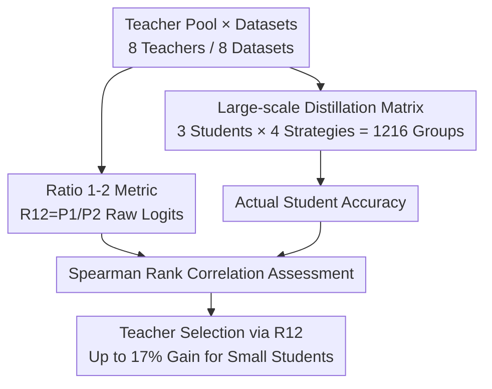

# How to Choose Your Teacher for Fine Grained Image Recognition

**Conference**: CVPR 2026  
**arXiv**: [2605.15689](https://arxiv.org/abs/2605.15689)  
**Code**: https://github.com/arkel23/FGIR-KD-Teacher (Available)  
**Area**: Model Compression / Knowledge Distillation  
**Keywords**: Knowledge Distillation, Fine-Grained Image Recognition, Teacher Selection, Logit Overconfidence, Empirical Study

## TL;DR
This work provides a large-scale empirical study on "which teacher to select for Knowledge Distillation (KD) in fine-grained recognition." Based on 1,216 experimental groups, the authors propose using the **raw logit ratio** $R_{12}$ of top-1/top-2 predictions as a teacher selection metric. $R_{12}$ outperforms metrics like "Teacher Accuracy" or "Secondary Class Probability Variance" in predicting final student accuracy, enabling student models to achieve up to a 17% absolute gain.

## Background & Motivation
**Background**: Fine-grained image recognition (FGIR, e.g., bird species, car models) requires distinguishing highly similar sub-classes within a meta-class. While large backbones achieve high accuracy, they are too heavy for deployment on constrained devices; KD is a common compression method to transfer knowledge from a large teacher to a small student.

**Limitations of Prior Work**: Student accuracy $Acc=f(D,T,S,L,H)$ is influenced by the dataset, teacher, student, training strategy/loss, and hyperparameters. Among these, **how to choose the teacher** has long been overlooked. Two intuitive metrics are unreliable: Teacher Accuracy (TAC)—as Cho & Hariharan noted, "a more accurate teacher does not necessarily result in a better student"—and Statistics of Soft Predictions (SSP, Tan et al.), which assumes that higher variance in secondary class probabilities implies more information. However, in FGIR, **inter-class differences are subtle and secondary class probabilities are naturally tiny**, leading to poor discriminative power for variance.

**Key Challenge**: Large teachers have high capacity and individual accuracy but often suffer from **overconfidence**—the softmax function concentrates almost all mass on the top-1 class. This causes soft labels to degenerate into something resembling hard labels, preventing the student from learning the nuanced inter-class relationships (e.g., "this image looks like A but also somewhat like B"). A trade-off exists between capacity and the "information richness" of soft labels.

**Goal**: To identify a metric that can **predict student performance** prior to distillation simply by looking at the teacher's own predictions, turning teacher selection from a trial-and-error process into a quantifiable one.

**Key Insight**: Since overconfidence is the root cause, one should directly measure "how confident" the teacher is—specifically using **raw logits** (before softmax normalization), as softmax erases the weak secondary signals inherent in fine-grained scenarios.

**Core Idea**: The ratio of the top-1 and top-2 raw logits, $R_{12}=P_1/P_2$, is used as an "overconfidence probe." A smaller ratio indicates that the teacher considers multiple classes likely, resulting in more informative soft labels and a better teacher.

## Method

### Overall Architecture
This paper does not propose a new model but rather an **evaluation and verification pipeline for teacher selection metrics**. The core mechanism involves: keeping the dataset, student, and training strategy fixed while rotating teachers to conduct distillation and obtain "ground truth" student accuracy. Simultaneously, candidate metrics (TAC / SSP / $R_{12}$) are calculated for each teacher. Finally, the **Spearman rank correlation** is used to measure the alignment between the "metric ranking" and the "actual student accuracy ranking." The experimental matrix covers 8 Datasets × 3 Students × 8 Teachers × 4 Training Strategies (plus 4 additional distillation losses), totaling 1,216 groups.

### Key Designs

**1. Ratio 1-2 Metric: Quantifying Teacher Overconfidence via Raw Logit Ratios**

To address the issue where softmax erases subtle secondary signals in FGIR (rendering SSP/TAC ineffective), the authors bypass normalization and work directly with the teacher's **raw logits**. Given an input $\mathbf{x}$ and an $N$-class classifier $F$, the logits $\mathbf{y}=F(\mathbf{x})$ are sorted in descending order as $\mathbf{P}=\text{sort}(\mathbf{y})$ ($P_1\ge P_2\ge\cdots\ge P_N$). The metric is defined as:

$$R_{12}=\frac{P_1}{P_2}$$

A larger ratio suggests the teacher casts almost all "votes" for a single class (overconfidence), leading to information-poor soft labels. A smaller ratio suggests the teacher views the top-2 classes as similar, providing a more nuanced judgment that helps students learn subtle sub-class relationships. The final $R_{12}$ for a teacher is the average ratio across all samples and training epochs. Unlike SSP, which uses the standard deviation of secondary class probabilities, $R_{12}$ focuses solely on the top-1 vs. top-2 gap using unnormalized logits, capturing the most critical signal in fine-grained scenarios.

**2. Comparison with Existing Metrics: Why TAC and SSP Fail in FGIR**

TAC (Teacher Accuracy) assumes "the more accurate, the better," but large, accurate teachers are often overconfident, causing soft label degradation. SSP uses the standard deviation of secondary probabilities (after softmax) to measure information; however, in FGIR, inter-class differences are so small that secondary probabilities are compressed near zero by softmax, drowning the variance signal. $R_{12}$ differs because it: ① Uses logits instead of probabilities to preserve scale information; ② Focuses only on the critical top-1/top-2 contrast rather than mixing in noisy values from near-zero secondary classes.

**3. Core Idea: Smaller Models Can Be Better Teachers (Capacity vs. Teachability)**

Applying $R_{12}$ reveals a counter-intuitive but explainable trend: VGG-19, the smallest teacher (~23M), consistently shows the **lowest $R_{12}$** (least overconfident) across multiple datasets like Aircraft, CUB, and Dogs. Conversely, the largest teacher, ResNetV2-101x3-BiT (~421M), consistently shows the **highest $R_{12}$**. Thus, "smaller models provide more ambiguous predictions and informative soft labels, making them better teachers." This aligns with Cho & Hariharan’s findings on capacity mismatch—large teachers are powerful, but their overconfidence can block knowledge transfer. Selecting a teacher requires balancing capacity and confidence.

### Loss & Training
Students are trained using Hinton's vanilla KD loss: $\mathcal{L}=\mathcal{L}_{\text{CE}}(y^{S},y_{gt})+\beta\mathcal{L}_{\text{KD}}(y^{S},y^{T})$ (CE + KL divergence). Teachers are trained with three levels of specialization: frozen backbone with a linear head (FZ), full fine-tuning (FT), and Counterfactual Attention Learning (CAL). Correspondingly, student training strategies include FZ / FT / CAL teachers, plus the SOTA **TGDA** (Teacher-Guided Data Augmentation), where a CAL teacher generates data-aware augmentations and an additional $\mathcal{L}_{\text{KD}}(y^{S}_{aug},y^{T}_{aug})$ term is added. This design ensures that the metric is robust across different levels of teacher specialization and supervision.

## Key Experimental Results

### Main Results
Correlation breakdown (percentage of total experiments, Spearman Rank Correlation; more "Strong" is better):

| Correlation Strength | TAC | SSP | $R_{12}$ (Ours) |
| :--- | :--- | :--- | :--- |
| Weak (0–0.5) | 42.2% | 39.8% | **28.1%** |
| Modest (0.51–0.7) | 25.8% | 16.4% | 21.1% |
| Strong (0.71–1) | 32.0% | 43.8% | **50.8%** |

$R_{12}$ increases the proportion of strong correlation to 50.8%, which is ~7 percentage points higher than the runner-up SSP (43.8%). The average correlation of $R_{12}$ across 8 datasets is **0.629**, outperforming SSP (0.559) and TAC (0.524).

Accuracy of LCNet-35 student (trained from scratch with TGDA) using different selection metrics:

| Dataset | CE (No Distill) | TAC | SSP | $R_{12}$ |
| :--- | :--- | :--- | :--- | :--- |
| Aircraft | 77.3 | 84.0 | 84.5 | **85.2** |
| Cars | 29.9 | 75.7 | 82.5 | 82.5 |
| CUB | 51.2 | 67.0 | 64.1 | **73.5** |
| Dogs | 43.9 | 55.2 | 68.0 | 68.0 |
| Flowers | 70.8 | 77.6 | 88.6 | 88.6 |
| Moe | 90.6 | 92.4 | 95.2 | 95.2 |
| NABirds | 22.9 | 62.4 | 62.4 | **67.8** |
| Pets | 61.3 | 78.6 | 79.1 | **80.2** |
| **Average** | 56.0 | 74.1 | 78.1 | **80.1** |

Students using teachers selected by $R_{12}$ achieved an average accuracy of 80.1%, up to 6 percentage points higher than those using other metrics. Compared to the CE baseline, gains were as high as 52.5% Gain (Cars) and 44.9% Gain (NABirds).

### Ablation Study
Correlation strength breakdown by training strategy:

| Strategy | Strength | TAC | SSP | $R_{12}$ |
| :--- | :--- | :--- | :--- | :--- |
| CAL | Strong | 29.2% | 37.5% | **58.3%** |
| TGDA | Strong | 16.7% | 50.0% | **66.7%** |

As the teacher becomes more specialized (CAL → TGDA), the advantage of $R_{12}$ becomes more pronounced, reaching an average correlation of 0.753 and 66.7% strong correlation under TGDA. This suggests the metric is particularly effective for highly specialized FGIR teachers.

### Key Findings
- The advantage of $R_{12}$ lies in the **Strong Correlation Proportion**: it pushes more experimental settings into the "strong correlation" zone rather than just slightly improving the mean, making it more reliable for practical teacher selection.
- **Smaller Teachers are Better**: VGG-19 (23M) repeatedly emerges as the lowest $R_{12}$ and most suitable teacher, while ResNetV2-101x3-BiT (421M) is consistently overconfident. Larger capacity does not equate to better teachability.
- **Architecture Independence**: $R_{12}$ consistently identifies the best teacher for the LCNet-35 CNN student even when faced with a mixed CNN/Transformer teacher pool, showing insensitivity to architectural mismatch.
- Selecting the right teacher can sometimes allow low-supervision settings (like CAL) to approach the accuracy of high-supervision settings—the leverage of teacher selection is as significant as the training strategy itself.

## Highlights & Insights
- **Bypassing softmax with raw logit ratios**: The core difficulty in FGIR is the faint secondary signal; softmax normalization destroys this scale information. Using the ratio of top-1/top-2 raw logits is a simple yet precise way to capture "overconfidence."
- **Explainable "Small Teacher" Rule**: It provides a unified explanation for why small models sometimes make better teachers (less overconfidence → richer soft labels) and bridges this with classic capacity mismatch theories.
- **Methodological Value**: The 1,216 experiments and the Spearman Rank Correlation framework offer a reusable paradigm for studying distillation selection metrics.
- **Zero Cost**: $R_{12}$ only requires a single forward pass of the teacher on the target set. It can be calculated before distillation at almost zero engineering cost.

## Limitations & Future Work
- **Focus on Vanilla KD**: To limit the search space, the authors primarily used vanilla KD with fixed hyperparameters. The accuracy of $R_{12}$ under complex losses like feature or relation distillation remains to be fully explored.
- **Not a Perfect Predictor**: Even at its best, strong correlation is around 50–66.7%, meaning there is still a significant chance of selecting a sub-optimal teacher.
- **Dataset Variance**: The average correlation (0.629) is only slightly higher than SSP (0.559). In certain datasets (e.g., Cars), it may lag behind TAC. Conclusions may vary across specific data distributions.
- The study is focused entirely on FGIR; whether $R_{12}$ outperforms SSP in coarse-grained classification (where softmax signals are more distinct) is unverified.

## Related Work & Insights
- **vs. TAC (Cho & Hariharan)**: While TAC assumes "more accurate is better," this work proves it is the least reliable in FGIR (highest weak correlation at 42.2%). $R_{12}$ quantifies "overconfidence" instead of "accuracy," providing a concrete implementation of the "large teachers are not always better" hypothesis.
- **vs. SSP (Tan et al.)**: SSP measures secondary class dispersion in probability space. This work argues that FGIR secondary probabilities are naturally too small for this to work; $R_{12}$ uses raw logits and the top-1/top-2 gap, proving more sensitive in fine-grained scenarios (50.8% vs. 43.8% strong correlation).
- **vs. TGDA**: TGDA is a SOTA training strategy for FGIR distillation. The two are orthogonal: TGDA addresses *how* to distill, while $R_{12}$ addresses *who* to distill from. $R_{12}$ shows its greatest advantage under the TGDA setting.

## Rating
- **Novelty**: ⭐⭐⭐⭐ While teacher selection is a specific niche, the $R_{12}$ angle is simple yet fresh.
- **Experimental Thoroughness**: ⭐⭐⭐⭐⭐ 1,216 groups across diverse dimensions is highly comprehensive.
- **Writing Quality**: ⭐⭐⭐⭐ Logic is clear, with a complete motivation-metric-verification chain.
- **Value**: ⭐⭐⭐⭐ Provides a zero-cost, practical rule for FGIR deployment.

<!-- RELATED:START -->

## Related Papers

- [\[CVPR 2026\] DAGE: Dual-Stream Architecture for Efficient and Fine-Grained Geometry Estimation](dage_dual-stream_architecture_for_efficient_and_fine-grained_geometry_estimation.md)
- [\[CVPR 2026\] DiT-Distill: Open-Set Fine-Grained Retrieval via Generative Curriculum Knowledge](dit-distill_open-set_fine-grained_retrieval_via_generative_curriculum_knowledge.md)
- [\[ACL 2026\] Find Your Optimal Teacher: Personalized Data Synthesis via Router-Guided Multi-Teacher Distillation](../../ACL2026/model_compression/find_your_optimal_teacher_personalized_data_synthesis_via_router-guided_multi-te.md)
- [\[CVPR 2026\] Distilling Balanced Knowledge from a Biased Teacher](distilling_balanced_knowledge_from_a_biased_teacher.md)
- [\[CVPR 2026\] Teacher-Guided Routing for Sparse Vision Mixture-of-Experts](teacher-guided_routing_for_sparse_vision_mixture-of-experts.md)

<!-- RELATED:END -->
