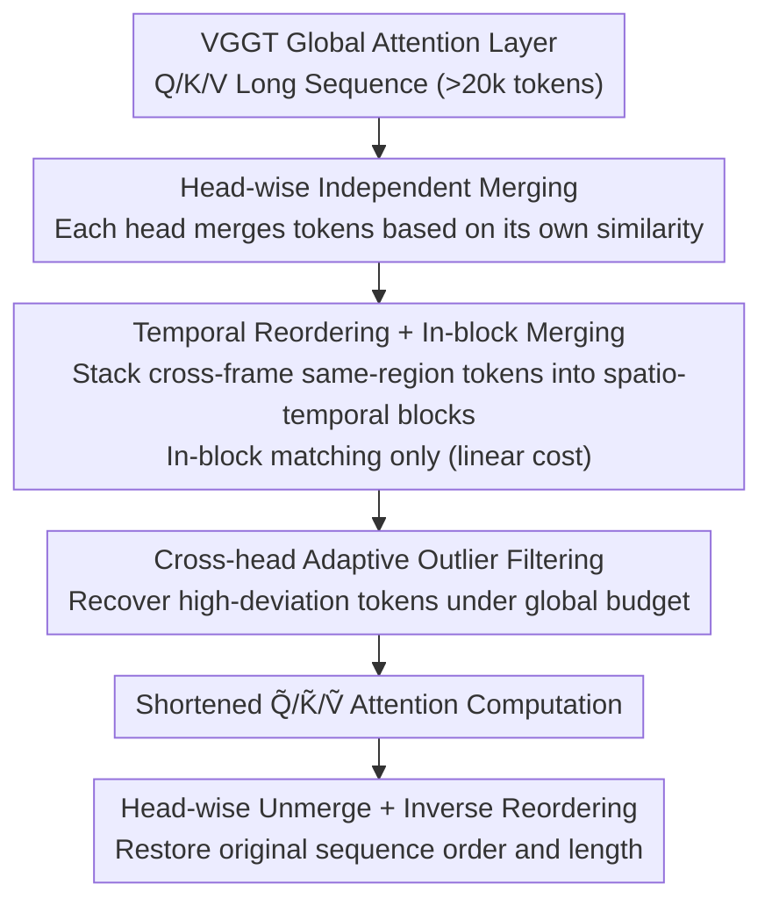

# HTTM: Head-wise Temporal Token Merging for Faster VGGT

**Conference**: CVPR 2026  
**Paper**: [CVF Open Access](https://openaccess.thecvf.com/content/CVPR2026/html/Wang_HTTM_Head-wise_Temporal_Token_Merging_for_Faster_VGGT_CVPR_2026_paper.html)  
**Code**: Not disclosed  
**Area**: Model Compression / Efficient Attention / 3D Reconstruction Acceleration  
**Keywords**: token merging, VGGT, 3D reconstruction, attention acceleration, training-free

## TL;DR
HTTM is a training-free token merging method specifically tailored for VGGT global attention layers. By employing "head-wise independent merging + temporal reordered in-block merging + cross-head adaptive outlier filtering," it accelerates long-sequence 3D reconstruction inference by up to $7\times$ with negligible performance degradation.

## Background & Motivation

**Background**: VGGT (Visual Geometry Grounded Transformer) represents a leap in 3D reconstruction, using a feed-forward Transformer to jointly infer camera poses, depth, and dense geometry in one pass, eliminating expensive geometric post-processing in traditional multi-view reconstruction. Its core mechanism involves alternating "intra-frame attention" and "global attention," where the global attention layer enables all-to-all interaction across all views to establish cross-frame 3D correspondences.

**Limitations of Prior Work**: The global attention layer constitutes the primary bottleneck. Even for small scenes, the token sequence easily exceeds 20,000. As sequence length grows linearly with the number of views while attention complexity is quadratic, latency increases sharply during large-scale or long-sequence reconstruction.

**Key Challenge**: Existing long-sequence acceleration methods are ineffective for VGGT. One category is **sparse attention** (popular in LLM/VLM), which relies on the assumption that attention scores are concentrated on a few tokens. However, measurements (Fig. 2) show that VGGT attention distributions are significantly flatter than Llama, lacking sufficient sparsity to reduce latency. The other category is **ToMe-style** similarity merging (e.g., FastVGGT adopting ToMeSD), which adapts to flatter distributions but applies a **uniform merging topology** across all heads and performs global similarity matching on long sequences, resulting in extreme overhead.

**Key Insight**: The authors analyze the similarity structure of VGGT tokens and discover two patterns: (1) RoPE is reapplied at every layer of VGGT (unlike BERT/SD which apply it once at the input), making the same spatial regions across different frames share similar positional encodings, thereby inducing **cross-frame temporal correspondence**; (2) input-level visual redundancy propagates layer-by-layer, reinforcing spatial local similarity. The superposition of both leads to high redundancy in both "spatial local" and "temporal correspondence" dimensions—a structure suitable for merging.

**Core Idea**: Perform merging at the **attention head granularity** (rather than across all heads) to preserve diversity in concatenated features. Leverage observed spatial locality and temporal correspondence by using "temporal reordering into blocks + in-block merging" to reduce matching costs from quadratic to linear, while using cross-head outlier filtering to ensure quality.

## Method

### Overall Architecture
HTTM is embedded within the global attention layers of VGGT. Before entering the attention kernel, Q/K/V tokens for each head are merged independently to shorten the sequence. After the attention computation, they are unmerged back to the original length. To ensure that "shortening the sequence" is both computationally cheap and high-quality, HTTM links three components: **head-wise independent merging** to maintain inter-head diversity, **temporal reordering + in-block merging** to group high-similarity tokens into small spatio-temporal blocks for linear matching, and **cross-head adaptive outlier filtering** to recover "outlier tokens" that were forced into low-similarity merges.

### Key Designs

**1. Head-wise independent token merging: Preserving diversity in concatenated features**

The issue is that ToMe/FastVGGT use a single merging topology for all attention heads (the same tokens are merged across all heads). This forces different heads to aggregate tokens identically, leading to "duplicate tokens" after concatenation (concat) and weakening the representational diversity that multi-head attention is supposed to provide (Fig. 7). HTTM switches to **independent merging per head based on individual similarity patterns**: for head $i$, tokens are divided into source set $S^{(i)}$ and destination set $D^{(i)}$. The cosine similarity matrix $\text{Sim}^{(i)}=\text{RowNorm}(S^{(i)})\cdot\text{RowNorm}(D^{(i)})^\top$ is computed, and each source token is matched only with its most similar destination, keeping the top-$r$ matches for merging (the merged token is the mean of the merged tokens). Q and K are merged independently, while V follows the matching of K to maintain key-value consistency. During unmerge, the output of the merged token is copied back to each original token. This allows different heads to combine tokens in complementary ways, resulting in richer concatenated representations. The trade-off is that overhead grows linearly with the number of heads, which is why previous methods avoided head-wise merging—a cost mitigated by the next design.

**2. Temporal reordering + In-block merging: Compressing quadratic matching costs to linear**

The most expensive step in head-wise merging is computing the similarity matrix $\text{Sim}^{(i)}$: for $N$ tokens partitioned into 25% destination / 75% source, FLOPs are approximately $0.19N^2 d_{\text{head}}$, growing quadratically with $N$. HTTM partitions the entire sequence into fixed-size $n_b$ merging blocks and **performs merging only within blocks**, reducing matching costs to linear growth with $N$. However, cutting continuous blocks directly along the $N$ dimension only captures spatial similarity near the main diagonal (Fig. 8a), wasting numerous high-similarity **cross-frame matches** outside the blocks. The solution is **Temporal Reordering**: before merging, tokens from the **same spatial region** (size $n_s$) across $n_t$ adjacent frames are stacked together to form spatio-temporal merging blocks of size $n_b=n_s\times n_t$. This ensures high-similarity tokens from both spatial locality and temporal correspondence enter the same block for in-block merging (Fig. 8b shows significantly more high-similarity matches within blocks after reordering). After attention, tokens are unmerged within blocks and inversely reordered to align the output with the input. This step transforms the spatio-temporal redundancy observed in §3.1 into "higher merging quality at the same block size" and amortizes the head-wise overhead.

**3. Cross-head adaptive outlier filtering: Protecting mis-merged tokens under a global budget**

For parallelism, block spatial size, temporal frame count, and merging ratios are fixed across all blocks and heads. However, this may not align with the actual similarity distribution: some blocks have low similarity, and a fixed merging ratio might force low-similarity tokens together, causing large distances between the merged token and original tokens—these are **outliers**. Instead of tuning ratios per block, HTTM performs filtering across all heads under a **global budget**: after an initial merge, the L2 deviation between each original query token and its merged token is calculated (unmerged tokens have deviation 0). The top-$d\%$ tokens with the largest deviations across all heads are labeled as outliers (binary mask $M_o\in\{0,1\}^{h\times N}$), and their contributions are **subtracted from the merged tokens and restored as independent tokens**. This adaptively allocates the filtering budget to heads with denser outliers, protecting the merged tokens' representational capacity and preserving outlier uniqueness. This is applied only to queries and implemented using a custom CUDA kernel for in-block parallelism. Ablations show this is the "quality fuse": removing it causes catastrophic reconstruction failure even with the same token count.

### Loss & Training
HTTM is a **completely training-free** inference-time method with no weight changes or loss functions. Experimental config: Temporal reordering uses spatial block $n_s=128$, temporal frames $n_t=30$ (block size $n_b=3840$); query merging 90% with 10% outlier filtering (final query sequence is 20% of original), key/value merging 70% (30% retained). Inference on A100 using Bfloat16 + FlashAttention, baseline is the memory-efficient VGGT* from FastVGGT.

## Key Experimental Results

Metrics: Reconstruction quality is measured by **Acc. (distance from reconstructed points to GT, lower is better)** and **Comp. (distance from GT to reconstructed points, i.e., completeness, lower is better)** using Chamfer distance. **Q ratio / K/V ratio** refers to the proportion of sequence length retained after merging.

### Main Results
Reconstruction comparison across datasets (7Scenes, NRGBD sampled every 10 frames as keyframes, and ETH3D with weak overlap):

| Method | Q / K·V Ratio | NRGBD Acc.↓ | NRGBD Comp.↓ | NRGBD Time↓ | 7Scenes Time↓ |
|--------|------|------|------|------|------|
| VGGT* (baseline) | 1.00 / 1.00 | 0.010 | 0.010 | 13.9s | 9.1s |
| FastVGGT | 0.34 / 0.34 | 0.016 | 0.013 | 7.0s | 4.5s |
| **VGGT*+HTTM** | **0.20 / 0.30** | **0.012** | **0.010** | **6.8s** | **4.3s** |

HTTM outperforms FastVGGT on NRGBD and matches it on 7Scenes using a more aggressive merging ratio (shorter sequences), with quality close to the original VGGT.

Long-sequence latency (Table 2, advantage increases with frame count):

| Method | Q / K·V | 100 frames | 300 frames | 1000 frames |
|--------|------|------|------|------|
| VGGT* | 1.00 / 1.00 | 9.1s | 60.7s | 724.6s |
| FastVGGT | 0.34 / 0.34 | 4.5s | 22.4s | 175.2s |
| **VGGT*+HTTM** | **0.20 / 0.30** | **4.3s** | **16.3s** | **102.8s** |

At 1000 frames, HTTM achieves approximately **$7\times$** speedup over original VGGT. Latency breakdown (Table 3, 1000 frames) shows the key gap is in matching cost: HTTM matching takes only 0.12s vs FastVGGT's 2.31s. Despite slightly higher aggregation (0.41s vs 0.11s), it yields a **4.58× reduction in merging cost**.

### Ablation Study
Adaptive outlier filtering (NRGBD, three configurations to ensure same token count after merging):

| Config | Acc.↓ | Comp.↓ | Note |
|------|------|------|------|
| No filtering (merge 80% query) | 0.240 | 0.310 | Catastrophic quality failure |
| 5% filtering (merge 85%) | 0.013 | 0.011 | Close to full performance |
| 10% filtering (merge 90%, Ours) | 0.012 | 0.010 | Best |

### Key Findings
- **Outlier filtering is a quality fuse**: With the same token count, removing filtering causes Acc./Comp. to crash from 0.012/0.010 to 0.240/0.310, indicating that fixed-ratio in-block merging must be paired with adaptive outlier recovery.
- **Spatial vs Temporal merging changes with scene** (§4.3 Pareto Frontier): Merging along the temporal dimension is superior for continuous frames, while merging along the spatial dimension is better for sparse frames; however, with a sufficient budget ($n_b\ge800$), incorporating temporal merging remains superior to purely spatial merging.
- **Matching cost, not attention itself, is the bottleneck**: HTTM and FastVGGT spend nearly identical time on the attention kernel (2.95s vs 2.97s). The difference lies entirely in matching overhead, validating the block-wise + temporal reordering approach.

## Highlights & Insights
- **Diagnosing "RoPE reapplication at every layer" as the source of temporal redundancy** and converting this into the engineering tool of "temporal reordering into blocks" is a robust link from mechanistic observation to architectural design.
- **Head-wise independent merging** counter-intuitively solves the "multi-head feature collapse after merging" problem—pointing out that a uniform merging topology destroys multi-head diversity. This insight is transferable to any token compression scenario for multi-head Transformers.
- **Cross-head outlier filtering under a global budget** provides a "rough merge, precise recovery" strategy: instead of tuning ratios block-by-block, it uses fixed ratios for parallelism and a global top-$d\%$ mask as a safety net, which is more hardware-parallelizable.

## Limitations & Future Work
- The method is **strongly coupled with VGGT's spatio-temporal similarity structure** (alternating intra-frame/global attention + per-layer RoPE). Gains might diminish for architectures without repeated positional encodings or clear temporal correspondence.
- Several key hyperparameters ($n_s=128$, $n_t=30$, 90%/70% merge ratios, 10% filtering) were chosen empirically based on datasets. The paper does not provide a cross-domain adaptive selection strategy; new scenes might require retuning.
- Evaluation focuses on indoor/continuous view reconstruction (7Scenes, NRGBD, ETH3D). Robustness in extreme sparse views or dynamic scenes requires broader validation (⚠️ Some long-sequence results were moved to the appendix).
- Outlier filtering relies on **custom CUDA kernels**, and its portability and actual benefit in non-A100 or non-FlashAttention environments need verification.

## Related Work & Insights
- **vs FastVGGT (ToMeSD adaptation)**: Both use similarity merging, but FastVGGT uses uniform head topology and global matching, sacrificing multi-head diversity and incurring high matching costs. HTTM uses head-wise merging and in-block temporal reordering, achieving better quality at higher merge ratios and a 4.58× lower matching cost.
- **vs Sparse Attention (BigBird / SparseVLM / SparseViT etc.)**: These rely on sparse attention assumptions. VGGT attention distributions are relatively flat, limiting acceleration. HTTM follows the similarity merging route, fitting VGGT's gradual distribution.
- **vs Online 3D methods (CUT3R / TTT3R)**: Online methods avoid all-to-all by maintaining global states but lack the accuracy of offline methods like VGGT. HTTM directly accelerates offline VGGT, preserving its quality advantage.

## Rating
- Novelty: ⭐⭐⭐⭐ The "head-wise merging + temporal reordered blocking + cross-head outlier filtering" trifecta is customized for VGGT structure with solid insights, though individual components draw from ToMe.
- Experimental Thoroughness: ⭐⭐⭐⭐ Multi-dataset + long-sequence latency + latency breakdown + outlier ablation are complete. Some long-sequence results are in the appendix.
- Writing Quality: ⭐⭐⭐⭐ Clear derivation from similarity observations to design. Effective diagrams. Hyperparameter selection rationale could be expanded.
- Value: ⭐⭐⭐⭐ Training-free plug-and-play, $7\times$ speedup, negligible quality loss. Very practical for large-scene VGGT deployment.

<!-- RELATED:START -->

## Related Papers

- [\[CVPR 2026\] HeSS: Head Sensitivity Score for Sparsity Redistribution in VGGT](hess_head_sensitivity_score_for_sparsity_redistribution_in_vggt.md)
- [\[CVPR 2026\] LiteVGGT: Boosting Vanilla VGGT via Geometry-aware Cached Token Merging](litevggt_boosting_vanilla_vggt_via_geometry-aware_cached_token_merging.md)
- [\[CVPR 2026\] Saliency-Driven Token Merging for Vision Transformers](saliency-driven_token_merging_for_vision_transformers.md)
- [\[CVPR 2026\] One Layer's Trash is Another Layer's Treasure: Adaptive Layer-wise Visual Token Selection in LVLMs](one_layers_trash_is_another_layers_treasure_adaptive_layer-wise_visual_token_sel.md)
- [\[CVPR 2026\] MeToM: Metadata-Guided Token Merging for Efficient Video LLMs](metom_metadata-guided_token_merging_for_efficient_video_llms.md)

<!-- RELATED:END -->
