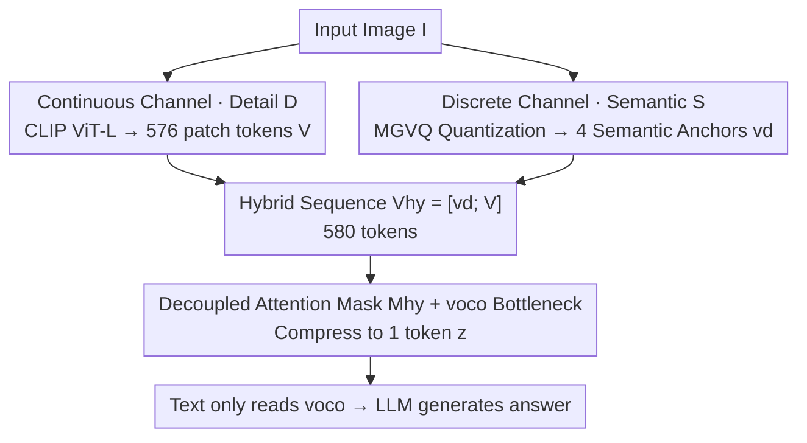

# Hybrid Token Compression for Vision-Language Models

**Conference**: CVPR 2026  
**Paper**: [CVF Open Access](https://openaccess.thecvf.com/content/CVPR2026/html/Zhang_Hybrid_Token_Compression_for_Vision-Language_Models_CVPR_2026_paper.html)  
**Code**: https://github.com/jushengzhang/HybridToken-VLM  
**Area**: Model Compression / Multimodal VLM  
**Keywords**: Visual token compression, VLM, Discrete quantization, Semantic-appearance decoupling, Single token bottleneck

## TL;DR
Addressing the dilemma where "continuous compression loses semantics and discrete quantization loses details" when visual tokens are compressed to 1, HTC-VLM utilizes a dual-path decoupling of a continuous channel (ViT patches for details) and a discrete channel (MGVQ for 4 semantic anchors). Through a decoupled attention mask and a `<voco>` bottleneck, 580 tokens are compressed into 1, improving performance retention from 81.0% to 87.2% across 7 benchmarks.

## Background & Motivation
**Background**: Modern VLMs (LLaVA, Qwen-VL, etc.) feed perceptual information to LLMs using hundreds of patch-level visual tokens (N=576 for a single ViT-L/14 image). However, LLM self-attention grows quadratically with sequence length $O((N+L)^2)$, and 576 patches quickly strain memory and context windows. Consequently, there is a push to compress visual tokens to a minimum, potentially even a single token.

**Limitations of Prior Work**: Compression typically follows two paths, each with complementary failure modes. **Continuous compression** (pooling, attention aggregation, Q-Former, VoCo-LLaMA) projects the entire image into a dense vector. While low-latency, averaging various patches into a unimodal distribution causes "semantic dilution"—for example, averaging patches of a "dog" and a "cat" results in insufficient vector entropy to distinguish species, causing the mutual information $I(v_c;S)$ to collapse. **Discrete quantization** (VQ-VAE, MGVQ, etc.) preserves categorical semantics and interpretability, but quantization noise $\epsilon=f(I)-c_k$ erases continuous details (texture, pose), creating a "granularity gap"—a Golden Retriever on grass and a Poodle on sand might map to the same code $k$, losing clues required for fine-grained tasks.

**Key Challenge**: This is generally viewed as an inevitable "efficiency-fidelity" trade-off. The authors re-examine this from a representation perspective: compressing 576 ViT tokens into a single latent variable exposes a structural bottleneck—**a single continuous token cannot simultaneously encode discrete semantics $S$ and continuous details $D$**. Information-theoretically, for the compressed vector $V_c$ to be a sufficient statistic for both $S$ and $D$, the Markov condition $S\perp D\mid V_c$ must be satisfied, meaning $S$ and $D$ must be decoupled before compression to maximize $I(V_c;S)+I(V_c;D)$ and minimize redundancy $I(S;D\mid V_c)$.

**Goal**: To create an ultra-compact (1-token) visual representation that suffers neither from semantic dilution nor granularity loss.

**Key Insight**: A critical observation is that **inserting a very small number of discrete semantic anchors** before the bottleneck can restore the high-level semantic "skeleton" needed for downstream reasoning, while continuous tokens continue to preserve complementary fine-grained details. Only after decoupling and then fusing for compression can a single token simultaneously express both $S$ and $D$.

**Core Idea**: Employ a dual-path decoupling of "continuous channel (details) + discrete channel (semantic anchors)." After merging these into a hybrid sequence, use a decoupled attention mask to compress them into a single `<voco>` token—i.e., "decouple before compressing to give the single token expressive power."

## Method

### Overall Architecture
HTC-VLM explicitly splits visual information into two orthogonal channels before fusion and compression. Given an image $I$: the **continuous channel** uses CLIP ViT-L/14 + a trainable linear projection $P_v$ to generate $N=576$ patch embeddings $V=\{v_i\}\in\mathbb{R}^{576\times4096}$, carrying low-level details $D$; the **discrete channel** uses MGVQ to quantize $I$ into feature vectors $q\in\mathbb{R}^{14112}$, which are then projected via a two-layer GELU MLP $P_d$ into 4 discrete semantic anchors $v_d\in\mathbb{R}^{4\times4096}$, carrying high-level semantics $S$. The $v_d$ anchors are prepended to $V$ to form a 580-token hybrid sequence $V_{hy}=[v_d;V]$, followed by a trainable `<voco>` token. By applying a **decoupled attention mask** $M_{hy}$, the entire hybrid sequence is compressed into a single latent variable $z$ (the output of `<voco>`), which is then passed to the LLM with text to generate an answer—achieving a 580:1 compression ratio.

### Key Designs

**1. Dual-Path Semantic-Detail Decoupling: Continuous for Details, Discrete for Semantics**

To address the dilemma of a single continuous token losing semantics while failing to retain details, HTC-VLM does not attempt to force everything into one channel. Instead, it splits information into two complementary channels. The **continuous channel** retains all 576 ViT patch embeddings $V=P_v(E_v(I))$, capturing fine-grained details like texture gradients and poses, maintaining high entropy $H(V)\propto\log|M_D|$, thereby preserving $I(V;D)$ and countering the granularity gap. The **discrete channel** uses MGVQ (multi-group quantization, 8 groups, codebook size 16384, 16× downsampling) to quantize the image into $q$, projected via $v_d=\mathrm{GELU}(W_2\cdot\mathrm{GELU}(W_1\cdot q))$ into just 4 semantic anchors. MGVQ quantization clusters semantics into discrete patterns (e.g., "dog on grass"), making $v_d$ a low-dimensional but stable semantic anchor where $I(v_d;S)\approx H(S)$, restoring $I(q;S)$ and countering semantic dilution. This is effective because prior single-channel methods (purely continuous or purely discrete) could not simultaneously optimize the joint information $I(V_c;S,D)$ while minimizing redundancy $I(S;D \mid V_c)$. Separating the two types of information into orthogonal channels lays the foundation for "decoupling before compression." Among various VQ methods tested, MGVQ was selected for its superior ability to cluster diverse semantic patterns through multi-group quantization.

**2. Decoupled Attention Mask and `<voco>` Single Token Bottleneck: Fusing Two Channels into One Interpretable Latent Variable**

The dual-path setup alone is insufficient; semantics and details must be compressed into one token without mutual interference. The authors prepend $v_d$ to form the hybrid sequence $V_{hy}=[v_d;V]\in\mathbb{R}^{580\times4096}$, append the trainable `<voco>`, and define a **decoupled attention mask** $M_{hy}$ over the full input $X=[V_{hy};\texttt{<voco>};W]$ ($W$ are text embeddings). The text $W$ can only attend to `<voco>` ($M=0$) and cannot see $V_{hy}$ directly. Within the hybrid sequence, tokens are masked from each other ($M=-\infty$ for $i\neq j$, prohibiting self-attention), while other positions remain open ($M=1$). Consequently, `<voco>` becomes the sole information exit—it must integrate $V_{hy}$ into its latent representation $z$, and the text reads the image only through $z$. This bottleneck is argued to approximate a VAE from a variational inference perspective: `<voco>` is the latent variable $z$ with posterior $p(z\mid V_{hy})$, and the training objective corresponds to the ELBO $\log p(Y\mid T,I)\ge \mathbb{E}_{q(z\mid V_{hy})}[\log p(Y\mid z,T)]-\mathrm{KL}(q(z\mid V_{hy})\Vert p(z))$. Here, $v_d$ acts as a semantic prior anchor biasing $z$ toward $S$, while $V$ contributes $D$, with $M_{hy}$ constraints reducing $I(S;D\mid z)$. The mask "rewires" gradients: $\partial L/\partial v_d$ strengthens semantic clustering and $\partial L/\partial V$ refines detail variance, allowing a single $z$ to optimize $I(z;S)+I(z;D)$ simultaneously. Attention analysis further shows the compressed token prioritizes discrete anchors, validating $v_d$ as an interpretable semantic carrier.

### Loss & Training
The training objective is a masked autoregressive loss $L_{HTC}=-\mathbb{E}\big[\sum_i\log p_\theta(y_i\mid y_{<i},\texttt{<voco>},T;M_{hy})\big]$, which decomposes into ELBO form $L_{HTC}\approx-\mathbb{E}_{q(z\mid V_{hy})}[\log p(Y\mid z,T)]+\mathrm{KL}(q(z\mid V_{hy})\Vert p(z))+\text{const}$. The first term is reconstruction error and the second regularizes $z$, with the mask $M_{hy}$ ensuring $q(z\mid V_{hy})$ depends on `<voco>` while $v_d$ serves as the prior anchor for $S$. Training data, backbone, and evaluation protocols are strictly aligned with VoCo-LLaMA.

## Key Experimental Results

> Custom Metric **Avg. (Retention Rate)**: Each benchmark is normalized as $(\text{result}-\text{lower bound})/(\text{upper bound}-\text{lower bound})$, where upper bound = original model without compression, lower bound = direct compression without specialized training; results are averaged. ⚠️ Individual benchmarks (e.g., SQAI) may exceed 100% retention; refer to the original paper.

### Main Results
7 understanding benchmarks, 576→1 token:

| Model | Tokens | GQA | VQAv2 | MMBench | MMEP | POPE | SEED | SQAI | Avg.(%) |
|------|--------|-----|-------|---------|------|------|------|------|---------|
| Upper Bound | 576 | 61.1 | 77.7 | 64.0 | 1487.2 | 85.0 | 57.9 | 66.5 | 100 |
| Q-Former | 1 | 51.1 | 63.4 | 51.7 | 1079.7 | 77.3 | 47.2 | 62.7 | 57.2 |
| Avg. Pool | 1 | 52.9 | 65.0 | 55.5 | 1210.3 | 79.1 | 50.3 | 62.2 | 64.1 |
| VoCo-LLaMA | 1 | 57.4 | 71.8 | 57.9 | 1241.4 | 81.5 | 48.8 | 66.3 | 81.0 |
| **HTC-VLM (Ours)** | **1(hybrid)** | **57.6** | **72.4** | **60.0** | **1265.2** | **82.8** | **49.8** | **67.7** | **87.2** |
| Lower Bound | 1 | 37.7 | 41.2 | 22.3 | 617.3 | 53.9 | 36.9 | 60.7 | 0 |

At the same 580→1 compression ratio, HTC-VLM increases the average retention rate from VoCo-LLaMA's 81.0% to 87.2%, matching or exceeding it on every benchmark. This confirms that "injecting discrete semantic anchors before compression" recovers the high-level semantics inevitably lost in continuous compression.

### Probes & Different Token Budgets
| Configuration | Conclusion |
|------|------|
| 192 / 128 / 64 tokens | HTC-VLM is comparable to ToMe/FastV/PDrop/SparseVLM; at 64 tokens, retention is 89.8%, outperforming all competitors. |
| Representation Probe $z_{voco}$ | 30.70% on detail tasks, 26.67% on semantic tasks; best in both, proving the single token retains both semantics and details. |
| Representation Probe $v_d$ | Information from just 4 tokens is less than $V^-$ (aggregation of 576); slightly weaker closed-set classification is expected, but results are stable and decodable for both semantics and details. |

### Key Findings
- **Discrete anchors are key for semantics**: Prepending 4 MGVQ semantic tokens significantly restores the semantic retention of the single token, which is the primary driver behind the 87.2% vs 81.0% gap.
- **Advantages more apparent in extreme compression**: The tighter the token budget (e.g., 64), the more distinct HTC-VLM's advantage becomes (89.8%, surpassing all rivals), fitting the design intuition that dual-path decoupling is most critical under single/few token bottlenecks.
- **Attention biases toward anchors**: The compressed `<voco>` token prioritizes discrete anchors, validating $v_d$ as an interpretable semantic carrier.

## Highlights & Insights
- **Reframing "Dilemma" as a "Decoupling Problem"**: The authors use information theory to translate the "efficiency-fidelity trade-off" into the goal: "to make a single token a sufficient statistic for $S$ and $D$, the condition $S\perp D\mid V_c$ must be met." This turns an engineering problem into a clear objective of "decoupling before compression"—a highly insightful perspective.
- **Minimal Discrete Anchors Yield Large Gains**: Adding only 4 MGVQ semantic tokens (less than 1% of the 580 total) can recover the semantic skeleton. This is highly cost-effective, suggesting semantics can be carried by sparse discrete anchors while details are left to the continuous channel.
- **Decoupled Attention Mask as a Bottleneck**: Using a mask to enforce "text only reads `<voco>`, hybrid sequence is internally shielded" forces multi-source information into a single latent variable while avoiding mutual interference. This method of implementing an information bottleneck via attention structure rather than extra modules is transferable to other multimodal compression scenarios.

## Limitations & Future Work
- The ELBO/VAE derivation is more of a post-hoc theoretical framework. The rigor of claims like the mask approximating a VAE or $I(z;S,D)$ is limited; gains are primary supported by empirical validation.
- The discrete channel relies on a pre-existing MGVQ quantizer; codebook quality and the ability to cluster semantics in out-of-distribution images will limit the upper bound. Sensitivity to weaker/stronger VQ methods is not deeply analyzed.
- Evaluation focuses on 7-9 understanding benchmarks, omitting generative or fine-grained localization tasks (like referring expression segmentation) that rely more on spatial details. Whether a single token suffices for these remains to be verified.
- At medium budgets (192/128 tokens), it is not always the optimal choice; advantages are primarily in extreme (1 or 64) compression.

## Related Work & Insights
- **vs VoCo-LLaMA**: Both compress 576 patches into a single `<voco>` token, but VoCo only compresses continuous tokens, leading to semantic dilution; HTC-VLM prepends 4 discrete anchors, raising retention from 81.0% to 87.2% at 580:1.
- **vs Q-Former / Avg. Pool**: Both aggregate patches into few/single dense vectors (57.2% / 64.1%). As purely continuous routes, they suffer from severe semantic dilution.
- **vs Purely Discrete (VQ-VAE / MoVQ / MGVQ)**: Codebooks preserve categorical semantics but quantization erases continuous details (granularity gap); ours only uses MGVQ for semantic anchors, leaving details to the continuous ViT channel to avoid this weakness.
- **vs Token Merging / Patch Dropping / Redundancy Selection (ToMe, FastV, PDrop, SparseVLM)**: These perform reduction in continuous feature space; under extreme 1-4 token compression, continuous features collapse and lose semantic structure. HTC-VLM's 89.8% retention at 64 tokens outperforms all.

## Rating
- Novelty: ⭐⭐⭐⭐ "Decoupling semantics and details via sparse discrete anchors before compression" is a novel perspective.
- Experimental Thoroughness: ⭐⭐⭐⭐ 7 benchmarks + budgets + probes + attention analysis is comprehensive, though task types are slanted toward understanding.
- Writing Quality: ⭐⭐⭐ Information theory/VAE derivations are somewhat dense and lack some rigor, but the engineering logic is clear.
- Value: ⭐⭐⭐⭐ Significant improvement in extreme 1-token compression; friendly to VLM long-context/VRAM; code is open-source.

<!-- RELATED:START -->

## Related Papers

- [\[CVPR 2026\] Rethinking Token Reduction for Large Vision-Language Models](rethinking_token_reduction_for_large_vision-language_models.md)
- [\[CVPR 2026\] SCoRe: Salience-Coverage Reduction for Vision Token Pruning in Vision-Language Models](score_salience-coverage_reduction_for_vision_token_pruning_in_vision-language_mo.md)
- [\[CVPR 2026\] Quant Experts: Token-aware Adaptive Error Reconstruction with Mixture of Experts for Large Vision-Language Models Quantization](quant_experts_token_aware_vlm_quantization.md)
- [\[CVPR 2026\] Accelerating Streaming Video Large Language Models via Hierarchical Token Compression](accelerating_streaming_video_large_language_models_via_hierarchical_token_compre.md)
- [\[CVPR 2026\] IF-Prune: Information-Flow Guided Token Pruning for Efficient Vision-Language Models](if-prune_information-flow_guided_token_pruning_for_efficient_vision-language_mod.md)

<!-- RELATED:END -->
