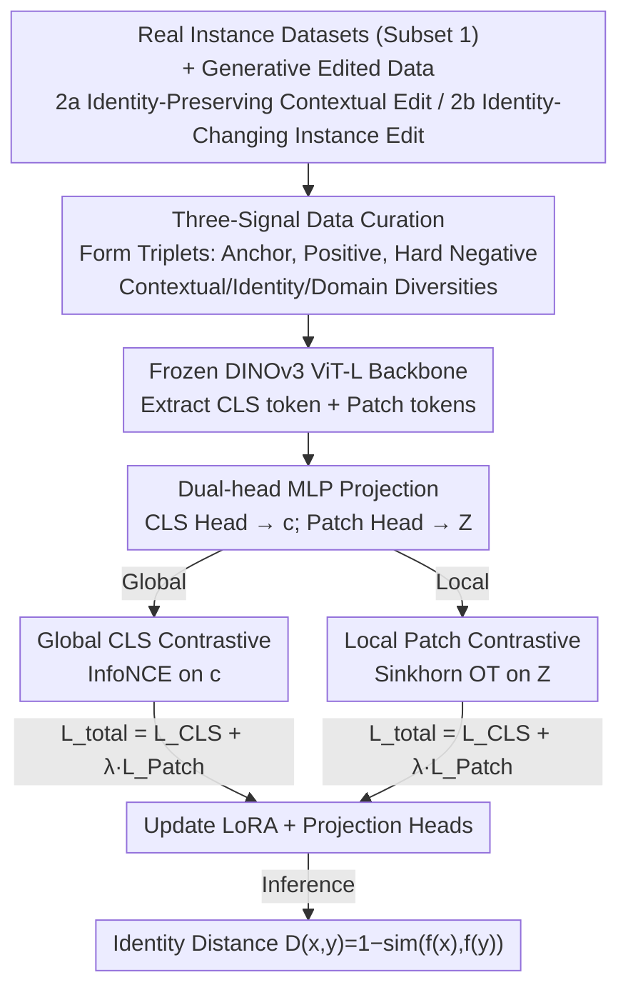

# ID-Sim: An Identity-Focused Similarity Metric

**Conference**: CVPR 2026  
**Paper**: [CVF Open Access](https://openaccess.thecvf.com/content/CVPR2026/html/Chae_ID-Sim_An_Identity-Focused_Similarity_Metric_CVPR_2026_paper.html)  
**Code**: To be confirmed (the paper mentions a project page, but the link is not provided in the main text)  
**Area**: Perceptual Similarity Metrics / Identity Recognition  
**Keywords**: Perceptual Metric, Identity Similarity, Selective Sensitivity, Contrastive Learning, DINOv3

## TL;DR
This paper introduces ID-Sim—a feed-forward perceptual metric specifically designed to measure "identity consistency." It mimics human "selective sensitivity" (insensitive to contextual changes like background/pose/lighting, but highly sensitive to subtle identity changes). By training LoRA and dual-head MLPs on a frozen DINOv3 ViT-L using real and synthetic edited data, combined with a dual objective of global CLS contrastive and local patch Optimal Transport contrastive, it outperforms existing metrics in 48 out of 49 evaluation settings across 7 datasets, using 100× less annotated data and a smaller backbone.

## Background & Motivation
**Background**: Every advancement in perceptual metrics has propelled visual research—from signal-level PSNR/SSIM to learning-based LPIPS, DISTS, and DreamSim, making "image similarity" increasingly aligned with human judgment. However, these metrics optimize for **appearance similarity** rather than **identity consistency**.

**Limitations of Prior Work**: Humans possess "selective sensitivity"—the ability to recognize the same individual across views/lighting/poses while remaining highly alert to subtle differences that change identity. Vision models struggle to balance these: ① General perceptual metrics (LPIPS/DreamSim) are distracted by irrelevant contextual changes (background, lighting), confusing "same object in a different pose" with "two similar but different objects"; ② Foundation models (DINOv3/CLIP) fail to recognize the same object under moderate transformations or are misled by surface features like backgrounds; ③ Specialized systems (Re-ID, instance retrieval, personalization evaluation) only work in narrow domains and fail across domains, often optimizing for "discriminative margin maximization" rather than "alignment with human similarity judgment."

**Key Challenge**: Identity-focused tasks (especially evaluation of personalized/subject-driven generation) lack a **universal, cross-domain identity consistency metric aligned with human judgment**. Existing methods either measure only appearance or discriminate only within a single domain; none reliably answer whether a transformation "preserved the identity or changed it."

**Goal**: To create a feed-forward, deterministic, and cross-domain universal identity metric that ensures "diverse appearances of the same identity cluster tightly, while different identities are separated," aligning highly with human annotations; and to establish a unified benchmark for identity perception.

**Key Insight**: The authors first provide clear definitions for "visual identity" (a unique set of intrinsic visual attributes: shape/texture/color) and "instance" (objects sharing the same visual identity), converging vague terms into actionable criteria. Finding no existing data providing all three signals—contextual diversity, identity diversity, and domain diversity—they bridge the gap using real instance data combined with generative editing.

**Core Idea**: Curate triplet training data containing selective sensitivity signals using "real instances + generative controllable editing," then perform lightweight fine-tuning on a strong foundation model using a **global+local dual contrastive** objective to obtain a perceptual metric specifically for identity consistency.

## Method

### Overall Architecture
The ID-Sim pipeline consists of two stages: **data curation** and **metric training**. On the data side, real instance datasets (Subset 1) and two types of generative edited data (Subset 2a: identity-preserving contextual editing; Subset 2b: identity-changing instance editing) are assembled into triplets $(x_0, x^+, \{x_i^-\})$—where the anchor and positive sample are two images of the same instance. Hard negatives are sourced from "identity-changing edits" or "real approximate instances found via DINOv3 nearest neighbors," with remaining negatives taken from other instances in the same batch. On the training side, each image passes through a frozen ViT backbone $f_\theta$ to obtain a global CLS token $c'$ and patch tokens $Z'$. A dual-head MLP projects these into two embedding spaces, optimized via a joint global CLS contrastive loss and local patch contrastive loss (tuning only LoRA and projection heads). During inference, the identity distance is calculated as $D(x,y)=1-\mathrm{sim}(f_\theta(x), f_\theta(y))$.

### Key Designs

**1. Three-signal data curation: Injecting context/identity/domain diversity with real + generative editing**

Addressing the pain point that "no existing data supports both invariance and discriminability." The authors decompose the required training signals into three categories: contextual diversity (supporting invariance to background/lighting/viewpoint), visual identity diversity (supporting sensitivity to subtle appearance differences), and domain diversity (supporting cross-category generalization). Curation follows two paths: Subset 1 aggregates 7 real instance-level datasets (ILIAS/FORB/MET/GLDv2/Dogs/Cats/DF2, covering landmarks, planar objects, artworks, animals, and fashion); Subset 2 uses generative editing—2a performs **identity-preserving contextual edits** on video datasets (UCO3D/LASOT/YouTubeVIS/GOT10k) to get "context-diverse positive pairs," and 2b performs **identity-changing instance edits** for "fine-grained negatives." The final training set comprises 10k triplets (~30k images, ~10k instances, 10 datasets), intentionally split into three equal parts: pure real triplets / generative positive + real negative / real positive + generative negative. Ablations show this "balance + filtering + editing" combination boosted the validation score from 0.693 to 0.965, forming the foundation of ID-Sim.

**2. Global + local dual contrastive objective: CLS for semantic wholeness, Patch for fine-grained correspondence via Optimal Transport**

Addressing the issue that "relying only on the global token loses dense/local discriminative cues." The authors use a joint objective $\mathcal{L}_{\text{total}}=\mathcal{L}_{\text{CLS}}+\lambda\,\mathcal{L}_{\text{Patch}}$ within a supervised contrastive framework. The global term is a standard InfoNCE on projected CLS tokens: $\mathcal{L}_{\text{CLS}}=-\log \frac{e^{s^+}}{e^{s^+}+\sum_{i=1}^N e^{s_i^-}}$, where $s^+=\mathrm{sim}(c_0,c^+)/\tau$ and $s_i^-=\mathrm{sim}(c_0,c_i^-)/\tau$. The key insight for the local term is that spatial layouts of patches shift across viewpoints/contexts, making position-wise comparisons unreliable. Thus, patch tokens are treated as **unordered sets of local descriptors**, and similarity is measured via soft alignment—defined as the negative entropy-regularized Optimal Transport (OT) distance $\mathrm{sim}_{\text{patch}}(A,B)=-S_\varepsilon(A,B)$, where $S_\varepsilon$ is the Sinkhorn distance calculated using GeomLoss on patches with uniform weights. This is then substituted back into InfoNCE as $\mathcal{L}_{\text{Patch}}$. Unlike DenseCL which uses augmented views of the same image to build hard nearest-neighbor correspondences, this implicitly learns correspondences **across different images of the same instance** via a soft global OT plan, tolerating real pose/contextual shifts.

**3. Frozen strong backbone + LoRA + Dual-head projection: Lightweight fine-tuning for cross-domain alignment**

Addressing the pain point that "specialized Re-ID/retrieval models require massive in-domain fine annotations and fail to generalize." The authors select DINOv3 ViT-L @ 448×448 as the backbone $f_\theta$ (the strongest instance-level performer in validation), **freeze the backbone**, and fine-tune only: rank-16 LoRA adapters on attention and feed-forward layers, and lightweight 2-layer dual-head MLP projection heads $c=\mathrm{MLP}_{\text{CLS}}(c')$ and $Z=\mathrm{MLP}_{\text{Patch}}(z')$. Hard negatives are sourced effortlessly—either from Subset 2b edits or by mining "visually similar but different" real instances using nearest neighbors in the pre-trained DINOv3 embedding space. This design allows ID-Sim to achieve superior cross-domain performance using approximately 100× fewer annotations and a smaller backbone than the retrieval SOTA (Universal Embedding, ViT-H + millions of annotations).

## Key Experimental Results

Backbone: DINOv3 ViT-L @ 448; frozen backbone with LoRA (rank 16) + dual-head MLP. Compared against 7 baselines (Perceptual: DreamSim/LPIPS/DiffSim; Foundation: DINOv3/CLIP/OpenCLIP; Retrieval: Universal Embedding [ViT-H]), evaluated on 7 unseen datasets across 3 task types (instance retrieval, concept preservation, Re-ID). **ID-Sim wins in 48 out of 49 evaluation settings**, with all ViT methods defaulting to CLS token similarity.

### Main Results (Concept Preservation Comparison with MLLMs, Table 2a)

| Method | Model | SUBJECTS2K (AP) | DreamBench++ |
|------|------|-----------------|--------------|
| **ID-Sim (Ours)** | ViT-L | **0.4063** | 0.697 |
| GPT-4o (Original prompt) | GPT-4o | 0.2901 | 0.748 |
| GPT-5 (Controlled prompt) | GPT-5 | 0.3159 | 0.3554 |
| Gemini (Controlled prompt) | Gemini | 0.3354 | 0.70 |

On the finer-grained SUBJECTS2K, ID-Sim outperforms all MLLMs. On DreamBench++, MLLMs perform slightly higher but are extremely sensitive to prompts (GPT-5 dropped from ~0.7 to 0.3554 when switched to a controlled identity-preservation prompt), whereas ID-Sim is deterministic, stable across evaluations, and has much lower computational overhead. SUBJECTS2K is a new benchmark annotated by the authors: 2k human binary (same/different instance) annotations on a subset of Subjects200k to replace noisy GPT-4v labels.

### Patch-level Embedding Comparison Across Tasks (Table 2b, including Patch supervision ablation)

| Dataset | Metric | DINOv3 | Ours (w/o Patch sup) | Ours (Full) |
|--------|------|--------|----------------------|--------------|
| DeepFashion2 | mAP | 0.4071 | 0.4765 | **0.7967** |
| AerialCattle2017 | mAP | 0.4516 | 0.5471 | **0.6245** |
| CUTE | Acc | 0.6561 | 0.6439 | **0.8189** |
| DreamBench++ | Spearman | 0.5479 | 0.5913 | **0.6834** |
| PetFace | mAP | 0.7849 | 0.8377 | **0.8446** |
| PODS | mAP | 0.5825 | **0.8181** | 0.7907 |
| SUBJECTS2K | AP | 0.2314 | 0.2348 | **0.3674** |

CLS supervision alone provides a ~13% relative gain over DINOv3; adding explicit patch supervision increases this to a 40% relative gain. The only outlier is PODS, where the version without patch supervision performed slightly better (0.8181 vs 0.7907).

### Ablation Study (Data Composition and Editing Strategy, Table 3)

| Config | Balance | Filtering | Pos. Edit | Neg. Edit | Ratio | Val Score |
|------|------|------|-----------|-----------|------|--------|
| All Data | ✗ | ✗ | ✗ | ✗ | – | 0.693 |
| All Data | ✓ | ✗ | ✗ | ✗ | – | 0.752 |
| Filtered | ✓ | ✓ | ✗ | ✗ | – | 0.890 |
| Filtered | ✓ | ✓ | ✓ | ✗ | 1:1 | 0.937 |
| Filtered | ✓ | ✓ | ✓ | ✓ | 1:1:1 | **0.965** |

### Personalized Segmentation Transfer (PerSAM on PODS, Table 2c)

| Method | mAP | F1 |
|------|-----|----|
| PerSAM + DINOv3 | 0.153 | 0.18 |
| PerSAM + Ours (w/o Patch sup) | 0.214 | 0.235 |
| PerSAM + Ours (Full) | **0.436** | **0.409** |

### Key Findings
- **Data quality and balance outweigh quantity**: Balancing positive/negative samples and filtering noisy instances pushed the validation score from 0.693 to 0.890; adding generative edits pushed it to 0.965—where positive edits improve intra-class consistency and identity-changing negative edits sharpen inter-class discrimination.
- **Patch supervision is an amplifier for fine-grained tasks**: While CLS alone outperforms DINOv3 by 13%, explicit patch contrastive amplification reaches 40% and allows ID-Sim's local features to be directly used in PerSAM, boosting segmentation mAP from 0.153 to 0.436.
- **Greatest gains occur in "Cross-Context Recognition" and "Fine-grained Identity Discrimination"**: On datasets like PODS and DeepFashion2 where contexts clearly change for positive samples, identity gains were +0.11 and +0.30 mAP over the next best models; on SUBJECTS2K, it outperformed the runner-up by +0.05 mAP.
- **Sensitivity analysis confirms selective sensitivity**: Across identity/background/viewpoint/lighting dimensions, ID-Sim achieves the best balance of "high identity sensitivity + low context sensitivity"—showing the largest similarity drop for identity changes and the highest stability for context changes. In contrast, CLIP/OpenCLIP/LPIPS show the weakest identity sensitivity.

## Highlights & Insights
- **The problem definition of "Selective Sensitivity" is a contribution in itself**: Converging the vague "identity/instance" into an actionable criterion (unique set of intrinsic visual attributes) and decomposing training signals into context/identity/domain for data curation provides a transferable framework for any metric learning task requiring both invariance and discriminability.
- **Sinkhorn OT for soft patch alignment is clever**: Transforming the real pain point of "spatial misalignment across contexts" into an "Optimal Transport distance between unordered sets of local descriptors" preserves fine-grained local cues while tolerating pose/viewpoint shifts, making it directly transferable to dense tasks like segmentation.
- **Generative editing as controllable data augmentation**: Creating positive samples via identity-preserving edits and hard negatives via identity-changing edits provides "fine-grained controllable variations" difficult to capture in real data, which was key to reaching a 0.965 validation score.
- **Small backbone with fewer labels beats large models**: By focusing on identity-focused data and objectives, ID-Sim outperforms retrieval SOTAs using ~100× fewer annotations and ViT-L vs. ViT-H.

## Limitations & Future Work
- **Training is highly dependent on generative editing quality**: Identity-preserving/changing edits generated by diffusion models (Qwen-Edit, Flux, etc.) can introduce distortions or identity leaks that pollute supervision signals.
- **Missing Code/Project Page**: The text says "Our project page is here" but provides no actual link, making reproducibility unclear.
- **Benchmark focus on static images**: Although video datasets were used as editing sources, the temporal dimension of identity consistency (evolution of an instance over time) was mentioned but not systematically evaluated.
- **Patch supervision slightly decreased performance on PODS** (0.8181→0.7907), suggesting it may not be positive for all domains; criteria for when to enable patch supervision are missing.
- **Dependence on a frozen DINOv3 backbone**: The performance ceiling is partially limited by the backbone's instance-level representation; whether LoRA can compensate for a weak backbone in a specific domain is not fully verified.

## Related Work & Insights
- **vs. LPIPS / DreamSim / DISTS (Perceptual Metrics)**: These optimize for overall appearance and are distracted by irrelevant contexts like backgrounds; ID-Sim explicitly targets "selective sensitivity" (context invariant, identity sensitive).
- **vs. DINOv3 / CLIP / OpenCLIP (Foundation Models)**: Foundation models struggle with background changes and retrieval tasks; ID-Sim corrects these weaknesses using identity-focused data and dual contrastive objectives.
- **vs. Universal Embedding (Retrieval SOTA)**: UNED depends on ViT-H and millions of labels; ID-Sim outperforms it with a smaller backbone and ~100× fewer labels, unifying retrieval, concept preservation, and Re-ID tasks.
- **vs. DenseCL (Dense Contrastive)**: DenseCL builds hard nearest-neighbor correspondences between augmented views of the same image; ID-Sim's patch OT learns correspondences implicitly between different images of the same instance via soft global transport, better suited for real contextual shifts.
- **vs. PerSAM (Personalized Segmentation)**: While PerSAM targets pixel-level masks, ID-Sim’s patch features serve as a plug-and-play enhancement, raising mAP from 0.153 to 0.436.

## Rating
- Novelty: ⭐⭐⭐⭐ The combination of "selective sensitivity" definition, real/synthetic editing data, and global-local dual contrastive learning is novel, though individual components (LoRA, InfoNCE, Sinkhorn OT) are clever assemblies of known parts.
- Experimental Thoroughness: ⭐⭐⭐⭐⭐ Comprehensive coverage across 7 baselines, 7 datasets, 3 task types, MLLM comparisons, patch/data ablations, and downstream segmentation transfer.
- Writing Quality: ⭐⭐⭐⭐ Clear logic from definition to method to experiment; however, missing project links and some details relegated to supplementary material.
- Value: ⭐⭐⭐⭐⭐ Fills the gap for a "universal cross-domain identity consistency metric" and provides the SUBJECTS2K benchmark, directly benefiting identity-focused tasks like personalized generation evaluation.

## Related Papers

- [\[CVPR 2026\] Convolutional Neural Networks Driven by Content Similarity](convolutional_neural_networks_driven_by_content_similarity.md)
- [\[CVPR 2026\] Beyond Global Similarity: Multi-Conditional Retrieval for Fine-Grained Cross-Modal Understanding](beyond_global_similarity_multi-conditional_retrieval_for_fine-grained_cross-moda.md)
- [\[AAAI 2026\] From Sequential to Recursive: Enhancing Decision-Focused Learning with Bidirectional Feedback](../../AAAI2026/others/from_sequential_to_recursive_enhancing_decision-focused_learning_with_bidirectio.md)
- [\[ICLR 2026\] Deterministic Bounds and Random Estimates of Metric Tensors on Neuromanifolds](../../ICLR2026/others/deterministic_bounds_and_random_estimates_of_metric_tensors_on_neuromanifolds.md)
- [\[CVPR 2025\] Potential Field Based Deep Metric Learning](../../CVPR2025/others/potential_field_based_deep_metric_learning.md)

<!-- RELATED:END -->

<!-- RELATED:START -->

## Related Papers

- [\[CVPR 2026\] Beyond Global Similarity: Multi-Conditional Retrieval for Fine-Grained Cross-Modal Understanding](beyond_global_similarity_multi-conditional_retrieval_for_fine-grained_cross-moda.md)
- [\[CVPR 2026\] Convolutional Neural Networks Driven by Content Similarity](convolutional_neural_networks_driven_by_content_similarity.md)
- [\[CVPR 2026\] EXOTIC: External Vision-driven Incomplete Multi-view Classification](exotic_external_vision-driven_incomplete_multi-view_classification.md)
- [\[CVPR 2026\] Dual-Band Thermal Videography: Separating Time-Varying Reflection and Emission Near Ambient Conditions](dual_band_thermal_videography_separating_time-varying_reflection_and_emission_ne.md)
- [\[CVPR 2026\] Robust Spiking Neural Networks by Temporal Mutual Information](robust_spiking_neural_networks_by_temporal_mutual_information.md)

<!-- RELATED:END -->
