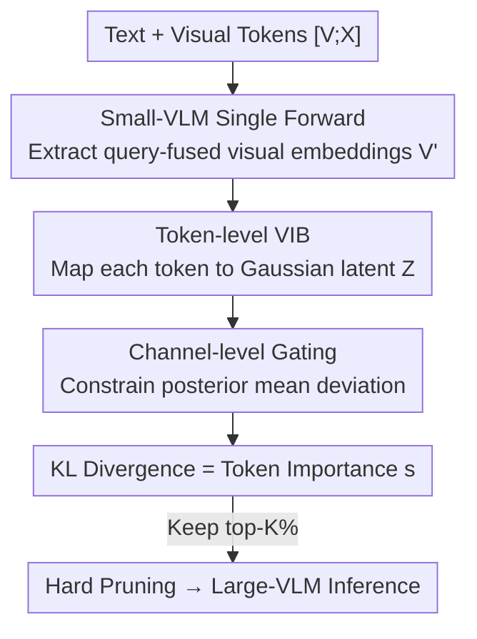

# IF-Prune: Information-Flow Guided Token Pruning for Efficient Vision-Language Models

**Conference**: CVPR 2026  
**Paper**: [CVF Open Access](https://openaccess.thecvf.com/content/CVPR2026/html/Sun_IF-Prune_Information-Flow_Guided_Token_Pruning_for_Efficient_Vision-Language_Models_CVPR_2026_paper.html)  
**Code**: https://github.com/snap-research/EVLM  
**Area**: Model Compression  
**Keywords**: Visual token pruning, VLM inference acceleration, Variational Information Bottleneck, Posterior guidance, Information flow

## TL;DR
This paper proposes IF-Prune, which models visual token importance estimation as an amortized variational inference problem. Using a small VLM equipped with a token-level Variational Information Bottleneck (VIB), the KL divergence between the posterior and prior of each visual token latent variable is used as the importance score to prune the large VLM. Guidance is provided in a single forward pass. Even when retaining only 5% of visual tokens, the large model maintains 95% of its original performance, outperforming the previous SOTA by approximately 8%.

## Background & Motivation
**Background**: VLMs using dynamic resolution visual encoders (e.g., LLaVA, QwenVL, InternVL) split high-resolution images into multiple blocks, each passing through a ViT to produce fixed-length patch sequences. While visually powerful, this results in a massive number of visual tokens and long sequences, leading to high inference costs. Since visual inputs are highly redundant and sparse as generation conditions, "token pruning" has become a mainstream route for efficiency.

**Limitations of Prior Work**: Existing pruning methods are mostly **answer-driven** attention heuristics. FastV assumes that the cross-attention of the first generated token reliably reflects token importance, but this assumption often fails in practice, leading to unstable pruning decisions. The more recent SGP uses a small VLM to aggregate attention weights of all generated tokens to construct an importance map for guiding the large VLM. Although it shows improvements at high pruning ratios, it **heavily depends on the small model's prior knowledge**. When the small VLM cannot answer a query due to a lack of prior knowledge, the generated importance map fails, leaving nose tokens and damaging the reasoning capability of the large VLM.

**Key Challenge**: Answer-driven importance estimation ties "token importance" to "small model accuracy." For complex instructions with high visual dependence, if the small model answers incorrectly, the importance map is wrong, leading to incorrect guidance for the large model. The essence of the problem is that using a capacity-limited small model to **identify the "most important" tokens and forcing the large model to follow** is the wrong direction.

**Goal**: To provide a visual token importance estimation framework that is independent of answer correctness, robust to complex instructions, and has low inference overhead.

**Key Insight**: Reverse the paradigm—instead of letting the small model identify "the most important" tokens, train it to approximate the distribution of "uninformative tokens." Drawing from the Variational Information Bottleneck, the amount of information each token contributes beyond the prior is measured through an information flow perspective.

**Core Idea**: Establish token importance estimation as a token-level Variational Information Bottleneck. Each visual token is treated as a stochastic latent variable; the KL divergence between its posterior and prior serves as the importance score. Tokens that deviate further from the prior contain higher information and should be retained.

## Method

### Overall Architecture
The pipeline of IF-Prune is as follows: concatenate text and visual tokens into a sequence $[V;X]$ and feed it into a small VLM (S-VLM) for a **single forward pass** to obtain visual embeddings $V'$ that have fused query information. A lightweight projection module maps each $V'_i$ to a Gaussian latent variable $Z_i$, equipped with a channel-level gate to constrain the deviation of the posterior mean from the prior. The KL divergence between each token's posterior and a learnable prior is used as the importance score $s\in\mathbb{R}^m$. Top-K% tokens are retained while others undergo hard pruning. The remaining visual tokens (including positional encodings) are fed into the large VLM (L-VLM) for decoding. The entire estimation requires only one forward pass of the small model without explicitly outputting attention weights, making it compatible with FlashAttention. Furthermore, the trained small model can be migrated "one-to-many" to larger models of the same architecture.

### Key Designs

**1. Token-level Variational Information Bottleneck: KL Divergence as Importance Score**

Addressing the root cause of unstable answer-driven importance, the authors add a token-level VIB to the small VLM, treating each visual token as a stochastic latent variable. After the S-VLM forward pass, query-fused visual embeddings $V'_i$ are obtained (under causal attention, $V'$ naturally absorbs query info via cross-attention to $X$) and mapped to a multivariate Gaussian posterior $Q_\theta(Z_i\mid V'_i)=\mathcal{N}(\mu_\theta(V'_i),\sigma^2_\theta(V'_i))$. The prior $P(z)=\mathcal{N}(\mu_p,\sigma^2_p)$ is **learnable and shared across channels**, allowing certain latent dimensions to carry more information while compressing redundancy in others. The importance score of each token is defined as the channel-averaged KL divergence between its posterior and prior:

$$s_i = \frac{1}{d}\sum_{j=1}^d \mathrm{KL}\!\left(Q_\theta(Z_i^{(j)}\mid V'^{(j)}_i)\,\Vert\,P(z^{(j)})\right)$$

The intuition is: tokens deviating further from the prior carry more task-relevant information, while those close to the prior contribute little. Applying the KL penalty at the **token level rather than the sequence level** offers two benefits: granular importance (KL per token reflects marginal utility for fine-grained decisions) and adaptive compression (learnable priors automatically suppress redundant dimensions). Compared to SGP which targets tokens directly linked to the answer, KL guidance spreads scores over a **wider range of potentially useful regions**, making the guidance "less certain but more heuristic," thus preserving the reasoning power of the large VLM.

**2. Channel-level Gating Mechanism: Capping Posterior Mean to Prevent KL Explosion**

Directly predicting the posterior mean $\mu_\theta(V'_i)$ via a projection layer can push it arbitrarily far from the prior, causing KL fluctuations and training instability. The authors introduce channel-level gating to enhance posterior mean expressiveness and stabilize optimization:

$$\mu_\theta(V'_i)=\sigma\!\big(I_\theta(V'_i)\big)\odot\big(V'_i-\mu_p\big)+\mu_p$$

where $I_\theta(V'_i)$ is the learned channel-wise importance gate, $\sigma(\cdot)$ is sigmoid, and $\odot$ is element-wise multiplication. Since $0<\sigma(\cdot)<1$, this gate **caps the deviation of the posterior mean from the prior**, preventing KL explosion and stabilizing training while still allowing the model to independently regulate information contribution per channel.

**3. Single-Forward Posterior-Guided Pruning + One-to-Many Migration**

During inference, the $XV$ sequence is fed into the small VLM once. From the output $(X'V')$, $V'$ is extracted to compute KL importance scores. Hard pruning is applied to $V$ and the pre-computed positional encodings based on the top-K% scores, retaining original spatial information for the remaining tokens. Unlike FastV/SGP which compute importance inside the L-VLM decoder or require decoding until EOS, IF-Prune uses only one small model forward pass, significantly reducing L-VLM FLOPs and VRAM while supporting FlashAttention. Furthermore, if the small VLM shares the **same architecture** as the large VLM, the visual encoding remains consistent. Experiments show the amortized posterior learned by InternVL2.5-1B can be directly migrated to prune InternVL2-8B/26B, allowing "one small model to serve multiple large models."

### Loss & Training
The training objective extends the classic VIB to the token level with two terms:

$$\mathcal{L}=\underbrace{\mathbb{E}_{X,Y\sim\mathcal{D},Z}\big[\log\pi_\phi(Y\mid X,Z)\big]}_{\text{Reconstruction Item}}-\frac{\beta}{m}\sum_{i=1}^m \underbrace{\mathrm{KL}\!\left(Q_\theta(Z_i\mid V'_i)\Vert P(z)\right)}_{\text{Token-level KL Penalty}}$$

The reconstruction term ensures latent tokens retain enough info to predict the answer $Y$ (using reparameterization $Z_i=\mu_\theta(V'_i)+\sigma_\theta(V'_i)\cdot\epsilon, \epsilon\sim\mathcal{N}(0,I)$). The KL penalty compresses tokens toward the prior, punishing redundancy; $\beta$ tunes the trade-off. For implementation, the InternVL series is used; the small VLM is initialized with InternVL2.5-1B and frozen, training only a two-layer MLP projection $Q_\theta$ and learnable prior embeddings ($\mu_p,\sigma^2_p$) via LoRA for one epoch. To alleviate domain shift between $\pi_\phi(Y\mid X,V)$ and $\pi_\phi(Y\mid X,Z)$, standard InternVL instruction data (ShareGPT-4V, LLaVA, DVQA, etc.) is used.

## Key Experimental Results

### Main Results
On 8 benchmarks (TextVQA, ChartQA, GQA, MMStar, MMBench, MM-Vet, MME, RealWorldQA), InternVL2-26B underwent hard pruning at layer $L{=}9$. Comparison of pruning methods (score ratio = normalized total score of pruned vs. full tokens):

| Method | Keep Ratio K | TextVQA | ChartQA | MMStar | MMBench | MM-Vet | MME | Score ratio ↑ |
|------|---------|---------|---------|--------|---------|--------|-----|---------------|
| InternVL2-26B (Full) | 100% | 82.45 | 84.92 | 60.08 | 83.46 | 64.00 | 2270 | 100.00% |
| FastV† | 20% | 75.62 | 71.68 | 53.01 | 78.31 | 45.00 | 2140 | 93.18% |
| SGP† | 20% | 81.97 | 81.68 | 56.77 | 80.76 | 62.34 | 2258 | 99.15% |
| **IF-Prune (Ours)** | 20% | 81.48 | 82.60 | 57.46 | 80.58 | 61.01 | 2271 | **99.4%** |

(† denotes author reproduction. At 20% retention, both IF-Prune and SGP are close to the full model; the gap widens at more aggressive ratios.)

### Efficiency Curve (Different Keep Ratios)
| Keep Ratio K | IF-Prune (score ratio) | SGP | FastV |
|----------|------------------------|-----|-------|
| 20% | 99.4% | 98.82% | — |
| 5% | **95.4%** | 88.9% | 67.1% |

Retaining only 5% of visual tokens, IF-Prune maintains 95.4% performance, whereas SGP/FastV drop to 88.9%/67.1%. More aggressive pruning highlights IF-Prune's advantage, corresponding to ~40% compute reduction and a ~7–8% gain over SOTA.

### One Can Serve Many (Migration)
The small VLM trained for InternVL2.5-1B was reused to prune InternVL2-8B ($L{=}0$): at $K{=}20\%$, SGP/IF-Prune scored 98.29%/97.56%. At an aggressive $K{=}5\%$, IF-Prune reached 94.03%, significantly outperforming SGP’s 90.34% (+3.69), with the largest gains in MMBench and MMStar.

### Key Findings
- **Informative tokens > Answer-related tokens**: Visualizations show SGP focuses only on tokens directly predicting the answer, while IF-Prune identifies a broader set of semantic/problem-relevant cues, outperforming on complex visual-dependent queries.
- **Advantage grows with pruning aggressiveness**: At 5% retention, IF-Prune (95.4%) leads SGP (88.9%) by 6.5 percentage points.
- **Gating is critical for stability**: Without the gate, free mean projection drives KL to infinity, leading to training divergence.

## Highlights & Insights
- **Paradigm Reversal**: Shifting from "letting a weak model identify important tokens for a large model" to "using VIB to estimate information deviation" elevates importance estimation from a heuristic to a principled probabilistic framework.
- **KL as Importance Score**: Using posterior-prior KL divergence naturally provides an interpretable, rankable measure of information. The token-level granularity is a key contribution to fine-grained pruning.
- **Single Forward + FlashAttention Compatibility**: No need to extract attention weights or decode until EOS. This engineering-friendly design makes it truly practical for deployment.
- **One-to-Many**: Pruning multiple large models with one small model amortizes training costs and increases utility.

## Limitations & Future Work
- The small VLM must share the **same architecture** as the large VLM to ensure visual encoding consistency; cross-architecture migration (e.g., InternVL to Qwen-VL) is unexplored.
- Validation focused on the InternVL family and single-image tasks; performance in multi-image, video, or long-context scenarios remains to be tested.
- Training a small VLM for each architecture is still required; fully training-free importance estimation remains an open problem.
- Future directions: extending the VIB to cross-architecture metrics or joint optimization with quantization/KV-cache compression.

## Related Work & Insights
- **vs. FastV**: FastV uses first-token attention, which is fragile; IF-Prune uses probabilistic KL information, is single-forward, and compatible with FlashAttention.
- **vs. SGP**: SGP aggregates generation attention and is answer-driven, failing on complex instructions if the small model lacks the prior; IF-Prune estimates uninformative token distributions, spreading scores wider and leading by 6.5% at 5% retention.
- **vs. ToMe**: ToMe merges redundant tokens in the visual encoder without considering the query; IF-Prune ensures pruning is query-aware by using $V'$.

## Rating
- Novelty: ⭐⭐⭐⭐⭐ Modeling visual token pruning as amortized variational inference and using KL as a measure is highly original and consistent.
- Experimental Thoroughness: ⭐⭐⭐⭐ Solid across 8 benchmarks, multi-scale models, and migration experiments, though mainly focused on the InternVL family.
- Writing Quality: ⭐⭐⭐⭐ Clear motivation and derivation of the information bottleneck; effective formulas and visualizations.
- Value: ⭐⭐⭐⭐⭐ High deployment value due to 95% performance at 5% tokens, single-forward pass, and FlashAttention compatibility.

<!-- RELATED:START -->

## Related Papers

- [\[CVPR 2026\] SCoRe: Salience-Coverage Reduction for Vision Token Pruning in Vision-Language Models](score_salience-coverage_reduction_for_vision_token_pruning_in_vision-language_mo.md)
- [\[CVPR 2026\] Hi-Lo Prune: Look at What You'll Lose before Pruning with Hierarchical Token Selection](hi-lo_prune_look_at_what_youll_lose_before_pruning_with_hierarchical_token_selec.md)
- [\[CVPR 2026\] Hybrid Token Compression for Vision-Language Models](hybrid_token_compression_for_vision-language_models.md)
- [\[CVPR 2026\] Rethinking Token Reduction for Large Vision-Language Models](rethinking_token_reduction_for_large_vision-language_models.md)
- [\[CVPR 2026\] Collaborative Multi-Mode Pruning for Vision-Language Models](collaborative_multi-mode_pruning_for_vision-language_models.md)

<!-- RELATED:END -->
