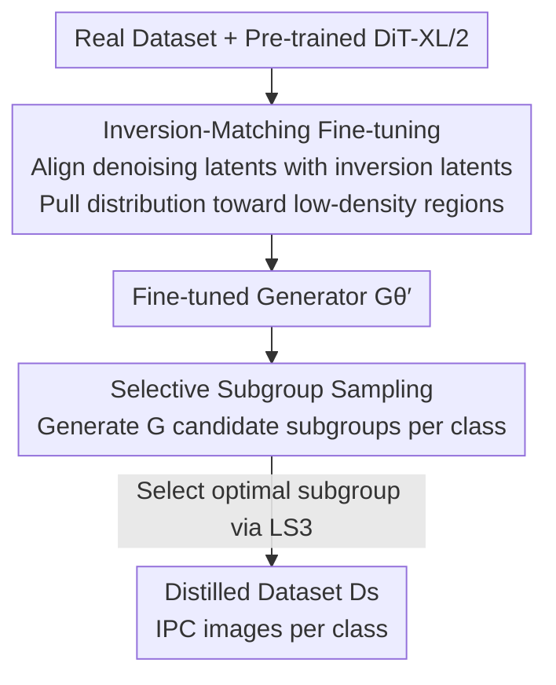

# IMS3: Breaking Distributional Aggregation in Diffusion-Based Dataset Distillation

**Conference**: CVPR 2026  
**Paper**: [CVF Open Access](https://openaccess.thecvf.com/content/CVPR2026/html/Wang_IMS3_Breaking_Distributional_Aggregation_in_Diffusion-Based_Dataset_Distillation_CVPR_2026_paper.html)  
**Code**: https://github.com/Westlake-AGI-Lab/IMS3  
**Area**: Model Compression / Dataset Distillation / Diffusion Models  
**Keywords**: Dataset Distillation, Diffusion Models, DDIM Inversion, Subgroup Sampling, Distributional Coverage

## TL;DR
Addressing the pain point where diffusion-based dataset distillation samples "over-aggregate in high-density regions and lack discriminative boundary samples," IMS3 leverages the instability of DDIM inversion for fine-tuning (Inversion-Matching, IM) to broaden the generated distribution toward low-density regions. It then employs training-free Selective Subgroup Sampling (S3) to pick synthetic subsets that are both representative and class-separable based on centroid similarity, achieving a new SOTA in diffusion-based distillation on ImageWoof, ImageNette, and ImageIDC.

## Background & Motivation
**Background**: Dataset Distillation aims to compress large-scale real data into a small set of synthetic samples such that models trained on the synthetic set approximate the accuracy of those trained on the real set. Early methods were optimization-based (directly optimizing synthetic samples to match gradients or statistics of real data). Recently, diffusion-based methods have leveraged the strong generative capabilities of pre-trained diffusion models, demonstrating better fidelity and scalability in high-resolution and many-class scenarios, typically through a "fine-tune + sample" two-stage pipeline.

**Limitations of Prior Work**: Diffusion models are inherently **generative**—maximizing data likelihood, which naturally concentrates quality in high-density regions of the data manifold. Conversely, dataset distillation is a **discriminative** objective—where the most useful samples are often low-density, hard-to-learn specimens near decision boundaries. This objective mismatch leads to synthetic samples being overly concentrated in high-density regions with insufficient boundary coverage. The authors name this phenomenon **distributional aggregation**: t-SNE visualizations show that samples from methods like Minimax are visibly crowded into high-density clusters, exhibiting narrow coverage and poor diversity.

**Key Challenge**: The objective mismatch between generative likelihood (high-density concentration) and discriminative utility (requirement for low-density boundary coverage + inter-class separability). Furthermore, standard diffusion sampling generates classes independently without considering inter-class relationships, further weakening the discriminative structure.

**Goal**: Split into two sub-problems: (1) how to widen distribution coverage from high-density to low-density regions during fine-tuning; (2) how to explicitly inject inter-class separability during sampling.

**Key Insight**: The authors seize upon an **anomalous property of the diffusion inversion process**: inversion trajectories are **inherently unstable** due to the accumulation of step-wise approximation errors, causing them to deviate from high-density manifolds and naturally drift toward low-density regions. While this property is considered a drawback in reconstruction tasks, it can be "borrowed" to expand low-density coverage.

**Core Idea**: Use "aligning denoising latents with their inversion latents" for fine-tuning to actively expand low-density coverage (IM), then use training-free sampling that "selects subgroups by centroid similarity" to inject inter-class separability (S3).

## Method

### Overall Architecture
IMS3 is a two-stage framework: first, **Inversion-Matching (IM) fine-tuning** is performed on a pre-trained DiT-XL/2 to broaden the generated distribution toward low-density regions; then, **Selective Subgroup Sampling (S3)** is used during inference to select the optimal synthetic subgroup for each class, injecting inter-class discriminability. The input consists of the real dataset $\mathcal{D}_r$ and a pre-trained diffusion model, and the output is the compressed distilled dataset $\mathcal{D}_s$ (IPC images per class). The two stages are complementary: IM addresses "insufficient coverage" while S3 addresses "insufficient inter-class separability."

### Key Designs

**1. Inversion-Matching Fine-tuning: Leveraging inversion instability to pull distribution toward low-density regions**

If fine-tuning for diffusion distillation uses only standard diffusion loss, it continues to reinforce high-density concentration. IM introduces a **time-aligned inversion matching loss**: for a real sample, DDIM inversion (Euler scheduler, see Eq. (3)) is first used to calculate the inversion noise latent $z_t^{\text{inv}}$ at timestep $t$. To save computation, the denoising latent does not follow the full trajectory but is directly sampled via $z_t = \sqrt{\bar\alpha_t}\,z_0 + \sqrt{1-\bar\alpha_t}\,\epsilon$. Then, the cosine similarity between the two is aligned at the same timestep:

$$\mathcal{L}_{\text{IM}} = 1 - \sigma(z_t^{\text{inv}}, z_t)$$

where $\sigma(\cdot,\cdot)$ denotes cosine similarity. Importantly, this **does not force the two latents to be identical** but merely aligns their directions—since inversion trajectories naturally drift toward low-density regions, pulling the generative latent toward the inversion latent broadens the distribution toward under-represented low-density boundary areas. To prevent excessive drift from damaging fidelity, a standard diffusion loss $\mathcal{L}_{\text{Diff}} = \|\epsilon_\theta(z_t,c)-\epsilon\|_2^2$ is added, resulting in the total loss $\mathcal{L} = \mathcal{L}_{\text{Diff}} + \lambda_{\text{IM}}\mathcal{L}_{\text{IM}}$ (with $\lambda_{\text{IM}}=0.002$). Fine-tuning uses PEFT (Difffit) to only update lightweight adapters in attention/MLP layers while freezing the backbone, which is memory-efficient and stable. The distinction from prior methods is that it does not artificially create boundary samples but **treats the inherent inversion drift—usually seen as a defect—as a navigation signal for "moving toward low density."**

**2. Selective Subgroup Sampling: Training-free selection of representative and separable subgroups**

Standard diffusion sampling generates classes independently without regarding inter-class relationships, resulting in synthetic samples that are visually plausible but discriminatively weak. S3 is a **training-free inference-time sampling strategy**: a frozen feature encoder $\phi$ maps images to $\ell_2$-normalized embeddings on a unit sphere. For each class, a real centroid $r_i$ is calculated using $K_i$ real samples (Eq. (8)). Then, $G$ candidate subgroups $\{S_{i,g_i}\}$ are drawn from the generator for that class, each with a subgroup centroid $c_{i,g_i}$ (Eq. (9)). A single subgroup is then chosen for each class by optimizing an objective that **balances representation and inter-class separation**:

$$\mathcal{L}_{S^3}(\mathbf{g}) = \alpha \sum_{i} \log\big(1-\sigma(c_{i,g_i}, r_i)\big) - \frac{\beta}{C-1}\sum_{i}\sum_{j\neq i}\log\big(1-\sigma(c_{i,g_i}, c_{j,g_j})\big)$$

The first term pulls the subgroup centroid toward its corresponding real centroid (ensuring representation and constraint within the real distribution), while the second term increases the angle between the centroids of selected subgroups of different classes (ensuring inter-class separability and suppressing mode collapse); $\alpha$ and $\beta$ are weights. Since this objective only depends on pre-calculated centroids, the optimal index $\mathbf{g}^* = \arg\min_{\mathbf{g}}\mathcal{L}_{S^3}$ can be obtained via a simple greedy search. It requires no additional training and embeds "class-awareness" directly into the sampling process—the fundamental difference from "independent class-wise sampling."

### Loss & Training
The total loss in the fine-tuning stage is $\mathcal{L} = \mathcal{L}_{\text{Diff}} + \lambda_{\text{IM}}\mathcal{L}_{\text{IM}}$ with $\lambda_{\text{IM}}=0.002$. Fine-tuning is performed on DiT-XL/2 at 256×256 resolution using Difffit PEFT for 8 epochs, batch size 8, AdamW, learning rate $1\times10^{-3}$ on a single A100-40GB. In the sampling stage, $G$, $\alpha$, and $\beta$ are chosen per dataset; performance is best when $\alpha$ and $\beta$ are balanced.

## Key Experimental Results

### Main Results
Comparison with optimization-based and diffusion-based SOTA on the fine-grained ImageWoof (10 highly similar dog breeds) (Top-1 Accuracy, %; highest of hard/soft labels reported):

| Dataset / IPC | Backbone | DiT | Minimax | D4M | DDVLCP | ImS3 (Ours) |
|---|---|---|---|---|---|---|
| ImageWoof / 10 | ResNetAP-10 | 34.7 | 35.7 | 33.2 | 39.5 | **41.8** |
| ImageWoof / 10 | ResNet-18 | 34.7 | 37.6 | 32.3 | 39.9 | **41.3** |
| ImageWoof / 50 | ResNet-18 | 50.1 | 53.9 | 53.7 | 58.9 | **60.1** |
| ImageNette / 50 | ResNetAP-10 | 73.3 | 83.7 | 77.7 | – | **84.2** |
| ImageIDC / 1 | ResNet-18 | 26.7 | 22.4 | – | – | **28.5** |

Gains are most significant at low IPC: on ImageWoof IPC=10 with ResNetAP-10, accuracy increases from Minimax's 35.7% to 41.8% (+6.1%), which is 2.3% higher than the second-best DDVLCP (39.5%).

### Ablation Study
Component-wise ablation of IM and S3 (ImageWoof using ResNetAP-10, ImageNette using ResNet-18):

| Configuration | ImageWoof IPC=10 | ImageWoof IPC=50 | ImageNette IPC=10 | ImageNette IPC=50 |
|---|---|---|---|---|
| DiT Baseline | 34.7 | 49.3 | 58.9 | 82.9 |
| + IM | 37.3 | 53.5 | 60.0 | 81.5 |
| + S3 | 40.9 | 54.9 | 62.2 | 81.3 |
| + ImS3 (IM+S3) | **41.8** | **61.0** | **62.9** | **84.2** |

### Key Findings
- **IM and S3 are effective individually and stronger together**: IM expands coverage while S3 strengthens inter-class separation. Their combination yields the largest gains across all settings; specifically on ImageWoof IPC=50, the combination jumps from 49.3 to 61.0.
- **$\alpha$, $\beta$ are robust**: Scanning the [0.1, 0.9] range, performance remains stable across a wide interval, with balanced values being optimal—indicating that representation and inter-class separation should be jointly optimized.
- **Reference number of real samples $K_i$**: Too few samples introduce noise and degrade subgroup selection quality; using a moderate number to calculate centroids is more stable, with benefits being especially pronounced at higher IPC.

## Highlights & Insights
- **Turning defects into signals**: Treating the instability of diffusion inversion—which causes trajectories to drift toward low-density regions—as a fine-tuning signal for low-density navigation is a clever perspective. It achieves coverage expansion for free without needing to explicitly construct boundary samples.
- **Plug-and-play training-free sampling**: S3 relies only on pre-calculated centroids and greedy search, injecting inter-class discriminability into sampling at zero additional training cost, making it transferable to the sampling stage of any diffusion-based distillation method.
- **Discriminative vs. Generative mismatch**: This analytical framework is insightful. Many tasks that use generative models for discriminative downstream applications likely suffer from similar high-density biases; the "broaden coverage + class-aware selection" strategy of IM/S3 is broadly applicable.

## Limitations & Future Work
- The theoretical/intuitive argument that inversion instability "drifts toward low-density regions" is primarily empirical; the main text provides a cosine alignment loss, while theoretical guarantees are in the appendix (verification should refer to the original text).
- The scalability of S3's greedy search for a very large number of classes and the generation overhead for $G$ candidate subgroups were not fully quantified in the main text.
- Main experiments focus on ImageNet subsets (ImageWoof/ImageNette/ImageIDC) at 256×256; large-scale (ImageNet-1K) results are in the appendix and not detailed in the main text.
- Future direction: Making the strength of inversion drift a controllable or learnable navigation field rather than a fixed cosine alignment target.

## Related Work & Insights
- **vs Minimax Diffusion**: Both fine-tune pre-trained diffusion models for distillation, but Minimax uses a minimax criterion to enhance representation and diversity, which still suffers from distributional aggregation. IMS3 uses inversion matching to explicitly pull toward low-density regions, resulting in broader coverage and more uniform t-SNE distributions.
- **vs D3HR**: D3HR uses DDIM inversion to map VAE latents to a more Gaussian domain and subgroup sampling to align distributions. IMS3 also uses inversion but focuses on leveraging its **instability** to expand low-density coverage, combined with class-aware subgroup selection aimed at discriminability rather than distribution normalization.
- **vs D4M**: D4M uses prototype learning to cluster latents and learn class centers to improve intra-class consistency and fidelity. IMS3's S3 also uses centroids but optimizes a subgroup selection objective of "closeness to real centroid + distance from other centroids," emphasizing inter-class separability.

## Rating
- Novelty: ⭐⭐⭐⭐ The perspective of using inversion instability as a low-density navigation signal is novel; S3 is a straightforward centroid-based selection.
- Experimental Thoroughness: ⭐⭐⭐⭐ Systematic comparisons across multiple datasets, backbones, and IPCs + component ablations + hyperparameter analysis, though large-scale results are primarily in the appendix.
- Writing Quality: ⭐⭐⭐⭐ Clear logic from motivation to method and experiment; the term "distributional aggregation" is apt; some theory relies on the appendix.
- Value: ⭐⭐⭐⭐ Provides a plug-and-play coverage expansion + class-aware sampling solution for diffusion-based dataset distillation with high practical utility.

<!-- RELATED:START -->

## Related Papers

- [\[CVPR 2026\] Mitigating The Distribution Shift of Diffusion-based Dataset Distillation](mitigating_the_distribution_shift_of_diffusion-based_dataset_distillation.md)
- [\[CVPR 2026\] ManifoldGD: Training-Free Hierarchical Manifold Guidance for Diffusion-Based Dataset Distillation](manifoldgd_training-free_hierarchical_manifold_guidance_for_diffusion-based_data.md)
- [\[CVPR 2026\] DMGD: Train-Free Dataset Distillation with Semantic-Distribution Matching in Diffusion Models](dmgd_train-free_dataset_distillation_with_semantic-distribution_matching_in_diff.md)
- [\[NeurIPS 2025\] Optimizing Distributional Geometry Alignment with Optimal Transport for Generative Dataset Distillation](../../NeurIPS2025/model_compression/optimizing_distributional_geometry_alignment_with_optimal_transport_for_generati.md)
- [\[ICLR 2026\] Diffusion Models as Dataset Distillation Priors](../../ICLR2026/model_compression/diffusion_models_as_dataset_distillation_priors.md)

<!-- RELATED:END -->
