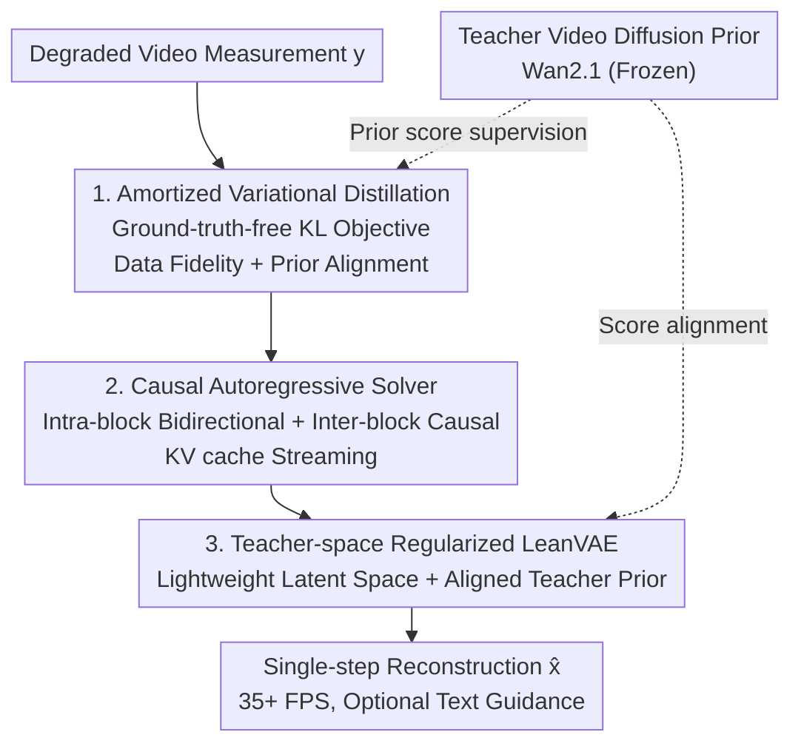

# InstantViR: Real-Time Video Inverse Problem Solver with Distilled Diffusion Prior

**Conference**: CVPR 2026  
**Paper**: [CVF Open Access](https://openaccess.thecvf.com/content/CVPR2026/html/Bai_InstantViR_Real-Time_Video_Inverse_Problem_Solver_with_Distilled_Diffusion_Prior_CVPR_2026_paper.html)  
**Code**: [Project Page](https://ai4scientificimaging.org/instantvir) (code repository to be confirmed)  
**Area**: Video Restoration / Diffusion Models / Inverse Problem Solving  
**Keywords**: Video Inverse Problems, Diffusion Prior Distillation, Amortized Inference, Causal Streaming Reconstruction, Real-time Restoration

## TL;DR
InstantViR distills a powerful bidirectional video diffusion model (teacher) into a **single-step, causal autoregressive** student solver. Without requiring paired clean/degraded data, it maps degraded videos directly to high-quality reconstructions in a single forward pass. By replacing the heavy VAE with a lightweight one, the throughput is pushed to **35+ FPS** (achieving up to a 100× speedup compared to iterative video diffusion solvers) while matching or exceeding the reconstruction quality of iterative baselines in denoising, deblurring, super-resolution, and inpainting tasks.

## Background & Motivation

**Background**: Video inverse problems (reconstructing a clean video $x$ from degraded measurements $y$, e.g., deblurring, super-resolution, and inpainting) are commonly modeled as a Bayesian posterior sampling problem $p(x|y)\propto p(y|x)p(x)$. Here, the likelihood $p(y|x)$ is determined by a known degradation operator, and the prior $p(x)$ characterizes the spatiotemporal statistics of videos. The strongest current priors are derived from diffusion models.

**Limitations of Prior Work**: Solving video inverse problems with diffusion priors typically follows two routes, both of which are suboptimal. ① **Image diffusion priors + temporal regularization** (heuristics like optical flow constraints or batch noise): The prior itself lacks awareness of spatiotemporal dynamics, leading to flickering and temporal inconsistency in the reconstruction, and still requires slow iterative sampling. ② **Native video diffusion priors** (e.g., Wan2.1, Open-Sora): Although they offer strong temporal priors, posterior sampling requires running hundreds or thousands of iterative trajectory steps in a high-dimensional video space. Furthermore, generating a single frame requires attending to the entire video sequence (including future frames) via bidirectional attention, resulting in latency too high for streaming or real-time scenarios (< 1 FPS).

**Key Challenge**: A severe trade-off between quality and speed—either "weak but slow" image priors or "strong but even slower" video priors. Meanwhile, a few single-step distillation methods, though fast, are highly task-specific and depend on tens of millions of paired data (e.g., 10M video pairs), lacking generalizability.

**Goal**: To eliminate the prohibitive sampling cost of video diffusion priors **without sacrificing their temporal consistency**, yielding a general-purpose, streaming, real-time, and text-controllable video inverse problem solver.

**Key Insight**: The authors argue that the conflict between quality and speed is not inherent. By replacing the slow test-time optimization (per-instance formulation of $p(x|y)$) with **amortized inference**, a general-purpose solver $q_\phi(x|y)$ is trained to directly map degraded videos to clean reconstructions in a single forward pass, shifting all iterative computational costs to the training stage.

**Core Idea**: The target posterior is defined using a "teacher video diffusion prior + known degradation operator". **Without requiring any paired ground-truth data**, this posterior is distilled into a **single-step causal student** via variational distillation. Furthermore, the heavy VAE is replaced with a lightweight VAE using teacher-space regularization, establishing a fully real-time pipeline.

## Method

### Overall Architecture
InstantViR takes degraded video measurements $y$ as input and outputs the reconstruction $\hat{x}$. It adopts an **asymmetric teacher-student design**: a slow bidirectional video diffusion model (Wan2.1-1.3B) serves as the teacher, defining the target posterior along with the degradation operator $A$; while a fast, causal autoregressive student $q_\phi$ is trained to approximate this posterior in a single step. Training only requires the degraded measurements $y$ and the frozen teacher (plus the known degradation operator), **obviating the need for any paired clean/degraded data**—degraded measurements are generated online from clean videos via the known forward operator and are used solely to query the teacher.

The pipeline progresses through three key components: ① **Amortized Variational Distillation**, which establishes the training objective (a dual-term KL loss for data fidelity and prior alignment) explaining "why a single-step solver can learn the correct posterior"; ② A **Causal Autoregressive Solver** that structures the student into a block-wise streaming architecture (intra-block bidirectional, inter-block causal + KV cache) to resolve the causal constraint of not seeing future frames during streaming; and ③ A **Teacher-space Regularized LeanVAE Replacement** that replaces the inference bottleneck (the heavy VAE decoder) with an ultra-lightweight tokenizer without breaking latent space alignment with the teacher prior. During inference, the student acts as a feed-forward network, outputting reconstructions in a block-by-block causal autoregressive manner, with optional text guidance.

### Key Designs

**1. Amortized Variational Distillation: Compressing Iterative Posterior Sampling into a Single Forward Pass via a Ground-Truth-Free KL Objective**

The bottleneck of iterative methods is that every new measurement $y$ requires rerunning a slow optimization and repeatedly backpropagating through the decoder. InstantViR instead directly learns a feed-forward solver $q_\phi(x|y)$ as a variational approximation of the posterior $p(x|y)$ by minimizing the expected KL divergence:
$$\mathcal{L}=\mathbb{E}_{y\sim p(y)}\big[D_{KL}(q_\phi(x|y)\,\|\,p(x|y))\big].$$
This KL divergence can be decomposed (up to a constant) into a **data fidelity term** and a **prior regularization term**: the first term $\mathbb{E}_{x\sim q_\phi}[-\log p(y|x)]$ enforces measurement consistency using the known degradation model $A$ (practically implemented as fidelity losses like $\|y-A\hat{x}_0\|_2^2$), while the second term $D_{KL}(q_\phi(x|y)\,\|\,p(x))$ pulls the solver's outputs back toward the natural video manifold defined by the teacher video diffusion prior.

Since the diffusion prior is formulated in the latent space, operations are performed on $z=E(x)$. The objective thus becomes the likelihood term $-\log p(y|D(z))$ plus the KL term with respect to $p(z)$. Because $p(z)$ is only implicitly defined via the teacher's score function $s_\theta$, the prior term is approximated as a score-matching loss leveraging score distillation:
$$\mathcal{L}_{prior}\approx\mathbb{E}_{t,\epsilon,z\sim q_\phi}\big[w(t)\,\|s_\theta(z_t,t)-s_{q_\phi}(z_t,t)\|^2\big],$$
where $z_t=\alpha_t z+\sigma_t\epsilon$ is the noised latent variable, and $s_{q_\phi}$ is provided by a small auxiliary network $s_\varphi$. **Key Advantage**: Training only requires $y$ and the frozen $s_\theta$, without needing paired ground truths. Consequently, it is naturally scalable and flexible, easily adapting to arbitrary degradation operators and text conditioning—switching tasks from inpainting to deblurring, super-resolution, or text-guided editing is seamless by simply altering the degradation model or prompt.

**2. Causal Autoregressive Solver: Intra-block Bidirectional + Inter-block Causal KV Cache to Enable Streaming in Single-step Solvers**

While offline generation can attend to the entire video, **streaming reconstruction at time $n$ can only observe past and current frames, but not the future**. Consequently, standard DiT with full spatiotemporal attention cannot serve directly as a streaming solver. InstantViR designs $q_\phi$ as a causal autoregressive solver sliding over temporal blocks of $T$ frames, employing a **dual-mode block-causal attention** mechanism:

- **Intra-block Bidirectional Attention**: All tokens within the current block $n$ attend to each other to model rich local spatiotemporal structures: $\text{Att}_{intra}(Q_i,K_n,V_n)=\mathrm{softmax}(Q_iK_n^\top/\sqrt{d_k})V_n$;
- **Inter-block Causal Attention**: Across blocks, tokens in block $n$ can only attend to previously reconstructed historical blocks $\hat{z}_{<n}$: $\text{Att}_{inter}(Q_i,K_{<n},V_{<n})=\mathrm{softmax}(Q_iK_{<n}^\top/\sqrt{d_k})V_{<n}$.

In practice, inter-block attention is implemented using a standard autoregressive **KV cache**: keys and values are stored upon completing each block's reconstruction for reuse by subsequent blocks, avoiding redundant computation on historical frames to minimize per-frame cost while strictly maintaining causality. This is the key to converting a "single-step forward pass" into "block-by-block streaming output"—preserving intra-block spatiotemporal modeling capacity while respecting the hard causal constraint of unseen future frames.

**3. Teacher-space Regularized LeanVAE Integration: Replacing the Decoding Bottleneck of Heavy VAEs Without Disrupting Latent Space Semantics**

After implementing the designs above, the system achieves approximately 15 FPS at 832×480 resolution. At this stage, the bottleneck shifts from the DiT to the **heavy video decoder**. Simply replacing it with an efficient VAE causes problems: the teacher's prior $p(z)$ and score $s_\theta$ are trained within the latent space $z$ induced by the original VAE $(E,D)$, whereas a new VAE $(E',D')$ introduces a **different latent space** $z'$. Instigating distillation directly on $z'$ without addressing this distribution shift leads to severe mismatches with the teacher prior.

The authors propose **teacher-space regularized distillation** to explicitly bridge the two latent spaces: the new solver $q'_\phi(z'|y)$ is trained in the $z'$ space. While the likelihood term is evaluated in the new space ($-\log p(y|D'(z'))$), the prior term **first decodes the new latent variable and then maps it back to the teacher's latent space using the original encoder**—$x=D'(z')$, $z=E(x)$, $z_t=\alpha_t z+\sigma_t\epsilon$. This is followed by score alignment using the teacher's $s_\theta$:
$$\mathcal{L}(q'_\phi)=\mathbb{E}_y\mathbb{E}_{z'\sim q'_\phi}\big[-\log p(y|D'(z'))\big]+\mathbb{E}_{t,\epsilon,z'}\big[w(t)\,\|s_\theta(z_t,t)-s_{q'}(z_t,t)\|^2\big].$$
This essentially constrains the new latent space $z'$: once decoded and re-encoded, it must still align with the teacher's prior, enabling effective single-step distillation under the new VAE. Structurally, **LeanVAE**—an ultra-efficient spatiotemporal tokenizer based on a lightweight NAF (Neighborhood-Aware Feedforward) backbone and wavelet channel compression—is selected. Integrating LeanVAE provides an additional speedup of >2×, pushing InstantViR beyond 35 FPS while preserving diffusion-grade fidelity and temporal consistency.

### Loss & Training
The total objective is the sum of the two terms in Eq. (7) or Eq. (11): the **data fidelity loss** (likelihood, $\|y-A\hat{x}_0\|_2^2$ enforcing measurement consistency) + the **prior distillation loss** (score-matching, aligning with the frozen teacher). Training is entirely ground-truth-free: degraded measurements $y$ are generated online from clean videos via the known forward operator, serving solely to query the teacher. The training dataset consists of 6,000 video clips from Open-Sora-v1.1 (without utilizing any text labels), using Wan2.1-1.3B as the teacher, trained on 8×A100 GPUs for approximately two weeks.

## Key Experimental Results

### Main Results
Evaluating three standard video inverse problems: 50% random inpainting, 4× super-resolution, and Gaussian deblurring at a resolution of 832×480. A hold-out set of 500 Open-Sora videos + REDS30 is used to test zero-shot generalization. Evaluation metrics include PSNR/SSIM (frame-by-frame reconstruction), LPIPS (perceptual quality), FVD (temporal consistency), and FPS (speed). InstantViR refers to the variant using the original VAE, while InstantViR† utilizes LeanVAE.

Temporal Quality (FVD↓) and Speed (FPS↑):

| Method | FVD Inpainting | FVD Super-Resolution | FVD Deblurring | Avg. FPS |
|------|---------|---------|-----------|---------|
| DPS | 375.81 | 711.61 | 783.10 | <0.02 |
| DiffIR2VR | - | 311.61 | - | 0.12 |
| SVI | 219.90 | 176.60 | 154.38 | 0.29 |
| VISION-XL | 224.74 | 172.79 | 138.79 | <0.17 |
| InstantViR | 136.06 | 153.13 | 110.51 | 13.91 |
| **InstantViR†** | **132.59** | 156.43 | **103.45** | **35.56** |

Spatial Quality (PSNR↑/SSIM↑/LPIPS↓, excerpted PSNR/LPIPS):

| Method | Inpainting PSNR | Inpainting LPIPS | Super-Res PSNR | Super-Res LPIPS | Deblurring PSNR | Deblurring LPIPS |
|------|----------|-----------|----------|-----------|-----------|------------|
| SVI | 29.42 | 0.17 | 33.85 | 0.17 | 26.93 | 0.31 |
| VISION-XL | 30.83 | 0.25 | **35.69** | 0.24 | 30.03 | 0.28 |
| InstantViR | 30.54 | **0.12** | 34.91 | 0.23 | **31.85** | 0.17 |
| InstantViR† | **31.78** | 0.13 | 27.04 | 0.22 | 31.16 | **0.15** |

InstantViR achieves SOTA or highly competitive PSNR and LPIPS results in inpainting and deblurring while securing the lowest FVD (most temporally consistent) across all tasks. Its speed is approximately 50× faster than SVI (13.91 vs 0.29 FPS), which further doubles to 35.56 FPS when integrated with LeanVAE, representing a 100×+ acceleration over SVI.

### Ablation Study
The paper presents a contribution breakdown by "gradually adding components" (numerical details are scattered throughout the text):

| Configuration | Speed / Quality | Description |
|------|------------|------|
| Amortized Distillation + Causal Architecture (Original VAE) | ~15 FPS @832×480 | Already a strong solver, but the heavy video decoder becomes the bottleneck |
| + Teacher-space Regularized LeanVAE | >35 FPS (further >2×) | Replaces with lightweight VAE, keeping alignment with the teacher prior |
| Directly Replacing VAE (No Teacher-space Regularization) | Severe mismatch | Latent distribution shift leads to misalignment with the teacher prior |

### Key Findings
- **Bottlenecks shift**: After removing the iterative sampling of DiT, the actual real-time bottleneck becomes the VAE decoder. This is an overlooked aspect in many latent-space video diffusion works, for which the authors specifically designed the teacher-space regularization.
- **The cost of LeanVAE**: The accelerated version, InstantViR†, exhibits a noticeably lower PSNR in super-resolution (27.04) compared to the original VAE version (34.91), validating the authors' admission that "latent distribution shift remains a limiting factor." However, its LPIPS and FVD are actually superior, indicating that perceptual and temporal quality are preserved while pixel-wise fidelity undergoes a trade-off.
- **Zero-shot generalization**: Sharp and temporally coherent reconstructions are still produced on the unseen REDS dataset, whereas baselines often suffer from blurriness and jitter.
- **Text controllability as a free by-product**: Because the teacher (Wan2.1) is natively text-conditioned, altering prompts for the same mask input (e.g., "eyes closed" vs. "eyes open", "wearing glasses" vs. "wearing a headband") generates multimodal reconstructions that are semantically distinct yet temporally consistent.

## Highlights & Insights
- **Shifting from "slow test-time optimization" to "training-time amortization + single forward pass"**: This is a fundamental paradigm shift. Quality is inherited via distilling the teacher's prior, while speed is achieved by amortizing all iterative costs to the training stage, leaving only a single forward pass during inference. This is a game-changer for real-time and streaming scenarios.
- **Elegant ground-truth-free distillation**: Approximating the posterior in a self-supervised manner using only degraded measurements, a known operator, and a frozen teacher avoids the reliance of typical single-step distillation methods on tens of millions of paired data. It naturally scales to large-scale, unlabeled videos.
- The combination of **intra-block bidirectional attention + inter-block causal attention + KV cache** is directly transferable to other streaming video generation or editing tasks: it serves as a clean paradigm when local spatiotemporal modeling must coexist with causal constraints of unseen future frames.
- **Teacher-space regularization as a reusable trick**: If one seeks to replace a tokenizer with a more efficient one but fears corrupting the semantics of pretrained diffusion priors, "evaluating likelihood in the new space, decoding, and then re-encoding back to the original space for prior alignment" provides a versatile bridging methodology.

## Limitations & Future Work
- **The authors acknowledge**: The accelerated version with LeanVAE is still slightly inferior in reconstruction quality (especially pixel-wise PSNR) compared to the original VAE version, as the latent distribution shift is not fully eliminated. Future work could jointly fine-tune the lightweight VAE to bring its latent space closer to the teacher's original space to close this gap.
- **My compilation/findings**: The approach relies heavily on the prior quality and text-conditioning capacity of the specific teacher (Wan2.1-1.3B), inheriting its biases or hallucinations. Furthermore, the degradation operator must be "known"; blind restoration for unknown or complex degradations has not yet been verified.
- The training cost is substantial (8×A100 for two weeks), and whether each degradation or data domain requires separate distillation (versus a single student covering multiple operators) was not fully elaborated in the main text. Additionally, the evaluation resolution is fixed at 832×480, leaving real-time performance at higher resolutions to be verified.
- **Directions for improvement**: Parameterizing or conditioning the degradation operator into the student to achieve "one-network-multiple-operators" blind video restoration; or transferring the framework to real-time domains such as medical video enhancement (directions explicitly highlighted by the authors).

## Related Work & Insights
- **vs. SVI / VISION-XL (Image diffusion priors + batch-consistent sampling)**: These methods rely on weak native image priors with temporal heuristics and still perform iterative sampling (<1 FPS). InstantViR utilizes a strong native video prior under single-step amortization, delivering lower FVD (superior temporal consistency) and running 50–100× faster.
- **vs. DPS (Diffusion Posterior Sampling)**: DPS injects likelihood gradients into reverse sampling, requiring hundreds of NFE steps, resulting in <0.02 FPS. InstantViR offers a single forward pass with higher quality and real-time speed.
- **vs. Task-specific single-step distillation (e.g., one-step super-resolution)**: These methods are highly task-specific and rely on ~10M-level paired data, whereas InstantViR operates without paired data and generalizes broadly, allowing task switching by simply altering the operator.
- **vs. DiffIR2VR (Hierarchical latent warping)**: Only comparable on super-resolution; its FVD (311.61) is substantially higher than InstantViR, and its speed (0.12 FPS) does not support streaming.

## Rating
- Novelty: ⭐⭐⭐⭐⭐ Distilling video diffusion priors into a ground-truth-free, single-step, causal streaming solver while directly addressing the VAE bottleneck offers a clear paradigm shift.
- Experimental Thoroughness: ⭐⭐⭐⭐ Comprehensive evaluation on three tasks, zero-shot generalization, text guidance, and multiple speed/quality metrics, though component ablation is mainly narrative ("gradual addition") rather than supported by a fine-grained ablation table.
- Writing Quality: ⭐⭐⭐⭐⭐ The logical flow (motivation—challenge—methodology) is cleanly presented, and the mathematical formulations align clearly with the diagrams.
- Value: ⭐⭐⭐⭐⭐ For the first time, diffusion-grade video restoration is achieved at 35+ FPS with stream control, offering high practical value for real-time applications such as live broadcast enhancement, AR/VR, and telepresence.

<!-- RELATED:START -->

## Related Papers

- [\[ICML 2026\] IDLM: Inverse-distilled Diffusion Language Models](../../ICML2026/model_compression/idlm_inverse-distilled_diffusion_language_models.md)
- [\[CVPR 2026\] Real-Time Neural Video Compression with Unified Intra and Inter Coding](real-time_neural_video_compression_with_unified_intra_and_inter_coding.md)
- [\[CVPR 2026\] Test-time Sparsity for Extreme Fast Action Diffusion](test-time_sparsity_for_extreme_fast_action_diffusion.md)
- [\[ICML 2026\] Causal Forcing: Autoregressive Diffusion Distillation Done Right for High-Quality Real-Time Interactive Video](../../ICML2026/model_compression/causal_forcing_autoregressive_diffusion_distillation_done_right_for_high-quality.md)
- [\[CVPR 2026\] DeltaQuant: 4-bit Video Diffusion Models with Spatiotemporal Delta Smoothing](deltaquant_4-bit_video_diffusion_models_with_spatiotemporal_delta_smoothing.md)

<!-- RELATED:END -->
