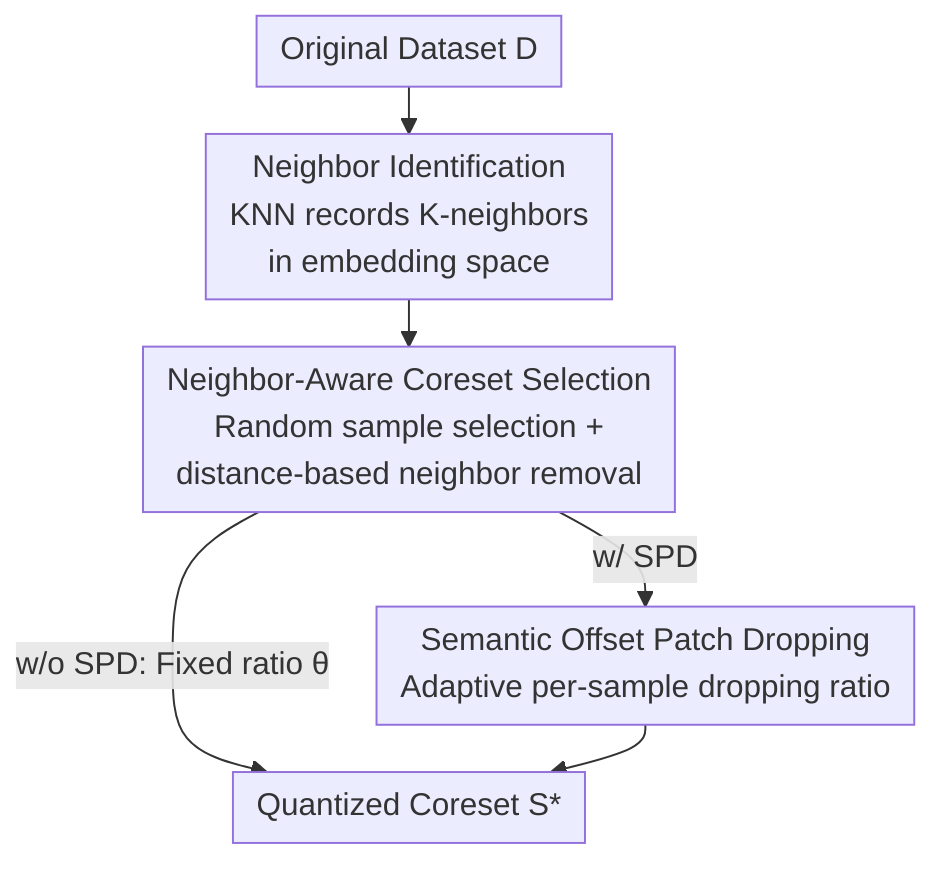

# Is Bin Generation Indispensable? A Bin-Generation-Free Dataset Quantization via Semantic Perspective

**Conference**: CVPR 2026  
**Paper**: [CVF Open Access](https://openaccess.thecvf.com/content/CVPR2026/html/Deng_Is_Bin_Generation_Indispensable_A_Bin-Generation-Free_Dataset_Quantization_via_Semantic_CVPR_2026_paper.html)  
**Code**: https://github.com/MaijieDeng/BGFDQ  
**Area**: Model Compression / Dataset Quantization / Coreset Selection  
**Keywords**: Dataset Quantization, Coreset Selection, KNN, Adaptive Patch Dropping, Scalability

## TL;DR
Addressing the pain points of the "bin generation" step scaling cubically with the number of intra-class samples and fixed patch dropping ratios being unable to adapt to sample redundancy, BGFDQ replaces expensive bin generation with lightweight KNN identification, uses neighbor-aware coreset selection to ensure coverage and remove redundancy, and adaptively selects dropping ratios for each image via semantic offset. This reduces complexity from $O(CM^3)$ to $O(CM^2)$, consistently outperforming SOTA across four classification benchmarks (up to +5% on CIFAR-100) and scaling to 200,000 samples per class where bin generation methods fail due to OOM.

## Background & Motivation
**Background**: Dataset Quantization (DQ) is a compression paradigm between dataset distillation and coreset selection, offering high compression ratios and cross-architecture transferability. The pioneering DQ defined the process in three steps: **bin generation** (recursively partitioning intra-class samples into non-overlapping bins via submodular optimization) $\rightarrow$ **coreset selection** (uniform sampling from each bin) $\rightarrow$ **patch dropping** (calculating patch importance via GradCAM++, dropping low-score patches at a fixed ratio $\theta$, and reconstructing with MAE during training). Subsequent works like DQAS and ADQ added active learning or bin weighting to the selection step.

**Limitations of Prior Work**: (1) **Expensive bin generation**—selecting each sample requires computing its squared Euclidean distance to all other intra-class samples ($O(M^2)$), and full bin generation iterates for $O(CM)$ rounds, leading to a total complexity of $O(CM^3)$. On datasets like Fakeddit, where some classes exceed 200,000 samples, OOM occurs at the very first selection; even with sufficient memory, it takes hours. (2) **Inflexible fixed dropping ratios**—the proportion of "unimportant patches" varies significantly across images (Figure 2 shows some images lose critical content at 25%, while others remain redundant). A uniform $\theta$ is suboptimal for most samples, lowering coreset quality.

**Key Challenge**: Bin generation is essentially a "costly dataset analyzer" used to assist coreset selection, while the assumption of "uniform redundancy" in patch dropping rarely holds for real data. Both are "expensive or rigid global operations used to handle problems that should be sample-adaptive."

**Goal**: (1) Find a lightweight, scalable mechanism to replace bin generation without losing semantic analysis capabilities; (2) Enable the patch dropping ratio to adapt to the redundancy of each image.

**Key Insight**: Ours finds that bin generation merely "captures semantic relationships between intra-class samples." Standard KNN in the embedding space is sufficient to record neighborhood relationships without actually partitioning bins.

**Core Idea**: Reconstruct the entire pipeline from a **semantic perspective**—substituting bin generation with KNN identification, using neighbor-aware coreset selection to remove local redundancy, and determining per-sample dropping ratios via semantic offset.

## Method

### Overall Architecture
BGFDQ (Bin-Generation-Free Dataset Quantization) replaces the traditional DQ steps of "bin generation $\rightarrow$ selection $\rightarrow$ fixed patch dropping" with "neighbor identification $\rightarrow$ neighbor-aware coreset selection $\rightarrow$ semantic offset patch dropping." The input is the original dataset $\mathcal{D}$, and the output is the quantized coreset $\mathcal{S}^*$. The first step uses KNN in the embedding space to record neighbors for each sample; the second step uses neighbor information to probabilistically delete redundant neighbors while preserving coverage; the third step adaptively chooses dropping ratios for each selected sample. Two versions exist: **BGFDQ (w/o SPD)** uses fixed patch dropping in the final step, while **BGFDQ (w/ SPD)** uses semantic offset adaptive dropping (full version).

### Key Designs

**1. Neighbor Identification: Replacing Cubic-Complexity Bin Generation with KNN**

Bin generation is expensive because it couples "analyzing dataset semantic structure" with "iterative construction of mutually exclusive bins," resulting in $O(CM^3)$ complexity. Ours observes that bin generation functions only as a "dataset analyzer." Thus, pure KNN is used for sample-level semantic analysis: each sample is embedded as $z_i = f(x_i)$ using a pretrained feature extractor $f(\cdot)$, squared Euclidean distances $d_{ij} = \|z_i - z_j\|_2^2$ are computed for intra-class samples, and the $K$ nearest are recorded as the neighbor set $\mathcal{N}_i = \text{TopK}_{j\neq i}(-d_{ij})$. $K=20$ is used as it is not a sensitive hyperparameter. This step records local semantic structure and reduces analysis cost from $O(CM^3)$, forming the foundation for scaling to 200,000 samples per class.

**2. Neighbor-Aware Coreset Selection: Higher Coverage and Lower Redundancy**

Identifying neighbors is insufficient; the key is how to use them for selection. The intuition is that semantically close samples are often redundant and should not be repeatedly selected. Starting from an empty coreset $\mathcal{S}=\{\}$, the full set $\mathcal{D}$, and a target ratio $\rho$, a sample $x_i$ is randomly selected from $\mathcal{D}$ and added to $\mathcal{S}$ each round. Its distance-ordered neighbors $x_i^k$ are then removed from $\mathcal{D}$ with probability $p_k = e^{-\rho\alpha k}$ ($\alpha>0$). Closer neighbors are more likely to be removed, and smaller $\rho$ values trigger more aggressive removal, forcing subsequent selections toward semantically distinct samples. Ours provides a theoretical comparison based on **coverage** $R(\mathcal{S})=\sup_{x\in\mathcal{D}}\min_{s\in\mathcal{S}} d(x,s)$ (lower is better) and **redundancy** $\Gamma(\mathcal{S})=\min_{s\neq s'} d(s,s')$ (higher is better), proving that the neighbor-based scheme (NI+NCS) achieves higher expected coverage and lower redundancy: $\mathbb{E}[R_{\text{NI+NCS}}] < \mathbb{E}[R_{\text{BG+RS}}]$ and $\mathbb{E}[\Gamma_{\text{NI+NCS}}] > \mathbb{E}[\Gamma_{\text{BG+RS}}]$.

**3. Semantic Offset Patch Dropping (SPD): Adaptive Ratios via Semantic Tolerance**

Fixed ratios $\theta$ are suboptimal for most samples. SPD automatically determines the optimal dropping ratio per sample based on "how much semantic offset occurs after dropping patches." First, a **semantic offset threshold** $\lambda_C$ is defined for each class as the mean of the 50 smallest non-zero intra-class distances, $\lambda_C = \text{mean}(\min\{d_{ij}\mid i,j\in C, i\neq j\})$, representing the "neighborhood boundary" in semantic space. This directly reuses distances computed during the neighbor identification stage. For each sample $x$ in the coreset, dropping variants $x_{\theta_i}$ are generated using candidate ratios $\theta_i\in\{10\%,...,90\%\}$. The variant with the highest ratio that does not exceed $\lambda_C$ is selected: $x_{\theta^*} = \arg\max_{\theta_i}\{d_{xx'}\mid d_{xx'} < \lambda_C\}$. This maximizes pruning while preserving semantic integrity.

### Loss & Training
This method is a coreset construction pipeline rather than an end-to-end training objective, so there is no independent loss function. ResNet-18 is used as the feature extractor; $K=20$; $\alpha$ and $\rho$ control selection aggressiveness; SPD candidate ratios are $\{10\%,...,90\%\}$. The overall complexity is $O(CM^2)$ (both for w/ and w/o SPD), providing a significant advantage over $O(CM^3)$ bin generation. Training follows traditional DQ practices using pretrained MAE to reconstruct dropped patches.

## Key Experimental Results

### Main Results
Using ResNet-18 as both the feature extractor and target network, validation accuracy (%) at different coreset ratios $\rho$ across CIFAR-10/100, ImageNet-1K, and Fakeddit:

| Dataset / ρ | Random | DQ | DQAS | ADQ | BGFDQ (w/o SPD) | BGFDQ (w/ SPD) |
|---|---|---|---|---|---|---|
| CIFAR-10 / 20% | 87.1 | 87.6 | 90.2 | 89.3 | 90.5 | **91.6** |
| CIFAR-100 / 20% | 60.5 | 60.4 | 61.0 | 59.1 | 62.8 | **66.0** |
| CIFAR-100 / 10% | 52.6 | 52.9 | 52.6 | 52.7 | 53.6 | **55.2** |
| ImageNet-1K / 20% | 48.7 | 49.1 | – | 49.2 | 49.4 | **49.5** |
| Fakeddit / 1% | 83.3 | OOM | OOM | OOM | 83.4 | **83.8** |

BGFDQ (w/o SPD) exceeds baselines by approximately 1.0%, and adding SPD yields an additional 1.3% Gain; improvements reach +5% on CIFAR-100. All bin generation methods OOM on Fakeddit, while Ours runs normally—validating scalability.

### Ablation Study
Comparison of coreset selection strategies (CIFAR-10, training ResNet-18, Acc %):

| Selection Strategy | 5K | 10K | 15K |
|---|---|---|---|
| RS (Pure Random) | 75.7 | 87.1 | 90.2 |
| BG+RS (Bin Gen + Intra-bin Random) | 75.9 | 87.0 | 90.1 |
| NI+NCS (Ours) | **76.4** | **87.6** | **90.5** |

Runtime Breakdown (CIFAR-10, ρ=20%, seconds):

| Method | Bin Gen | Neighbor ID | Patch Dropping | Total Time | Acc |
|---|---|---|---|---|---|
| DQ | 441 | / | 806 | 1248 | 87.6 |
| ADQ | 441 | / | 806 | 1640 | 89.3 |
| BGFDQ (w/o SPD) | / | 155 | 806 | 1052 | 90.5 |
| BGFDQ (w/ SPD) | / | 155 | 2219 (SPD) | 2465 | 91.6 |

### Key Findings
- **Bin generation provides almost no benefit**: BG+RS only improves over pure random by 0.1% on average, proving it is "expensive yet useless." The neighbor-based scheme provides consistent gains across all scales.
- **NI is faster and better**: Neighbor Identification (155s) is much faster than Bin Generation (441s). BGFDQ (w/o SPD) is faster than DQ while being more accurate (90.5 vs 87.6).
- **SPD achieves higher compression without accuracy loss**: While fixed dropping ratios cause performance degradation when increased, SPD maintains accuracy similar to PD(25%) even when dropping an average of 40% of patches.
- **Cross-architecture generalization**: Coresets selected with ResNet-18 generalize to ResNet-50 and ViT, with BGFDQ consistently outperforming baselines (e.g., 35.7% vs ADQ 30.9% on CIFAR-100/ViT).

## Highlights & Insights
- **"Questioning a default step" is highly valuable**: Instead of improving bin generation, the authors asked "is it indispensable?" and proved via theory and ablation that it can be replaced by cheap KNN—a mindset applicable to many pipeline-based methods.
- **Clever criterion for adaptive dropping**: Using whether the semantic offset exceeds the intra-class boundary $\lambda_C$ to determine per-sample ratios, reusing already computed distances at zero extra cost.
- **Scalability as a major selling point**: Reducing complexity from $O(CM^3)$ to $O(CM^2)$ allows dataset quantization to be applied to datasets like Fakeddit with 200,000 samples per class for the first time.

## Limitations & Future Work
- SPD requires significant additional computation (2219s on CIFAR-10); total FLOPs only favor SPD when intra-class samples reach $\sim10^5$.
- The semantic offset threshold $\lambda_C$ is heuristic (mean of 50 smallest distances), lacking rigorous formal proof.
- The feature extractor is fixed to ResNet-18; the impact of different backbones on neighbor quality requires further investigation.
- Future directions include making the neighbor removal probability $p_k$ and SPD candidate ratios learnable rather than fixed grid/exponential decay.

## Related Work & Insights
- **vs. DQ**: DQ uses submodular optimization for bin generation and fixed patch dropping ($O(CM^3)$); BGFDQ uses KNN and adaptive dropping ($O(CM^2)$), saving time and improving accuracy.
- **vs. DQAS / ADQ**: These follow the bin generation pipeline with active learning adjustments; BGFDQ replaces the root step, enabling execution on datasets where they OOM.
- **vs. Coreset Selection (e.g., GradMatch)**: Traditional selection lacks coverage in extreme compression; BGFDQ's neighbor-aware removal explicitly optimizes coverage and adds patch-level quantization for higher compression.

## Rating
- Novelty: ⭐⭐⭐⭐ Challenging binary generation + KNN replacement + adaptive dropping reconstructs the DQ pipeline with a fresh perspective.
- Experimental Thoroughness: ⭐⭐⭐⭐ Four datasets + cross-architecture + runtime breakdown + ablation + complexity analysis.
- Writing Quality: ⭐⭐⭐⭐ Clear mapping between pain points, method, theory, and experiments.
- Value: ⭐⭐⭐⭐⭐ Reduces complexity by an order of magnitude, enabling large-scale application of dataset quantization.

<!-- RELATED:START -->

## Related Papers

- [\[CVPR 2026\] SG-LoRA: Semantic-guided LoRA Parameters Generation](sg-lora_semantic-guided_lora_parameters_generation.md)
- [\[CVPR 2026\] DMGD: Train-Free Dataset Distillation with Semantic-Distribution Matching in Diffusion Models](dmgd_train-free_dataset_distillation_with_semantic-distribution_matching_in_diff.md)
- [\[CVPR 2026\] Adaptive Video Distillation: Mitigating Oversaturation and Temporal Collapse in Few-Step Generation](adaptive_video_distillation_mitigating_oversaturation_and_temporal_collapse_in_f.md)
- [\[ICLR 2026\] PTQ4ARVG: Post-Training Quantization for AutoRegressive Visual Generation Models](../../ICLR2026/model_compression/ptq4arvg_post-training_quantization_for_autoregressive_visual_generation_models.md)
- [\[ACL 2025\] Predicting Through Generation: Why Generation Is Better for Prediction](../../ACL2025/model_compression/predicting_through_generation_why_generation_is_better_for_prediction.md)

<!-- RELATED:END -->
