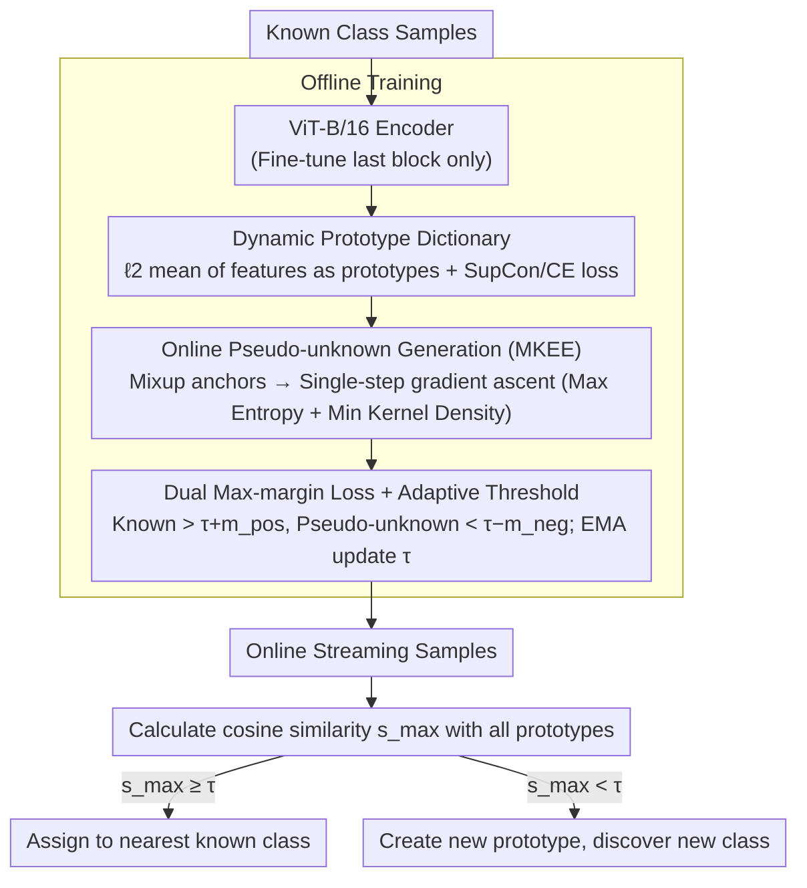

# Learning through Creation: A Hash-Free Framework for On-the-Fly Category Discovery

**Conference**: CVPR 2026 Findings  
**arXiv**: [2603.13858](https://arxiv.org/abs/2603.13858)  
**Code**: [brandinzhang/LTC](https://github.com/brandinzhang/LTC)  
**Area**: Model Compression  
**Keywords**: On-the-Fly Category Discovery, pseudo-unknown class generation, hash-free framework, dynamic prototype dictionary, max-margin loss

## TL;DR
The LTC framework is proposed to generate pseudo-unknown class samples online using MKEE (Minimized Kernel Energy + Maximized Entropy) during the training phase. Combined with dual max-margin loss and adaptive thresholds, it achieves a 1.5%–13.1% all-class accuracy improvement across seven datasets, completely eliminating the damage to fine-grained semantics caused by hash encoding.

## Background & Motivation
1. **Limitations of Closed-World Assumption**: Traditional deep learning models assume fixed categories and cannot identify unseen classes, making them unsuitable for dynamic real-world environments.
2. **Limitations of NCD/GCD**: Novel Category Discovery and Generalized Category Discovery require simultaneous access to known and unknown data during training and only support offline inference, failing to handle online streaming scenarios.
3. **OCD Setting is More Practical**: On-the-Fly Category Discovery (OCD) trains on known classes only during the offline phase and processes streaming data sample-by-sample in the online phase, supporting real-time discovery of new categories.
4. **Information Loss in Hash Encoding**: Existing OCD methods (SMILE, PHE) rely on hash encoding to discretize features into binary codes, leading to significant loss of fine-grained semantic information.
5. **Optimization Goal Misalignment**: Existing methods only perform representation learning during training and never expose the model to the "discovery" task, yet expect the model to suddenly possess discovery capabilities during inference—a fundamental optimization misalignment.
6. **Limitations of DiffGRE**: Although it attempts to move away from hashing, it compresses features into a 12-dimensional space and relies on offline diffusion models for data pre-generation (taking ~284 seconds for 128 images), which is essentially data augmentation rather than a discovery mechanism.

## Method

### Overall Architecture

LTC aims to solve the fundamental optimization misalignment in OCD: existing methods only learn representations during training without ever "discovering" anything, yet expect discovery capabilities during inference. The proposed approach "creates" a batch of pseudo-unknown samples online during training using MKEE, allowing the model to practice on the boundaries between known and unknown classes. Furthermore, it replaces hash codes with a dynamic prototype dictionary in a continuous feature space to avoid losing fine-grained semantics. The pipeline consists of: ViT feature extraction → Prototype dictionary maintenance → MKEE pseudo-unknown sample generation → Dual max-margin loss to separate known/unknown → Adaptive threshold for online class creation.

### Key Designs

**1. Dynamic Prototype Dictionary: Replacing Hash Codes in Continuous Feature Space**

Methods like SMILE and PHE compress features into binary hash codes as class prototypes; this quantization destroys fine-grained semantics, hindering accuracy on fine-grained datasets. LTC avoids hashing by using ViT-B/16 (CLIP or DINO pre-trained, fine-tuning only the last Transformer block) to extract continuous features. Each known class prototype $P_k$ is the $\ell_2$-normalized mean of the features for that class. During training, a joint supervised contrastive loss $\mathcal{L}_{\text{sup}}$ maintains intra-class structures, while a cross-entropy loss $\mathcal{L}_{\text{ce}}$ ensures inter-class separability. During online inference, test samples are matched via cosine similarity; if the maximum similarity is below threshold $\tau$, a new prototype is created. The continuous space preserves the semantic priors of CLIP, which hash codes cannot do.

**2. MKEE Online Pseudo-unknown Class Generation: Training the Model to See the "Unknown"**

MKEE creates pseudo-unknown samples locally in each batch to simulate the "discovery" task. First, anchors on the manifold are obtained via Mixup between different class samples: $x_{\text{mix}} = \lambda x_i + (1-\lambda) x_j$. Then, a single-step gradient ascent is performed along the joint objective $\mathcal{J}(x) = -\sum_c p_c \log p_c - \lambda_\rho \cdot \rho(x)$, resulting in $x_{\text{pus}} = x_{\text{mix}} + \varepsilon \cdot \nabla_x \mathcal{J}(x) / \|\nabla_x \mathcal{J}(x)\|_2$. The first term maximizes predictive entropy to push samples toward uncertainty zones, while the second term uses kernel density estimation $\rho(x)$ to push samples away from known class regions. Density is approximated using the current batch features with an adaptive bandwidth $\sigma$ based on median distance to avoid $\mathcal{O}(N^2)$ costs. Triggered with probability $p_{\text{gen}}=0.3$, it generates 30-40 samples per iteration with an overhead of <1s. Compared to DiffGRE's offline diffusion (~284s for 128 images), MKEE is a lightweight "discovery drill" within the training loop, over 280 times faster.

**3. Dual Max-Margin Loss + Adaptive Threshold: Separating Known and Unknown**

With pseudo-unknown samples, a loss is required to explicitly optimize for "high scores for known, low scores for unknown." The positive margin $\mathcal{L}_{\text{pos}}$ drives the maximum similarity $s_{\max}(x)$ of known samples above $\tau + m_{\text{pos}}$, while the negative margin $\mathcal{L}_{\text{neg}}$ pushes pseudo-unknown samples below $\tau - m_{\text{neg}}$. These are combined into $\mathcal{L}_{\text{mm}}$. The threshold $\tau$ is not static; it is set as the midpoint between the upper quantile $u_{\text{pos}}$ of known class scores and the lower quantile $u_{\text{neg}}$ of pseudo-unknown scores, updated via EMA ($\beta=0.001$). This makes it robust to initial values. The total loss is $\mathcal{L}_{\text{total}} = \mathcal{L}_{\text{ce}} + \alpha \mathcal{L}_{\text{sup}} + \gamma_{mm} \mathcal{L}_{\text{mm}}$ (with $\alpha=0.3, \gamma_{mm}=0.05$).

## Key Experimental Results

### Main Results (Greedy-Hungarian, All-class ACC)

| Dataset | PHE-CLIP | LTC-CLIP | Gain |
|--------|----------|----------|------|
| CIFAR-10 | 79.3% | **88.6%** | +9.3% |
| CIFAR-100 | 66.1% | **70.7%** | +4.6% |
| ImageNet-100 | 52.9% | **55.6%** | +2.7% |
| CUB-200 | 44.2% | **57.8%** | +13.6% |
| Stanford Cars | 46.4% | **56.6%** | +10.2% |
| Oxford Pets | 64.1% | **73.0%** | +8.9% |
| Food-101 | 47.8% | **54.7%** | +6.9% |

- Average improvement of 7.84% on fine-grained datasets.
- Significant reduction in category estimation error: On CUB, LTC estimates 210 classes (true is 200), whereas PHE-32bit estimates 474.

### Ablation Study (Oxford Pets, Greedy-Hungarian)

| Variant | All | Old | New |
|------|-----|-----|-----|
| w/o $\mathcal{L}_{\text{ce}}$ | 71.2 | 94.0 | 59.2 |
| w/o $\mathcal{L}_{\text{sup}}$ | 67.6 | 89.5 | 56.2 |
| w/o $\mathcal{L}_{\text{mm}}$ | 68.5 | 94.4 | 54.9 |
| w/o MKEE | 68.8 | 95.4 | 54.8 |
| **LTC (full)** | **73.0** | 92.6 | **62.7** |

- Removing MKEE drops New-class accuracy from 62.7% to 54.8%, proving pseudo-unknown generation is vital for discovery.
- MKEE improves New-class ACC by 4.2% and 5.7% compared to Mixup and DiffGRE, respectively, while being >280x faster.

## Highlights & Insights
- **Training-Inference Alignment**: For the first time in OCD, the optimization misalignment is explicitly identified and addressed by "creating" pseudo-unknown classes to directly optimize discovery capability during training.
- **Lightweight Online Generation**: MKEE requires only single-step gradient ascent and no external generative models, taking <1s per batch, far superior to diffusion models' 284s/128 samples.
- **Hash-Free Design**: Complete removal of binary encoding preserves fine-grained semantic information in continuous space and better leverages CLIP's semantic priors.
- **Adaptive Threshold**: The EMA-based quantile adaptation mechanism is insensitive to initial values, enhancing robustness in real-world deployment.

## Limitations & Future Work
1. On datasets with low category diversity like CIFAR-10, the known class accuracy under the Strict-Hungarian protocol is only around 19%, indicating a problem where new categories "absorb" known ones.
2. Only validated in image classification; not yet extended to downstream tasks like detection or segmentation.
3. Pseudo-unknown generation depends on Mixup + single-step perturbation; the diversity of generated samples may be limited.
4. Long-term temporal stability of continuous category appearance in open-set/open-world scenarios is not discussed.
5. The EMA coefficient $\beta$ and quantile hyperparameters for the adaptive threshold still require manual tuning.

## Related Work & Insights

| Method | Encoding | Unknown Gen during Training | Generation Overhead | Core Strategy |
|------|---------|-------------------|---------|---------|
| SMILE | Hash code | No | — | Hash code symbolic matching |
| PHE | Multi-hash prototype | No | — | Prototype supervision + Hashing |
| DiffGRE | 12D Projection | Yes (Offline Diffusion) | ~284s/128 samples | Diffusion gen + Hungarian matching |
| **Ours (LTC)** | **Continuous Feature** | **Yes (Online MKEE)** | **<1s/batch** | **Pseudo-unknown creation + Dual margin loss** |

## Rating
- Novelty: ⭐⭐⭐⭐ — The idea of "creating the unknown during training" is clear; MKEE is elegantly designed and lightweight.
- Experimental Thoroughness: ⭐⭐⭐⭐ — 7 datasets, multiple protocols, various backbones, and comprehensive ablation/baseline comparisons.
- Writing Quality: ⭐⭐⭐⭐ — Motivated well with a clear explanation of the framework.
- Value: ⭐⭐⭐⭐ — A substantial advancement in the OCD direction; the hash-free + online generation paradigm is worth following.

<!-- RELATED:START -->

## Related Papers

- [\[CVPR 2026\] TALON: Test-time Adaptive Learning for On-the-Fly Category Discovery](talon_test-time_adaptive_learning_for_on-the-fly_category_discovery.md)
- [\[ECCV 2024\] Category Adaptation Meets Projected Distillation in Generalized Continual Category Discovery](../../ECCV2024/model_compression/category_adaptation_meets_projected_distillation_in_generalized_continual_catego.md)
- [\[CVPR 2026\] Bridging Domains through Subspace-Aware Model Merging](bridging_domains_through_subspace-aware_model_merging.md)
- [\[CVPR 2026\] UniComp: Rethinking Video Compression Through Informational Uniqueness](unicomp_rethinking_video_compression_through_informational_uniqueness.md)
- [\[CVPR 2026\] OneSparse: A Unified Framework for Sparse Activation Layers in Vision Models](onesparse_a_unified_framework_for_sparse_activation_layers_in_vision_models.md)

<!-- RELATED:END -->
