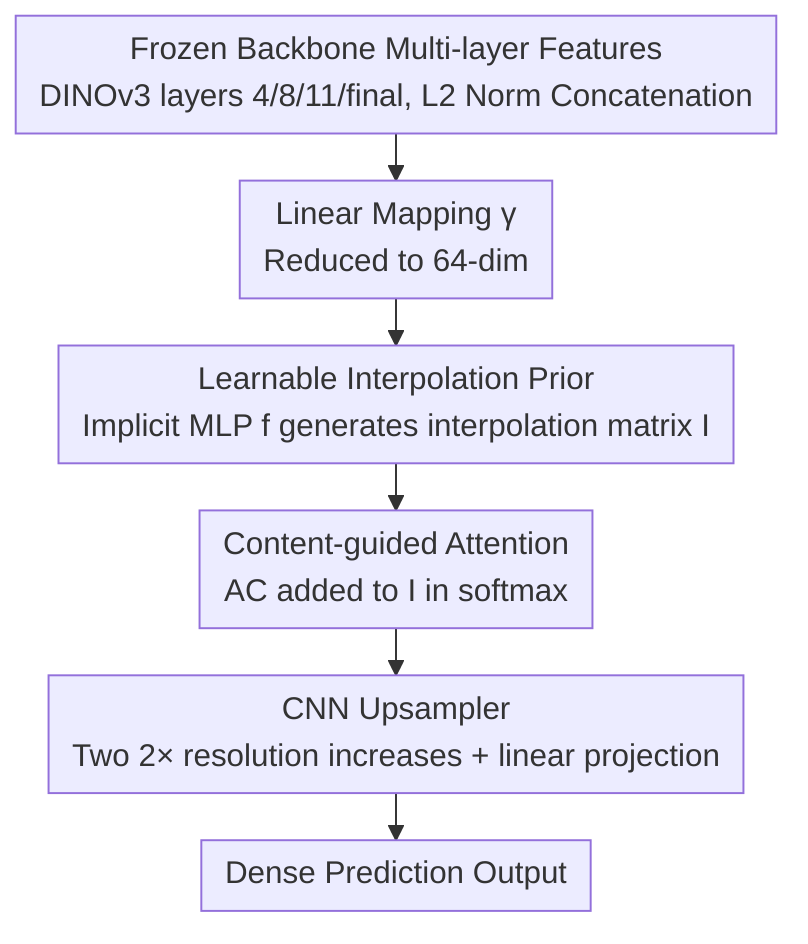

# LiDeRe: A Lightweight Readout for Fast and Data-Efficient Dense Prediction

**Conference**: CVPR 2026  
**Paper**: [CVF Open Access](https://openaccess.thecvf.com/content/CVPR2026/html/Luddecke_LiDeRe_A_Lightweight_Readout_for_Fast_and_Data-Efficient_Dense_Prediction_CVPR_2026_paper.html)  
**Code**: https://eckerlab.org/code/lidere  
**Area**: Model Compression / Parameter-Efficient Transfer / Dense Prediction  
**Keywords**: Lightweight readout, Parameter-efficient fine-tuning, Frozen backbone, Learnable interpolation, Dense prediction

## TL;DR
LiDeRe argues that for dense prediction tasks with limited data, rather than using Parameter-Efficient Fine-Tuning (PEFT) such as LoRA—which requires backpropagation through the entire backbone—it is superior to attach a carefully designed lightweight readout on top of a **frozen backbone**. By integrating a "learnable interpolation prior" and "content-guided attention" into a feature interpolation module, this approach often achieves parity with or surpasses PEFT methods in semantic segmentation, pose estimation, object detection, and boundary detection using fewer than 400,000 trainable parameters, while offering faster training and lower memory consumption.

## Background & Motivation
**Background**: Large-scale self-supervised pre-training (e.g., DINOv2/DINOv3, SAM) has established a new vision paradigm of using "frozen backbone strong features + lightweight adaptation." In data-scarce dense prediction scenarios (segmentation, detection, keypoints), directly reusing these pre-trained features is particularly attractive, leaving the primary challenge as "how to adapt backbone features to new tasks."

**Limitations of Prior Work**: The authors characterize current practices as a dilemma (Figure 1 in the paper):
- **PEFT (e.g., LoRA)**, while training few parameters, still requires backpropagation through most backbone layers, incurring high training memory and compute costs. Furthermore, it is often restricted to backbones specifically designed for dense prediction (like SAM) or requires heavy task heads (UPerNet, SETR, etc.) that do not benefit from backbone pre-training.
- **Linear readout (linear probing)** is fast to train but is limited by the low spatial resolution of the backbone, producing only coarse low-resolution predictions that fail to capture fine structures.
- SAM-based models provide dense outputs but possess limited semantic predictive power in their features.

**Key Challenge**: An ideal adapter should be "compatible with any strong backbone, capable of predicting fine structures, and efficient in training and memory," yet existing methods consistently compromise across "resolution / parameter count / training overhead / backbone universality."

**Goal**: Design a lightweight readout attached to a frozen backbone that retains the training speed and low memory of linear readouts while producing high-resolution, fine-grained dense predictions.

**Key Insight**: Upsampling does not need to be hardcoded as bilinear interpolation; the network can **learn** an interpolation prior (purely geometric and content-agnostic) and then layer a **content-dependent** attention mechanism to refine it. Since the backbone is frozen, backpropagation through it is unnecessary, naturally making training fast and efficient.

**Core Idea**: Utilize a feature interpolation module composed of a "learnable interpolation prior + content-guided attention" to high-quality upsample multi-layer low-resolution features from a frozen backbone for dense prediction, serving as an alternative to PEFT.

## Method

### Overall Architecture
LiDeRe is connected to a frozen backbone (defaulting to DINOv3 ViT-B, extracting features from layers 4/8/11/final, concatenated after L2 normalization). The entire readout consists of three stages: first, a **linear mapping** reduces the high-dimensional concatenated features to a low dimension (default 64) for parameter efficiency; next, a **feature interpolation module** combines a content-agnostic learnable interpolation prior and content-guided attention into a single softmax to upsample the feature volume to the target resolution; finally, a small **CNN upsampler** further increases resolution and maps to task-specific outputs (category counts / keypoints / detection maps). Because the backbone is frozen and does not require backpropagation, the entire pipeline is fast and memory-efficient.

### Key Designs

**1. Learnable Feature Interpolation Prior: Turning "How to Upsample" into a Learnable Geometric Prior**

Linear interpolation can be expressed as $X'=IX$, where $I$ is an $(H'W'\times HW)$ interpolation matrix; conventional methods use fixed kernels like bilinear. LiDeRe avoids hardcoding this, instead using an implicit neural network $f$ to generate the interpolation matrix: $I_{ij}=f(p^F_i,p^T_j)$, where $f$ is an MLP. The inputs are the axis-wise differences and squared differences (4-dimensional vector) between the backbone feature position $p^F\in\mathbb{R}^2$ and the target position $p^T\in\mathbb{R}^2$. Intuitively, $f$ observes only coordinates and not content, thus learning a **content-agnostic universal geometric upsampling prior**—how much information a feature location should contribute to a target pixel. It uses sine activations and is initialized with scaled weights to focus on relative distances; furthermore, $I$ is computed only during training and can be cached during inference to save time.

**2. Content-guided Attention: Adaptive Upsampling Based on Sample Content**

Geometric labels alone are insufficient, as different samples require different upsampling focus. LiDeRe treats the interpolation matrix as an attention bias (mask), forming masked attention:

$$\text{softmax}\Big(\frac{A_C}{\sqrt{d}}+I\Big)V$$

Where value $V=\psi_V(X)$, and content attention $A_C=\phi(P)\psi_K(X)$. Both $\phi,\psi_K$ are linear projections, and $\phi(P)$ encodes coordinates $H'W'\times HW$, which can be understood as cross-attention with feature volume positions as queries. The resulting $A_C$ has the shape $H'W'\times HW$, allowing it to be added to $I$. Using 8 attention heads allows different subspaces to perform different interpolations; the output then passes through a two-layer feed-forward MLP with a 4× expansion in hidden dimension. A key insight is that due to the softmax, the geometric prior $I$ and the content term $A_C$ are effectively **multiplicative**—the prior dictates "where to interpolate," while content attention adjusts this prior to relevant regions based on sample features. Visualizations show that different heads focus on various feature scales.

**3. Parameter-Efficient Pipeline with Frozen Backbone + Linear Compression + CNN Upsampling**

This serves as the engineering pillar to make the method a viable PEFT alternative. The backbone remains frozen, so **backpropagation through the backbone is not required**, keeping training time and memory usage comparable to linear readouts. The linear mapping $X=\gamma([Z_l\mid l\in L])$ compresses concatenated multi-layer features to 64 dimensions, a critical step for parameter efficiency. The terminal CNN upsampler consists of two "convolution + transposed convolution" blocks, each providing 2× resolution increases, followed by a linear projection to task output values. For tasks where most outputs are zero (like pose or detection), the CNN upsampler is initialized to approximate an empty map. The entire readout typically involves fewer than 400,000 trainable parameters (task-dependent) while leveraging the pre-training benefits of any strong backbone (CNN or ViT).

### Loss & Training
Optimization uses AdamW (weight decay 0.01). Some experiments use a cosine scheduler to decay the learning rate from $10^{-3}$ to 0. Training is performed on a single A100 or V100 GPU with 512px (518px for DINOv2) resolution and Automatic Mixed Precision (AMP). Augmentations are adjusted per task; detection uses the CenterNet framework (predicting center heatmaps, size maps, and category embedding maps), pose uses keypoint heatmaps, and boundaries use tiled inference followed by stitching.

## Key Experimental Results

### Main Results
Covering four categories of dense prediction (semantic segmentation, pose, boundary, detection), evaluated on small datasets. $P$ denotes the number of trainable parameters.

| Task / Dataset | Method | Backbone | $P$ | Key Metric |
|------|------|------|------|------|
| Segmentation / Pascal VOC | LoRA | SAM ViT-B | 4.1M | 79.5 mIoU |
| Segmentation / Pascal VOC | **Ours** | DINOv3 ViT-L | 0.34M | **88.9 mIoU**|
| Segmentation / Pascal VOC | **Ours + LoRA** | DINOv3 ViT-L | 0.73M | **90.5 mIoU**|
| Boundary / BSDS500 | UAED | - | 72M | 82.9 ODS |
| Boundary / BSDS500 | **Ours + LoRA** | DINOv3 ViT-L | 0.73M | **85.3 ODS** |
| Detection / PlantDoc | Cascade-DN-Def-DETR | - | 48M | 49.1 mAP |
| Detection / PlantDoc | **Ours** | DINOv3 ViT-L | 1.01M | **50.9 mAP** |
| Pose / iRodent | SuperAnimal | - | - | 73.0 mAP |
| Pose / iRodent | **Ours + LoRA** | DINOv3 ViT-L | - | **73.8 mAP** |

On Pascal VOC, the method outperforms all SAM-based PEFT with less than 1/10 of the trainable parameters. On BSDS500 and PlantDoc, it even exceeds specialized models with orders of magnitude more parameters and task-specific pre-training. For pose estimation, it matches or exceeds SuperAnimal (pre-trained on relevant pose data) without task-specific pre-training.

### Ablation Study
Removing core components of the feature interpolation module (Table 6) shows degradation across tasks.

| Configuration | Description | Impact |
|------|------|------|
| Full | Full interpolation prior + Content attention + FF | Baseline |
| w/o Prior $I$ | Replaced with fixed bilinear interpolation matrix | Detection drops ~6.0 mAP; localization tasks suffer most |
| w/o Attention $A_C$ | Removed content branch; interpolation is content-agnostic | Minor individual impact, but detection worsens significantly |
| w/o FF MLP | Replaced expansion MLP with linear layer | Slight decrease in most tasks |
| Everything removed / Linear Probing | Degrades to linear readout (with/without transposed conv) | Significant degradation; coarse predictions, details lost |

### Key Findings
- **Learnable interpolation prior contributes most to localization tasks**: Replacing it with fixed bilinear drops object detection by approximately 6.0 mAP, consistent with the principle that feature pyramids/multiscale upsampling are vital for detection.
- **Content-guided attention and feed-forward MLP have smaller impacts individually, but removing all three leads to a sharp drop**, indicating a synergistic relationship between geometric priors, content adaptation, and non-linear transformations.
- **DINOv2/DINOv3 significantly outperform ImageNet/MAE/CLIP/SAM backbones**, confirming that self-supervised dense features are better suited for dense prediction. CNNs like ConvNeXt also perform well in pose/detection.
- **Extremely fast training**: Under 1024px input, training is ~2.5× faster than Conv-LoRA; at 512px, both training and inference are multiple times faster. Competitive results can be achieved on small datasets like iRodent or Leaf within 5 minutes.

## Highlights & Insights
- **"Interpolation as attention bias" is a elegant unification**: Embedding the content-agnostic geometric prior $I$ into the softmax as a mask allows it to be multiplied with content attention $A_C$. The prior determines "where to interpolate" and content determines "to which region," maintaining geometric plausibility while gaining content adaptivity.
- **Implicit coordinate networks for upsampling kernels**: Using an MLP $f$ that only takes coordinate differences to generate cached interpolation matrices effectively creates a "learnable bilinear" mechanism with zero extra inference cost.
- **Frozen Backbone = No Backprop = Fast and Efficient**: The core engineering dividend comes from not backpropagating through the backbone, allowing a readout with <400k parameters to align with linear probing in training cost while achieving PEFT-level accuracy. This efficiency is highly attractive for resource-constrained users.
- **Methodological Implication**: The stronger the self-supervised features, the less the need for complex task heads or heavy fine-tuning; a lightweight readout is sufficient—this is transferable to more dense prediction tasks.

## Limitations & Future Work
- While mAP@50 increased significantly (up to +7.1 over previous best), the overall mAP is relatively weaker, suggesting the model "detects most objects but with imprecise localization." Bounding box regression accuracy has room for improvement.
- The method assumes the backbone is already a strong, multi-task capable model; performance drops significantly with weaker backbones (e.g., ImageNet supervised), showing a heavy dependence on the quality of the base model.
- Validation was primarily focused on **small-data** scenarios; whether a lightweight readout can outperform fully fine-tuned PEFT or task-specific heads on large-scale datasets remains under-explored.
- Certain tasks (pose/detection) still require task-related initialization of the CNN upsampler and specific augmentation tuning, meaning it is not yet fully "plug-and-play."

## Related Work & Insights
- **vs LoRA / Conv-LoRA**: These require backpropagation through the backbone, have higher training overhead, and are often tied to specific backbones (SAM) or heavy task heads. LiDeRe freezes the backbone, avoids backpropagation, and achieves superior results with <10% of the trainable parameters.
- **vs Linear Readout**: Linear readouts are fast but resolution-limited. LiDeRe fills the gap in fine-structure capability using learnable interpolation, content-guided attention, and CNN upsamplers, as evidenced by significantly sharper boundaries in qualitative comparisons.
- **vs SAM-based PEFT**: While SAM has dense outputs, its semantic predictive power is limited. LiDeRe demonstrates that DINOv2/DINOv3 self-supervised features are superior for most dense tasks.
- **vs Task-specific Models (EDTER, UAED, Cascade-DN-Def-DETR, etc.)**: These models often have 10-100× more parameters and rely on task-specific pre-training. LiDeRe matches or beats them with fewer parameters and samples, highlighting the value of the "strong self-supervised feature + light readout" paradigm.

## Rating
- Novelty: ⭐⭐⭐⭐ The combination of "learnable interpolation prior + content attention" and the perspective of replacing PEFT with a frozen backbone readout are quite novel.
- Experimental Thoroughness: ⭐⭐⭐⭐⭐ Comprehensive coverage across four task types, multiple datasets, backbone comparisons, efficiency benchmarks, and ablation studies.
- Writing Quality: ⭐⭐⭐⭐ Clear motivation and illustrations; mathematical expressions for attention and interpolation are concise.
- Value: ⭐⭐⭐⭐ A practical, low-cost solution for small-data dense prediction, highly attractive for resource-limited scenarios.

<!-- RELATED:START -->

## Related Papers

- [\[CVPR 2026\] Ultra-Fast Neural Video Compression](ultra-fast_neural_video_compression.md)
- [\[CVPR 2026\] MEMO: Human-like Crisp Edge Detection Using Masked Edge Prediction](memo_human-like_crisp_edge_detection_using_masked_edge_prediction.md)
- [\[CVPR 2026\] Test-time Sparsity for Extreme Fast Action Diffusion](test-time_sparsity_for_extreme_fast_action_diffusion.md)
- [\[CVPR 2026\] LoPrune: Efficient Data Pruning for LoRA-Based Fine-Tuning of Vision Transformer](loprune_efficient_data_pruning_for_lora-based_fine-tuning_of_vision_transformer.md)
- [\[ECCV 2024\] SpaceJAM: a Lightweight and Regularization-free Method for Fast Joint Alignment of Images](../../ECCV2024/model_compression/spacejam_a_lightweight_and_regularization-free_method_for_fast_joint_alignment_o.md)

<!-- RELATED:END -->
