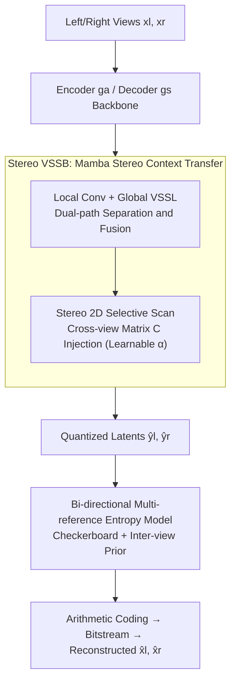

# MambaSIC: Mamba-based Stereo Image Compression with Bi-directional Multi-reference Entropy Model

**Conference**: CVPR 2026  
**Paper**: [CVF Open Access](https://openaccess.thecvf.com/content/CVPR2026/html/Qin_MambaSIC_Mamba-based_Stereo_Image_Compression_with_Bi-directional_Multi-reference_Entropy_Model_CVPR_2026_paper.html)  
**Code**: None (Link not disclosed in the paper)  
**Area**: Model Compression / Image Compression / State Space Models  
**Keywords**: Stereo Image Compression, Mamba, Visual State Space, Checkerboard Entropy Model, Inter-view Redundancy

## TL;DR
MambaSIC replaces expensive cross-attention in stereo image compression with a linear-complexity Stereo Visual State Space Block (Stereo VSSB) for inter-view context transfer. Combined with a checkerboard-partitioned bi-directional multi-reference entropy model instead of spatial autoregression, it refreshes Rate-Distortion performance on InStereo2K / Cityscapes (improving BD-PSNR) while reducing latency to 1.26s (approximately $62\times$ faster than the SOTA BiSIC).

## Background & Motivation
**Background**: Stereo Image Compression (SIC) jointly compresses image pairs of the same scene from left and right views. The key is to exploit strong inter-view redundancy to achieve higher coding efficiency than independent per-view compression. Recent SOTA methods (BiSIC, CAMSIC, LDMIC, etc.) follow the path of "**Cross-attention** for inter-view redundancy elimination + **Spatial-autoregressive entropy models** for precise probability estimation," achieving strong R-D performance.

**Limitations of Prior Work**: This path is extremely slow. The complexity of cross-attention is quadratic relative to image resolution, and spatial-autoregressive entropy models require serial iterative decoding across spatial positions. Together, these result in codec latencies of tens of seconds (BiSIC total latency is 78.6s), making them unsuitable for real-time or large-scale scenarios.

**Key Challenge**: A sharp trade-off between compression performance and encoding speed. Modeling global inter-view long-range dependencies requires attention (slow), and precise entropy estimation requires autoregression (even slower); existing methods sacrifice speed for performance.

**Goal**: Split into two sub-problems: (1) What operator can efficiently capture inter-view long-range dependencies without quadratic complexity? (2) What entropy model can introduce inter-view priors without the serial cost of spatial autoregression?

**Key Insight**: The authors noted that Mamba (Visual State Space Model) has stronger global modeling capabilities than attention in vision tasks while maintaining **linear complexity**, making it a natural replacement candidate. However, vanilla Mamba only scans single images and cannot capture correlations between views, and its local modeling is weak—precluding direct application.

**Core Idea**: Transform Mamba's state space scanning into a "stereo" version by injecting control information from the other view into the selective scan output matrix $C$, allowing left and right views to exchange context within the SSM. The same stereo block is used to generate inter-view priors for the entropy model, which is parallelized via checkerboard partitioning.

## Method

### Overall Architecture
MambaSIC remains an end-to-end learned compressor: the encoder $g_a$ transforms stereo image pairs $x_l, x_r \in \mathbb{R}^{3\times H\times W}$ into latent variables $y_l, y_r \in \mathbb{R}^{M\times \frac{H}{16}\times \frac{W}{16}}$, which are quantized to $\hat{y}_l, \hat{y}_r$. After distribution estimation by the entropy model, they are arithmetically coded into bitstreams. The decoder $g_s$ reconstructs $\hat{x}_l, \hat{x}_r$. During training, quantization is handled via mixed quantization (adding uniform noise for rate estimation, round + straight-through estimator for reconstruction).

The real innovations lie in two replacements: ① In the encoder/decoder backbones, **Stereo VSSB** is inserted after the first three downsampling/upsampling blocks as a nonlinear transform, replacing traditional 2D/3D convolutions or cross-attention. ② The entropy model uses a **Bi-directional Multi-reference Entropy Model**, which reuses Stereo VSSB internally to fuse left and right priors. Stereo VSSB itself consists of a "Local Convolution + Global Stereo VSSL" nested structure, where the core of VSSL is "Stereo 2D Selective Scanning." The entire pipeline is bi-directionally symmetric to avoid quality imbalance between views.

### Key Designs

**1. Stereo VSSB: Dual-path inter-view context transfer with local convolution and global state space**

To address the bottleneck where "attention's quadratic complexity is too slow, and vanilla Mamba lacks cross-view and local modeling," the authors designed the Stereo Visual State Space Block (Stereo VSSB). Input stereo features $f_l, f_r \in \mathbb{R}^{N\times H_f\times W_f}$ first pass through $1\times1$ convolutions and are split channel-wise into local components $f^{Local}$ and global components $f^{Global}$. The local component uses a CNN (CLR network with convolution + LeakyReLU) for neighboring texture transfer, concatenating the opposite view's local features: $\hat{f}^{Local}_l = \mathrm{CLR}(\mathrm{Cat}(f^{Local}_l, f^{Local}_r)) + f^{Local}_l$. The global component enters Stereo VSSL. Finally, the local and global paths are concatenated and fused via $1\times1$ convolution with a residual connection. This design uses convolutions to supplement Mamba's local modeling and SSM to supplement the long-range dependency missing in CNNs, while maintaining linear complexity.

**2. Stereo 2D Selective Scan: Injecting cross-view control into matrix C**

This is the core mechanism for upgrading single-view Mamba to "stereo." In the selective state space, the input-dependent parameter matrix $C$ maps the hidden state $h_t$ to the output, dynamically magnifying or suppressing features. Following VMamba's four-direction scanning, global features are flattened into 1D sequences. After the standard SSM recurrence $h^l_t = A'_l h^l_{t-1} + B'_l w^l_t$, the **control matrix from the opposite view** is weighted during output:

$$v^l_t = (C_l + \alpha C_r)\,h^l_t + D_l w^l_t,\qquad v^r_t = (C_r + \alpha C_l)\,h^r_t + D_r w^r_t,$$

where $\alpha$ is a learnable scalar initialized to 0. Placing cross-view interaction on $C$ (rather than $B$, $\Delta$, or output $v$) was validated through ablation—as $C$ is closest to the output in the state equations, it has the most direct impact. This explicitly introduces inter-view information with negligible cost. Additionally, a stereo gating mechanism in VSSL multiplies the 2DSS output with a gating branch (SiLU activation acting as a spatial importance map).

**3. Bi-directional Multi-reference Entropy Model: Checkerboard Parallelism + Stereo VSSB Priors**

To escape the position-wise serial nature of spatial autoregression, the authors adopt a checkerboard pattern, partitioning latent variables into anchors and non-anchors. Anchors are coded first, then non-anchors are coded conditioned on anchors, compressing spatial autoregression into two steps. To include inter-view dependencies, the model first generates **intra-view priors** (hyper-prior $\Phi^h$, channel autoregressive prior $\Phi^{ch}$, and spatial contexts $\Phi^{lc},\Phi^{tra},\Phi^{ter}$). These are concatenated and fed into a **Stereo VSSB** $V$ to generate **inter-view priors** $\Phi^{iac}, \Phi^{ina}$: $\Phi^{iac}_{l,i}, \Phi^{iac}_{r,i} = V^{ac}_i(\Phi^{ac}_{l,i}, \Phi^{ac}_{r,i})$. These priors jointly estimate the Gaussian distribution parameters $(\mu, \sigma)$.

### Loss & Training
Standard Rate-Distortion (RD) optimization: $L = \frac{1}{2}\sum_{l,r}\big(\lambda\cdot D(x_i, \hat{x}_i) + R(\hat{y}_i) + R(\hat{z}_i)\big)$. $\lambda$ controls the trade-off, $D$ uses MSE or MS-SSIM, and $R$ is the bpp estimation. Channels are set to $N=128, M=320$, with Stereo VSSB counts of $(1,1,1)$. Training uses Adam for 2M steps with learning rate decay from 1e-4 to 1e-6.

## Key Experimental Results

### Main Results
On InStereo2K and Cityscapes datasets, compared against standard codecs (BPG, MV-HEVC, VVC) and learned methods (HESIC+, SASIC, BCSIC, LDMIC, ECSIC, DispSIC, BiSIC, CAMSIC). The table below shows BD-PSNR (higher is better) and BDBR (bitrate saving relative to BPG, more negative is better):

| Method | InStereo2K BD-PSNR↑ | InStereo2K BDBR↓ | Cityscapes BD-PSNR↑ | Cityscapes BDBR↓ |
|------|------|------|------|------|
| BiSIC | 1.63dB | -48.07% | 3.34dB | -57.49% |
| CAMSIC | 1.46dB | -45.92% | 2.28dB | -47.89% |
| ECSIC | 1.38dB | -43.71% | 2.84dB | -52.06% |
| **MambaSIC** | **1.92dB** | **-57.15%** | **3.75dB** | **-66.43%** |

> Note: MambaSIC outperformed all models across both datasets. Compared to bi-directional codecs like BiSIC, it saves approximately 9.08%~15.93% more bitrate.

Codec Latency (InStereo2K, single RTX 3090):

| Method | Encoding (s)↓ | Decoding (s)↓ | Total (s)↓ |
|------|------|------|------|
| BiSIC | 32.82 | 45.79 | 78.61 |
| LDMIC | 11.38 | 27.85 | 39.23 |
| ECSIC | 5.71 | 5.31 | 11.02 |
| CAMSIC | 0.94 | 0.81 | 1.75 |
| **MambaSIC** | **0.61** | **0.66** | **1.26** |

MambaSIC is the fastest, approximately $62\times$ faster than BiSIC, primarily due to checkerboard context replacing spatial autoregression.

### Ablation Study
Component ablation (Ours as anchor, values represent BDBR increase/worsening):

| Configuration | BDBR Change | Description |
|------|---------|------|
| Ours (Full) | 0% / 0% | — |
| w/o Cross-view Matrix αC | +3.86% / +3.19% | Remove αC injection in Stereo 2DSS |
| w/o Stereo Gating | +6.98% / +7.64% | Remove stereo gating connections |
| w/ Single-view VSSB | +10.13% / +12.67% | Revert block to single-view Mamba |
| w/o Inter-view Prior | +11.67% / +13.01% | Entropy model reverts to MLIC++ style |
| w/ BiSIC Mutual Attention | +13.59% / +15.74% | Replace Stereo VSSB with Mutual Attention |

### Key Findings
- **Inter-view priors contribute most**: Removing them causes the largest performance drop (BDBR +11.67%/13.01%), indicating fusion of view priors is the primary performance source.
- **Entropy model determines speed**: Replacing the entropy model with BiSIC's (V2) causes latency to skyrocket from 1.26s to 75.19s, proving checkerboard parallelism is the key to speed.
- **Matrix C is position-sensitive**: Cross-view injection is optimal only in $C$; injecting into $B/\Delta/v$ results in significant performance degradation.

## Highlights & Insights
- **Integrating "Stereo" into SSM Internally**: Instead of spatial alignment layers, MambaSIC weights cross-view control logic directly into the selective scan's $C$ matrix.
- **Double Duty**: The same Stereo VSSB is used for both the backbone transformations and the entropy model's prior fusion, resulting in a clean, reusable design.
- **Simultaneous Gain in Speed and Performance**: By using linear operators + parallel entropy models, MambaSIC achieves improvements in both dimensions, a strategy applicable to video or multi-view compression.

## Limitations & Future Work
- The code link is not yet public, raising the threshold for reproduction.
- Validation is limited to InStereo2K and Cityscapes (dual-view); scalability to $N > 2$ views is not explicitly demonstrated.
- Learnable $\alpha$ starts at 0; robustness to extreme disparity or low-overlap scenarios requires further analysis.
- 1.26s latency still includes arithmetic coding overhead—further optimization is needed for strict real-time video frame rates.

## Related Work & Insights
- **vs. BiSIC/CAMSIC**: These rely on cross-attention and spatial autoregression. MambaSIC’s linear Mamba + checkerboard approaches are both more accurate and $62\times$ faster.
- **vs. Single-view Checkerboard Models (MLIC++)**: Single-view models ignore inter-view dependencies. MambaSIC adds Stereo VSSB to provide these priors, reducing BDBR by ~13%.
- **vs. Traditional MVC / MV-HEVC**: Learned global modeling with SSM significantly outperforms manual disparity compensation in complex scenes.

## Rating
- Novelty: ⭐⭐⭐⭐ (Clever modification of SSM for cross-view interaction).
- Experimental Thoroughness: ⭐⭐⭐⭐ (Comprehensive metrics and latencies, though missing multi-view scaling).
- Writing Quality: ⭐⭐⭐⭐ (Clear structure, dense but well-coordinated formulas).
- Value: ⭐⭐⭐⭐ (Significant practical impact for real-time stereo compression).

<!-- RELATED:START -->

## Related Papers

- [\[CVPR 2026\] FreqSIC: Frequency-aware Stereo Image Compression with Bi-directional Checkerboard Context Model](freqsic_frequency-aware_stereo_image_compression_with_bi-directional_checkerboar.md)
- [\[ECCV 2024\] Bidirectional Stereo Image Compression with Cross-Dimensional Entropy Model](../../ECCV2024/model_compression/bidirectional_stereo_image_compression_with_cross-dimensional_entropy_model.md)
- [\[CVPR 2026\] Parallax to Align Them All: An OmniParallax Attention Mechanism for Distributed Multi-View Image Compression](parallax_to_align_them_all_an_omniparallax_attention_mechanism_for_distributed_m.md)
- [\[CVPR 2026\] CADC: Content Adaptive Diffusion-Based Generative Image Compression](cadc_content_adaptive_diffusion-based_generative_image_compression.md)
- [\[CVPR 2026\] Block-based Learned Image Compression without Blocking Artifacts](block-based_learned_image_compression_without_blocking_artifacts.md)

<!-- RELATED:END -->
