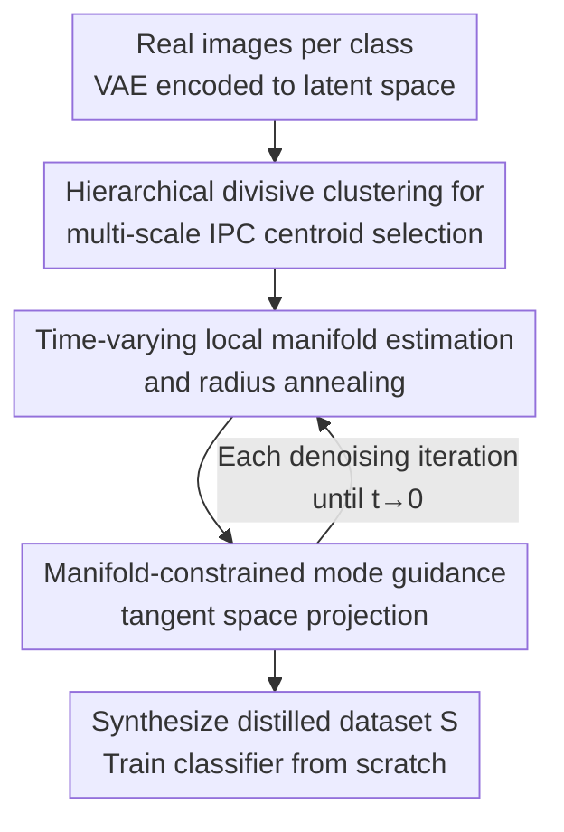

<!-- Automatically generated by tmp/gen_cvf_stubs.py (CVF-only, no arXiv) -->
# ManifoldGD: Training-Free Hierarchical Manifold Guidance for Diffusion-Based Dataset Distillation

**Conference**: CVPR 2026  
**Paper**: [CVF Open Access](https://openaccess.thecvf.com/content/CVPR2026/html/Roy_ManifoldGD_Training-Free_Hierarchical_Manifold_Guidance_for_Diffusion-Based_Dataset_Distillation_CVPR_2026_paper.html)  
**Code**: https://github.com/AyushRoy2001/ManifoldGD  
**Area**: Dataset Distillation / Model Compression  
**Keywords**: Dataset Distillation, Diffusion Models, Manifold Guidance, Tangent Space Projection, Training-Free

## TL;DR
ManifoldGD is a training-free diffusion-based dataset distillation framework. It projects the mode-guided vectors directed toward class centroids onto the local tangent space of the diffusion manifold, removing the normal components that drift samples away from the data manifold. As a result, the synthetic data maintains both semantic consistency and geometric fidelity without fine-tuning any models. Its FID, $\ell_2$/MMD distances, and downstream classification accuracy consistently outperform existing training-free and even some training-based distillation methods.

## Background & Motivation
**Background**: The goal of dataset distillation is to compress a large dataset $D$ into a tiny synthetic set $S$ ($|S|\ll|D|$), so that a classifier trained from scratch on $S$ achieves performance close to that of training on the full $D$. Early efforts involved coreset selection and gradient/trajectory matching, but they rely on expensive bi-level optimization, are architecture-sensitive, and struggle to cover rare modes in the data distribution. Recently, the rise of pre-trained diffusion models introduced a new paradigm: directly synthesizing $S$ using generative priors. Here, training-based diffusion methods (such as Min-Max Diffusion, D4M) yield good results but still require fine-tuning the generator or performing min-max/gradient matching optimization on the synthetic images, which is expensive.

**Limitations of Prior Work**: In the truly "training-free" line of work (which only uses off-the-shelf pre-trained diffusion models for inference), guiding strategies are weak. They either rely on unguided denoising (leading to semantic dispersion and redundancy) or "mode guidance" like MGD (Mode-Guided Diffusion)—Euclidean space attraction toward the Instance-per-Class (IPC) centroid of each class. The issue is that this attraction assumes "the direction toward the centroid is meaningful in the ambient Euclidean space," but the real generative manifold is a curved low-dimensional submanifold embedded in a high-dimensional space. Pure Euclidean attraction easily drags samples off-manifold (off-manifold drift), leading to degraded generation quality (e.g., distorted dog legs, abnormal building structures).

**Key Challenge**: The mode guidance $g^t_{mode}$ provides semantic attraction (pulling samples toward class modes), but its direction in the ambient space often contains a **normal component** perpendicular to the data manifold. As denoising progresses ($t\to0$), the marginal distribution $p_t(x_t)$ becomes increasingly sharp and concentrated near the manifold, meaning even a tiny normal drift sharply reduces the sample likelihood under $p_{data}$. In other words, "semantic alignment" and "manifold fidelity" are entangled in a single vector in existing methods, preventing independent control.

**Goal**: Under a completely training-free setting using only a pre-trained diffusion model and its native VAE latent space: (1) select IPC centroids that can cover multi-scale modes from coarse to fine; (2) constrain the guidance to the data manifold at each denoising step, removing the off-manifold components.

**Key Insight**: Explicitly decompose the score of conditional diffusion into two terms: "marginal denoising + mode guidance," and perform geometric decomposition on the mode guidance term—projecting it onto the tangent/normal space of the local manifold, keeping only the tangential component and discarding the normal one.

**Core Idea**: Replace the "raw Euclidean mode guidance" with "mode guidance with tangent space projection" to ensure the generation trajectory stays strictly on the data manifold, effectively introducing "geometry awareness" to training-free dataset distillation for the first time.

## Method

### Overall Architecture
ManifoldGD is a pure inference pipeline: given real images for each category, it first uses a pre-trained VAE to encode them into the latent space. Then, it employs **hierarchical divisive clustering** in the latent space to select a set of IPC centroids (coreset) covering coarse-to-fine modes. During each step of reverse denoising with a pre-trained diffusion model (e.g., DiT) to generate synthetic images, a **local manifold matching the current noise level is temporarily constructed** around the current centroid. Its tangent/normal spaces are estimated, and the mode-guided vector directed toward the centroid is projected to **remove the normal component**, leaving only the tangential component to update the sample. Denoising proceeds step-by-step until $t\to0$, yielding synthetic images that closely align with class semantics while remaining on the data manifold, forming the distilled dataset $S$.

The entire method centers around a score decomposition. The score of conditional diffusion can be written as:

$$\nabla_{x_t}\log p_t(x_t\mid c)=\underbrace{\nabla_{x_t}\log p_t(x_t)}_{\text{(1) Marginal Denoising}}+\underbrace{\nabla_{x_t}\log p_t(c\mid x_t)}_{\text{(2) Mode Guidance}}$$

where $c$ is the IPC centroid of the class. The first term restores the rough geometric structure provided by the diffusion prior, while the second term pulls the sample toward the class semantic mode. ManifoldGD reformulates the second term.

### Key Designs

**1. Manifold-Constrained Mode Guidance: Projecting Euclidean attraction to the tangent space, discarding off-manifold components**

This is the core of the paper, directly addressing the pain point that "raw mode guidance drags samples off the manifold." The authors first write the mode guidance as the gradient of a kernel affinity: $k_\phi(x_t,c)=\exp(-\phi(\|x_t-c\|^2))$, which yields $g^t_{mode}=-\phi'(\|x_t-c\|^2)\frac{x_t-c}{\|x_t-c\|^2}$. Choosing a quadratic potential $\phi(r)=\frac{r^2}{2\sigma_t^2}$ reduces to the standard Gaussian form $g^t_{mode}=-\frac{1}{\sigma_t^2}(x_t-c)$, exactly corresponding to existing methods like MGD. The problem is that this vector is defined in the ambient Euclidean space and contains a normal component $\langle g^t_{mode}, n_t\rangle$ (where $n_t$ belongs to the normal space $\mathcal{N}_{x_t}$); as $t\to0$, $p_t$ highly concentrates near the manifold, so even a tiny normal offset drastically lowers the true likelihood.

The authors solve this via **tangent space projection**: constructing orthogonal projection operators $P_{T_t}$ (projecting to the tangent space $T_{x_t}\mathcal{M}_t$) and $P_{N_t}=I-P_{T_t}$ (projecting to the normal space) on the estimated diffusion manifold $\mathcal{M}_t$. The corrected guidance is:

$$g^t_{manifold}(x_t;c)=g^t_{mode}(x_t;c)-P_{N_t}\,g^t_{mode}(x_t;c)$$

which subtracts the normal component from the mode guidance, retaining only the tangential part. The complete sampling step becomes $x_{t-1}=x_t+\eta_t\big(s_\theta(x_t,t)+g^t_{manifold}\big)+\sqrt{\beta_t}\,\epsilon_t$. In this way, semantic attraction (toward centroids) and geometric correction (staying on the manifold) are decoupled and can be weighted independently. The authors also highlight a trade-off in Remark 1: while strict tangential projection preserves geometric consistency, it may **over-smooth** and sacrifice diversity due to constrained exploration—which is precisely mitigated by the subsequent radius annealing.

**2. Hierarchical Divisive Clustering for Multi-Scale IPC Centroid Selection: Using a coarse-to-fine tree of modes as guidance anchors**

The choice of $c$ for mode guidance determines whether the synthetic data can cover the diverse modes of a category. The pain point is that simple k-means centroids only occupy local sub-regions near the feature cloud mean, lacking full coverage (especially missing rare modes). This paper instead uses **divisive k-means hierarchical clustering** on the VAE latent features of each class to build a tree: the root node corresponds to the coarsest semantic mode, while moving toward the leaf nodes captures increasingly fine intra-class variations. Given a starting level $s_{start}\in[0,L]$ (controlling the preference for coarseness) and an IPC budget $K$, a "coarse-to-fine scan from $s_{start}$ to the root, taking one node per level" is performed, and if the budget is not met, leaf nodes are randomly sampled to fill the gap. This yields a deterministic coreset: when classes highly overlap, a larger $s_{start}$ is used to favor global/general modes; otherwise, finer specific modes are gradually added. Each selected $c_s$ also defines a neighborhood $\mathcal{N}_s$ (a local region in the latent space) to capture structures similar to $c_s$ for the subsequent manifold construction. Ablation studies show that divisive (top-down) clustering outperforms agglomerative (bottom-up, which pushes centroids to the outer boundary) clustering and k-means, yielding a larger convex hull area $A_{CH}$ and more uniform spatial coverage.

**3. Time-Varying Local Manifold Estimation & Radius Annealing: Dynamically deforming the manifold with noise levels and tightening neighborhoods with denoising**

To perform tangent space projection, one must first define the "manifold." The pain point is that the true data manifold is unknown and curved, and since the noise level of the sample changes during diffusion, the manifold should also change. The authors construct a **local manifold matching the current noise level** for each centroid neighborhood $\mathcal{N}_s$: the points in $\mathcal{N}_s$ are forward-noised to the variance at time step $t$, $\mathcal{M}^{(s)}_t=\mathcal{N}_s+\epsilon_t,\ \epsilon_t\sim\mathcal{N}(0,(1-\bar\alpha_t)I)$, which smoothly converges to the embedded structure $\mathcal{M}_{data}$ as $t\to0$. Given the current sample $x_t$, the $K_t$ nearest neighbors within this local manifold patch are selected, and the empirical covariance $C_t$ is computed. Its top $d$ principal eigenvectors span the tangent space $T_{x_t}\mathcal{M}_t$, and the remaining orthogonal directions span the normal space—from which the projection operators are derived. Furthermore, the authors apply **annealing** to the neighborhood radius: experiments show that exponential annealing works best, utilizing a larger radius at high noise levels in the early stage to capture broader geometric context, and tightening it in later stages to a more local, approximately linear representation. This scheduling operationalizes the trade-off in Remark 1—relying on $g^t_{mode}$ exploration in the early phase and $g^t_{manifold}$ geometric correction in the late phase, combined with $T_{STOP}$ (the step to halt guidance, typically around the 25th step of a 50-step denoising process) to prevent excessive guidance from disrupting natural denoising.

### Loss & Training
The method is **completely training-free** and does not involve any learnable parameters or backpropagation: the VAE and diffusion backbone (DiT/LDM) use pre-trained weights, IPC centroids are determined in a single clustering run, and manifold estimation and projection are performant linear algebra operations during inference. Key hyperparameters include the IPC budget $K$, starting level $s_{start}$, neighborhood size $K_t$, radius annealing schedule, and $T_{STOP}$. The authors also mention using ridge regularization for covariance, adaptive $(r,K_t)$, and annealed $\lambda_{man}$ to balance consistency and diversity.

## Key Experimental Results

**Setup**: 256×256 resolution, hard-label protocol (the most challenging and unbiased setup, where student networks are trained solely on $S$ and discrete labels, preventing soft label leakage of teacher information). Datasets: ImageNette / ImageWoof / ImageNet-100. Classifiers: ConvNet-6 / ResNetAP-10 / ResNet-18. IPC = 10/20/50 (10 being the most difficult). Metrics include classification accuracy $\text{Acc}_{S\to D}$, FID, $\ell_2$, MMD, representativeness (Rep), and diversity (Div). Results are averaged over three seeds.

### Main Results
On ImageNette / ImageNet-100 (ResNetAP-10, relative gains over MGD in parentheses):

| Dataset | IPC | DiT* | MGD* | ManifoldGD | Training-based Reference |
|--------|-----|------|------|------------|------------|
| ImageNette | 10 | 59.1 | 61.9 | **64.1** (+2.2) | MinMaxDiff 64.8 |
| ImageNette | 20 | 64.8 | 66.5 | **69.7** (+3.2) | MinMaxDiff 71.0 |
| ImageNette | 50 | 73.3 | 77.5 | **78.4** (+1.4) | MinMaxDiff 81.2 |
| ImageNet-100 | 10 | 23.2 | 26.1 | **27.6** (+1.5) | D4M 25.7 |
| ImageNet-100 | 20 | 28.4 | 33.2 | **35.3** (+2.1) | MinMaxDiff 32.3 |

ManifoldGD outperforms training-free baselines (DiT/MGD/LDM/Random) across all IPC budgets, and even surpasses some training-based methods on ImageNet-100 (e.g., at IPC=20, 35.3 exceeds MinMaxDiff's 32.3). The trend is consistent on ImageWoof (Tab. 2, multi-IPC × multi-classifier), e.g., on IPC=10/ResNetAP-10, ManifoldGD scores 38.3 vs. MGD 37.5 (+1.3), and 58.2 vs. 56.2 (+2.0) on IPC=50/ResNet-18. Additionally, it achieves the lowest FID, highest Rep/Div, and smallest $\ell_2$ and MMD, confirming that manifold-consistent guidance simultaneously improves fidelity and distribution alignment.

### Ablation Study
On ImageNette, IPC=10 (C = clustering, L = hierarchical, A = annealing):

| Configuration | ConvNet-6 | ResNetAP-10 | ResNet-18 | Description |
|------|-----------|-------------|-----------|------|
| KMeans | 56.3 | 61.0 | 59.7 | Naive centroids, poor coverage |
| Agglomerative | 37.7 | 45.9 | 42.6 | Agglomerative is the worst, centroids clump on outer boundaries |
| Divisive | 57.4 | 62.5 | 58.5 | Divisive outperforms k-means |
| Divisive-levelwise | 59.2 | 63.3 | 61.1 | Further improvement with hierarchical selection |
| Ours (+ manifold guidance) | 60.5 | 64.0 | 62.3 | Adding $g^t_{manifold}$ |
| Ours (annealed) | **60.8** | **64.5** | **62.7** | Adding radius annealing, best |

Kernel function ablations (Tab. 5, ImageNette IPC=10) show that $g^t_{manifold}$ is kernel-agnostic: RBF/Laplace/IMQ kernels all show improvements after applying manifold correction (e.g., RBF improves from 62.5 to 64.4 on ResNetAP-10).

### Key Findings
- Clear contribution of normal correction: adding $g^t_{manifold}$ on top of divisive-levelwise yields +1.3/+0.7/+1.2 across the three classifiers, demonstrating that geometric correction and hierarchical centroid selection are complementary.
- Sweet spot for $T_{STOP}$: halting guidance around step 25 (out of 50 steps) yields the best FID and accuracy. Guiding beyond this point quickly degrades both metrics, as imposing guidance during the late detail-generation phase leads to overfitting and disrupts natural denoising.
- Balance between mode guidance and manifold guidance over $t$: small $t$ (where samples are far from the manifold) requires strong semantic alignment $g^t_{mode}$ for exploration, while large $t$ (close to high-density areas) relies on $g^t_{manifold}$ to prevent off-manifold drift, exactly matching the trade-off in Remark 1.
- Exponential annealing of the neighborhood radius > cosine / linear, aligning with the intuition of "broad context early, tight local linear approximation late."

## Highlights & Insights
- Completely decoupling "semantic attraction" and "manifold fidelity" using orthogonal projection between tangent and normal spaces is a clean and explainable geometric perspective. The single equation $g^t_{manifold}=g^t_{mode}-P_{N_t}g^t_{mode}$ beautifully formalizes the concept of "not dragging samples off the manifold."
- Fully training-free and pure inference: the manifold is **temporarily estimated** by forward-noising centroid neighborhoods and computing covariance principal components, without needing to train auxiliary classifiers or discriminators (unlike Information-/Influence-Guided methods that require auxiliary networks).
- Hierarchical divisive clustering naturally provides "coarse-to-fine" multi-scale centroids, where a single $s_{start}$ parameter adjusts the coverage granularity based on class separability. Using a clustering tree hierarchy as a generative diversity knob is a transferable concept for any generative guidance task requiring prototypes or anchors.
- Radius annealing operationalizes the trade-off of "geometric constraints vs. diversity" into a schedule that tightens as denoising progresses, serving as a practical trick to mitigate the over-smoothing of tangent space projection.

## Limitations & Future Work
- The authors acknowledge that at high noise levels, diffusion destroys local neighborhoods, leading to biased tangent space estimation and weak manifold reconstruction; low-rank approximations also over-smooth on highly curved manifolds, limiting diversity (Remark 1). While currently alleviated by adaptive $(r,K_t)$, ridge-regularized covariance, and annealed $\lambda_{man}$, **formal analysis of projection errors and curvature sensitivity remains future work**.
- There are quite a few hyperparameters ($d$ for tangent space dimension, $K_t$, $s_{start}$, $T_{STOP}$, etc.). Although the paper offers empirical values, it lacks automated selection strategies across different datasets. ⚠️ Concrete tuning processes are subject to the original text and supplementary materials.
- Evaluation is concentrated on ImageNet subsets (Nette/Woof/100) and 256×256, lacking verification on larger scales or higher resolutions.

## Related Work & Insights
- **vs MGD (Mode-Guided Diffusion)**: MGD uses pure Euclidean attraction to pull samples toward k-means centroids, which this paper proves equivalent to $g^t_{mode}$ under an RBF kernel. ManifoldGD builds on this by adding tangent space projection to remove the normal component and replacing k-means with hierarchical divisive clustering, achieving lower FID and higher accuracy.
- **vs Training-based Diffusion Distillation (MinMaxDiff / D4M / GLaD)**: These methods require fine-tuning generators or running min-max/gradient matching optimization on synthetic images, which is computationally expensive. ManifoldGD is completely training-free yet achieves comparable or even superior accuracy in several setups.
- **vs Information-/Influence-Guided Diffusion**: These methods utilize information-theoretic objectives or influence scores for more "principled" guidance, but rely on separately trained classifiers or discriminators. ManifoldGD relies solely on the native VAE latent space of the diffusion backbone, without requiring any auxiliary supervision.

## Rating
- Novelty: ⭐⭐⭐⭐⭐ The first to introduce tangent/normal space geometric correction into training-free dataset distillation, with a clear and explainable perspective.
- Experimental Thoroughness: ⭐⭐⭐⭐ Multi-dataset × multi-classifier × multi-IPC + five metrics + thorough ablations, but limited to ImageNet subsets.
- Writing Quality: ⭐⭐⭐⭐ Coherent derivations from score decomposition to manifold correction; Remark explains trade-offs thoroughly; some notations are slightly dense.
- Value: ⭐⭐⭐⭐ Training-free, plug-and-play, kernel- and scheduler-agnostic—extremely practical for distillation research under constrained compute.

<!-- RELATED:START -->

## Related Papers

- [\[CVPR 2026\] DMGD: Train-Free Dataset Distillation with Semantic-Distribution Matching in Diffusion Models](dmgd_train-free_dataset_distillation_with_semantic-distribution_matching_in_diff.md)
- [\[CVPR 2026\] Mitigating The Distribution Shift of Diffusion-based Dataset Distillation](mitigating_the_distribution_shift_of_diffusion-based_dataset_distillation.md)
- [\[CVPR 2026\] IMS3: Breaking Distributional Aggregation in Diffusion-Based Dataset Distillation](ims3_breaking_distributional_aggregation_in_diffusion-based_dataset_distillation.md)
- [\[ICLR 2026\] Diffusion Models as Dataset Distillation Priors](../../ICLR2026/model_compression/diffusion_models_as_dataset_distillation_priors.md)
- [\[CVPR 2026\] Dataset Distillation by Influence Matching](dataset_distillation_by_influence_matching.md)

<!-- RELATED:END -->
