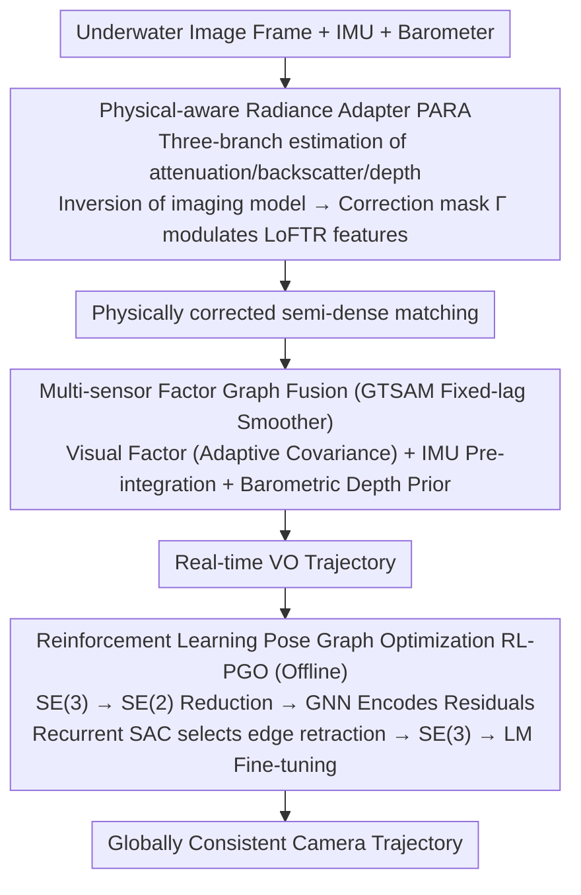

# MARVO: Marine-Adaptive Radiance-aware Visual Odometry

**Conference**: CVPR 2026  
**arXiv**: [2511.22860](https://arxiv.org/abs/2511.22860)  
**Code**: None  
**Area**: Model Compression  
**Keywords**: Underwater visual odometry, physical-aware feature matching, factor graph optimization, reinforcement learning pose graph optimization, multi-sensor fusion  

## TL;DR

Ours proposes the MARVO underwater visual odometry framework, which embeds a Physical-aware Radiance Adapter (PARA) into the LoFTR feature matcher to compensate for underwater wavelength attenuation. It combines GTSAM multi-sensor factor graph fusion with Reinforcement Learning Pose Graph Optimization (RL-PGO) to achieve robust localization in underwater scenes.

## Background & Motivation

Underwater visual localization faces unique challenges: light scattering, **wavelength-dependent attenuation**, and strong non-Gaussian noise lead to severe contrast loss, unstable features, and long-term pose estimation inconsistency. Traditional VO/SLAM systems fail in underwater environments for two primary reasons:

**Background**: Standard systems fail to account for the physical process of underwater image formation (color channel attenuation, backscattering), causing feature descriptors to fail in turbid regions. The matching quality of standard LoFTR drops significantly in areas of spectral degradation.

**Limitations of Prior Work**: Standard least-squares solvers (Gauss-Newton/LM) tend to get trapped in local optima on high-noise, visually degraded trajectories, especially when loop closure constraints are sparse.

**Key Insight**: Robust underwater VO requires both (i) a perception module that explicitly compensates for radiance distortion and (ii) a global optimizer capable of escaping local optima.

## Method

### Overall Architecture

To achieve robust camera pose estimation in turbid and heavily attenuated underwater scenes, MARVO adopts the logic of "perception first compensates for physical degradation, then the optimizer escapes local optima." When an image frame enters the system, it undergoes a three-stage process: the front-end uses LoFTR embedded with the Physical-aware Radiance Adapter (PARA) for feature matching, outputting physically corrected semi-dense correspondences; the back-end integrates these visual constraints along with IMU and barometer constraints into a GTSAM factor graph to solve the VO trajectory in real-time; finally, an offline Reinforcement Learning Pose Graph Optimizer (RL-PGO) performs global refinement on SE(2) for the entire trajectory to correct long-term drift. Each stage targets a specific failure point of underwater VO: the front-end ensures "features remain recognizable in turbid water," the back-end manages "multi-source constraint fusion," and the offline stage ensures "avoiding local optima under sparse loop closures."

### Key Designs

**1. Physical-aware Radiance Adapter PARA: Embedding the underwater imaging model directly into the feature pipeline instead of pre-processing.**

Contrast loss in underwater images stems from wavelength-dependent attenuation and backscattering, causing standard LoFTR descriptors to fail in spectrally degraded regions. PARA avoids the two-stage "enhance first, match later" approach. Instead, it inserts a lightweight module between LoFTR's CNN encoder and Transformer layers, allowing physical correction to occur in the feature space for end-to-end differentiability. It is based on the revised underwater imaging model:

$$I_c(x) = J_c(x) e^{-\beta_c(x)z(x)} + B_\infty^c(x)(1 - e^{-\beta_c(x)z(x)})$$

where $J_c$ is the degradation-free radiance, $\beta_c$ is the attenuation coefficient, and $B_\infty^c$ is the asymptotic backscatter. PARA uses a three-branch head to estimate attenuation $\hat{\boldsymbol{\beta}} \in \mathbb{R}^{H \times W \times 3}$, backscatter $\hat{\mathbf{B}}_\infty \in \mathbb{R}^{H \times W \times 3}$, and a depth proxy $\hat{\mathbf{z}} \in \mathbb{R}^{H \times W \times 1}$ pixel-wise from shared features. By inverting the model, it obtains the corrected radiance estimate $\hat{J}_c$, which is compressed into a pixel-wise scalar correction mask:

$$\Gamma(x) = \frac{1}{3}\sum_{c \in \{R,G,B\}} \frac{\hat{J}_c(x)}{I_c(x) + \epsilon}$$

This mask is element-wise multiplied back into the encoder features and processed with Layer Normalization: $\tilde{\mathbf{F}}(x) = \text{LN}(\Gamma(x) \odot \mathbf{F}(x))$. The module adds less than 5% parameters, but descriptor consistency in turbid areas improves significantly. The **Core Idea** is not just "CNN modulation," but that this modulation is supervised by physical parameters—replacing physical supervision with pure CNN modulation in ablations leads to a drop in robustness, proving the value of the physical prior.

**2. Multi-sensor Factor Graph Fusion: Using adaptive covariance to automatically switch between inertial and barometric reliance during vision degradation.**

Monocular underwater VO suffers from both scale ambiguity and vertical drift. MARVO utilizes a GTSAM fixed-lag smoother to jointly solve three types of constraints. IMU pre-integration factors provide scale and short-term motion. The visual factor from PARA-LoFTR estimates relative pose with a covariance inversely proportional to the number of inliers and spatial coverage. Thus, frames with high visibility dominate the optimization, while weights for degraded frames are automatically suppressed. The barometric depth prior is a unary factor that fixes the depth of each frame. This **Design Motivation** leverages the low cost of pressure sensors to eliminate the vertical drift inherent in monocular VO, while adaptive covariance allows the system to transition smoothly between visual and inertial/barometric constraints.

**3. Reinforcement Learning Pose Graph Optimization RL-PGO: Treating PGO as sequential decision-making on SE(2) to escape local optima.**

Visual degradation often provides poor initialization for classic PGO. Least-squares solvers like Gauss-Newton/LM fail to escape local optima, particularly with sparse loop closures. RL-PGO refines the pose graph offline using an RL policy. It first projects SE(3) onto SE(2) by utilizing AUV/ROV kinematic priors—since roll and pitch are stabilized by the vehicle and depth is fixed by the barometer, yaw is the primary rotational degree of freedom. This reduces 6-DoF to 3-DoF, narrowing the search space. A GNN encoder aggregates residuals from all edges to generate state representations. A Recurrent SAC agent then selects edges to adjust and outputs retraction actions on SE(2). After refinement, the poses are re-embedded into SE(3) for a final fast LM fine-tuning. The optimization objective is a log-weighted orientation cost:

$$OC_{\text{log}} = \sqrt{\sum_{(i,j) \in E} w_{ij} \|R_i R_{ij} - R_j\|_F^2}, \qquad w_{ij} = 1 + \beta \log\left(\frac{\|\mathbf{t}_{ij}\|}{\bar{t}} + \epsilon\right)$$

The log-weighting for translation distance ensures that long-distance constraints are emphasized without being dominated by outlier noise edges; it reverts to uniform weighting when $\beta=0$.

### Loss & Training

Front-end joint loss: $\mathcal{L} = \lambda_{\text{match}}\mathcal{L}_{\text{match}} + \lambda_{\text{photo}}\mathcal{L}_{\text{photo}} + \lambda_{\text{phys}}\mathcal{L}_{\text{phys}}$

- $\mathcal{L}_{\text{match}} = \|\hat{\mathbf{P}} - \mathbf{P}^*\|_1$: Geometric consistency of matching points.
- $\mathcal{L}_{\text{photo}} = 1 - \text{SSIM}(I'_A, I'_B)$: View consistency after radiance correction.
- $\mathcal{L}_{\text{phys}} = \|\hat{\boldsymbol{\beta}} - \boldsymbol{\beta}_{\text{gt}}\|_1 + \|\hat{\mathbf{B}}_\infty - \mathbf{B}_{\infty,\text{gt}}\|_1$: L1 supervision of physical parameters.

Training strategy: Pre-training on ~120k synthetic underwater pairs (ScanNet/TartanAir/Hypersim rendered via SyreaNet) → Fine-tuning on ~12k real frames (10% KITTI + internal data). Mixed precision on 4×A100.

## Key Experimental Results

### Main Results

Real-world underwater VO performance (Scale Aligned):

| Method | ATE (m)↓ | RPE (deg/m)↓ | Drift (%)↓ |
|------|---------|-------------|-----------|
| ORB-SLAM3 | 4.12 | 0.92 | 3.8 |
| LIBVISO2 | 3.47 | 0.85 | 3.1 |
| MAST3R-SLAM | 2.52 | 0.58 | 2.2 |
| VGGT-SLAM | 2.41 | 0.56 | 2.1 |
| **MARVO (Ours)** | **1.73** | **0.34** | **1.2** |

Synthetic underwater feature matching (Pose AUC):

| Method | @5° | @10° | @20° |
|------|-----|------|------|
| SP+SuperGlue | 25.4 | 42.2 | 59.7 |
| LoFTR | 42.9 | 59.5 | 68.2 |
| **MARVO** | **49.7** | **62.9** | **71.3** |

### Ablation Study

| Configuration | AUC @10°↑ | ATE (m)↓ | Drift (%)↓ |
|------|----------|---------|-----------|
| Full MARVO | **0.92** | **1.73** | **1.2** |
| w/o PARA module | 0.81 | 2.24 | 1.9 |
| Replace with vanilla LoFTR | 0.76 | 2.47 | 2.3 |
| Classic PGO instead of RL-PGO | 0.84 | 2.05 | 1.7 |
| w/o physical radiance normalization | 0.73 | 2.68 | 2.6 |

### Key Findings

1. **Physical radiance normalization is core**: Removing it drops AUC to 0.73 (the largest decrease), proving that physical supervision, rather than simple CNN modulation, is key.
2. Compared to ORB-SLAM3, ATE is reduced by 58% and Drift by 68%.
3. RL-PGO reduces the ATE of classic PGO from 2.05m to 1.73m, which is particularly effective in sparse loop closure scenarios.
4. Even compared to the latest VGGT-SLAM, ATE is reduced by 28% and Drift by 43%.

## Highlights & Insights

1. **Embedding physical models directly into DL pipelines**: PARA performs physical correction in the feature space rather than image space, maintaining end-to-end differentiability.
2. **Barometric depth prior**: A low-cost unary factor effectively eliminates vertical drift in monocular VO.
3. **SE(2) reduced-dimension RL-PGO**: Ours cleverly uses AUV/ROV kinematic constraints to reduce 6-DoF to 3-DoF.
4. Adaptive covariance allows the system to rely on inertial/barometric constraints automatically during visual degradation.

## Limitations & Future Work

1. **Lack of standard underwater VO datasets**: Evaluation relies on synthetic rendering and COLMAP alignment, lacking statistical significance.
2. The synthetic-to-real gap is bridged only by 10% real data fine-tuning, providing limited robustness guarantees.
3. RL-PGO operates only on SE(2); the roll/pitch coupling assumption may not hold for all AUVs.
4. 3D mapping (TSDF/MVS) is not integrated, and real-time metrics (FPS/latency) are missing.
5. Small experimental scale without large-scale multi-sequence long-term evaluation.

## Rating

- **Novelty**: ⭐⭐⭐⭐ — Combining physical models with Transformer matching is a clear innovation; RL-PGO adaptation for underwater is novel.
- **Experimental Thoroughness**: ⭐⭐⭐ — Limited by the lack of underwater datasets; small scale with a lack of error bars and multi-sequence statistics.
- **Writing Quality**: ⭐⭐⭐⭐ — Method description is detailed, system logic is clear, and derivations are complete.
- **Value**: ⭐⭐⭐⭐ — Directly applicable to underwater robotics; physical-aware principles can be generalized to fog/rain/night localization.

<!-- RELATED:START -->

## Related Papers

- [\[CVPR 2026\] One Layer's Trash is Another Layer's Treasure: Adaptive Layer-wise Visual Token Selection in LVLMs](one_layers_trash_is_another_layers_treasure_adaptive_layer-wise_visual_token_sel.md)
- [\[ICLR 2026\] AgilePruner: An Empirical Study of Attention and Diversity for Adaptive Visual Token Pruning in LVLMs](../../ICLR2026/model_compression/agilepruner_an_empirical_study_of_attention_and_diversity_for_adaptive_visual_to.md)
- [\[CVPR 2026\] Quant Experts: Token-aware Adaptive Error Reconstruction with Mixture of Experts for Large Vision-Language Models Quantization](quant_experts_token_aware_vlm_quantization.md)
- [\[CVPR 2026\] Progressive Supernet Training for Efficient Visual Autoregressive Modeling](progressive_supernet_training_for_efficient_visual_autoregressive_modeling.md)
- [\[ACL 2026\] SAMoRA: Semantic-Aware Mixture of LoRA Experts for Task-Adaptive Learning](../../ACL2026/model_compression/samora_semantic-aware_mixture_of_lora_experts_for_task-adaptive_learning.md)

<!-- RELATED:END -->
