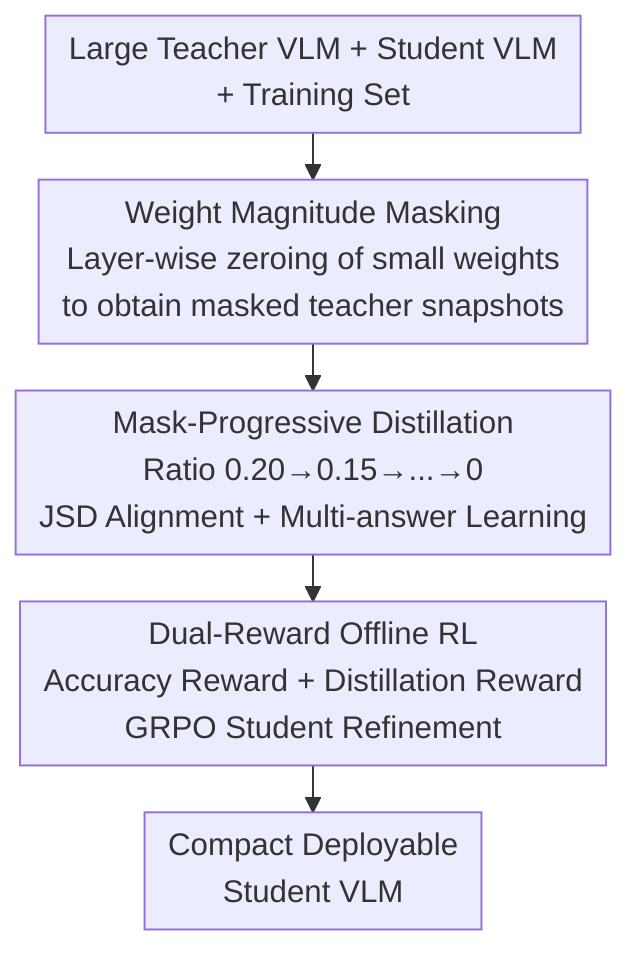

# Masking Teacher and Reinforcing Student for Distilling Vision-Language Models

**Conference**: CVPR 2026  
**Paper**: [CVF Open Access](https://openaccess.thecvf.com/content/CVPR2026/html/Lee_Masking_Teacher_and_Reinforcing_Student_for_Distilling_Vision-Language_Models_CVPR_2026_paper.html)  
**Code**: TBD  
**Area**: Model Compression / Multimodal VLM  
**Keywords**: Knowledge Distillation, Vision-Language Models, Weight Masking, Progressive Distillation, Offline Reinforcement Learning

## TL;DR
Masters bridges the teacher-student capacity gap through a progressive strategy that masks teacher weights by magnitude and gradually restores them during training. This is combined with offline RL driven by accuracy and distillation transferability rewards, enabling compact VLMs to stably absorb knowledge and outperform same-sized models across 13 multimodal benchmarks.

## Background & Motivation
**Background**: Large-scale Vision-Language Models (VLMs) approach human-level performance in multimodal understanding and reasoning. However, their tens of billions of parameters make deployment on mobile or edge devices difficult. Distilling knowledge from large teachers into compact students is a primary path for creating "small yet powerful" VLMs.

**Limitations of Prior Work**: A massive parameter/capacity gap exists between teachers and students (e.g., 38B teacher vs. 8B student). Students struggle to replicate high-dimensional, complex teacher representations, leading to unstable training and performance degradation. Most existing distillation methods focus on training objectives, intermediate layer alignment, or RL, while **few directly address narrowing the "gap" itself**.

**Key Challenge**: The complexity of teacher representations is overwhelming for students. Standard SFT data labels, often generated by closed-source models like GPT-4o, are "too rich" in reasoning style for compact models with smaller vocabularies and lower hidden dimensions. Forcing alignment causes performance drops, and single-answer targets limit diversity.

**Goal**: ① Directly reduce the teacher-student capacity gap for progressive learning; ② Escape the constraints of single, overly-rich SFT labels; ③ Filter out "factually incorrect" or "difficult-to-transfer" samples from generated responses.

**Key Insight**: Inspired by network pruning—where low-magnitude weights contribute minimally to logits—the teacher can be temporarily masked to create a "simplified teacher" for coarse-grained learning. These weights are gradually restored to increase teacher capacity during training. This masking is **temporary and reversible**, unlike permanent pruning for compression.

**Core Idea**: Integrate weight masking, progressive distillation, multi-answer learning, and offline RL into a unified framework that dynamically aligns teacher-student capacity while refining knowledge transfer.

## Method

### Overall Architecture
Masters takes a pair of same-family large teacher and compact student VLMs plus a training set as input. The pipeline consists of three serial steps: first, **layer-wise masking** of the teacher by weight magnitude to create snapshots; second, **progressive restoration** of the teacher (masking ratio $r$ decreasing from 0.20 to 0) using JSD distillation and multi-answer learning; finally, **offline RL** using accuracy and transferability rewards to push the student toward "correct and easy-to-transfer" responses.

### Key Designs

**1. Weight Magnitude Masking: Downsizing the Teacher for Digestibility**

To address the teacher-student gap, a binary mask is constructed for teacher weights $W_T=\{w_n\}_{n=1}^N$: $m_n=1$ if $|w_n|\geq\lambda_r$, otherwise $m_n=0$. The masked teacher becomes $W_{T_r}=M_r\odot W_T$. The ratio $r\in[0,1]$ determines the threshold $\lambda_r$. Masking small weights reduces capacity and filters noise that hinders stable transfer. To prevent layer failure from global thresholds, $\lambda_r$ is **calculated and applied layer-wise**, ensuring balanced masking across the architecture.

**2. Mask-Progressive Distillation: Gradual Capacity Restoration**

To avoid limiting the student to simplified representations, the masking ratio decreases monotonically during training. The ratio at iteration $i$ is $r[i]=r_{\max}-s\cdot\lfloor i\times M/I\rfloor$, where $s$ is the step decrement and $M$ is the total number of snapshots. The objective uses Jensen-Shannon Divergence (JSD) to align logit-softmax outputs: $\min_{W_S}\mathbb{E}\,[D(P_{T_{r[i]}}(y|x)\,\|\,P_S(y|x))]$. This allows the student to learn coarse patterns before refining toward high-level representations. To bypass "overly rich" SFT labels, distillation uses **multi-answer Gen-Data** pre-generated by both the masked teacher and the student, ensuring targets match the student's current capacity.

**3. Dual-Reward Offline RL: Filtering Incorrect and Hard-to-Transfer Samples**

Generated responses may contain factual errors or complex language difficult for distillation. Masters applies **offline RL** to evaluate **accuracy** and **transferability**. Using offline data (8 responses per query) saves computation compared to online generation. Two rewards are utilized: Accuracy Reward $R_{\text{acc}}$ via LLM-as-a-Judge for semantic fidelity, and Distillation Reward $R_{\text{distill}}$ via **inverse min-max normalization** of JSD (higher reward for lower divergence). The final objective combines the GRPO loss with a distillation term: $\min_{W_S}\mathbb{E}\,[L_{\text{GRPO}}+D(P_{T_{r[i]}}(\hat{y}|x)\|P_S(\hat{y}|x))]$.

### Loss & Training
JSD is used as the primary distillation objective. The student is optimized using AdamW with a learning rate of $1\times10^{-6}$. Offline RL utilizes DeepSpeed ZeRO-3 to manage the teacher-student pair. Five teacher snapshots $(s=0.05)$ are used to generate 1.5M training samples via vLLM (Temperature 1.0, top-p 0.9). Accuracy rewards are pre-calculated using LLM-as-a-Judge. Experiments were conducted primarily on NVIDIA A100 80GB GPUs.

## Key Experimental Results

### Main Results
The table shows average scores across 13 benchmarks (AI2D, ChartQA, MMMU, etc.) as Masters components are added. "+Large Teacher" denotes naive distillation, "+Mask-Progressive" denotes progressive masking, and "+Reward Feedback" is the full configuration.

| Student Model | Baseline | +Naive Distillation | +Mask-Progressive | +Reward Feedback (Full) |
|---------------|----------|----------------------|-------------------|--------------------------|
| Qwen2.5-VL-7B | 69.8     | 70.3                 | 71.6              | **74.0**                |
| Qwen3-VL-8B   | 75.7     | 76.9                 | 78.4              | **80.4**                |
| InternVL3-8B  | 71.8     | 72.4                 | 73.4              | **76.1**                |
| InternVL3.5-8B| 75.4     | 75.8                 | 76.3              | **77.1**                |

Full Masters achieves a Gain of +1.7 to +4.7 points over baselines, with each component contributing consistent improvements.

### Ablation Study
Comparing distillation from a single large teacher versus using an intermediate-sized teacher transition (+Mid Teacher):

| Configuration (InternVL3.5-2B) | Avg Score | Description |
|--------------------------------|-----------|-------------|
| Baseline                       | 68.6      | Original student |
| +Large Teacher                 | 69.1      | Naive distillation from 38B teacher |
| +Mid Teacher                   | 70.0      | Transition via 4B/8B/14B teachers |
| +Mask-Progressive              | 71.8      | With progressive masking |
| +Reward Feedback               | **75.1**  | Full Masters |
| −Mid Teacher                   | 70.4      | Performance drop without intermediate transition |

### Key Findings
- **Dual-Reward RL (Reward Feedback) provides the largest gain**: Adding this step resulted in the biggest single improvement (e.g., +3.3 for InternVL3.5-2B), highlighting the importance of filtering incorrect/complex responses.
- **Progressive size scaling > Direct large teacher**: Transitioning from 14B to 38B provides smoother convergence. Removing the "Mid Teacher" transition dropped the 2B student score from 75.1 to 70.4.
- **Significant gains in ChartQA**: Qwen3-VL-8B improved from 88.4 to 95.9 on ChartQA, suggesting that masking and RL are particularly effective for structured data understanding.

## Highlights & Insights
- **Repurposing "Pruning" as a Distillation Scheduler**: Masking is used to create a "capacity-adjustable" teacher sequence rather than for compression, providing a novel "coarse-to-fine" learning curriculum.
- **Efficiency through Offline RL**: Pre-generating multi-responses bypasses the high cost of online reasoning (think-answer) loops, allowing RL to scale to 1.5M samples.
- **Quantifying "Transferability" via Reward**: Using normalized logit divergence as a reward explicitly optimizes for responses the student can actually learn, a concept applicable to broader data selection tasks.

## Limitations & Future Work
- **Dependency on Model Family**: Requires teacher and student models from the same family; cross-architecture effectiveness remains unverified.
- **Heavy Pipeline**: Saving multiple teacher snapshots and pre-generating massive response sets involves high storage and inference costs.
- **LLM-as-a-Judge Bias**: Accuracy rewards depend on the evaluator's quality, though parsing prompts are used to mitigate hallucination.
- **Future Directions**: Exploring cross-family distillation and adaptive masking schedules that adjust based on the student's learning curve.

## Related Work & Insights
- **vs. Intermediate Feature Alignment**: Traditional methods align features but ignore the "parameter gap." Masters narrows the capacity difference at the source.
- **vs. Permanent Pruning**: Pruning is irreversible; Masters uses temporary, reversible masking to create a teaching curriculum.
- **vs. Online RL (e.g., DeepSeek-R1)**: Online RL is computationally expensive for long reasoning; Masters' offline approach scales much better while achieving stable convergence.

## Rating
- Novelty: ⭐⭐⭐⭐⭐ Using pruning as a capacity scheduler is a fresh perspective.
- Experimental Thoroughness: ⭐⭐⭐⭐ Strong benchmark coverage and component ablation.
- Writing Quality: ⭐⭐⭐⭐ Clear logic and well-integrated diagrams.
- Value: ⭐⭐⭐⭐ High engineering value for scaling student performance.

<!-- RELATED:START -->

## Related Papers

- [\[CVPR 2026\] Distilling Balanced Knowledge from a Biased Teacher](distilling_balanced_knowledge_from_a_biased_teacher.md)
- [\[CVPR 2026\] Teacher-Guided Routing for Sparse Vision Mixture-of-Experts](teacher-guided_routing_for_sparse_vision_mixture-of-experts.md)
- [\[CVPR 2026\] SigLino: Efficient Multi-Teacher Distillation for Agglomerative Vision Foundation Models](siglino_efficient_multi-teacher_distillation_for_agglomerative_vision_foundation.md)
- [\[CVPR 2026\] Collaborative Multi-Mode Pruning for Vision-Language Models](collaborative_multi-mode_pruning_for_vision-language_models.md)
- [\[ACL 2025\] Towards the Law of Capacity Gap in Distilling Language Models](../../ACL2025/model_compression/law_of_capacity_gap_distilling_language_models.md)

<!-- RELATED:END -->
