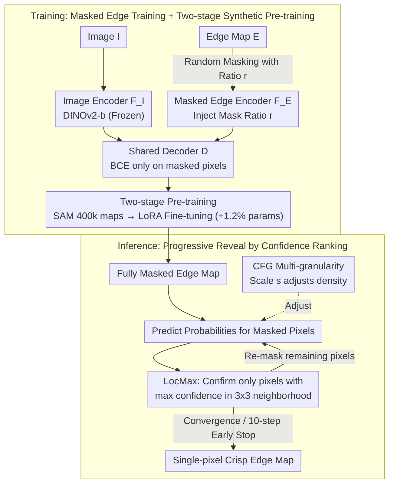

# MEMO: Human-like Crisp Edge Detection Using Masked Edge Prediction

**Conference**: CVPR 2026  
**arXiv**: [2603.20782](https://arxiv.org/abs/2603.20782)  
**Code**: [https://github.com/cplusx/MEMO_Edge_Detection](https://github.com/cplusx/MEMO_Edge_Detection)  
**Area**: Model Compression / Edge Detection  
**Keywords**: Edge Detection, Masked Prediction, Confidence-ranked Inference, Multi-granularity Prediction, Synthetic Data Pre-training

## TL;DR

Ours proposes the MEMO framework, which employs masked edge training and a progressive inference strategy based on confidence ranking. Using only standard cross-entropy loss, it generates sharp, single-pixel edge maps and significantly outperforms existing methods in crispness-aware evaluation (increasing CEval ODS from 0.749 to 0.836 on BSDS).

## Background & Motivation

1. **Background**: Deep learning-based edge detection typically models the problem as a pixel-level binary classification task optimized with cross-entropy loss. Mainstream methods like HED, RCF, and BDCN have achieved high detection accuracy.

2. **Limitations of Prior Work**: Models trained with cross-entropy generally produce "thick edge" predictions—the predicted edge width far exceeds the single-pixel width of human annotations. Existing methods either design specialized sparse losses (e.g., CATS, CED) or use diffusion models (e.g., DiffEdge), but crispness remains below 50% on datasets like BSDS.

3. **Key Challenge**: The ambiguity of labels from multiple annotators (where different annotators provide slightly shifted edges for the same location) "softens" the training signal, leading models to predict high probabilities across multiple pixels near an edge.

4. **Goal**: (a) Generate crisp edges without modifying loss functions or network architectures; (b) Avoid overfitting on small datasets; (c) Support multi-granularity edge prediction during inference.

5. **Key Insight**: Authors observe that **thick edge predictions exhibit a confidence gradient**—confidence is highest at the central edge pixel and gradually decays toward the sides. This implies that high-confidence predictions can be determined first, followed by incremental processing of uncertain regions.

6. **Core Idea**: Masked training enables the model to learn to predict remaining edges when partial edges are known. During inference, the edge map is "revealed" progressively from high to low confidence, naturally achieving single-pixel width.

## Method

### Overall Architecture

The core problem MEMO addresses is outputting single-pixel crisp edges, similar to human annotations, without changing the loss function or network structure. The key is shifting "crispness generation" from the training phase to the inference phase. By training the model to "complete remaining edges given partial knowledge," the inference process can "reveal" the edge map based on confidence, confirming only the most certain pixels at each step to refine thick edges into single pixels.

The pipeline consists of three components: a frozen image encoder $F_I$ (DINOv2-b) for image features, a masked edge encoder $F_E$ to encode "known partial edges," and a shared edge decoder $D$ that fuses both to predict edge probabilities for masked pixels. Training involves two stages: pre-training $F_E$ and $D$ on 400,000 SAM-synthesized edge maps, followed by fine-tuning on downstream datasets (like BSDS) using LoRA adapters, adding only about 1.2% additional parameters. Inference iteratively executes a loop: "Predict probabilities → LocMax confirms local maximum confidence pixels → Re-mask remaining pixels," with an optional CFG scale $s$ to adjust edge density.

### Key Designs

**1. Masked Edge Training: Pre-training as an "Edge Completion" Task**

Training end-to-end with standard cross-entropy causes models to produce high probabilities across several pixels because the supervision signal itself is "blurry" due to annotator variance. MEMO changes the objective: for each sample, a mask ratio $r \in (0, 1]$ is randomly sampled, and pixels are masked independently via Bernoulli sampling. The model sees $1-r$ of the ground truth edges and predicts the masked portion. The ratio $r$ is injected into $F_E$ and $D$ via sinusoidal positional embeddings. The cross-entropy loss is calculated only on masked pixels:

$$\mathcal{L} = -\mathbb{E}\Big[\tfrac{1}{r}\sum_i \mathbf{1}[E_r[i]=\text{mask}] \cdot \text{BCE}\Big]$$

A model trained this way learns to process "partial" edge maps; when it perceives a confirmed edge nearby, it learns to suppress redundant activations rather than spreading probability across a region.

**2. Two-stage Synthetic Pre-training: Using SAM to Mitigate Overfitting**

Masked training increases task difficulty and data diversity requirements; small datasets like BSDS (200 training images) lead to rapid overfitting. MEMO addresses this by pre-training on large-scale synthetic data. Using SAM on LAION images, instance masks are automatically generated. Single-pixel instance boundaries are extracted via morphological erosion and subtraction. 400,000 image-edge pairs were synthesized. During pre-training, $F_I$ is frozen, and only $F_E$ and $D$ are trained. Fine-tuning uses LoRA. Synthetic edges are inherently single-pixel, providing a strong prior bias.

**3. Confidence-ranked Inference + LocMax: One Pixel per Local Neighborhood**

Predicting all high-confidence pixels simultaneously during inference results in clusters of confirmed pixels (thick edges). LocMax addresses this by confirming a pixel $i$ only if its confidence $c_i = \max(p_i, 1-p_i)$ is the maximum within its $3\times 3$ neighborhood. Unconfirmed pixels are re-masked for the next iteration. This leverages the confidence gradient identified by the authors: by keeping only the "gradient peak" in each local window, edges are forced to be one pixel wide vertically. The process naturally converges as the number of masked pixels decreases monotonically.

**4. Multi-granularity Prediction via Classifier-Free Guidance**

Edge density typically requires multi-granularity annotations (e.g., MuGE). MEMO adopts classifier-free guidance from diffusion models. During training, the image input is replaced with a zero tensor with 10% probability. During inference, conditional and unconditional predictions are extrapolated:

$$p(E\mid I, E_r) = \text{Sigmoid}\big(s \cdot D_{\text{cond}} + (1-s) \cdot D_{\text{uncond}}\big)$$

A scale $s \ge 1$ allows smooth adjustment from "main contours only" to "fine textures" without requiring multi-granularity labels.

### Loss & Training

- **Loss Function**: Standard binary cross-entropy applied only to masked pixels.
- **Pre-training**: 400,000 synthetic edge maps from LAION using SAM; single-pixel boundaries via morphological erosion.
- **Fine-tuning**: LoRA adapters in the edge encoder and decoder; pre-trained weights frozen. AdamW optimizer, learning rate $2 \times 10^{-5}$.
- **Augmentation**: Horizontal/vertical flips and 90° rotations to preserve edge structure.

## Key Experimental Results

### Main Results

**BSDS Dataset Results (Single-scale Prediction):**

| Method | SEval ODS | SEval OIS | CEval ODS | CEval OIS | AC |
|:---|:---:|:---:|:---:|:---:|:---:|
| HED | 0.788 | 0.808 | 0.588 | 0.608 | 0.215 |
| RCF | 0.798 | 0.815 | 0.585 | 0.604 | 0.189 |
| EDTER | 0.824 | 0.841 | 0.698 | 0.706 | 0.288 |
| UAED | 0.829 | 0.847 | 0.722 | 0.731 | 0.227 |
| MuGE | 0.831 | 0.847 | 0.721 | 0.729 | 0.296 |
| DiffEdge | 0.834 | 0.848 | 0.749 | 0.754 | 0.476 |
| **Ours (C*)** | **0.854** | **0.861** | **0.836** | **0.841** | **0.663** |

**Visual Similarity Comparison:**

| Method | AC | FID↓ | LPIPS↓ |
|:---|:---:|:---:|:---:|
| DiffEdge | 0.476 | 89.96 | 0.300 |
| MuGE | 0.296 | 115.89 | 0.456 |
| **Ours (C*)** | **0.663** | **83.95** | **0.282** |
| **Ours (AC*)** | **0.705** | **75.55** | **0.291** |

### Ablation Study

| Configuration | SEval ODS | CEval ODS | AC | Description |
|:---|:---:|:---:|:---:|:---|
| LocMax, 10 steps | 0.854 | 0.836 | 0.663 | Full Model |
| Random Reveal | 0.819 | 0.794 | 0.671 | Fragmented edges, poor detection |
| TopK Reveal | 0.825 | 0.715 | 0.510 | Edges cluster and thicken |
| 5-step Inference | 0.855 | 0.835 | 0.594 | Fast but lower crispness |
| Full-step Inference | 0.846 | 0.842 | 0.840 | Most crisp, slow (10.46s) |
| Synthetic Data Only | - | Lower | Highest | Crisp but lacked accuracy |
| Real Data Only | - | Higher | Lower | Edge duplication artifacts |

### Key Findings

- **LocMax is Central**: Compared to TopK and Random, LocMax improves CEval by 17% and 5% respectively, and is the only strategy performing well across all metrics.
- **10-step Inference is Optimal**: Visually crisp enough with 1.33s inference time vs. 10.46s for Full-step.
- **Synthetic Pre-training is Critical**: Prevents edge duplication artifacts and provides a single-edge prior.
- **Significant AC Gain**: AC on BSDS improved from 0.476 (DiffEdge) to 0.663/0.705, a crispness increase of nearly 50%.

## Highlights & Insights

- **"No specialized loss" philosophy**: Achieving crisp edges with only cross-entropy disrupts the consensus that sparse losses are mandatory. The key is moving the solution from training to inference.
- **Ingenious LocMax strategy**: Exploiting the natural confidence gradient of edges to achieve pixel-perfect localization is elegant and effective.
- **CFG for Pixel-level tasks**: Redefining classifier-free guidance for edge density control allows multi-granularity prediction without labels, a concept transferable to tasks like semantic segmentation.

## Limitations & Future Work

- **Inference Speed**: 10-step iterative inference is ~10x slower than a single forward pass (1.33s vs 0.1s), limiting real-time application.
- **Performance on BIPED**: SEval ODS (0.888) is slightly lower than DiffEdge (0.899) in texture-heavy scenes.
- **Dependence on SAM**: Synthetic edge quality is limited by SAM's segmentation accuracy.
- **Future Directions**: (a) Distilling inference steps to 1-2 steps; (b) Using SAM2 for higher-quality synthetic data; (c) Dynamic adaptive step counts.

## Related Work & Insights

- **vs. DiffEdge**: DiffEdge uses diffusion backbones for crispness but is slower and can produce fragmented details. MEMO achieves better crispness via lighter masked training and iterative inference.
- **vs. MuGE/SAUGE**: These require multi-granularity labels. MEMO achieves unsupervised control via CFG.
- **vs. CATS/Refined Label**: These improve AC via loss design, but AC remains below 0.5. MEMO proves the strategy of training/inference design can outweigh loss function design.

## Rating

- Novelty: ⭐⭐⭐⭐
- Experimental Thoroughness: ⭐⭐⭐⭐⭐
- Writing Quality: ⭐⭐⭐⭐⭐
- Value: ⭐⭐⭐⭐

<!-- RELATED:START -->

## Related Papers

- [\[CVPR 2026\] Edge-RecViT: Efficient Vision Transformer via Semantic-Refined Dynamic Recursion](edge-recvit_efficient_vision_transformer_via_semantic-refined_dynamic_recursion.md)
- [\[CVPR 2026\] Critical Patch-Aware Sparse Prompting with Decoupled Training for Continual Learning on the Edge](critical_patch-aware_sparse_prompting_with_decoupled_training_for_continual_lear.md)
- [\[AAAI 2026\] Lightweight Optimal-Transport Harmonization on Edge Devices](../../AAAI2026/model_compression/lightweight_optimal-transport_harmonization_on_edge_devices.md)
- [\[CVPR 2026\] Cross-Architecture Adaptation: Cloud-Edge Continual Test-Time Adaptation with Dynamic Sampling and Heterogeneous Distillation](cross-architecture_adaptation_cloud-edge_continual_test-time_adaptation_with_dyn.md)
- [\[ICLR 2026\] Vulcan: Tailoring Compact Class-Specific Vision Transformers for Edge Intelligence](../../ICLR2026/model_compression/vulcan_crafting_compact_class-specific_vision_transformers_for_edge_intelligence.md)

<!-- RELATED:END -->
