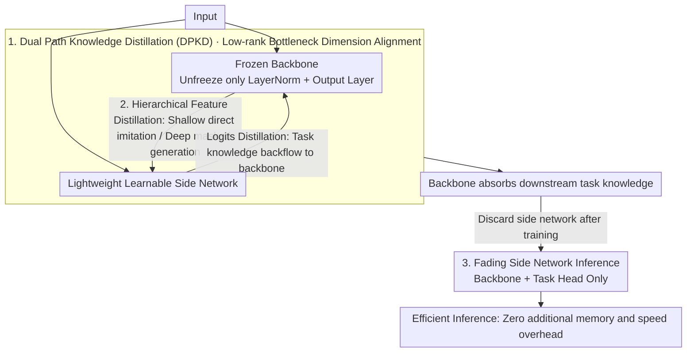

# Memory-Efficient Transfer Learning with Fading Side Networks via Masked Dual Path Distillation

**Conference**: CVPR 2026  
**arXiv**: [2604.09088](https://arxiv.org/abs/2604.09088)  
**Code**: [https://github.com/Zhang-VKk/MDPD](https://github.com/Zhang-VKk/MDPD)  
**Area**: Model Compression/Efficient Transfer Learning  
**Keywords**: Memory-Efficient Transfer Learning, Knowledge Distillation, Side Networks, Inference Acceleration, Dual Path Distillation

## TL;DR

MDPD proposes efficient fine-tuning through bidirectional knowledge distillation between a frozen backbone and a lightweight side network. The side network is discarded after training, achieving both parameter/memory efficiency during training and high speed during inference.

## Background & Motivation

**Background**: Memory-Efficient Transfer Learning (METL) constructs lightweight parallel side networks to avoid gradient backpropagation through large backbones, significantly reducing training memory. However, side networks introduce additional memory and time overhead during inference.

**Limitations of Prior Work**: Existing METL methods achieve parameter and memory efficiency during the training phase, but the additional overhead during the inference phase contradicts the ultimate goal of efficient transfer learning.

**Key Challenge**: Side networks are indispensable during training (to avoid gradient storage for the large backbone) but become a burden during inference (increasing forward propagation overhead).

**Goal**: Design a method that utilizes side networks for memory efficiency during training while discarding them during inference without compromising accuracy.

**Key Insight**: Transfer the downstream task knowledge learned by the side network back to the backbone via bidirectional knowledge distillation.

**Core Idea**: During training, the backbone and side network act as mutual teacher-students for distillation. During inference, only the optimized backbone is used, while the side network is "faded" out.

## Method

### Overall Architecture

MDPD addresses the inherent dilemma in memory-efficient transfer learning: side networks are heroes for saving memory during training but become bottlenecks for speed during inference. The overall approach allows a frozen backbone and a lightweight learnable side network to run in parallel and exchange knowledge during training—the backbone feeds pre-trained knowledge to the side network, while the side network transfers learned downstream task knowledge back to the backbone. This bidirectional flow is termed Dual Path Knowledge Distillation (DPKD), where backbone-to-side feature distillation follows a divide-and-conquer strategy based on encoder depth (Hierarchical Feature Distillation, HFD). Once training is complete, the backbone has absorbed the task capabilities, allowing the side network to be directly discarded (Fading Side Network). During inference, only the backbone and a task head remain, incurring zero extra memory or time cost.

### Key Designs

**1. Dual Path Knowledge Distillation (DPKD): Mutual Teacher-Student Learning to Transfer Task Knowledge Back to the Backbone**

Side networks cannot typically be discarded during inference because downstream task knowledge is localized within them while the backbone remains frozen. DPKD establishes bidirectional knowledge flow between the two paths: in feature-level distillation, the backbone acts as the teacher to transfer rich pre-trained features to the side network student; in logits-level distillation, roles are reversed, and the side network acts as the teacher to transfer task discriminative capabilities back to the backbone. Since the two networks have different feature dimensions (Side network $D_S$, Backbone $D_B$), a pair of low-rank matrices $M_{down} \in \mathbb{R}^{D_S \times d}$ and $M_{up} \in \mathbb{R}^{d \times D_B}$ are used for bottleneck dimension alignment, enabling cross-dimensional coupling without introducing excessive parameters. This bidirectional distillation creates a cycle of mutual reinforcement—the backbone's foundation provides a better starting point for the side network, while the side network's adaptation effectively "awakens" the backbone, ultimately depositing task knowledge into the backbone that is retained during inference.

**2. Hierarchical Feature Distillation (HFD): Differentiated Distillation Strategies Based on Encoder Depth**

Applying a uniform distillation method to all layers can be hindered by disparities between shallow and deep layers. The paper observes that in shallow layers, teacher and student attention patterns are similar (primarily diagonal self-attention); thus, direct feature imitation for the student is sufficient. However, in deep layers, teachers and students focus on different sparse key tokens, leading to divergent attention patterns. Forced copying of teacher features in deep layers results in poor learning. Consequently, a masked generation strategy is adopted for deep layers—instead of requiring the student to replicate teacher features, the student is tasked with "generating" them. This relaxes the objective from precise alignment to content reconstruction, which better suits the sparse attention distributions in deep layers. This hierarchical approach transfers backbone knowledge to the side network more effectively than a one-size-fits-all method.

**3. Fading Side Network Inference Strategy: Minimal Backbone Update During Training and Complete Removal of Side Path During Inference**

To discard the side network without losing accuracy, the backbone must become "task-aware" during training. MDPD does not unfreeze the entire backbone; instead, it updates only a small fraction of parameters—specifically the scaling/offset coefficients of LayerNorm and the final output layer—while keeping the vast majority of weights frozen. Parameter efficiency is thus maintained. Because DPKD continuously distills task knowledge from the side network into the backbone, these few tunable parameters, combined with the distillation signals, are sufficient to adapt the backbone. After training, the side network's mission is complete. Inference uses only the "Backbone + Task Head," eliminating the entire side path and resulting in zero extra speed or memory overhead.

### Loss & Training

Backbone and side network are optimized alternately during training to minimize the difference in feature distributions. The total loss consists of two parts: feature distillation loss from backbone to side network, and logits distillation loss from side network to backbone.
> ⚠️ Specific weighting coefficients and details of alternating optimization should refer to the original text.

## Key Experimental Results

### Main Results

| Task | Metric | MDPD | SOTA METL | Gain |
|------|------|------|-----------|------|
| Vision Tasks | Inference Speedup | $\ge 25.2\%$ | $0\%$ | $+25.2\%$ |
| Language Tasks | Inference Speedup | $\ge 22.5\%$ | $0\%$ | $+22.5\%$ |
| Multimodal Tasks | Accuracy | Surpasses SOTA | - | Improvement |

### Ablation Study

| Configuration | Key Metric | Description |
|------|---------|------|
| No Feature Distillation | Accuracy drop | Lack of pre-trained knowledge transfer |
| No Logits Distillation | Accuracy drop | Lack of task knowledge migration |
| No Hierarchical Distillation | Accuracy drop | Improper strategy for shallow/deep layers |
| Full MDPD | Optimal | Bidirectional distillation + hierarchical strategy |

### Key Findings

- Inference acceleration of at least $25.2\%$ is achieved while maintaining or even improving accuracy, demonstrating that the side network's role can be completely transferred via distillation.
- The hierarchical distillation strategy is critical for multi-layer encoders; the combination of shallow imitation and deep masked generation is optimal.
- The method is effective across vision, language, and vision-language modalities, verifying its generalizability.

## Highlights & Insights

- **Disposable Coach Philosophy**: The design of the side network as a "disposable coach" during training elegantly solves the inference overhead problem in METL.
- **Hierarchical Distillation Insight**: The observation of divergent attention patterns in shallow vs. deep layers and the corresponding distillation strategy design provide a valuable reference.
- **Low-Rank Dimension Alignment**: The use of a bottleneck structure avoids significant parameter overhead for dimension alignment, preserving parameter efficiency.

## Limitations & Future Work

- Training time may increase due to the requirement of dual-path forward passes and distillation loss calculations.
- Updating only LayerNorm parameters might limit adaptation capability under extreme domain shifts.
- The relationship between side network scale and distillation effectiveness remains undiscussed.

## Related Work & Insights

- **vs LoRA**: LoRA modifies backbone weights directly but still requires backpropagation through the backbone; MDPD updates the backbone indirectly via side networks, saving more memory.
- **vs Side-Tuning**: Traditional side-tuning methods retain the side network during inference, whereas MDPD achieves complete removal through distillation.

## Rating

- Novelty: ⭐⭐⭐⭐ Combination of bidirectional distillation and fading side networks is innovative.
- Experimental Thoroughness: ⭐⭐⭐⭐ Verified across vision, language, and multimodal tasks.
- Writing Quality: ⭐⭐⭐⭐ Methodology is clearly described.
- Value: ⭐⭐⭐⭐ Addresses the core contradiction in the METL field.

<!-- RELATED:START -->

## Related Papers

- [\[CVPR 2026\] TaskIT: Memory-Efficient Fine-Tuning of Multi-LoRA LLMs via Cross-Task Importance Transfer](taskit_memory-efficient_fine-tuning_of_multi-lora_llms_via_cross-task_importance.md)
- [\[CVPR 2026\] Dual-branch Distilled Transformer for Efficient Asymmetric UAV Tracking](dual-branch_distilled_transformer_for_efficient_asymmetric_uav_tracking.md)
- [\[CVPR 2026\] DAGE: Dual-Stream Architecture for Efficient and Fine-Grained Geometry Estimation](dage_dual-stream_architecture_for_efficient_and_fine-grained_geometry_estimation.md)
- [\[CVPR 2026\] WPT: World-to-Policy Transfer via Online World Model Distillation](wpt_world-to-policy_transfer_via_online_world_model_distillation.md)
- [\[CVPR 2026\] Attention-aware Inference Optimizations for Large Vision-Language Models with Memory-efficient Decoding](attention-aware_inference_optimizations_for_large_vision-language_models_with_me.md)

<!-- RELATED:END -->
