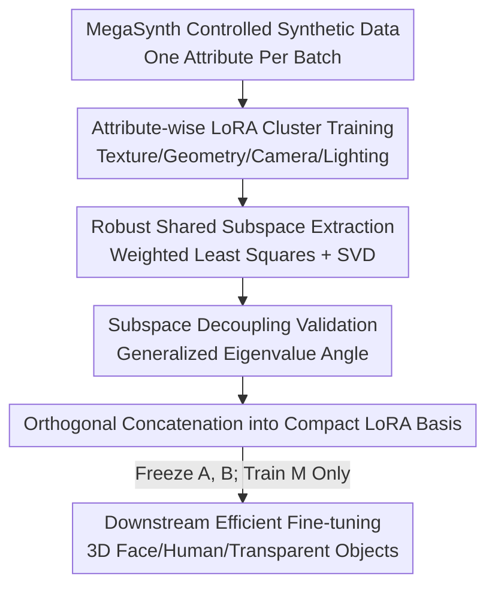

# Mining Attribute Subspaces for Efficient Fine-tuning of 3D Foundation Models

**Conference**: CVPR 2026  
**Paper**: [CVF Open Access](https://openaccess.thecvf.com/content/CVPR2026/html/Jiang_Mining_Attribute_Subspaces_for_Efficient_Fine-tuning_of_3D_Foundation_Models_CVPR_2026_paper.html)  
**Code**: To be confirmed  
**Area**: Model Compression / Parameter-Efficient Fine-Tuning (PEFT)  
**Keywords**: LoRA Subspace, 3D Foundation Models, VGGT, Attribute Decoupling, Synthetic Data Fine-tuning

## TL;DR
Aiming at 3D foundation models like VGGT, the authors extract a "shared LoRA subspace" for four types of 3D variations—texture, geometry, camera, and lighting—using controlled synthetic data. They demonstrate that these subspaces are approximately orthogonal. By concatenating them into a set of compact LoRA bases, efficient fine-tuning is achieved by training only a small middle matrix. This method achieves superior downstream accuracy on 3D face anti-spoofing, clothed human reconstruction, and transparent object reconstruction with significantly fewer parameters (approx. 4M vs. 16M for LoRA).

## Background & Motivation

**Background**: 3D foundation models (e.g., DUSt3R, VGGT) can solve various 3D tasks like multi-view reconstruction and depth estimation using a unified network. LoRA is the dominant choice for downstream adaptation, which constrains the weight update $dW$ to be low-rank $dW = AB^\top$, training only a few parameters to mitigate low-data regimes and overfitting.

**Limitations of Prior Work**: Directly applying LoRA to 3D tasks faces two specific challenges. First, real 3D data is exceptionally difficult to collect—a typical example is multi-view face anti-spoofing using micro-baselines (where the camera barely moves), where capturing videos is labor-intensive and involves privacy concerns. Second, 3D tasks focus on **low-level visual attributes** such as texture, geometry, camera motion, and lighting, while general LoRA mixes all variations into a single low-rank update. It is unclear which part of the subspace each attribute occupies, nor whether these updates are transferable. Consequently, as observed in the paper's experiments, LoRA fails to learn new variations at low ranks and overfits at high ranks, while PiSSA continues to degrade as rank increases.

**Key Challenge**: The low-rank update space of LoRA is spanned randomly in an "all-in-one" fashion. It neither aligns with the true factors of variation in 3D data nor utilizes the structural prior that "3D variations are naturally decomposable into several independent attributes." Consequently, parameters are wasted on irrelevant directions.

**Goal**: Decompose the problem into three sub-questions explicitly stated in the abstract: (1) Does each 3D variation correspond to a LoRA subspace? (2) Are these subspaces decoupled (mutually orthogonal)? (3) How can they be computed efficiently?

**Key Insight**: Since real 3D data is expensive, can **synthetic data** be used instead? By using a graphics engine to deliberately amplify the variation of only one specific attribute while minimizing others, the directions corresponding to the "amplified attribute" in the resulting LoRA will reappear across multiple data partitions (shared components), while other random attributes contribute only sample-specific noise components. Extracting these shared components yields the subspace for that attribute.

**Core Idea**: Mine a "shared LoRA subspace" for each attribute using controlled synthetic data and concatenate them into a compact orthogonal basis $(A, B)$. During downstream tasks, only the small middle square matrix $M$ is trained ($dW = AMB^\top$), leveraging the structure learned from synthetic data for efficient fine-tuning on real data.

## Method

### Overall Architecture
The method consists of two pipelines: **offline subspace mining** and **online fine-tuning using subspaces**. In the offline stage, the MegaSynth graphics engine generates synthetic datasets for four attributes—texture, geometry, camera, and lighting—where only one attribute varies while the others are fixed. LoRA adapters for VGGT are independently trained on each dataset to obtain a cluster of LoRA weights. A robust weighted least squares algorithm then extracts the "shared components" from these clusters as the attribute subspaces, and their approximate orthogonality is verified. In the online stage, the four attribute subspaces are orthogonally concatenated into a compact basis $(A, B)$. During downstream fine-tuning, $A$ and $B$ are frozen, and only the middle square matrix $M$ is trained, reducing trainable parameters from tens of millions in standard LoRA to a few million.

### Key Designs

**1. Controlled Synthetic Data + Domain Randomization: Making Attribute Variation Exceed the Sim-to-Real Gap**

To isolate a "texture subspace" from LoRA, one must have data where only texture varies while geometry, camera, and lighting remain fixed. The authors use MegaSynth to push the variation of the target attribute to extremes while keeping other attributes random but within a very small range across different datasets. The motivation is domain randomization—as long as the intentionally created intra-attribute variation is **larger than the domain gap between real and synthetic data**, the learned subspace will bridge the sim-to-real gap and generalize to real data. This step is the physical foundation of the methodology: because the "target attribute variation is maximized and others minimized," a single LoRA can be approximated as "shared target attribute component + sample-specific noise component," providing the algorithm with extractable features.

**2. Robust Shared LoRA Subspace Extraction: Extracting Common Directions via Weighted Least Squares**

Given $k$ pairs of LoRA matrices $\{A_i, B_i\}$ trained under the same attribute, the goal is to find a pair of $A, B$ with dimension $d'$ such that $AB^\top$ best approximates all individual updates $A_iB_i^\top$. A naive approach minimizes the Frobenius residual, but synthetic data may produce outlier LoRAs, biasing the ordinary sum of squares. The authors employ a robust objective with an exponent $\alpha$:

$$\min_{A,B}\ \sum_{i=1}^{k}\ \|AB^\top - A_iB_i^\top\|_F^{\alpha}.$$

Since there is no closed-form solution for $\alpha \neq 2$, **Iterative Re-weighted Least Squares (IRLS)** is used. By introducing weights $w_i$, the problem is converted to $\min_{A,B}\sum_i w_i\|AB^\top - A_iB_i^\top\|_F^2$, alternating optimization from $w_i=1$. When $w_i$ is fixed, the optimal solution is the SVD of the weighted average matrix $C=\sum_i w_i A_iB_i^\top / \sum_i w_i$: taking the top $d'$ singular vectors/values, $A=U_{d'}\Sigma_{d'}^{1/2}$ and $B=V_{d'}\Sigma_{d'}^{1/2}$. When $A, B$ are fixed, weights are updated by $w_i = 1/(\varepsilon^2 + \|AB^\top - A_iB_i^\top\|_F^2)^{(2-\alpha)/2}$—downweighting LoRAs with large residuals and automatically mitigating outliers. The singular spectrum of $C$ shows a significant "cliff" at the $d'$-th singular value (Fig. 2 in the paper shows a steep drop between the 16th and 17th values), providing empirical evidence for the existence of shared subspaces.

**3. Subspace Decoupling Validation + Orthogonal Concatenation: Combining Attribute Directions into a Reusable LoRA Basis**

Extracting subspaces is insufficient; they must be independent to ensure concatenation does not lead to cancellation. Comparing two subspaces $S=AB^\top$ and $S'$ is non-trivial because $AB^\top$ is invariant under $A\to AX, B\to BX^{-\top}$, and global scaling $aS$ represents the same linear space. The authors normalize via SVD (setting $A=U\Sigma^{1/2}$ and $B=V\Sigma^{1/2}$) and define a scale-invariant "subspace angle":

$$d(S,S')=\min_{x,x'}\frac{\|Sx-S'x'\|_2}{\|Sx\|_2+\|S'x'\|_2},$$

the optimal solution for which is solved as a minimum generalized eigenvalue problem. Measured minimum eigenvalues for six pairs of attribute subspaces were mostly above 0.5 (where 1 indicates perfect orthogonality), showing approximate decoupling, especially between texture-camera and geometry-camera. This decoupling allows for the final **orthogonal concatenation** of all attribute subspaces: $AMB=(\,\|_{i\in\Lambda}A_i\,)\cdot(\,\|_{i\in\Lambda}B_i\,)^\top$, resulting in a compact, non-redundant LoRA basis. Fine-tuning freezes this $A, B$ and trains only the middle square matrix $M$, where the number of parameters is determined by the basis dimension rather than full rank, achieving efficiency. The authors also provide an intuition from Neural Tangent Kernel and diffusion model generalization theories: the non-linear response of the network to attribute changes can be characterized by the linear approximation of its Jacobian, which naturally facilitates decoupling, while higher-order residuals correspond to weak correlations between attributes.

### Loss & Training
The base model is VGGT (comprising 48 sets of self-attention and linear layers; each self-attention has QKV and projection matrices). For downstream fine-tuning, the DINO encoder is frozen, and a depth head is used instead of a point head for prediction. All experiments use the same number of training steps with a two-stage learning rate schedule (linear + cosine decay). Each attribute subspace is refined from 5–10 LoRA adapters with rank $r=16$.

## Key Experimental Results

### Main Results

3D Face Anti-spoofing (micro-baseline setting), comparing full fine-tuning and LoRA/PiSSA at different ranks on synthetic and real face datasets:

| Method | Trainable Params | Syn Acc↓ | Syn Comp↓ | Syn NC↑ | Real AbsRel↓ | Real δ<1.25↑ |
|:---|:---|:---|:---|:---|:---|:---|
| VGGT (No FT) | - | 9.006 | 4.965 | 80.74 | 2.651 | 98.59 |
| Full FT | 853.6 M | 5.585 | 3.531 | 85.77 | 2.203 | 98.85 |
| LoRA (rank=16) | 16.3 M | 5.767 | 3.385 | 84.78 | 2.115 | 98.92 |
| PiSSA (rank=16) | 16.3 M | 5.729 | 3.532 | 85.30 | 2.433 | 98.81 |
| **Ours (d=16)** | **4.0 M** | **3.831** | **2.037** | **86.65** | 2.170 | 98.92 |

On the synthetic set, Ours reduces Accuracy from LoRA's 5.767 to 3.831 and Completeness from 3.385 to 2.037 using approximately 1/4 of LoRA's parameters. On the real set, it is competitive with the best baseline, validating that subspaces learned from synthetic data transfer to real data.

Clothed Human Reconstruction (THuman 2.1 indoor + 2K2K cross-domain generalization):

| Method | Trainable Params | THuman Acc↓ | THuman NC↑ | 2K2K Acc↓ | 2K2K NC↑ |
|:---|:---|:---|:---|:---|:---|
| VGGT | - | 2.816 | 91.51 | 3.103 | 92.81 |
| LoRA (rank=64) | 65.3 M | 2.791 | 92.12 | 3.017 | 93.18 |
| LoRA (rank=256) | 261.4 M | 3.521 | 91.81 | 2.517 | 93.99 |
| PiSSA (rank=64) | 65.3 M | 3.931 | 89.42 | 3.730 | 91.13 |
| **Ours (d=64)** | **19.3 M** | **2.745** | 91.82 | **2.513** | 93.56 |

While LoRA requires a rank of 256 (261M parameters) to reach 2.517 cross-domain Acc, Ours achieves 2.513 with 19.3M parameters (approx. 1/13). On transparent object reconstruction (ClearPose), Ours (16.3M) also outperforms LoRA and AdaLoRA at the same parameter scale.

### Ablation Study

| Configuration | THuman Acc↓ | 2K2K Acc↓ | Description |
|:---|:---|:---|:---|
| PSV (d=64) | 4.066 | 3.805 | Use Principal Singular Vectors of original weights as basis |
| **Ours (d=64)** | **2.745** | **2.513** | Use proposed attribute subspaces |
| r=16, d=8 | 5.839 | 5.712 | Input LoRA rank 16, Subspace dim 8 |
| r=16, d=64 | 2.745 | 2.513 | Performance improves as subspace dim increases |
| r=64, d=64 | 2.783 | 2.563 | Similar trend regardless of input LoRA rank |

### Key Findings
- **Subspace source is critical**: At the same dimension, attribute subspaces extracted by the proposed algorithm (Ours) significantly outperform using the Principal Singular Vectors (PSV) of the original model weights, indicating that performance stems from "alignment with 3D attribute variations" rather than just low-rank structure.
- **Increasing d improves stability**: While the method is sub-optimal at small $d$, it becomes increasingly robust and generalizes better as $d$ increases. This contrasts with LoRA's overfitting at higher ranks and PiSSA's degradation, demonstrating the stability of subspace alignment.
- **Spectral "cliffs" vary by layer**: The singular spectrum of $C$ exhibits different patterns (sharp drops in deep attention/FC layers, larger or no breakpoints in early layers). This reflects that deep layers encode generalizable global patterns, while early layers undergo large adjustments for local patterns in synthetic data. MLP layers show vast differences in relative attribute magnitudes, necessitating **attribute-wise** subspace extraction.

## Highlights & Insights
- **The perspective of "reverse-engineering LoRA structure via synthetic data" is clever**: Instead of collecting more real 3D data, the graphics engine is used to controllably amplify a single attribute, making it the unique common direction across multiple LoRAs. This turns an expensive data problem into an affordable algorithmic one.
- **Robust Weighted Least Squares + IRLS is a generalizable LoRA merging tool**: The sub-problem of finding a "robust low-rank approximation of a cluster of LoRAs" is applicable to other scenarios like style/content LoRA fusion, beyond 3D.
- **Scale-invariant subspace angle metric is noteworthy**: Using a generalized eigenvalue problem to define a distance between two $AB^\top$ matrices that is invariant to normalization and scaling provides a rigorous quantitative criterion for subspace orthogonality.
- **The "offline structure mining followed by online small-matrix training" paradigm** upgrades PEFT from "randomly spanned low-rank" to "low-rank aligned with true data factors," a concept transferable to other domains with clear factors of variation (e.g., controllable generation).

## Limitations & Future Work
- **Limited to static scenes**: The authors note that motion variations were not addressed; extending to 4D foundation models would require introducing motion attributes.
- **Dependency on engine-controllable attributes**: The approach relies on MegaSynth being able to generate texture, geometry, camera, and lighting in a decoupled manner. It may not hold for attributes difficult to control independently or those with extreme sim-to-real gaps (e.g., complex materials, real-world noise).
- **Decoupling is only "approximate" and lacks theory**: Subspace angles are mostly above 0.5 but far from perfectly orthogonal. The Neural Tangent Kernel explanation provided is intuitive, leaving rigorous analysis for future work.
- **Sub-optimal at small dimensions**: The method is less effective than baselines at very small $d$, requiring sufficient dimensionality and synthetic diversity. The offline cost of training a cluster of LoRAs to extract a subspace is also non-negligible.

## Related Work & Insights
- **vs. LoRA Merging in Generative Models (ZipLoRA, B-LoRA, etc.)**: These works focus on fusing two pre-trained LoRAs (e.g., style + content). This paper focuses on whether each variation can be encoded by a shared subspace and how to extract it from synthetic data, proving orthogonality and sim-to-real generalization.
- **vs. LoRA Training Strategies (AdaLoRA, PiSSA, GaLore)**: These methods "online" control the low-rank space of updates. This work **pre-computes** subspaces aligned with 3D attributes and specifically provides an algorithm to derive them from synthetic data, outperforming PiSSA-style "principal singular vector" initialization in ablations.
- **vs. Vanilla LoRA**: Vanilla LoRA uses randomly spanned directions with poor interpretability, underfitting at low ranks and overfitting at high ranks. By aligning directions with attributes, this method is more parameter-efficient, more stable as dimension increases, and generalizes better cross-domain.

## Rating
- Novelty: ⭐⭐⭐⭐⭐ Aligning LoRA subspaces with attribute structure priors via synthetic data extraction and proving decoupling is a highly novel perspective.
- Experimental Thoroughness: ⭐⭐⭐⭐ Covers 3D face anti-spoofing, human reconstruction, and transparent objects across internal and external domains with many ablations, though only validated on the VGGT base model.
- Writing Quality: ⭐⭐⭐⭐ Clear motivation driven by three core questions; spectral analysis and decoupling metrics are well-explained.
- Value: ⭐⭐⭐⭐ Provides an efficient fine-tuning route for 3D foundation models based on "aligned attribute structures"; the robust LoRA merging and subspace metric tools are transferable.

## Related Papers

- [\[ICLR 2026\] ABBA-Adapters: Efficient and Expressive Fine-Tuning of Foundation Models](../../ICLR2026/model_compression/abba-adapters_efficient_and_expressive_fine-tuning_of_foundation_models.md)
- [\[CVPR 2026\] Merge3D: Efficient 3D Multimodal LLMs via Joint 2D-3D Token Merging](merge3d_efficient_3d_multimodal_llms_via_joint_2d-3d_token_merging.md)
- [\[CVPR 2026\] LoPrune: Efficient Data Pruning for LoRA-Based Fine-Tuning of Vision Transformer](loprune_efficient_data_pruning_for_lora-based_fine-tuning_of_vision_transformer.md)
- [\[CVPR 2026\] ReFTA: Breaking the Weight Reconstruction Bottleneck in Tensorized Parameter-Efficient Fine-Tuning](refta_breaking_the_weight_reconstruction_bottleneck_in_tensorized_parameter-effi.md)
- [\[CVPR 2026\] TaskIT: Memory-Efficient Fine-Tuning of Multi-LoRA LLMs via Cross-Task Importance Transfer](taskit_memory-efficient_fine-tuning_of_multi-lora_llms_via_cross-task_importance.md)

<!-- RELATED:END -->

<!-- RELATED:START -->

## Related Papers

- [\[ICLR 2026\] ABBA-Adapters: Efficient and Expressive Fine-Tuning of Foundation Models](../../ICLR2026/model_compression/abba-adapters_efficient_and_expressive_fine-tuning_of_foundation_models.md)
- [\[CVPR 2026\] SigLino: Efficient Multi-Teacher Distillation for Agglomerative Vision Foundation Models](siglino_efficient_multi-teacher_distillation_for_agglomerative_vision_foundation.md)
- [\[CVPR 2026\] LoPrune: Efficient Data Pruning for LoRA-Based Fine-Tuning of Vision Transformer](loprune_efficient_data_pruning_for_lora-based_fine-tuning_of_vision_transformer.md)
- [\[ICLR 2026\] Sculpting Subspaces: Constrained Full Fine-Tuning in LLMs for Continual Learning](../../ICLR2026/model_compression/sculpting_subspaces_constrained_full_fine-tuning_in_llms_for_continual_learning.md)
- [\[CVPR 2026\] ReFTA: Breaking the Weight Reconstruction Bottleneck in Tensorized Parameter-Efficient Fine-Tuning](refta_breaking_the_weight_reconstruction_bottleneck_in_tensorized_parameter-effi.md)

<!-- RELATED:END -->
