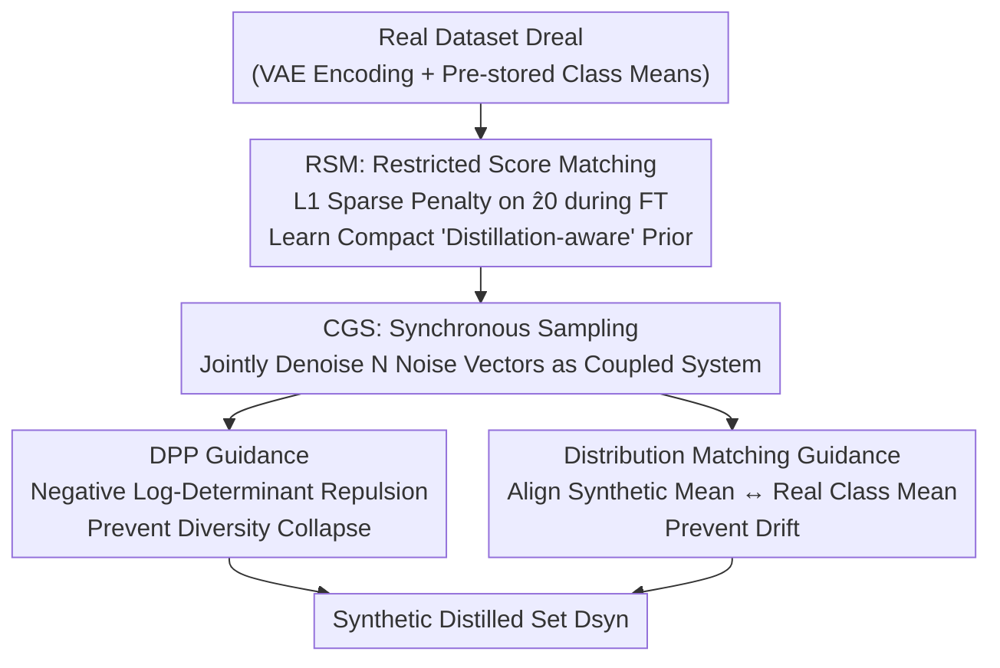

# Mitigating The Distribution Shift of Diffusion-based Dataset Distillation

**Conference**: CVPR 2026  
**Paper**: [CVF Open Access](https://openaccess.thecvf.com/content/CVPR2026/html/Xu_Mitigating_The_Distribution_Shift_of_Diffusion-based_Dataset_Distillation_CVPR_2026_paper.html)  
**Code**: Not released  
**Area**: Model Compression / Dataset Distillation / Diffusion Models  
**Keywords**: Dataset Distillation, Diffusion Models, Distribution Shift, Sparse Regularization, Determinantal Point Process

## TL;DR
This paper identifies that using diffusion models for dataset distillation suffers from two types of distribution shifts: training-stage and sampling-stage shifts. It proposes a two-stage framework: during training, L1 sparse regularization (RSM) is used to force the diffusion model to learn a compact and sparse "distillation-aware" manifold; during sampling, greedy i.i.d. generation is replaced by synchronous denoising of the entire batch with Collaborative Guided Sampling (CGS), which integrates DPP diversity and distribution matching. The method achieves SOTA performance on ImageNet subsets and ImageNet-1K with lower computational cost.

## Background & Motivation
**Background**: Dataset Distillation (DD) aims to compress a large dataset into a small synthetic set such that models trained on it approximate the performance of those trained on the full data. Traditional DD relies on iterative per-sample optimization (meta-model / gradient matching / trajectory matching / distribution matching), which is computationally expensive. Recently, generative diffusion models have become promising "off-the-shelf" alternatives due to their ability to efficiently characterize complex data manifolds.

**Limitations of Prior Work**: Directly using diffusion models as off-the-shelf tools to generate distilled data exposes a frequently overlooked issue in the synthetic set: **distribution shift**. This gap between the ideal properties of distilled data and actual generated properties offsets the advantages of the diffusion framework. The authors decompose this into two root causes:

- **Training-stage Shift**: The standard objective of diffusion models is to **perfectly replicate** the real distribution $p(x)$. However, this is the wrong objective for DD—if replication were the only goal, standard generative models or coreset selection would suffice. Extensive research in regularized DD indicates that the ideal distilled distribution is a **task-aware compressed abstraction** that retains only core, transferable information. Therefore, the diffusion prior itself must be regularized to learn a "simplified manifold."
- **Sampling-stage Shift**: Distilled sets inherently have low capacity ($N\ll N_{real}$), where the Law of Large Numbers does not hold. The empirical distribution of $N$ i.i.d. samples has high variance and fails to represent the target prior. This manifests as two failures: **diversity collapse** (samples converge to a few redundant modes, exacerbated by advanced solvers like DDIM) and **distribution drift** (statistics like mean/variance of the synthetic set deviate from the real manifold).

**Key Challenge**: The nature of diffusion to "replicate the real distribution" directly conflicts with the DD requirement to be "simplified yet globally representative at low capacity." Previous generative DD methods treated this as $N$ independent sampling tasks, magnifying the sampling-stage shift through greedy generation.

**Goal**: To mitigate both types of shifts during the **learning** and **generation** phases respectively.

**Core Idea**: Apply L1 sparse constraints during training to force a "distillation-aware" simplified prior. During sampling, redefine "finding $N$ individually optimal samples" as "generating a globally optimal dataset," using synchronous denoising and collaborative guidance to manage both collapse and drift simultaneously.

## Method

### Overall Architecture
The method is a two-stage process. **Stage 1: RSM (Restricted Score Matching)** acts during the fine-tuning of the diffusion model by adding an L1 sparsity penalty to the "predicted clean latent $\hat z_0$." This prunes the generative prior into a compact, semantically sparse "distillation-aware" manifold—preparing the problem space for sampling. **Stage 2: CGS (Collaborative Guided Sampling)** samples from this refined manifold: it treats $N$ noise vectors of the same class as a coupled system for **synchronous denoising** (rather than greedy individual generation). This allows the definition of two collaborative losses where each sample "perceives" the other $N-1$ samples: DPP guidance to prevent diversity collapse and distribution matching guidance to prevent distribution drift.

### Key Designs

**1. RSM: Pruning Diffusion Priors into Simplified Manifolds via L1 Regularization**

Addressing training-stage shift: "Diffusion replicates the full distribution while DD only needs core information." Evidence suggests that synthetic data usually captures simple samples or early training dynamics. RSM adds an **L1 penalty on the predicted clean latent $\hat z_0$** to the standard denoising objective when fine-tuning the diffusion model on $D_{real}$:

$$\mathcal{L}_{\text{RSM}}=\underbrace{\mathbb{E}_{t,x_0,\epsilon}\|\epsilon-\epsilon_\theta(x_t,t)\|_2^2}_{\text{Data Fidelity}}+\lambda\underbrace{\mathbb{E}_{t,x_0,\epsilon}\|\hat x_0(x_t,t)\|_1}_{\text{Complexity Regularization}}$$

where $\hat x_0$ is derived via $\hat x_0(x_t,t)=\frac{1}{\sqrt{\bar\alpha_t}}(x_t-\sqrt{1-\bar\alpha_t}\,\epsilon_\theta(x_t,t))$. The L1 penalty forces sparsity in the latent space, effectively "pruning non-essential features" and reducing manifold complexity to focus on the most transferable features. Experiments show that **RSM alone** (without sampling guidance) outperforms SOTA methods like Minimax, proving it creates a superior prior.

**2. Synchronous Sampling: Global Joint Optimization of Coupled Systems**

Addressing the issue where greedy sequential sampling fails to reach global optima and introduces biased guidance for small $n$. Unlike previous guided DD which freezes sampled $Z^{(n)}$, the proposed method initializes a set of $N$ noise vectors $Z_T=\{z_T^{(i)}\}$ and performs **synchronous** denoising $Z_T\to Z_{T-1}\to\cdots\to Z_0$. This allows each sample $z_t^{(i)}$ to "see" the other $N-1$ samples, enabling the definition of collaborative losses to explicitly manage collapse and drift.

**3. DPP (Determinantal Point Process) Guidance: Preventing Diversity Collapse**

To prevent $N$ samples from becoming semantically redundant under low-capacity constraints, the authors maximize the probability $P(Z)\propto\det(K_Z)$, which forces samples to be as orthogonal as possible. Using a cosine similarity kernel $K_{ij}=\cos\langle\hat z_t^{c,(i)},\hat z_t^{c,(j)}\rangle$ for latents of class $c$, the diversity loss is defined as:

$$\mathcal{L}_{dpp}(\mathcal{Z}_t^c)=-\log(\det(K_\mathcal{Z}+\epsilon I))$$

Minimizing this ensures intra-class diversity.

**4. Distribution Matching Guidance: Preventing Distribution Drift**

To keep the synthetic distribution from drifting, the authors align the first-order statistic (mean). Using the forward process $z_t=\sqrt{\bar\alpha_t}z_0+\sqrt{1-\bar\alpha_t}\epsilon$, the real data mean at step $t$ is $\bm\mu_{\text{real},t}^c=\sqrt{\bar\alpha_t}\,\bm\mu_{\text{real},0}^c$. The alignment loss is the MSE between the synthetic mean and the target real mean:

$$\mathcal{L}_{dm}(\mathcal{Z}_t^c)=\Big\|\tfrac{1}{N}\sum_{i=1}^N z_t^{c,(i)}-\sqrt{\bar\alpha_t}\,\bm\mu_{\text{real},0}^c\Big\|_2^2$$

This pulls the centroid of the synthetic set back to the real distribution centroid at each denoising step. The total guidance gradient $g_t^c=\eta_{dpp}\nabla\mathcal{L}_{dpp}+\eta_{dm}\nabla\mathcal{L}_{dm}$ is applied after the DDPM/DDIM prediction: $Z_{t-1}\leftarrow Z_{t-1}-g_t^c$.

## Key Experimental Results

### Main Results
Evaluated on ImageNet subsets (ImageNette, ImageWoof) and ImageNet-1K. Models are trained from scratch on distilled sets using ConvNet-6 / ResNet-18. Values represent Top-1 accuracy.

| Dataset / Model / IPC | Random | DM | DiT | Minimax | RSM (Stage 1 Only) | RSM+CGS (Full) |
|------|------|------|------|------|------|------|
| Nette / ConvNet-6 / 10 | 46.0 | 49.8 | 56.2 | 58.2 | 62.4 | **65.5** |
| Nette / ConvNet-6 / 50 | 71.8 | 70.3 | 74.1 | 76.9 | 79.0 | **82.7** |
| Nette / ResNet-18 / 10 | 55.8 | 60.9 | 62.5 | 64.9 | 67.2 | **68.7** |
| Woof / ConvNet-6 / 10 | 25.2 | 27.6 | 32.3 | 33.5 | 35.8 | **38.2** |

### Ablation Study
On ImageNette / ConvNet-6 / IPC 10:

| Configuration | Top-1 | Description |
|------|------|------|
| DiT (Baseline) | 56.2 | Direct generation from fine-tuned DiT |
| + Minimax | 58.2 | Previous SOTA diffusion DD |
| **+ RSM (Training Regularization Only)** | 62.4 | RSM alone outperforms Minimax by +4.2 |
| **+ CGS (Sampling Guidance Only)** | **65.5** | Full framework adds +3.1 over RSM |

### Key Findings
- **RSM is powerful independently**: Adding a single L1 term during fine-tuning improves DiT (56.2) to 62.4, outperforming Minimax. This demonstrates that "constructing a better distillation-aware prior" provides significant gains.
- **CGS provides additive gains**: Synchronous sampling with dual guidance on the refined manifold adds ~3%, confirming the complementarity of the two stages.
- **Fine-grained datasets benefit more**: Significant leads on ImageWoof suggest that diversity and distribution alignment are crucial for hard-to-distinguish classes.
- **Minimal overhead**: Log-determinant calculation for a $10k \times 10k$ kernel is <10ms, making it more efficient than traditional iterative DD.

## Highlights & Insights
- **Decomposition of distribution shift**: Categorizing shifts into training-stage ("wrong objective") and sampling-stage ("high variance estimation") provides a clear diagnostic framework and decoupled solutions.
- **Minimalist RSM regularization**: A simple L1-on-$\hat z_0$ term directs the diffusion prior toward a "distillation-aware" sparse manifold, which is easy to plug into any diffusion-based DD method.
- **Perspective shift to "Dataset-level Optimization"**: Moving from "$N$ optimal samples" to "one optimal set" via synchronous sampling is the key to unlocking global collaborative losses (DPP/DM). This concept is transferable to coreset selection and active learning.

## Limitations & Future Work
- Distribution matching aligns only the **first-order moment (mean)**; higher-order statistics are not explicitly constrained, which might be insufficient for complex multi-modal intra-class distributions.
- The DPP kernel relies on latent space cosine similarity, which depends on the quality of the latent representation. Sensitivity to hyperparameters ($\lambda, \eta_{dpp}, \eta_{dm}$) is not fully detailed in the main text.
- The method is tied to **latent diffusion (DiT + VAE)** and pre-stored class means; applicability to pixel-space or unlabeled data requires further design.

## Related Work & Insights
- **vs. Minimax**: Minimax uses bi-level optimization for discriminative priors; this work uses a simpler L1 sparse regularization but achieves higher performance even without sampling guidance.
- **vs. DD-IDG / Influence Guidance**: These methods use guidance but remain **greedy sequential** generators, leading to biased results. Synchronous denoising eliminates this greedy bias.
- **vs. DM (Distribution Matching)**: Traditional DM optimizes synthetic data directly in feature space; this method embeds mean-matching into every step of the diffusion denoising process alongside DPP diversity control.

## Rating
- Novelty: ⭐⭐⭐⭐ Clear diagnosis of two-stage shifts and unified framework, though components draw from established techniques.
- Experimental Thoroughness: ⭐⭐⭐⭐ Wide range of datasets and architectures; could benefit from more sensitivity analysis on higher-order moments.
- Writing Quality: ⭐⭐⭐⭐⭐ Logical flow from diagnosis to formula and algorithm; highly readable.
- Value: ⭐⭐⭐⭐ A single-GPU, plug-and-play solution providing a practical push for diffusion-based DD.

<!-- RELATED:START -->

## Related Papers

- [\[CVPR 2026\] DMGD: Train-Free Dataset Distillation with Semantic-Distribution Matching in Diffusion Models](dmgd_train-free_dataset_distillation_with_semantic-distribution_matching_in_diff.md)
- [\[CVPR 2026\] IMS3: Breaking Distributional Aggregation in Diffusion-Based Dataset Distillation](ims3_breaking_distributional_aggregation_in_diffusion-based_dataset_distillation.md)
- [\[CVPR 2026\] ManifoldGD: Training-Free Hierarchical Manifold Guidance for Diffusion-Based Dataset Distillation](manifoldgd_training-free_hierarchical_manifold_guidance_for_diffusion-based_data.md)
- [\[CVPR 2026\] Balanced Dataset Distillation via Modeling Multiple Visual Pattern Distribution](balanced_dataset_distillation_via_modeling_multiple_visual_pattern_distribution.md)
- [\[CVPR 2026\] Dataset Distillation by Influence Matching](dataset_distillation_by_influence_matching.md)

<!-- RELATED:END -->
