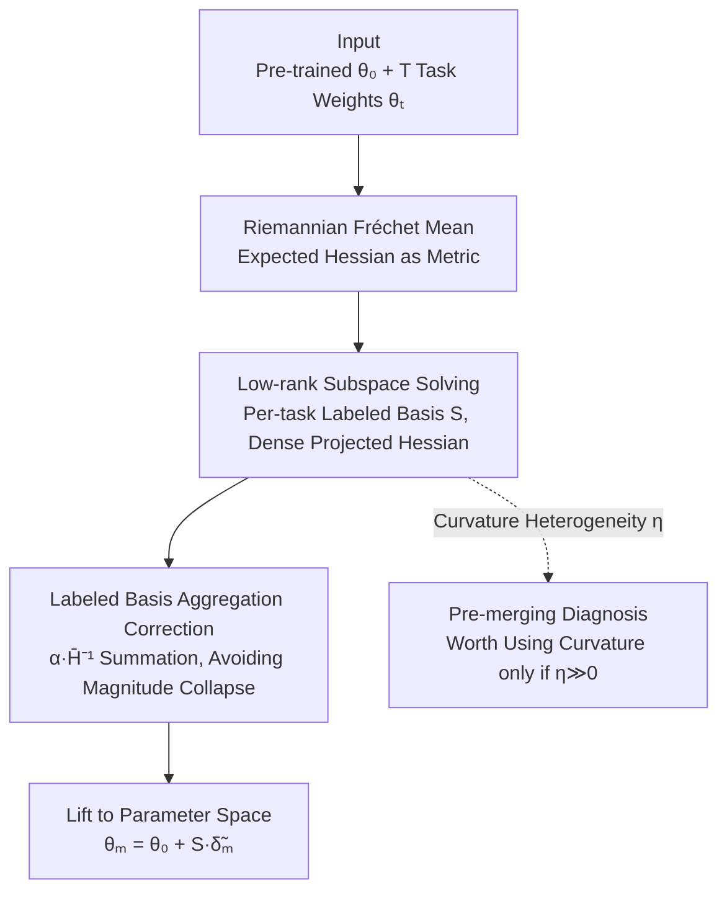

# Model Merging on Loss Landscape: A Geometry Perspective

**Conference**: CVPR 2026  
**arXiv**: [2605.26693](https://arxiv.org/abs/2605.26693)  
**Code**: None (not public as of note)  
**Area**: Model Compression / Model Merging  
**Keywords**: Model Merging, Loss Curvature, Riemannian Manifold, Fréchet Mean, Fisher Information  

## TL;DR
This paper proposes EpiMer, which reformulates model merging as "calculating the Fréchet mean on a Riemannian manifold with the expected Hessian as the metric." By restricting the computation to a low-rank subspace spanned by task vectors, the curvature becomes exactly solvable. Theoretically, the merging error bound is decomposed into subspace variance and residual energy, and a closed-form criterion $\eta$ is derived to determine when curvature-aware merging is provably superior to flat geometric merging. Experimentally, EpiMer consistently outperforms the strongest flat baseline, TSV-M, across eight-task merging tasks using three CLIP-ViT backbones.

## Background & Motivation
**Background**: Model merging aims to unify multiple expert models, fine-tuned from the same pre-trained weights, into a single unified model without retraining or accessing the original data. Prevailing approaches operate in flat Euclidean parameter space—performing weighted averages of task vectors and selecting weights based on auxiliary information such as performance ranking (Model Soups), Task Arithmetic, or heuristic conflict resolution (TIES).

**Limitations of Prior Work**: These flat geometric methods share a fundamental flaw—**completely ignoring the geometry of the loss surface**. Parameter sensitivity to loss varies drastically across different directions: moving a parameter slightly in one direction might explode the loss, while moving another significantly in a different direction might have almost no effect. Flat averaging treats all directions equally, causing the merged point to potentially land on high-loss barriers of some tasks, leading to destructive interference or even catastrophic forgetting.

**Key Challenge**: Methods attempting to introduce curvature (second-order information) are hindered by another issue—calculating or approximating the Hessian in the full parameter space is either infeasible or too noisy (e.g., full-space diagonal Fisher). Conversely, recent spectral methods (TSV-M, Isotropic Merging) bypass curvature and operate only in the SVD subspace of task vectors. While effective, they **lack a geometric theoretical explanation**. Consequently, a fundamental question remains: **When does curvature truly matter, and when is flat geometry sufficient?**

**Goal**: (R1) Provide a more general merging formulation that incorporates the loss surface beyond simple parameter averaging; (R2) Characterize when curvature-aware merging is provably useful and design a practical algorithm to exploit curvature in the subspace where it actually matters; (R3) Predict the "mergeability" of a set of models before the actual merging process.

**Key Insight**: The authors observe that parameter sensitivity to loss essentially corresponds to the **epistemic uncertainty** of the parameters, which is characterized by the local curvature (Hessian) of the loss. By modeling the parameter space as a statistical manifold with the expected Hessian as the metric tensor, "merging" naturally becomes the task of finding the geometric center on this curved manifold.

**Core Idea**: Replace "weighted average in Euclidean space" with "Fréchet mean on a Riemannian manifold" for model merging, and restrict the infeasible full-space computation to the **low-rank subspace spanned by task vectors**. In this subspace, the projected Hessian is both dense and small enough to be exactly inverted, enabling curvature-aware merging to be both principled and computable for the first time.

## Method

### Overall Architecture
The input to EpiMer consists of pre-trained weights $\bm{\theta}_0$ and $T$ task weights $\{\bm{\theta}_t\}$ fine-tuned from it; the output is a single merged weight $\bm{\theta}_m=\bm{\theta}_0+\bm{S}\tilde{\bm{\delta}}_m^*$. The pipeline consists of four steps: first, **redefine** merging as the Fréchet mean on a loss manifold (using expected Hessian as the metric), yielding the closed-form solution $\bm{\delta}_m^*=(\sum_t\lambda_t\bm{H}_t)^{-1}\sum_t\lambda_t\bm{H}_t\bm{\delta}_t$; since the full-space solution is computationally intractable, **construct a per-task labeled low-rank basis** $\bm{S}$ (following the per-task SVD factors in TSV-M) to project the problem into a $p\ll m$ dimensional subspace, where the projected Hessian $\tilde{\bm{H}}_t=\bm{S}^\top\bm{H}_t\bm{S}$ becomes dense and can be exactly inverted using $kT$ Hessian-vector products; next, solve for the Fréchet mean in the subspace using a **modified aggregation formula** (to avoid magnitude collapse caused by labeled bases); finally, lift the solution back to the original parameter space. The method also includes a **curvature heterogeneity diagnostic $\eta$** to predict if curvature-aware merging is worth the effort before merging.

### Key Designs

**1. Fréchet Mean on Riemannian Manifold: Incorporating Curvature into the Objective**

The limitation of flat methods is that they "treat all parameter directions equally." This paper models the parameter space $\Theta$ as a differentiable manifold $\mathcal{M}\subset\mathbb{R}^m$, with the metric tensor defined as the **expected Hessian** $\bm{G}(\bm{\theta})\triangleq\mathbb{E}_{\bm{x}}[\nabla^2_{\bm{\theta}}\mathcal{L}(\bm{x},\bm{\theta})]$. At local minima, the Hessian is semi-positive definite, making it a valid Riemannian metric (it may be a degenerate Riemannian manifold due to over-parameterization). Thus, the squared geodesic distance $d_g^2$ measures the "accumulated total loss change when transporting parameters along a path"—geodesics prioritize regions with high epistemic uncertainty (small loss changes). Merging is then rewritten as finding the geometric centroid of all task models on this curved manifold:

$$\bm{\theta}_m\triangleq\underset{\bm{\theta}\in\mathcal{M},\gamma_t}{\arg\min}\sum_{t=1}^T\lambda_t\int_{\gamma_t(0)=\bm{\theta}_t}^{\gamma_t(1)=\bm{\theta}}\dot\gamma_t^\top\bm{G}_t(\gamma_t)\dot\gamma_t\,d\tau$$

Ours proves (Proposition 1) that under a second-order approximation, minimizing multi-task loss is equivalent to seeking the Fréchet mean of these models. By approximating geodesics as linear paths and pinning the metric at the endpoints $\bm{H}_t$, the objective reduces to a quadratic form in $\bm{\delta}_m=\bm{\theta}_m-\bm{\theta}_0$, yielding the closed-form solution $\bm{\delta}_m^*=(\sum_t\lambda_t\bm{H}_t)^{-1}\sum_t\lambda_t\bm{H}_t\bm{\delta}_t$. The difference from flat averaging is that curvature $\bm{H}_t$ acts as a weight, prioritizing the alignment of loss-sensitive directions rather than performing an undifferentiated linear superposition.

**2. Low-rank Subspace Solving: Making Infeasible Full-space Hessians Dense and Invertible**

The closed-form solution is elegant but not directly applicable: the full-space $\sum_t\lambda_t\bm{H}_t$ is $m\times m$ (where $m$ is millions of parameters), making inversion $\mathcal{O}(m^2)$ or higher. Worse, if the **empirical Fisher diagonal** $\bm{v}_t=\mathbb{E}_{\bm{x}}[(\nabla_{\bm{\theta}}\mathcal{L}_t)^2]$ is used to approximate $\bm{H}_t\approx\mathrm{diag}(\bm{v}_t)$, the matrix-weighted solution reduces to simple re-weighting of Task Arithmetic since all tasks share the coordinate axes as the basis—effectively erasing curvature signals.

The solution is to restrict merging to a column-orthogonal low-rank subspace $\bm{S}\in\mathbb{R}^{m\times p}$ ($\bm{S}^\top\bm{S}=\bm{I}_p$, $p\ll m$). **Key Observation**: Even if $\bm{H}_t$ is diagonal, the projected $\tilde{\bm{H}}_t=\bm{S}^\top\bm{H}_t\bm{S}$ becomes a dense $kT\times kT$ matrix, recovering cross-parameter curvature signals lost by full-space diagonal proxies. The subspace basis construction follows the **per-task labeled basis** of TSV-M: SVD is performed per layer for each task vector to take the top-$k$ triplets; after concatenating factors across tasks and performing Procrustes-like whitening, $kT$ rank-1 outer product atoms $\{\bm{U}_{\perp,i}\bm{V}_{\perp,i}^\top\}$ are obtained, each labeled with its "originating task." Using per-task factors (rather than joint orthogonalization) is crucial because the latter has a hard rank limit $T$, which would collapse EpiMer back to Task Arithmetic. In the subspace, the projected Hessian requires only $kT$ HVPs and is small enough for exact inversion.

**3. Labeled Basis Aggregation Correction: Using α Scaling to Cancel Magnitude Collapse**

Labeled bases introduce a new issue: each atom belongs to exactly one task, but a standard Fréchet mean would divide each block by $T$, leading to severe "under-merging" where the magnitude of the merged delta is too small. Ours provides a simple correction, treating each task's contribution as a "sum" rather than an "average" while preserving curvature re-weighting:

$$\tilde{\bm{\delta}}_m^{(\ell)}=\alpha\,\bar{\bm{H}}^{-1}\sum_{t=1}^T\tilde{\bm{H}}_t^{(\ell)}\tilde{\bm{\delta}}_t^{(\ell)},\qquad\bar{\bm{H}}=\tfrac{1}{T}\sum_{t=1}^T\tilde{\bm{H}}_t^{(\ell)}$$

This effectively multiplies the standard Fréchet mean by $\alpha T$ to undo the averaging. $\alpha$ is a global scaling factor shared with TSV-M. **Why this works**: In the limit of homogeneous curvature, it collapses to $\alpha\sum_t\tilde{\bm{\delta}}_t$, exactly reproducing TSV-M; once curvature is heterogeneous, the matrix solution reshapes contributions according to each task's curvature. $\alpha$-sweep experiments confirm this aggregation out-performs the standard Fréchet mean at every rank and on every backbone.

**4. Curvature Heterogeneity Diagnostic η: Predicting Curvature Utility Before Merging**

This is the core theoretical result answering "when curvature matters" (Theorem 3). Let $\tilde{\bm{\delta}}_I=\sum_t\lambda_t\tilde{\bm{\delta}}_t$ be the flat solution and $\tilde{\bm{\delta}}_H=\bar{\bm{H}}^{-1}\sum_t\lambda_t\tilde{\bm{H}}_t\tilde{\bm{\delta}}_t$ be the curvature-aware solution. The difference in their merging objectives is exactly:

$$\mathcal{F}(\tilde{\bm{\delta}}_I)-\mathcal{F}(\tilde{\bm{\delta}}_H)=\bm{c}^\top\bar{\bm{H}}^{-1}\bm{c}=\eta\ge0,\qquad\bm{c}=\sum_{t=1}^T\lambda_t(\tilde{\bm{H}}_t-\bar{\bm{H}})(\tilde{\bm{\delta}}_t-\bar{\bm{\delta}})$$

Where $\bm{c}$ correlates "curvature deviation" with "task vector deviation." $\eta$ can be calculated in $\mathcal{O}(p^3)$ from projected Hessians and task vectors and is always non-negative—meaning curvature-aware merging **never performs worse**. $\eta=0$ (flat geometry is near-optimal) if and only if: (a) all task projected Hessians are identical (homogeneous curvature), (b) all task vectors are identical, or (c) curvature deviation is uncorrelated with task vector deviation. Curvature is worth using only when $\eta\gg0$. This diagnostic is only available within the Riemannian framework; existing flat methods cannot self-check if their flat assumptions hold. Theorem 2 also decomposes the merging error bound into **Subspace Fréchet Variance $\mathcal{V}_S$** (irreducible conflict across tasks) + **Residual Energy $\mathcal{R}_S$** (information lost by projection) + third-order Taylor remainders, noting that TSV-M only minimizes $\mathcal{R}_S$ (by setting $\bm{H}_t=\bm{I}$) while ignoring $\mathcal{V}_S$, whereas EpiMer minimizes $\mathcal{V}_S$ on the labeled basis.

> Unified Perspective (Proposition 2): Subspace Fréchet mean unifies existing methods as special cases—$\bm{S}=\bm{I}_m, \tilde{\bm{H}}_t=\bm{I}_m$ is Task Arithmetic; $\bm{S}=\bm{I}_m, \tilde{\bm{H}}_t=\mathrm{diag}(\bm{F}_t)$ is Fisher Averaging; $\bm{S}=\bm{I}_m, \tilde{\bm{H}}_t=\bm{H}_t$ is Gradient Matching; $\bm{S}=$ top-$k$ SVD, $\tilde{\bm{H}}_t=\bm{I}_p$ is TSV-M; only EpiMer uses both a non-trivial subspace and a curvature-aware metric.

## Key Experimental Results

Setup: Merging CLIP-ViT models fine-tuned on eight image classification tasks (Stanford Cars, DTD, EuroSAT, GTSRB, MNIST, RESISC45, SUN397, SVHN) using three backbones (ViT-B/32, ViT-B/16, ViT-L/14). The primary metric is the average top-1 accuracy across eight tasks. EpiMer and TSV-M are reported at $k=32$ with their respective optimal $\alpha$.

### Main Results

| Backbone | AM/TA | TIES | TSV-M | Fisher | **EpiMer** | Fine-tune Upper Bound |
|----------|-------|------|-------|--------|------------|-----------------------|
| ViT-B/32 | .653 | .725 | .822 | .539 | **.833** | .909 |
| ViT-B/16 | .710 | .774 | .865 | .625 | **.870** | .929 |
| ViT-L/14 | .791 | .859 | .906 | .720 | **.906** | .943 |

EpiMer outperforms TSV-M by 1.10%, 0.48%, and 0.06% on the three backbones, respectively, and outperforms TIES by 10.8%, 9.6%, and 4.7%. Note: On ViT-L/14, EpiMer is actually 0.9065 vs TSV-M 0.9059 (a 0.06 percentage point difference), both showing as .906 at three decimals. Full-space diagonal Fisher fails on every backbone (.539/.625/.720), validating that "full-space diagonal Fisher is too coarse" and that subspace projection is the remedy.

### Ablation Study (Global Scale α Sensitivity, $k=32$)

| Backbone | Method | α=0.20 | α=0.30 | α=0.50 | α=0.70 | α=1.00 |
|----------|--------|--------|--------|--------|--------|--------|
| ViT-B/32 | TSV-M | .630 | .699 | .787 | .822 | .820 |
| ViT-B/32 | EpiMer | .601 | .670 | .764 | .812 | **.833** |
| ViT-B/16 | TSV-M | .688 | .747 | .822 | .857 | .865 |
| ViT-B/16 | EpiMer | .666 | .724 | .804 | .846 | **.870** |
| ViT-L/14 | TSV-M | .772 | .816 | .870 | .895 | .906 |
| ViT-L/14 | EpiMer | .766 | .808 | .863 | .890 | **.906** |

The optimal $\alpha$ falls in $[0.7, 1.0]$, significantly higher than the literature default $1/\sqrt{T}=1/\sqrt{8}\approx0.354$; merely tuning $\alpha$ closes most of the gap to the fine-tuning upper bound. At their respective optimal $\alpha$, EpiMer does not lag behind TSV-M on any backbone or rank.

### Worst-Task Robustness

EpiMer's worst single-task top-1 accuracy is 0.8%, 2.4%, and 0.1% higher than TSVs-M, and 13.3%, 15.1%, and 8.8% higher than TIES (across the three backbones). This indicates that curvature awareness tightens the lower bound of the worst tasks while maintaining a strict lead in average performance, rather than sacrificing weak tasks.

### Key Findings
- **Subspace Projection vs. Curvature Awareness**: On ViT-B/32, projecting AM/TA deltas to the same labeled basis already increases accuracy from 0.653 to TSV-M's 0.822 (subspace contribution); curvature awareness further pushes it to 0.833 (second-order refinement contribution). Thus, "subspace does the heavy lifting, while curvature provides the final refinement."
- **Marginal Diminishing Returns on Large Backbones**: On ViT-L/14, TSV-M is already at 0.906, only 3.7% away from the fine-tuning upper bound 0.943; thus, second-order refinement space is inherently limited.
- **$\eta$ as a Within-Backbone Signal**: Within each backbone, $\eta$ increases monotonically with rank $k$, and EpiMer consistently maintains a positive margin; however, the ranking of $\eta$ across different backbones does not predict the ranking of margins across backbones (e.g., ViT-L/14 has the largest $\eta$ but the smallest margin because it is already saturated).
- **High Data Efficiency of Empirical Fisher**: Using only 0.5% of the per-task training data (1–6 batches with batch size 64), the merged accuracy is within ~0.7% of the full-data value; performance saturates at $f=10\%$—orders of magnitude less data than needed for test-time adaptation baselines.

## Highlights & Insights
- **Unification is the Greatest Strength**: A "Subspace Fréchet Mean + Metric Selection" framework successfully unifies traditional curvature-aware methods (Fisher, Gradient Matching) and spectral methods (TSV-M, Isotropic) into a single formula. The narrative of "establishing a grand unified theory and then locating the proposed method as the optimal instance" is highly persuasive.
- **Clever Pre-merging Diagnosis**: $\eta=\bm{c}^\top\bar{\bm{H}}^{-1}\bm{c}$ is always non-negative and can be computed in $\mathcal{O}(p^3)$, providing practitioners with a "free health check" for whether curvature awareness is needed. Flat methods lack any equivalent self-diagnostic capability.
- **"Diagonal Hessians Becoming Dense after Projection" is a Key Technical Trick**: While full-space diagonal Fisher erases curvature due to shared axes, projecting onto a non-axis-aligned labeled basis immediately recovers cross-parameter coupling. This observation is transferable to any scenario attempting cheap diagonal approximations without losing second-order information.
- **Error Bound Decomposition (Variance + Residual Energy)** provides a clear explanation for why subspace methods work: TSV-M only reduces residual energy, while EpiMer additionally minimizes variance, making the positioning very clear.

## Limitations & Future Work
- **Small Absolute Gains**: The improvement over the strongest baseline TSV-M is only 1.10%/0.48%/0.06%, nearly matching it on ViT-L/14 (0.9065 vs 0.9059). While attributed to saturation, this implies that the practical utility of curvature awareness depends heavily on how far the baseline is from the upper bound.
- **Reliance on SPD Hessian and Local Minima Assumptions** (Assumption 2: near-zero gradients for fine-tuned models): If fine-tuning hasn't converged or if the loss is non-convex enough to have negative eigenvalues, the validity of the metric is questionable.
- **Narrow Experimental Scope**: Validated only on CLIP-ViT for eight image classification tasks. Experiments on LLMs, multi-modal tasks, or scenarios with more tasks are needed to verify generalization.
- **Diagnostic Failure Across Backbones**: $\eta$ functions as a within-backbone signal and cannot be compared across different backbones, limiting its value as a universal "mergeability" metric.
- **Need to Reconstruct Empirical Fisher**: Since public checkpoints only store weights (not optimizer states), an extra forward-backward pass is required (though 0.5% of data suffices), which adds a data-access step compared to pure weight-averaging methods.

## Related Work & Insights
- **vs TSV-M (Strongest Flat Baseline)**: Both use the **exact same per-task labeled basis**, differing only in aggregation—TSV-M uses an isotropic metric $\tilde{\bm{H}}_t=\bm{I}_p$ (ignoring curvature), while EpiMer uses projected per-task Hessians for a matrix-weighted solution. EpiMer is a curvature-aware superset of TSV-M and converges to it in the homogeneous curvature limit, meaning it theoretically never performs worse.
- **vs Fisher Averaging (Curvature-aware Predecessor)**: Fisher uses diagonal Fisher in the **full parameter space**, where curvature signals are erased due to shared coordinate axes, causing it to fail in experiments; EpiMer's core fix is "project to low-rank subspace before calculating curvature."
- **vs Task Arithmetic / TIES (Flat Geometry)**: They perform linear averaging (with masking) in the full space, ignoring the loss surface. Ours proves they are special cases of the Subspace Fréchet Mean with $\bm{S}=\bm{I}_m$ and specific metrics, providing a geometric explanation for why "subspace + curvature" is superior.
- **Insight**: The perspective linking "epistemic uncertainty $\leftrightarrow$ local curvature $\leftrightarrow$ Riemannian metric" can be transferred to parameter importance weighting in continual or transfer learning (e.g., EWC / Laplace approximation). The trick of "cheap diagonal approximations recovering coupling through non-axis-aligned subspaces" is applicable to any low-rank approximation of second-order optimization.

## Rating
- Novelty: ⭐⭐⭐⭐⭐ First to use degenerate Riemannian manifolds + Fréchet means to unify curvature-aware and spectral methods, providing a closed-form mergeability diagnostic.
- Experimental Thoroughness: ⭐⭐⭐⭐ Solid results across three backbones and eight tasks with extensive ablations on α, rank, data efficiency, and worst-task performance, though limited to CLIP-ViT.
- Writing Quality: ⭐⭐⭐⭐⭐ Clear theoretical derivations; Table 1 and specific propositions make the positioning and special cases very easy to follow.
- Value: ⭐⭐⭐⭐ Strong theoretical contribution and practical diagnostic; however, empirical gains over the strongest baseline are limited, making its utility dependent on baseline saturation.

<!-- RELATED:START -->

## Related Papers

- [\[CVPR 2026\] LiteVGGT: Boosting Vanilla VGGT via Geometry-aware Cached Token Merging](litevggt_boosting_vanilla_vggt_via_geometry-aware_cached_token_merging.md)
- [\[CVPR 2026\] Bridging Domains through Subspace-Aware Model Merging](bridging_domains_through_subspace-aware_model_merging.md)
- [\[CVPR 2026\] Batch Loss Score for Dynamic Data Pruning](batch_loss_score_for_dynamic_data_pruning.md)
- [\[ICCV 2025\] FREE-Merging: Fourier Transform for Efficient Model Merging](../../ICCV2025/model_compression/free-merging_fourier_transform_for_efficient_model_merging.md)
- [\[ICLR 2026\] RAIN-Merging: A Gradient-Free Method to Enhance Instruction Following Through Model Merging](../../ICLR2026/model_compression/rain-merging_a_gradient-free_method_to_enhance_instruction_following_through_mod.md)

<!-- RELATED:END -->
