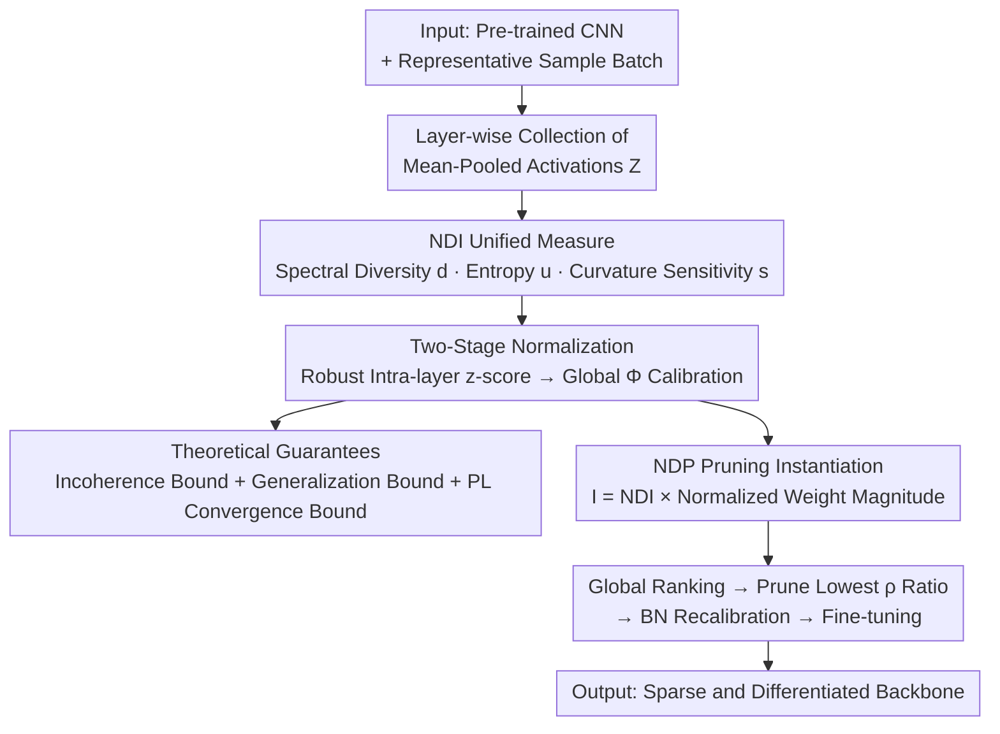

# Neural Differentiation in Deep Networks: A Theoretical Framework for Expressivity and Representational Diversity

**Conference**: CVPR 2026  
**Paper**: [CVF Open Access](https://openaccess.thecvf.com/content/CVPR2026/html/Wang_Neural_Differentiation_in_Deep_Networks_A_Theoretical_Framework_for_Expressivity_CVPR_2026_paper.html)  
**Area**: Model Compression / Network Pruning / Expressivity Theory  
**Keywords**: Neural Differentiation, Channel Importance, Structured Pruning, Representational Diversity, Provable Error Bounds

## TL;DR
This paper proposes a mathematical framework for "neural differentiation," utilizing a unified **Neural Differentiation Index (NDI)** (integrating spectral diversity, entropy information, and second-order curvature sensitivity) to quantify the functional uniqueness of each neuron/channel. It provides provable error bounds for pruning; the resulting algorithm, NDP, achieves accuracies comparable to or exceeding the Prev. SOTA on MNIST, CIFAR-10, Tiny-ImageNet, and ImageNet at higher sparsity rates.

## Background & Motivation

**Background**: As model capacity and data scale expand, pruning has become a mainstream method for compressing networks, reducing inference costs, and adapting to constrained hardware. In CNNs, structured pruning (removing entire channels/filters) is most widely studied because it directly translates into memory and computational savings and is hardware-friendly.

**Limitations of Prior Work**: However, mainstream pruning criteria remain stuck on "simple rules"—ranking by weight magnitude or local sensitivity. These criteria only consider individual parameter magnitudes and **fail to capture the richer forms of redundancy and inter-channel interactions** in modern convolutional networks: two channels with large weight magnitudes may be functionally redundant, which cannot be discovered by magnitude alone.

**Key Challenge**: The "importance" of a neuron is not equivalent to its "parameter size." Representational geometry, feature rank, activation diversity, and curvature sensitivity in the loss landscape all influence a neuron's true contribution to network expressivity. Compressing these dimensions into a single magnitude scalar inevitably loses information, leading to pruning that either removes the wrong (unique) channels or fails to remove redundant ones.

**Goal**: To define a unified channel importance measure that characterizes "functionally unique + information-rich + loss-sensitive" properties and to constrain its pruning behavior with theoretical bounds—proving the maximum error increase and optimization stability after removing low-importance channels.

**Key Insight**: The authors draw intuition from biological "neural differentiation" (where progenitor cells gradually acquire distinct neuronal identities/functions). In a good network, **each neuron should assume a unique representational role to avoid redundancy and maximize collective expressivity**. They emphasize this is only a naming inspiration; the framework itself is entirely mathematical and architecture-agnostic.

**Core Idea**: Quantify the degree to which a neuron deviates from its peers using a **multiplicatively coupled** NDI (Neural Differentiation Index). It unifies scores from three complementary perspectives: geometry (spectral diversity), information (entropy), and curvature (Hessian sensitivity). This index drives pruning (NDP), supported by provable loss perturbation bounds.

## Method

### Overall Architecture
The method consists of two layers. **The first layer is a theoretical framework**: activations are collected for each layer to construct an NDI that allows for cross-layer comparisons. It multiplies three factors: "orthogonality of channel responses (spectral diversity $d$), informational richness of activation distributions (entropy $u$), and channel sensitivity to loss curvature (second-order sensitivity $s$)." A two-stage normalization scales these scores across layers, followed by three theorems ensuring that high-NDI channels are "incoherent and their removal maintains controllable error/convergence." **The second layer is the instantiated NDP pruning**: NDI is multiplied by normalized weight magnitude to obtain global importance $I$. Channels are ranked globally by $I$, the lowest are pruned according to the target sparsity, BN statistics are recalibrated, and accuracy is recovered through fine-tuning.

The pipeline is a clear multi-stage process, as shown in the architecture diagram:

### Key Designs

**1. NDI Multi-view Unified Measure: Decomposing "Functional Uniqueness" into Geometric, Informational, and Curvature Components**

This is the core of the paper. Addressing the limitation that weight magnitude fails to capture inter-channel redundancy, the authors decompose the importance of channel $c$ into three complementary components, each answering a different question.

*Spectral Diversity $d$ (Geometric perspective, "Is this channel orthogonal to others?"):* For centered activations $\tilde Z^{(\ell)}$, the sample covariance is computed as $\Sigma^{(\ell)}=\frac{1}{N-1}\tilde Z^{(\ell)\top}\tilde Z^{(\ell)}$, which is then standardized into a correlation matrix $R^{(\ell)}$ and eigen-decomposed as $R^{(\ell)}=V\Lambda V^\top$. Defining the channel loading on each feature mode as $a^{(\ell)}_{c,k}=\big(v^{(\ell)}_k[c]\big)^2$ (where $\sum_k a^{(\ell)}_{c,k}=1$), the redundancy is:

$$\phi^{(\ell)}_c=\sum_{k=1}^{C_\ell} a^{(\ell)}_{c,k}\cdot\frac{\lambda^{(\ell)}_k}{\sum_j\lambda^{(\ell)}_j+\epsilon_{\text{stab}}}$$

This measures how much the channel's energy is concentrated in dominant feature modes (i.e., "shared directions" with other channels). After intra-layer normalization, $d^{(\ell)}_c=1-\tilde\phi^{(\ell)}_c$ is taken; **less redundant, more independent channels receive higher scores**.

*Entropy Information $u$ (Informational perspective, "Is the activation distribution information-rich?"):* Shannon entropy $\hat H_c$ is estimated for each channel activation using $B$ adaptive quantile bins + Laplace smoothing, then normalized to $u^{(\ell)}_c=\hat H_c/\ln B\in[0,1]$. High-entropy channels (diverse response patterns, not constant or unimodal) score higher.

*Second-order Sensitivity $s$ (Curvature perspective, "How much curvature does this channel contribute to the loss landscape?"):* The diagonal of the loss Hessian is estimated using the Hutchinson estimator with the Pearlmutter trick: $\widehat{\mathrm{diag}}(H)=\frac1m\sum_t v^{(t)}\odot(Hv^{(t)})$. These are aggregated per channel as $\hat s^{(\ell)}_c$ and min-max normalized. This captures whether pruning the channel would perturb the loss along sharp curvature directions.

The three are combined via **multiplicative coupling** to form the NDI:

$$\mathrm{NDI}^{(\ell)}_c=\big(\bar d^{(\ell)}_c+\epsilon_f\big)^p\cdot\big(\bar u^{(\ell)}_c+\epsilon_f\big)^q\cdot\big(\bar s^{(\ell)}_c+\epsilon_f\big)^r$$

Multiplication is used rather than weighted sums because it rewards channels that are "simultaneously high in all three"—a channel must be independent, information-rich, and loss-sensitive to be truly important. If any term collapses toward 0, the overall score is suppressed (small constant $\epsilon_f$ prevents total zeroing). Indices $p,q,r$ adjust the relative influence.

**2. Two-Stage Normalization: Enabling NDI for Global Ranking Across Layers**

Pruning requires a global comparison of all channels to decide which to remove, but activation scales vary significantly across different layers. Directly comparing NDI would be dominated by layer scales. The authors design a two-stage normalization to solve this alignment problem. The first stage is **Robust Intra-layer Standardization**: for each raw component, a robust z-score is calculated using the median and MAD (Median Absolute Deviation): $r^{(\ell)}_{x,c}=\frac{x^{(\ell)}_c-\mathrm{med}_\ell(x)}{1.4826\cdot\mathrm{MAD}_\ell(x)+\epsilon_{\text{norm}}}$. MAD is used instead of standard deviation to resist outliers in activations. The second stage is **Global Calibration**: robust scores from all layers are pooled to calculate global mean and variance, yielding $g^{(\ell)}_{x,c}=\frac{r^{(\ell)}_{x,c}-\mu_{R_x}}{\sigma_{R_x}+\epsilon_{\text{norm}}}$, which is then mapped to $(0,1)$ using the standard normal CDF $\Phi(\cdot)$ to get comparable components $\bar d,\bar u,\bar s$. This ensures the three components have aligned distributions across the entire network for global NDI ranking.

**3. Theoretical Guarantees: Proving that "High-NDI Channels are Unique + Pruning Low-score Channels is Safe"**

The authors provide three theorems to turn intuition into provable guarantees. **Lemma 3.5 (Spectral Diversity ⇒ Incoherence)**: Definiting the projection quality of channel $c$ onto the top-$k$ feature subspace as $\mu_c=\|P_k e_c\|_2^2=\sum_{i=1}^k a_{c,i}$, under the spectral gap $\gamma=\lambda_k-\lambda_{k+1}>0$ and sample error $\|\hat R-R\|_2\le\delta$, the sample correlation between any two channels satisfies $|\hat R_{c,j}|\le\sqrt{\mu_c\mu_j}+\frac{2\delta}{\gamma}$. This proves that channels with low projection quality (high diversity) are nearly orthogonal. **Theorem 3.6 (Generalization Bound)**: Given an $L_{\text{out}}$-Lipschitz output and $L_\Theta$-Lipschitz mapping, the difference in parameters before and after pruning $\Delta=\|\Theta-\Theta'\|_2$ bounds the expected loss: $\mathbb E[L(f_{\Theta'})]\le\frac1N\sum_i L(f_\Theta(x_i),y_i)+L_{\text{out}}L_\Theta\Delta+O(\sqrt{\log(1/\delta)/N})$. Pruning by zeroing channels makes $\Delta=\big(\sum_{(c,\ell)\in P}\|W^{(\ell)}_c\|_F^2\big)^{1/2}$, providing a "safety margin." **Theorem 3.7 (PL Convergence Stability)**: Under L-smooth + PL conditions, restarting gradient descent from $\Theta'$ results in $f(\Theta'_t)-f^\star\le(1-\eta\mu)^t(f(\Theta)-f^\star)+(1-\eta\mu)^t\frac{L}{2}\Delta^2$. The perturbation introduces an additive term controlled by $\Delta^2$, indicating stable convergence during fine-tuning.

**4. NDP Pruning Instantiation: Global Ranking Pruning with NDI × Weight Magnitude**

For the practical algorithm, the authors add a structural significance perspective. Since NDI alone is insufficient, it is multiplied by normalized weight magnitude $\bar w^{(\ell)}_c=\frac{\|W^{(\ell)}_c\|_F}{\frac{1}{C_\ell}\sum_{c'}\|W^{(\ell)}_{c'}\|_F+\epsilon_w}$, yielding globally comparable importance $I^{(\ell)}_c=\mathrm{NDI}^{(\ell)}_c\cdot\bar w^{(\ell)}_c$. This balances "functional differentiation" with "structural significance." Given a target sparsity $\rho$, all channels are ranked by $I$ in descending order, and the lowest $\rho\cdot\sum_\ell C_\ell$ channels are pruned. For architectures with residuals/branches, joint pruning is performed along connected paths for compatibility. BN statistics are recalibrated after pruning to restore activation stability before final fine-tuning.

### Loss & Training
The NDP framework follows a "post-training pruning + fine-tuning" flow; the NDI criterion itself requires no additional training. Notably, in the ablation experiments, the authors use an **NDI-based regularization term** during training to encourage neuron differentiation (see Exp 4.1), proving the differentiation concept can serve as both a pruning criterion and a training regularizer.

## Key Experimental Results

### Main Results
Covering various architectures/datasets from MLPs to large-scale CNNs, NDP consistently leads and its **advantage is magnified in extreme sparsity regions**.

| Dataset / Architecture | Sparsity | NDP | Best Competitor | Note |
|--------------|--------|-----|----------|------|
| MNIST / MLP-Net | 95% | **96.68%** | 94.70% (MSP) | SpaM drops to 89.43% |
| MNIST / MLP-Net | 98% | **94.59%** | <91% (Most <60%) | Highly robust to sparsity |
| CIFAR-10 / ResNet-18 | 98% | **90.03%** | 89.01% (EarlySNAP) | 2–3% lead throughout |
| CIFAR-10 / VGG-16 | 95% | **93.03%** | ~91.4% | More stable at high sparsity |
| Tiny-ImageNet / ResNet-18 | 68.38% | **72.10%** | ~58.4% (NPB) | ~14% improvement |
| ImageNet / MobileNet-V2 | 90% | **56.39%** | 42.46% (UniPTS) | Robust for large scale |

On Tiny-ImageNet, NDP simultaneously reduces FLOPs: at 90% sparsity, it uses only $2.32\times10^8$ FLOPs (less than half of PHEW/SynFlow) while maintaining 66.32% accuracy (competitors at 55.93% / 54.68%).

### Ablation Study

| Configuration | Observation | Explanation |
|------|------|------|
| Training w/ NDI Regularization | Tight t-SNE clusters, good inter-class separation | More discriminative penultimate representations |
| Without NDI Regularization | Overlapping/diffuse t-SNE clusters | Entangled representations, poor separability |
| Dynamic NDI Cross-layer Analysis | Shallow NDI saturates quickly; deep NDI is slower/weaker | Reveals emergence rhythms of hierarchical features |

### Key Findings
- **Robustness at extreme sparsity is the primary advantage**: The higher the sparsity, the larger the gap between NDP and competitors. While others collapse below 40% at 99% sparsity on Tiny-ImageNet, NDP retains 53.63%, suggesting that selecting channels by functional differentiation rather than magnitude avoids mis-deleting critical paths.
- **Multiplicative coupling + global normalization is key for NDI global ranking**: Requiring simultaneous high scores across three views avoids single-metric bias; two-stage normalization makes cross-layer comparison valid.
- **Dynamic NDI provides mechanistic insights**: Shallow feature detectors become class-sensitive quickly, while deep ones differentiate slowest, replicating the hierarchical law where early features stabilize to support late specialization.

## Highlights & Insights
- **Upgrade from scalar magnitude to a geometric/information/curvature product**: The approach is clean and interpretable. Multiplicative coupling naturally implements the "Cannikin Law"—if one component is weak, the whole score is suppressed.
- **Strong alignment between theory and practice**: The Lemma proves "high diversity ⇒ near-orthogonality," and theorems explicitly bound pruning error and convergence by $\Delta$. This provides a rare provable safety margin for structured pruning rather than relying on pure heuristics.
- **Dynamic NDI as a reusable analysis tool**: Using NDI to plot the "class-sensitivity trajectory" of neurons over training quantifies the emergence of hierarchical representations. This can be transferred to representation learning or plasticity studies beyond pruning.
- **NDI as both a pruning criterion and a regularizer**: Using it as a regularizer improved t-SNE cluster separation, proving that encouraging neuron de-correlation is a beneficial training signal.

## Limitations & Future Work
- **Ours is limited to CNNs**: Currently, the pruning instantiation and experiments cover only convolutional networks. Transformers and Spiking Neural Networks have fundamentally different redundancy patterns and require redefined differentiation and pruning operators.
- **Computational overhead not fully discussed**: Calculating NDI involves covariance eigen-decomposition (approximated by randomized SVD) and Hessian diagonals (Hutchinson + Pearlmutter). This is significantly costlier than magnitude pruning; time/memory costs for calculating criteria were not provided.
- **Multiple hyperparameters**: $p,q,r$ indices, $\epsilon$ constants, bin counts $B$, and Hutchinson probes $m$ are all tunable. A systematic sensitivity analysis is missing, potentially increasing the tuning burden for replication.
- **Strong theoretical assumptions**: Theorem 3.7 relies on PL conditions and Theorem 3.6 on global Lipschitz properties, which may not hold in real deep networks.

## Related Work & Insights
- **vs. Magnitude/Local Sensitivity Pruning (MP, WF, etc.)**: These rank by individual parameter size or first-order sensitivity, failing to capture inter-channel redundancy. NDP uses spectral diversity to explicitly characterize orthogonality.
- **vs. Early Pruning / Pruning at Initialization (CroPit, SNAP, SNIP, SynFlow, PHEW)**: These methods often prune based on connectivity/gradient flow early in training. NDP follows a post-training activation statistic + provable bound route, outperforming them on ResNet/VGG at higher accuracy and lower FLOPs.
- **vs. Activation/Attribution-aware Pruning (NBP etc.)**: This work falls into the category of "functional statistics over pure parameters" but systematically advances them by unifying diversity, information, and curvature into one index with theoretical guarantees and global normalization.
- **vs. Neural Alignment (Min et al.) / Task-specific Differentiation (Niu et al.)**: Previous works analyzed alignment in two-layer ReLU networks or used the term "differentiation" locally in shortcut learning. Ours claims the first explicit definition of "neural differentiation" as a unified ML framework.

## Rating
- Novelty: ⭐⭐⭐⭐ Unifying channel importance into geometric/informational/curvature perspectives with provable bounds is clear and formal, though components (spectra, entropy, Hessian) are organic combinations of existing tools.
- Experimental Thoroughness: ⭐⭐⭐⭐ Covers MLP to MobileNet across MNIST to ImageNet; includes t-SNE and dynamic NDI analysis; however, lacks computational overhead comparison and hyperparameter sensitivity studies.
- Writing Quality: ⭐⭐⭐⭐ Definitions, theorems, and algorithms are well-structured. The biology metaphor is well-clarified. Appendix-based pseudocode makes the main text flow slightly incomplete.
- Value: ⭐⭐⭐⭐ Provides a rare "provable safety margin + multi-view criterion" for structured pruning. Dynamic NDI is a valuable tool for representation analysis.

<!-- RELATED:START -->

## Related Papers

- [\[CVPR 2026\] Event Structural Valley: A Unified Theoretical and Practical Framework for Event Camera Autofocus](event_structural_valley_a_unified_theoretical_and_practical_framework_for_event_.md)
- [\[CVPR 2026\] Convolutional Neural Networks Driven by Content Similarity](convolutional_neural_networks_driven_by_content_similarity.md)
- [\[ICLR 2026\] Training Deep Normalization-Free Spiking Neural Networks with Lateral Inhibition](../../ICLR2026/others/training_deep_normalization-free_spiking_neural_networks_with_lateral_inhibition.md)
- [\[CVPR 2026\] Robust Spiking Neural Networks by Temporal Mutual Information](robust_spiking_neural_networks_by_temporal_mutual_information.md)
- [\[CVPR 2026\] On the Role of Temporal Granularity in the Robustness of Spiking Neural Networks](on_the_role_of_temporal_granularity_in_the_robustness_of_spiking_neural_networks.md)

<!-- RELATED:END -->
