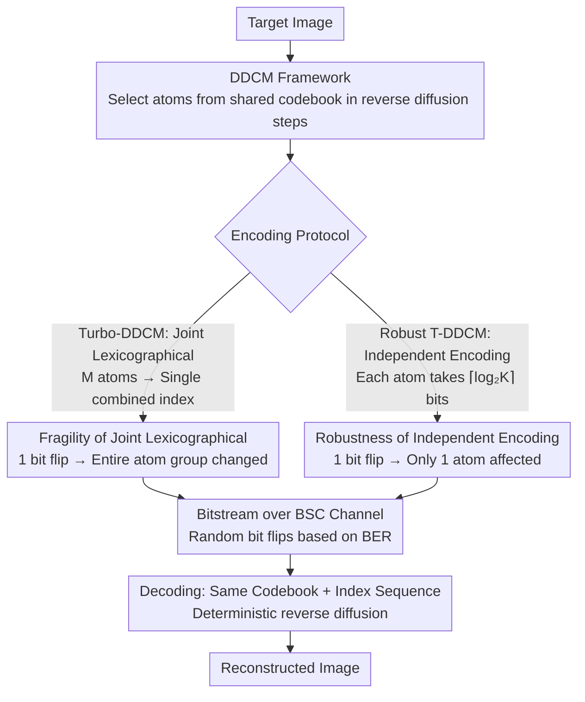

# On the Robustness of Diffusion-Based Image Compression to Bit-Flip Errors

**Conference**: CVPR 2026  
**arXiv**: [2604.05743](https://arxiv.org/abs/2604.05743)  
**Code**: None (The paper mentions a reference implementation but provides no specific link)  
**Area**: Image Compression / Model Robustness  
**Keywords**: Diffusion Models, Image Compression, Bit-Flip, Channel Robustness, Reverse Channel Coding

## TL;DR

This work provides the first systematic study of the robustness of diffusion-based image compression under bit-flip errors. It discovers that diffusion compression methods based on Reverse Channel Coding (RCC) are naturally more error-resilient than traditional and learned codecs. The proposed Robust Turbo-DDCM variant further enhances robustness by independently encoding atom indices, maintaining high reconstruction quality even at a BER of $10^{-3}$.

## Background & Motivation

1. **Background**: Neural image compression has achieved significant progress, reaching high perceptual quality at extremely low bitrates. Diffusion models have emerged as a powerful paradigm for image compression, achieving SOTA rate-distortion-perception trade-offs through end-to-end training, pre-trained model reuse, or zero-shot approaches. Representative methods include DDCM, Turbo-DDCM, and DiffC, which are zero-shot diffusion compression methods based on RCC.

2. **Limitations of Prior Work**: Real-world systems face threats from bit-flip errors (BFE) caused by transmission noise, hardware degradation, or malicious attacks (e.g., Rowhammer). A few bit-flips can severely degrade reconstruction quality or render files undecodable. Existing practices rely on error-correcting codes (ECC), which increase the size of the compressed representation and worsen rate-distortion performance.

3. **Key Challenge**: Optimization of image compression methods usually focuses solely on the rate-distortion-perception trade-off, while robustness is rarely considered. Traditional codecs use variable-length entropy coding (e.g., Huffman or arithmetic coding), where a single bit error can cause loss of synchronization in decoding and propagate errors to all subsequent symbols.

4. **Goal**: Can diffusion compression provide stronger robustness while offering higher compression ratios? How can its bit-flip robustness be further enhanced?

5. **Key Insight**: The compressed representation of RCC methods encodes control signals guiding the denoising trajectory rather than direct pixel values or transform coefficients. This indirect representation may possess natural tolerance to small perturbations—a few bit-flips might still result in similar guidance signals and reconstruction trajectories.

6. **Core Idea**: Replace the joint lexicographical encoding in Turbo-DDCM with independent encoding for each atom index. This ensures that a single bit-flip only affects one atom instead of the entire subset selection, trading a minor increase in BPP for a significant boost in robustness.

## Method

### Overall Architecture

This paper addresses two questions: why zero-shot diffusion compression based on Reverse Channel Coding (RCC) is naturally resistant to bit-flips, and how to further enhance this resilience. It utilizes the DDCM / Turbo-DDCM pipeline without retraining the model. The encoder selects atoms from a fixed codebook at each step of the reverse diffusion to guide the trajectory toward the target image; the selected atom index sequence serves as the compressed representation. The decoder uses the same codebook and index sequence to run a deterministic reverse diffusion to reconstruct the image. The paper clarifies the roots of RCC error resilience (DDCM base framework), identifies a vulnerability in Turbo-DDCM's bitstream protocol (fragility of joint lexicographical encoding), and achieves an order of magnitude improvement in robustness by modifying the encoding method to independent encoding.

### Key Designs

**1. DDCM Framework: Deterministic codebook selection as the compressed representation**

The error resilience of RCC stems from how DDCM performs compression. Standard diffusion sampling draws random noise from a Gaussian distribution at each step. DDCM replaces this step by selecting one of $K$ candidate Gaussian vectors from a reproducible codebook $\mathcal{C}_t$ shared by the encoder and decoder. During encoding, the atom most correlated with the current denoising residual $\mathbf{x}_0 - \hat{\mathbf{x}}_{0|t}$ is chosen:

$$k_t = \arg\max_k \langle \mathbf{C}_t(k),\ \mathbf{x}_0 - \hat{\mathbf{x}}_{0|t} \rangle$$

The resulting index sequence $\{k_t\}$ constitutes the total compressed information, with BPP $= T\lceil\log_2 K\rceil$ / number of pixels. Crucially, these indices do not encode pixel values or transform coefficients but "control signals" guiding the denoising direction. A bit-flip results in choosing an adjacent atom at that step, slightly shifting the guidance direction, yet the overall trajectory still converges to a similar reconstruction. This is the physical origin of RCC robustness: perturbations act on indirect control variables rather than direct data.

**2. Fragility Analysis of Turbo-DDCM: Joint lexicographical encoding couples multiple atoms**

To improve quality, Turbo-DDCM replaces single atom selection with sparse approximation—picking $M$ atoms per step and encoding this $M$-element subset into a single lexicographical index, occupying $\lceil\log_2\binom{K}{M}\rceil$ bits. While this improves compression efficiency, it compromises robustness: lexicographical encoding maps the entire subset to a single integer. Flipping any bit leads to a completely different subset. For example, if $K=8, M=3$, index 0 decodes to $\{0,1,2\}$; flipping the MSB might change it to index 32, which decodes to $\{1,4,7\}$. A single bit error results in all three atoms being changed, magnifying the error and causing the denoising direction to collapse.

**3. Robust Turbo-DDCM: Localizing error impact through independent encoding**

Since fragility arises from coupling $M$ atoms into one index, the solution is decoupling. Robust Turbo-DDCM encodes each selected atom independently into $\lceil\log_2 K\rceil$ bits. Thus, a single bit-flip can at most corrupt the selection of one atom, while the remaining $M-1$ atoms continue to guide the trajectory correctly. This localizes the per-step deviation and prevents cascading. The cost is a slightly larger bitstream, with BPP becoming $(T-1-N)(M\lceil\log_2 K\rceil + MC)$ / number of pixels. The paper observes that reconstruction quality yields diminishing returns as $M$ increases; therefore, the quality loss from having fewer atoms at the same BPP is limited, while the robustness gain—maintaining near-lossless reconstruction at significantly higher BER—is a favorable trade-off.

### Loss & Training

This method is zero-shot and requires no training. It uses pre-trained Stable Diffusion 2.1 as the diffusion backbone. Compression and decompression are deterministic algorithms for codebook selection; the only modification is to the bitstream encoding protocol (joint lexicographical → independent indices) without touching the model architecture or sampling logic.

## Key Experimental Results

### Main Results

Reconstruction quality on the Kodak24 dataset at BER=$10^{-4}$:

| Method | Type | BPP | PSNR (No Noise) | PSNR (BER=1e-4) | Failure Rate |
|------|------|-----|-------------|-----------------|-----------|
| JPEG | Traditional | 1.0 | ~30 | Severe Degradation | High |
| BPG | Traditional | 0.5 | ~30 | Severe Degradation | High |
| ILLM | Learned | ~0.1 | ~28 | Severe Degradation | High |
| StableCodec | Diffusion | ~0.1 | ~25 | Severe Degradation | High |
| DDCM | RCC | ~0.1 | ~24 | Good | 0% |
| Turbo-DDCM | RCC | ~0.1 | ~25 | Slight Degradation | 0% |
| **Robust T-DDCM** | **Ours** | ~0.1 | ~24 | **Near-lossless** | **0%** |

### Ablation Study

| Configuration | BER=1e-4 PSNR | BER=1e-3 PSNR | BER=1e-2 Failure Rate |
|------|--------------|--------------|-------------------|
| JPEG | Severe Degradation | Unusable | >80% |
| Turbo-DDCM | Slight Degradation | Significant Degradation | 0% |
| Robust Turbo-DDCM | Near-lossless | Near-lossless | 0% |
| Rate-Distortion (No Noise) | Turbo-DDCM Slightly Better | — | — |

### Key Findings

- The PSNR of non-RCC methods drops sharply at BER ~$10^{-5}$, whereas RCC methods degrade much more slowly.
- Robust Turbo-DDCM maintains near-lossless reconstruction at BER=$10^{-3}$, while all other methods are severely degraded or unusable at this noise level.
- Regarding the "Failure Rate," non-RCC methods see over 80% file corruption at BER ~$10^{-2}$, while all RCC methods maintain 0% across the entire BER range.
- The robustness advantage of RCC is not purely due to the absence of entropy coding; robustness differences are observed even within groups of methods that do or do not use entropy coding.
- Under noise-free conditions, Robust Turbo-DDCM's rate-distortion-perception performance is slightly lower than Turbo-DDCM, representing the expected cost of trading compression efficiency for robustness.

## Highlights & Insights

- **Discovery of an "Incidental" Property of Diffusion Compression**: RCC methods not only provide high compression but also offer natural robustness to bit-flips. This occurs because the compressed representation encodes control signals for the denoising trajectory rather than direct data, allowing small perturbations to still result in similar trajectories.
- **Encoding Protocols are Critical for Robustness**: Modifying only the bitstream encoding (joint → independent) without changing the model architecture or algorithm logic yields an order of magnitude improvement in robustness. This suggests the importance of encoding protocols in compression system design has been underestimated.
- **Potentially Disrupting the Traditional Compression-ECC Separation**: If the compressed representation itself is sufficiently robust, one could use weaker ECC or eliminate it entirely, saving bandwidth and simplifying system design.

## Limitations & Future Work

- Evaluated only independent bit-flips in a Binary Symmetric Channel (BSC), without considering burst errors or other structured channel models.
- Since some methods use entropy coding while DDCM/Turbo-DDCM do not, it is difficult to fully isolate the contributions of representation robustness versus encoding schemes.
- The encoding/decoding speed of RCC methods is significantly slower than traditional codecs (requiring full diffusion sampling), which is a hurdle for real-time applications.
- Evaluated only on Kodak24 and DIV2K; tests on larger or more diverse image datasets are missing.
- No comparison was made with Joint Source-Channel Coding (JSCC) methods.

## Related Work & Insights

- **vs JPEG/BPG**: Traditional codecs utilize variable-length entropy coding; a single bit error can cause loss of synchronization and cascading error propagation, resulting in extremely poor robustness.
- **vs Turbo-DDCM**: Robust Turbo-DDCM modifies the encoding protocol from joint lexicographical indexing to independent indexing, trading an ~20% increase in BPP for near-lossless reconstruction at BER=$10^{-3}$.
- **vs DiffC**: DiffC, also an RCC method, demonstrates good robustness, but Robust Turbo-DDCM further leads at high BER levels.
- This work may inspire the wireless communication field to consider the natural robustness of generative compression when designing end-to-end transmission systems.

## Rating

- Novelty: ⭐⭐⭐⭐ First systematic study of bit-flip robustness in diffusion compression with interesting and practical findings.
- Experimental Thoroughness: ⭐⭐⭐⭐ Systematic evaluation across various BER values and compression types, though dataset scale is limited.
- Writing Quality: ⭐⭐⭐⭐⭐ Clear motivation and intuitive explanations, especially the example regarding the fragility of lexicographical encoding.
- Value: ⭐⭐⭐⭐ Reveals a new dimension of advantage for diffusion compression, offering valuable insights for communication and compression system design.

<!-- RELATED:START -->

## Related Papers

- [\[CVPR 2026\] CADC: Content Adaptive Diffusion-Based Generative Image Compression](cadc_content_adaptive_diffusion-based_generative_image_compression.md)
- [\[CVPR 2026\] BinaryAttention: One-Bit QK-Attention for Vision and Diffusion Transformers](binaryattention_one-bit_qk-attention_for_vision_and_diffusion_transformers.md)
- [\[NeurIPS 2025\] One-Step Diffusion-Based Image Compression with Semantic Distillation](../../NeurIPS2025/model_compression/one-step_diffusion-based_image_compression_with_semantic_distillation.md)
- [\[CVPR 2026\] Block-based Learned Image Compression without Blocking Artifacts](block-based_learned_image_compression_without_blocking_artifacts.md)
- [\[CVPR 2026\] Mitigating The Distribution Shift of Diffusion-based Dataset Distillation](mitigating_the_distribution_shift_of_diffusion-based_dataset_distillation.md)

<!-- RELATED:END -->
