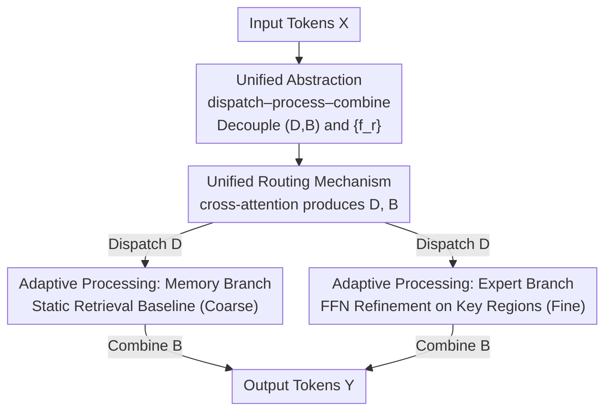

# OneSparse: A Unified Framework for Sparse Activation Layers in Vision Models

**Conference**: CVPR 2026  
**Paper**: [CVF Open Access](https://openaccess.thecvf.com/content/CVPR2026/html/Zhu_OneSparse_A_Unified_Framework_for_Sparse_Activation_Layers_in_Vision_CVPR_2026_paper.html)  
**Code**: https://github.com/Adlith/OneSparse  
**Area**: Model Compression / Sparse Activation  
**Keywords**: Sparse Activation, Mixture-of-Experts, Memory Modules, Unified Routing, Vision Backbone

## TL;DR
OneSparse unifies Mixture-of-Experts (MoE) and memory modules—two previously distinct sparse activation approaches—into a single "dispatch–process–combine" abstraction. Based on this, it introduces the Nexus Layer, a hybrid sparse layer that utilizes memory units to provide a low-cost baseline for all tokens while employing expert units to refine semantically critical regions. On ImageNet, COCO, and ADE20K, it achieves a superior accuracy-efficiency frontier compared to pure MoE and pure memory-based models at lower computational costs.

## Background & Motivation
**Background**: Large-scale models enhance performance by increasing parameters, but this leads to an explosion in computational requirements. Sparse activation layers are the primary means to decouple "capacity" from "computation" by activating only a subset of parameters for each token. Currently, there are two main paradigms: **Mixture-of-Experts (MoE)**, which uses a router to distribute tokens to a few expert FFNs for input-dependent dynamic transformation; and **memory modules**, which treat a large static key-value library as a lookup table where tokens act as queries to retrieve and aggregate the most similar values.

**Limitations of Prior Work**: Although both paths aim to achieve "sparsity," they have evolved independently and remain incompatible. MoE offers strong expressiveness but is computationally expensive (each expert is a full FFN, plus routing overhead), and hard routing during training often suffers from load imbalance, necessitating additional load-balancing regularization for stability. Memory modules are extremely fast at retrieval but are essentially **static lookups**—they ignore the specific aggregated input and return fixed value vectors, lacking the dynamic transformation capabilities of MoE. Furthermore, memory modules have been studied primarily in NLP, with almost no systematic validation in computer vision.

**Key Challenge**: MoE and memory modules represent two extremes of the same spectrum: one is "dynamic but expensive," while the other is "efficient but non-adaptive." Existing designs are forced to choose two among "efficiency, load balance, and adaptivity." No framework currently exists to compare them systematically, nor is there a method to combine their respective strengths.

**Goal**: (1) Propose a unified abstraction capable of accommodating both MoE and memory modules for systematic comparison; (2) design a hybrid sparse layer that truly integrates the advantages of both based on this abstraction.

**Key Insight**: The authors observe that both MoE and memory module forward passes can be decomposed into three steps: distributing tokens to processing units (**dispatch**), processing by each unit (**process**), and weighted merging of results (**combine**). The only fundamental difference lies in whether the "process" step is a dynamic transformation or a static lookup.

**Core Idea**: By completely decoupling the **routing logic** from the **processing functions**, a continuous design space is formed; MoE and memory are merely two special cases within this space. Choosing a hybrid point of "memory for baseline + experts for refinement" results in the Nexus Layer.

## Method

### Overall Architecture
OneSparse contributes on two levels: first, a **unified abstraction** (translating existing sparse layers into a single mathematical form), and second, the **Nexus Layer**, a concrete new layer developed under the guidance of this abstraction.

The core of the abstraction is that any sparse activation layer consists of a **router** and a set of **processing functions** $\{f_r\}$. Given $N$ tokens $X \in \mathbb{R}^{N\times D}$, $E$ processing units, and $C$ capacity slots per unit, the router produces two tensors: a dispatch tensor $D \in \mathbb{R}^{N\times E\times C}$ (the weight of token $i$ assigned to slot $(r,c)$) and a combine tensor $B \in \mathbb{R}^{N\times E\times C}$ (the weight of the output from slot $(r,c)$ in the final representation of token $j$). The forward pass for the entire layer is written as a unified equation:

$$y_j = \sum_{r=1}^{E}\sum_{c=1}^{C} B_{j,r,c}\cdot f_r\!\left(\sum_{i=1}^{N} D_{i,r,c}\, x_i\right).$$

The inner summation aggregates tokens into each slot according to $D$, $f_r$ processes this aggregated input, and the outer summation merges the results back according to $B$. This $(D, B, \{f_r\})$ framework separates "routing logic $(D,B)$" from "computation $\{f_r\}$," revealing two orthogonal design axes: routing ranging from hard to soft assignment, and processing functions ranging from dynamic transformations to static lookups.

The Nexus Layer is a hybrid point in this space. Its pipeline consists of three stages: a **unified router** uses cross-attention for soft assignment of tokens to heterogeneous slots $\rightarrow$ half of the slots go to a **memory branch** for low-cost retrieval-based baselining, while the other half go to an **expert branch** for FFN-based refinement $\rightarrow$ outputs are merged according to $B$.

### Key Designs

**1. dispatch–process–combine Unified Abstraction: Translating MoE and Memory into the Same Mathematics**

This step addresses the fundamental issue that the two paradigms were previously incomparable. The authors demonstrate that token-choice MoE, expert-choice MoE, SoftMoE, and Product Key Memory can all be represented by the unified equation above, differing only in how $(D, B, \{f_r\})$ are defined. For token-choice MoE, $D_{i,r,c}=\mathbb{1}[r\in I_i \wedge c=c(i,r)]$ represents hard assignment, $B$ uses normalized routing weights, and $f_r$ is a dynamic FFN. For memory modules (PKM), the $K^2$ value vectors are viewed as processing units with capacity $C=1$, where two-level ANN retrieval $D_{i,r,1}=\mathbb{1}[r\in S_i]$ acts as an "extremely efficient router," and the processing function is a **static lookup** $f_r(\sum_i D_{i,r,1} x_i)=v_r$, which ignores the input and returns the unit's learnable value.

**2. Unified Routing Mechanism: One Cross-Attention Router for Both Experts and Memory with Natural Load Balancing**

To hybridize heterogeneous units, the Nexus Layer uses cross-attention. It partitions the layer into $E=E_{mem}+E_{exp}$ processing units. The original $K^2$ scattered memory vectors are **regrouped into $E_{mem}=K$ groups**, each containing $K$ values. This allows both expert and memory groups to expose $C$ slots, aligning their structures. The router assigns a learnable query $q_{r,c}$ to each slot $(r,c)$, tokens $x_i$ are projected to keys $k_i=W_K x_i$, and the affinity is $s_{i,r,c}=k_i^\top q_{r,c}$. The dispatch tensor $D$ applies softmax across the **token dimension**, and the combine tensor $B$ applies softmax across the **slot dimension**:

$$D_{i,r,c}=\frac{\exp(s_{i,r,c})}{\sum_{i'}\exp(s_{i',r,c})},\qquad B_{j,r,c}=\frac{\exp(s_{j,r,c})}{\sum_{r',c'}\exp(s_{j,r',c'})}.$$

This ensures fully differentiable soft routing and **structural load balancing**—since each unit has an equal number of slots and dispatch is handled via slot-wise softmax, the imbalance issues of hard routing are naturally avoided **without requiring auxiliary load-balancing losses**.

**3. Adaptive Processing Strategy: Memory for Low-cost Baselining, Experts for Key Region Refinement**

The Nexus Layer allocates computation based on token importance: $E_{mem}$ **memory units** provide a low-cost baseline for all tokens, while $E_{exp}$ **expert units** refine only semantically critical regions. The memory branch (coarse) treats the aggregated input $z^{in}_{r,c}$ as a query and performs top-$k$ dot-product retrieval within its group of learnable key-values $\{k_{r,m},v_{r,m}\}_{m=1}^K$:

$$f_r(z^{in}_{r,c})=\sum_{m\in T_{r,c}}\frac{\exp((z^{in}_{r,c})^\top k_{r,m})}{\sum_{m'\in T_{r,c}}\exp((z^{in}_{r,c})^\top k_{r,m'})}\, v_{r,m}.$$

The expert branch (fine) uses standard dynamic transformation $f_r(z^{in}_{r,c})=\mathrm{FFN}_r(z^{in}_{r,c})$. Visualizations (Fig. 3) show that memory units cover broad context while expert units focus on salient objects.

## Key Experimental Results

### Main Results
Experiments were conducted on ViT and ConvNeXt backbones, with sparse layers inserted at fixed positions (Layers 5/7/9/11 for ViT), comparing against TC-MoE, EC-MoE, SoftMoE, and Memory+.

| Task / Backbone | Metric | Dense | Strongest MoE | Memory+ | Nexus (Ours) |
|------|------|------|------|------|------|
| ImageNet ViT-S | Top-1 Acc / FLOPs | 78.8% / 4.3G | 80.8% / 5.4G | 79.3% / 4.3G | **81.2% / 4.3G** |
| ImageNet ViT-T | Top-1 Acc / FLOPs | 73.9% / 1.1G | 76.9% / 1.4G | 75.9% / 1.1G | **77.1% / 1.3G** |
| COCO Det. ViT-S | AP$^{bbox}$ | 40.2 | 42.2 | 41.5 | **42.7** |
| ADE20K Seg. ViT-S | mIoU | 44.6% | 45.3% | 44.8% | **45.8%** |
| ImageNet ConvNeXt-B | Top-1 Acc / FLOPs | 83.8% / 15.4G | 84.2% / 17.5G | 83.8% / 15.3G | **84.5% / 15.3G** |

### Ablation Study

| Configuration | FLOPs(G) | Params(M) | Acc(%) | Description |
|------|------|------|------|------|
| Product Key Routing | 4.4 | 78.7 | 79.4 | Pure memory-style ANN retrieval, unbalanced |
| Expert-Choice Routing | 59.9 | 244 | OOM | MoE routing applied to memory—computationally infeasible |
| Unified Routing (Ours) | 4.2 | 77.7 | **80.1** | Group-based hierarchical retrieval, balanced & efficient |
| All Memory | — | — | 80.1 | Lowest computation but limited accuracy |
| All MoE | — | — | 80.8 | Higher accuracy but >1.2× computation |
| Balanced MoE:Mem (Ours) | — | — | **81.2** | Optimal balance of accuracy and efficiency |

### Key Findings
- **Unified routing is the key to successful hybridization**: Memory-style routing (PK) is unbalanced, while MoE routing (EC) results in computational explosion. Hierarchical unified routing is both balanced and efficient.
- **Hybridizing is superior to either extreme**: Under a fixed parameter budget, balanced hybridization (81.2%) outperforms both pure memory (80.1%) and pure expert (80.8%) configurations.
- **Denser prediction tasks show greater gains**: On COCO and ADE20K, the gains are more pronounced as token complexity varies significantly across scenes, fitting the "memory for redundant zones, experts for key zones" design.

## Highlights & Insights
- **"Unify Before Innovate" Paradigm**: By first proving two disparate fields are special cases of the same framework, the authors identified gaps in the design space. This abstraction-driven approach is more persuasive than heuristic module stacking.
- **Regrouping Memory for Structural Load Balancing**: Reframing memory as groups with equal slots allows soft routing to be naturally balanced, eliminating the need for cumbersome auxiliary losses in MoE training.
- **Embedding Visual Priors into Computation Allocation**: The common vision knowledge that "semantics are concentrated locally" is explicitly encoded. Visualizations confirm that the branches successfully learn functional differentiation.

## Limitations & Future Work
- **Empirical Memory/Expert Ratio**: The ratio is currently determined by grid search (Fig. 4). Future work could make this ratio learnable or dynamic.
- **FLOPs vs. Wall-clock Time**: While the FLOPs-accuracy frontier improved, real-world latency requires hardware-aware optimization. Top-$k$ retrieval and cross-attention routing may not always be faster than dense FFNs on specific hardware. ⚠️ The paper lacks a comparison of measured inference latency.
- **Scale Constraints**: Experiments were limited to ViT-S/ConvNeXt-B. The stability of unified routing in larger models with more experts/memory units remains to be verified.

## Related Work & Insights
- **vs. Token/Expert-Choice MoE**: These rely solely on dynamic transformations, which are expressive but expensive and require auxiliary losses. Nexus replaces some computation with cheap memory retrieval, outperforming them at lower FLOPs.
- **vs. SoftMoE**: SoftMoE uses learnable slots for soft routing to ensure balance. Nexus adopts this idea but extends it to include memory units, expanding the processing from "purely dynamic" to a "dynamic+static" hybrid spectrum.
- **vs. Product Key Memory / Memory+**: Pure memory modules are efficient but static and lack balancing. Nexus "upgrades" these modules by regrouping them for unified routing and combining them with experts to regain dynamic transformation capabilities.

## Rating
- Novelty: ⭐⭐⭐⭐⭐ Unifying MoE and memory into one abstraction and designing a hybrid layer is a fresh and clear contribution.
- Experimental Thoroughness: ⭐⭐⭐⭐ Extensive coverage across tasks and backbones with solid ablations, though lacking real-world latency and large-scale validation.
- Writing Quality: ⭐⭐⭐⭐⭐ Clear logic from abstraction to instance to validation; formulas align well with motivations.
- Value: ⭐⭐⭐⭐ Provides a reusable framework and strong baseline for hybrid sparse architectures in vision, pending hardware optimization for deployment.

<!-- RELATED:START -->

## Related Papers

- [\[CVPR 2026\] Teacher-Guided Routing for Sparse Vision Mixture-of-Experts](teacher-guided_routing_for_sparse_vision_mixture-of-experts.md)
- [\[CVPR 2026\] Towards Unified Human Perception and Machine Understanding: Token Flow Guided Compression Framework](towards_unified_human_perception_and_machine_understanding_token_flow_guided_com.md)
- [\[CVPR 2026\] Decompose, Mix, Adapt: A Unified Framework for Parameter-Efficient Neural Network Recombination and Compression](decompose_mix_adapt_a_unified_framework_for_parameter-efficient_neural_network_r.md)
- [\[ICLR 2026\] ODESteer: A Unified ODE-Based Steering Framework for LLM Alignment](../../ICLR2026/model_compression/odesteer_a_unified_ode-based_steering_framework_for_llm_alignment.md)
- [\[CVPR 2026\] SCoRe: Salience-Coverage Reduction for Vision Token Pruning in Vision-Language Models](score_salience-coverage_reduction_for_vision_token_pruning_in_vision-language_mo.md)

<!-- RELATED:END -->
