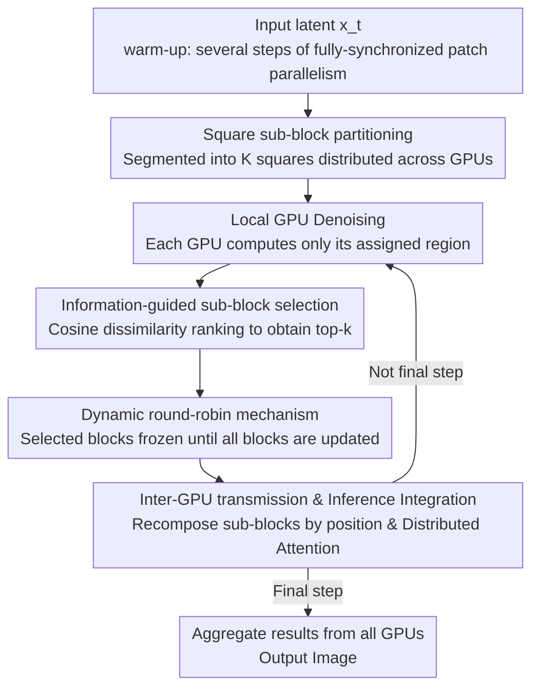

# Otil: Accelerating Diffusion Model Inference via Communication-Efficient Multi-GPU Parallelism

**Conference**: CVPR 2026  
**Thesis**: [CVF Open Access](https://openaccess.thecvf.com/content/CVPR2026/html/Li_Otil_Accelerating_Diffusion_Model_Inference_via_Communication-Efficient_Multi-GPU_Parallelism_CVPR_2026_paper.html)  
**Code**: https://github.com/uplaoli/OTIL-PROJECT  
**Area**: Model Compression / Diffusion Model Inference Acceleration  
**Keywords**: Multi-GPU Parallelism, Diffusion Models, Communication Optimization, Inference Acceleration, Plug-and-Play

## TL;DR
Otil discovers that latent activations in adjacent steps of diffusion denoising change significantly only within a few spatial regions. Therefore, during multi-GPU parallel inference, it **transmits only a few sub-blocks with the largest changes**, while employing a dynamic round-robin mechanism to guarantee ultimate coverage of all regions. This reduces GPU-to-GPU communication overhead by up to 87.5%, achieving speedups of 1.8× (2 GPUs for SD1.5) to 2.6× (4 GPUs for SDXL) under PCIe interconnects, without requiring retraining and maintaining full compatibility with few-step samplers and LoRA.

## Background & Motivation
**Background**: Diffusion models yield stunning results in image/video generation but inherently rely on multi-step sequential denoising, leading to substantial cumulative latency. To reduce latency without altering the models, the most practical approach for industrial deployment is **multi-GPU parallelism**—distributing the computation of a single denoising step across multiple GPUs to compute simultaneously. Currently, mainstream parallel paradigms fall into two categories: patch-based methods (e.g., DistriFusion, which segments the image into patches and distributes them to each GPU) and pipeline-based methods (e.g., AsyncDiff, which partitions the denoising network into layers acting as pipeline stages).

**Limitations of Prior Work**: The sequential dependency in the denoising process makes it highly challenging to overlap computation and communication. At each step, each GPU must synchronize its calculated intermediate activations with other GPUs before proceeding to the next step. Consequently, patch-based methods broadcast the entire activation map at each step, while pipeline-based methods exchange all intermediate results among $p$ pipeline stages. This communication overhead is extremely expensive under low-bandwidth interconnects like PCIe, where **communication latency can offset the time saved by parallel computation**, a bottleneck that scales worse with more GPUs. Moreover, pipeline-based methods are incompatible with few-step samplers and require each GPU to hold an independent copy of the noise predictor, further limiting acceleration gains.

**Key Challenge**: The gains from parallelism arise from distributing computation across multiple GPUs, but this comes at the cost of requiring full activation synchronization at each step. **The lower the bandwidth and the more GPUs there are, the more this "full synchronization" becomes a bottleneck.** The root cause is the default assumption that "the entire activation must be transmitted to others at each step." However, does this premise truly hold?

**Goal**: To significantly reduce the communication volume of multi-GPU diffusion inference without requiring retraining, altering model architectures, or losing compatibility with accelerated samplers, whilst maintaining generation quality.

**Key Insight**: The authors observe two key facts: ① the difference in output activations between adjacent denoising steps is very small (retaining a low relative MAE of adjacent step latents); ② these differences are not uniformly distributed across the entire image, but are rather **concentrated in a small set of spatial regions**. Since only a few regions actually "change" at each step, transmitting the entire activation map results in a massive waste of resources.

**Core Idea**: Only Transmit Informative Latents (Otil)—each step only synchronizes the **few sub-blocks with the most intense changes** to other GPUs, while the remaining static regions directly reuse stale values. A dynamic round-robin scheduling mechanism is integrated to guarantee that every region eventually gets updated over time, ensuring no blind spots are permanently ignored.

## Method

### Overall Architecture
Otil uniformly segments the latent activations of an image into square sub-blocks, dividing them among multiple GPUs so that each computes its designated region. After each denoising step, each GPU selects only the top-$k$ sub-blocks within its assigned region that exhibit the "most significant changes" and transmits them to other GPUs. Upon receiving these, other GPUs insert them back into their own latents based on their spatial positions. This allows each GPU to maintain a "complete" full-image activation while transmitting only a small fraction of the data. The entire pipeline begins with a warm-up phase of a few fully-synchronized patch-parallel steps (ensuring each GPU obtains the complete initial latent), followed by the Otil main loop: local denoising $\to$ sub-block change computation $\to$ top-$k$ selection with dynamic round-robin scheduling $\to$ inter-GPU communication $\to$ reconstruction of the latent upon reception $\to$ proceeding to the next step. Finally, the results from all GPUs are aggregated before the final step.

### Key Designs

**1. Square Sub-block Partitioning: Providing Suitable Granularity for "Region-Based Transmission"**

To achieve "transmitting only modified regions," activations must first be segmented into units that can be individually measured and transmitted. Otil uniformly partitions the local latent activation $x_t^{(n)} \in \mathbb{R}^{C \times H \times W}$ on each GPU into $K$ non-overlapping square sub-blocks, using the operator $\Pi_i(\cdot)$ to extract the $i$-th sub-block. Why use square blocks instead of arbitrary shapes? The authors leverage the intuition of CNN receptive fields: visual activations possess locally clustered semantics, and square blocks maintain local spatial coherence, which fits the spatial organization of activations while providing a natural measurement and transmission unit for the subsequent "information-guided communication." The block size involves a trade-off: if it is too small, the number of blocks $K$ is large, increasing the overhead of cosine similarity calculations and sorting, which actually slows down communication; if it is too large, "subtle but critical local changes" may be entirely erased, resulting in lost details. The experiments eventually select $8 \times 8$.

**2. Information-Guided Sub-block Selection: Identifying "Truly Changed" Regions Using Adjacent-Step Similarity**

This is the core of Otil's communication savings. Based on the observation that adjacent steps change only in a few regions, after each denoising step, the cosine similarity (normalized by Frobenius inner product) between each sub-block and its corresponding sub-block from the previous step is calculated:

$$s_t^{(n)}(i) = \frac{\langle \Pi_i x_t^{(n)},\ \Pi_i x_{t+1}^{(n)} \rangle_F}{\|\Pi_i x_t^{(n)}\|_F \, \|\Pi_i x_{t+1}^{(n)}\|_F}$$

Defining the dissimilarity as $d_t^{(n)}(i) = 1 - s_t^{(n)}(i)$, the set of top-$k$ sub-blocks with the largest dissimilarity is selected as $\mathcal{A}_t^{(n)} = \mathrm{Topk}_i(d_t^{(n)}(i), k)$, and **only these $k$ sub-blocks are transmitted across GPUs**, while other GPUs reuse their stale values for the remaining blocks. The validity of transmitting only a subset stems from the diffusion update rule $x_{t-1} = \alpha_t x_t + \beta_t \hat\varepsilon_\theta(x_t, t)$: local variations in the noise prediction $\hat\varepsilon_\theta$ cause proportional changes in $x_{t-1}$ within roughly the same spatial region. Combined with the local smoothness of the LDM latent-to-image decoder, **sub-blocks with larger changes in the latent correspond closely to the regions undergoing actual evolution in the final image**. The authors also compared five sorting criteria: random, SSIM, cosine, mutual information, and dHash (measured by AUC to evaluate the alignment between latent and pixel changes). The results indicate that cosine similarity achieves the best alignment, validating the hypothesis that low-variation sub-blocks contribute negligibly to generation and can be safely bypassed during communication.

**3. Dynamic Round-Robin Mechanism: Preventing Starvation of Low-Variation Regions**

Relying solely on top-$k$ selection introduces a potential issue: certain regions might constantly exhibit large changes and get updated repeatedly, whereas other low-variation regions **might never rank in the top-$k$ and thus go long periods without serialization**, resulting in incomplete spatial coverage and lost details. A dynamic round-robin scheduling mechanism is used as a fallback: once a sub-block is selected in a given step, it is **temporarily frozen** and cannot be selected again until all other sub-blocks in the current round have been visited. Letting $\mathcal{U}_t$ denote the set of unvisited sub-blocks in the current round, the update rule is formulated as:

$$\mathcal{A}_t^{(n)} \subseteq \mathcal{U}_t, \qquad \mathcal{U}_{t+1} = \begin{cases} \mathcal{U}_t \setminus \mathcal{A}_t^{(n)}, & \mathcal{U}_t \neq \varnothing \\ \{1,2,\dots,K\}, & \text{otherwise} \end{cases}$$

In other words, the top-$k$ selection is restricted to the "unvisited set," which resets once a round is completed. This guarantees that **each sub-block is updated exactly once within a certain number of steps**, preserving global integrity while enabling local refinement under minimal communication overhead—resolving the conflict between reducing communication and preventing region omission.

**4. Inference Integration and Distributed Attention: Seamlessly Reconnecting Saved Transmissions to Standard Denoising**

Each GPU's input at the current step is assembled from three parts: ① its locally generated activation from the previous step, ② "stale" activations retained from earlier iterations (untransmitted regions reusing old values), and ③ newly received sub-blocks from other GPUs. Upon receipt, sub-blocks are re-embedded into $x_{t-1}$ according to their spatial positions, **reconstructing a complete, spatially coherent latent**. Despite transmitting only a small part, each GPU maintains a global perspective after integration. For attention, the distributed attention strategy from DistriFusion is adopted: each GPU retains the query tokens for its assigned region, while key/value tokens are shared across the entire latent. Consequently, the local denoising computation on each GPU matches the original diffusion model, and the computational load depends only on the size of its assigned region. This allows Otil to **preserve the inference semantics of standard diffusion**, making it naturally compatible with acceleration techniques such as few-step samplers (e.g., DPM-Solver, UniPC) and LoRA—something pipeline-based methods fail to achieve.

### Loss & Training
Otil is **fully training-free and architecture-agnostic**, directly acting on the inference phase of pre-trained diffusion models (e.g., SD1.5, SDXL, SD3) without any loss function. The only "warm-up" is that, except for the first step, 4 additional steps of synchronized patch parallelism are performed to ensure each GPU receives the complete initial latent before entering the main loop of transmitting only informative sub-blocks. The communication cost can be analytically compared: let the activation size be $M$, parallelism degree be $p$, and partition count be $K$ (with $k$ blocks transmitted). DistriFusion requires $(p-1)M$ per step, AsyncDiff requires $p(p-1)M$ per step, while Otil requires only $\frac{k}{K}(p-1)M$ per step. Setting $\frac{k}{K}=\frac{1}{4}$ saves 75% of communication compared to full exchange.

## Key Experimental Results

The evaluation is conducted on COCO Captions 2014 (randomly selecting 5000 image-caption pairs from the validation set) using A100 GPUs with PCIe interconnects, 50-step DDIM, and CFG=5. Five SOTA parallel baselines are compared: DistriFusion, AsyncDiff, ParaStep, PipeFusion, and CompactFusion.

### Main Results

| Base Model | GPUs | Method | Latency (s) ↓ | Speedup ↑ | FID ↓ | CLIP ↑ |
|----------|------|------|---------|----------|------|-------|
| SD1.5 512² | 1 | Original | 1.382 | 1× | – | 31.485 |
| SD1.5 512² | 2 | DistriFusion | 1.012 | 1.36× | 25.133 | 31.450 |
| SD1.5 512² | 2 | **Otil** | **0.794** | **1.74×** | 23.145 | 31.440 |
| SDXL 1024² | 2 | DistriFusion | 3.940 | 1.50× | 26.599 | 36.102 |
| SDXL 1024² | 2 | **Otil** | **3.140** | **1.88×** | 25.171 | 36.132 |
| SDXL 1024² | 4 | DistriFusion | 3.240 | 1.82× | 24.236 | 36.014 |
| SDXL 1024² | 4 | **Otil** | **2.650** | **2.23×** | 23.347 | 36.022 |
| SD3 (DiT) 1024² | 2 | PipeFusion | 2.626 | 1.12× | 20.159 | 31.247 |
| SD3 (DiT) 1024² | 2 | **Otil** | **1.711** | **1.72×** | 20.334 | – |

Otil achieves the lowest latency under all configurations. As the number of GPUs increases and communication becomes more dominant, Otil's advantage becomes more pronounced (with 4 GPUs on SDXL, it reaches 2.23×, superior to the baseline). The CLIP and FID scores are comparable to DistriFusion, remaining in the high-quality range relative to original diffusion. In terms of communication volume: at $\frac{k}{K}=\frac{1}{4}$, Otil saves **87.5% (2 GPUs) / 93.75% (4 GPUs)** compared to AsyncDiff and 75% compared to DistriFusion.

Compatibility (Table 2, SDXL/SD1.5 with fast samplers and LoRA):

| Base | Config | Original Speedup | Otil (2 GPUs) Speedup |
|------|------|------------------|-------------------|
| SDXL | + DPM-Solver (30 steps) | 1.69× | **2.79×** |
| SDXL | + UniPC (30 steps) | 1.66× | **2.84×** |
| SD1.5 | + LoRA (30 steps) | 1.78× | **2.46×** |

When combined with few-step samplers, the 2-GPU speedup further boosts to 2.46×–2.84×, with image content and fidelity remaining largely unchanged, demonstrating the plug-and-play compatibility afforded by maintaining standard inference semantics.

### Ablation Study

| Experiment | Variable | Conclusion |
|------|------|------|
| Transmitted sub-block ratio $\frac{k}{K}$ | 1/16 → 1/2 → Full | A smaller ratio saves more communication but reduces generation quality; $\frac14$ is the optimal trade-off between latency and fidelity (SD1.5 2-GPU: 13.70ms/LPIPS 0.0425 at 1/4 vs 16.23ms/0.0405 with full transmission). |
| Sub-block size | 4×4 / 8×8 / 16×16 | Sizes that are too small incur massive sorting overhead and slow down execution, while sizes that are too large lose details; $8 \times 8$ is overall optimal (SDXL 2-GPU 8×8: 27.53ms/LPIPS 0.0142). |
| Selection criterion | random / SSIM / cosine / mutual information / dHash | Cosine similarity achieves the best alignment between latent and pixel changes in terms of AUC, proving that "low-variation sub-blocks can be safely skipped". |

### Key Findings
- **Communication is the real bottleneck of multi-GPU diffusion**: The more GPUs and the lower the bandwidth, the more the full-synchronization overhead dominates. Otil's relative advantage widens as the GPU count increases (showing larger gains on 4 GPUs than on 2 GPUs compared to baselines).
- **The $\frac14$ ratio is the sweet spot**: Quality drops significantly below 1/4, while latency benefits diminish above 1/4. This ratio directly dictates the 75%/87.5%/93.75% communication savings.
- **Cosine similarity selection is theoretically grounded**: The diffusion update rule combined with the local smoothness of the LDM decoder ensures that sub-blocks with larger latent changes correspond to the regions undergoing actual evolution in pixel space. Thus, block selection is theoretically sound rather than purely empirical.
- **Dynamic round-robin is a quality insurance**: Without it, low-variation regions would be starved by the top-$k$ selection over long periods, sacrificing details. Its presence guarantees that every block is updated exactly once within $K$ steps.

## Highlights & Insights
- **Leveraging "adjacent-step redundancy" from the temporal dimension to the spatial dimension**: Many acceleration works exploit temporal similarity across adjacent steps for cache reuse (temporal redundancy). Otil further points out that this similarity is **spatially non-uniform**, which translates it into communication compression via "transmitting only a few spatial sub-blocks"—a highly clever perspective.
- **A lightweight yet critical safeguard in dynamic round-robin**: Pure top-$k$ selection causes "long-term starvation" of certain regions. The authors resolve this with an $O(1)$ loop freeze scheduler that ensures full coverage at virtually zero extra cost. This trick can be migrated to any "sparse selection with integrity requirements" scenario.
- **Training-free and preserving standard inference semantics brings true plug-and-play**: Since the denoising computations remain byte-for-byte identical to the original diffusion model, Otil can be directly combined with DPM-Solver, UniPC, and LoRA to further accelerate inference. This is far more practical than pipeline-based methods, which are incompatible with few-step samplers.
- **Analytical formulation of communication costs**: Defining the cost as $\frac{k}{K}(p-1)M$ clearly illustrates the exact amount saved and how it scales with $p$, $k$, and $K$, facilitating parameter tuning based on hardware bandwidth.

## Limitations & Future Work
- The authors acknowledge that Otil's generation quality is slightly lower than DistriFusion (e.g., SDXL 4-GPU LPIPS of 0.135 compared to DistriFusion's 0.069), presenting a trade-off between quality and communication; caution is advised for scenarios extremely sensitive to fidelity.
- The experiments focus heavily on PCIe low-bandwidth interconnects, which is the scenario where Otil benefits most. Under high-bandwidth interconnects like NVLink, where communication is no longer a major bottleneck, the acceleration gains might be significantly lower (no comparative results were provided).
- The warm-up phase still requires several fully-synchronized steps. In scenarios with very few denoising steps (few-step inference), the proportion of warm-up overhead increases, potentially diluting the gains. Exploring how to shorten or completely avoid warm-up is a promising direction.
- The top-$k$, $\frac{k}{K}$, and sub-block size are global, static hyperparameters, rather than adaptation over time-steps or image content. Since changes are typically more concentrated in later denoising steps, dynamically shrinking $k$ could theoretically yield further communication savings.

## Related Work & Insights
- **vs DistriFusion (patch-based methods)**: Both perform spatial patch partitioning and apply distributed attention. However, DistriFusion broadcasts the entire activation map $(p-1)M$ at each step, whereas Otil transmits only the top-$k$ sub-blocks $\frac{k}{K}(p-1)M$, reducing communication by 75% and lowering latency, at the cost of a minor reduction in quality.
- **vs AsyncDiff / PipeFusion (pipeline-based methods)**: These methods partition the denoising network into pipeline stages and exchange all intermediate results $p(p-1)M$ at every step. They are incompatible with few-step samplers and require redundant copies of the predictor on each GPU. Otil achieves a communication volume that is an order of magnitude lower (saving 87.5%–93.75%) and retains standard inference semantics to maintain compatibility with fast samplers.
- **vs CompactFusion (compressing communication content)**: CompactFusion compresses transmitted activations using low-bit quantization. Otil follows an orthogonal path of "reducing what is sent" rather than "compressing what is sent," meaning both principles can theoretically be integrated.

## Rating
- Novelty: ⭐⭐⭐⭐ Formulating "spatially non-uniform adjacent-step redundancy" as communication compression combined with a dynamic round-robin fallback represents a novel and self-consistent perspective.
- Experimental Thoroughness: ⭐⭐⭐⭐ Covers three base models (SD1.5, SDXL, SD3), 2/4 GPUs, 5 baselines, and three sets of ablation studies. However, it only evaluates under PCIe and lacks NVLink comparisons.
- Writing Quality: ⭐⭐⭐⭐ Clear motivation, with equations and diagrams well-integrated, though minor typos (e.g., "motheds", "mian") are present.
- Value: ⭐⭐⭐⭐ Training-free, plug-and-play, and compatible with fast samplers and LoRA, making it highly practical for low-bandwidth multi-GPU deployments.

<!-- RELATED:START -->

## Related Papers

- [\[ICML 2026\] Learned Subspace Compression for Communication-Efficient Pipeline Parallelism](../../ICML2026/model_compression/learned_subspace_compression_for_communication-efficient_pipeline_parallelism.md)
- [\[CVPR 2026\] PyramidalWan: On Making Pretrained Video Model Pyramidal for Efficient Inference](pyramidalwan_on_making_pretrained_video_model_pyramidal_for_efficient_inference.md)
- [\[ICLR 2026\] WINA: Weight Informed Neuron Activation for Accelerating Large Language Model Inference](../../ICLR2026/model_compression/wina_weight_informed_neuron_activation_for_accelerating_large_language_model_inf.md)
- [\[CVPR 2026\] Mitigating The Distribution Shift of Diffusion-based Dataset Distillation](mitigating_the_distribution_shift_of_diffusion-based_dataset_distillation.md)
- [\[CVPR 2026\] IMS3: Breaking Distributional Aggregation in Diffusion-Based Dataset Distillation](ims3_breaking_distributional_aggregation_in_diffusion-based_dataset_distillation.md)

<!-- RELATED:END -->
