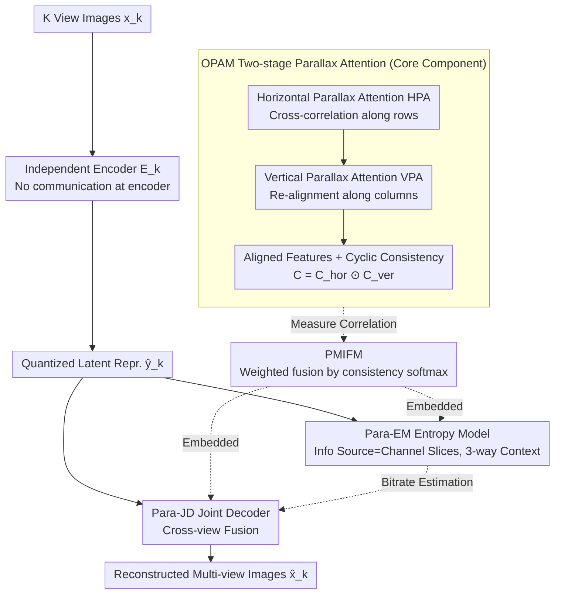

# Parallax to Align Them All: An OmniParallax Attention Mechanism for Distributed Multi-View Image Compression

**Conference**: CVPR 2026  
**arXiv**: [2603.03615](https://arxiv.org/abs/2603.03615)  
**Code**: None  
**Area**: Model Compression  
**Keywords**: Multi-view image compression, distributed coding, parallax attention, feature fusion, entropy model

## TL;DR

This paper proposes the OmniParallax Attention Mechanism (OPAM) for Distributed Multi-View Image Compression (DMIC). By explicitly modeling correlations and aligned features between arbitrary view pairs via two-stage parallax attention, the constructed ParaHydra framework enables DMIC methods to significantly outperform SOTA MIC encoders for the first time while substantially reducing computational overhead.

## Background & Motivation

**Background**: Multi-view image compression (MIC) exploits inter-view redundancies to improve efficiency in fields like autonomous driving and VR. Distributed MIC (DMIC) follows distributed source coding theory, where views are encoded independently and decoded jointly, requiring no cross-view communication at the encoder.

**Limitations of Prior Work**: LDMIC, the first end-to-end DMIC framework, uses average pooling to fuse multi-view features, treating all views equally. This ignores discrepancies in correlations between different views—for example, when reconstructing a floor area, views where the floor is visible and unoccluded should be prioritized over views where it is blocked by pedestrians.

**Key Challenge**: How to accurately measure and utilize semantic correlations between multiple information sources to achieve adaptive feature fusion rather than simple averaging.

**Goal**: (1) Efficiently capture inter-view correlations within the full 2D spatial context; (2) adaptively fuse multi-view features based on correlation; (3) simultaneously utilize cross-view information in both the joint decoder and the entropy model.

**Key Insight**: Starting from the Parallax Attention Mechanism (PAM) used in stereo matching—which only computes attention along horizontal epipolar lines—this work generalizes it to full 2D space by completing 2D context modeling in two stages: horizontal then vertical.

**Core Idea**: Implementing full 2D cross-view feature alignment and correlation measurement with $O(N^3)$ complexity through two-stage (horizontal + vertical) parallax attention, used for joint decoding and entropy modeling.

## Method

### Overall Architecture

ParaHydra addresses the problem of "independent encoding, aligned joint decoding" in DMIC. The workflow is as follows: each view image $x_k$ is independently compressed into a latent representation $y_k$ via its own encoder without inter-view communication; all quantized $y_k$ are fed into the joint decoder Para-JD, where cross-view features are aligned and fused for the first time to reconstruct the images; on the entropy coding side, Para-EM integrates channel, local spatial, and global spatial contexts to provide more accurate bitrate estimation. OPAM serves as the underlying component across Para-JD and Para-EM—whether aligning two views or two channel slices, it measures correlation and generates aligned features. Its output is wrapped by PMIFM into a general operator for "consistency-weighted fusion," embedded into Para-JD (fusing views) and Para-EM (fusing channel slices). The entire framework is trained end-to-end using an R-D loss.

### Key Designs

**1. OmniParallax Attention Mechanism (OPAM): Generalizing Parallax Attention to Full 2D Space**

PAM in stereo matching only searches for correspondences along horizontal epipolar lines, which suffices for rectified binocular setups. However, in DMIC, relative camera positions are arbitrary, and correspondences can exist in any row or column. Directly applying full 2D self-attention is infeasible due to $O(N^4)$ complexity. OPAM decomposes 2D alignment into two sequential 1D stages: Horizontal Parallax Attention (HPA), where each position in the main source performs cross-correlation only along the corresponding row of the side source to obtain horizontally aligned features $f_l^{hor}$, followed by Vertical Parallax Attention (VPA) to align these features along the column dimension. This achieves a receptive field covering the entire 2D side source with $O(N^3)$ complexity. To evaluate alignment reliability, OPAM uses cyclic consistency:

$$C_l = C_l^{hor} \odot C_l^{ver}$$

By performing element-wise multiplication of horizontal and vertical consistencies, the resulting $C_l$ is high only if a position corresponds stably in both directions; occluded or non-overlapping regions are suppressed. This consistency serves as the basis for fusion weights.

**2. Parallax Multi Information Fusion Module (PMIFM): Weighting Views by Correlation**

LDMIC uses average pooling for multi-view fusion, giving equal weight to all side sources. PMIFM leverages OPAM outputs: for each side source $f_k$, OPAM provides aligned features $f_k^t$ and consistency $C_k$. Consistencies are concatenated and passed through a softmax to obtain normalized weights $W$, followed by a weighted sum:

$$f_i^t = \sum_{k \neq i} W_k \cdot f_k^t$$

A lightweight fusion network then merges this result with the target view's original features. Views with rich information and fewer occlusions naturally receive higher weights, letting the data decide "who to trust."

**3. Parallax Entropy Model (Para-EM): Migrating Correlation Measurement to the Channel Dimension**

In Para-EM, PMIFM is integrated into the Parallax Channel Context Module (PCCM), redefining "information source" from "views" to "channel slices." The same two-stage parallax attention measures correlations between slices for adaptive aggregation. The Parallax Global Context Module (PGCM) reuses PCCM to extract global features across slices, followed by anchor/non-anchor attention. Channel, local spatial, and global spatial priors are fed together for tighter bitrate estimation. This reuse of OPAM validates its abstract generality across different data dimensions.

### Loss & Training

R-D Loss: $L = \lambda D + R = \lambda \sum_k d(x_k, \hat{x}_k) + \sum_k (R(\hat{y}_k) + R(\hat{z}_k))$. $\lambda \in \{1024, 2048, 4096, 8192\}$ for MSE and $\{32, 64, 128, 256\}$ for MS-SSIM. Trained for 1400 epochs on multi-view datasets and 3000 epochs on stereo datasets, using a learning rate of $10^{-4}$ on an A30 GPU.

## Key Experimental Results

### Main Results (BDBR relative to LDMIC, negative values indicate bitrate savings)

| Method | InStereo2K(2) | WildTrack(3) | WildTrack(6) | Mip-NeRF 360(3) |
|------|-------|-------|-------|-------|
| VVC | +48.68% | +49.47% | +25.16% | +7.14% |
| MV-HEVC | +84.84% | +31.84% | +10.01% | +41.15% |
| LDMIC | 0% | 0% | 0% | 0% |
| LMVIC | - | - | - | -14.30% |
| **ParaHydra** | **-6.92%** | **-19.72%** | **-24.18%** | **-18.20%** |

### Efficiency (InStereo2K 1024x832)

| Method | Enc Time (s) | Dec Time (s) | Param (M) | FLOPs (T) |
|------|---------|---------|---------|----------|
| LDMIC | 9.27 | 21.43 | 214.98 | 2.88 |
| **ParaHydra** | **0.27** | **0.33** | **105.25** | **1.78** |

### Key Findings

- ParaHydra is the first DMIC method to significantly outperform MIC encoders; on Mip-NeRF 360(4), it saves 34.11% bitrate compared to LMVIC.
- BDBR gains increase from -19.72% to -24.18% as the view count grows from 3 to 6, showing excellent scalability.
- Encoding is 34x faster, decoding is 65x faster, and parameters are halved compared to LDMIC.

## Highlights & Insights

- **General Two-stage Decomposition**: Decomposing 2D attention into horizontal and vertical 1D stages maintains $O(N^3)$ complexity and can be transferred to multi-camera 3D reconstruction or multi-sensor fusion.
- **Flexible Information Source Definition**: OPAM is used not only for inter-view modeling but also for context modeling between channel slices, demonstrating high mechanism generality.

## Limitations & Future Work

- Use of independent encoders means parameter counts scale linearly with the number of views.
- Cyclic consistency may fail in regions with severe occlusion or no overlap.
- Only validated on fixed multi-camera scenes; dynamic views or large baseline variations remain untested.

## Related Work & Insights

- **vs LDMIC**: Average pooling → OPAM+PMIFM adaptive fusion. BDBR savings of 19-24%, with 34-65x speedup.
- **vs LMVIC**: While LMVIC relies on 3D Gaussian priors at the encoder (MIC paradigm), ParaHydra (DMIC) outperforms it on the Mip-NeRF 360 dataset.

## Rating

- Novelty: ⭐⭐⭐⭐ Theoretical grounding for the two-stage 2D generalization of PAM.
- Experimental Thoroughness: ⭐⭐⭐⭐⭐ 4 datasets, varied view counts, and detailed efficiency/ablation analysis.
- Writing Quality: ⭐⭐⭐⭐ Rigorous derivations and clear architectural diagrams.
- Value: ⭐⭐⭐⭐ Significant milestone for DMIC surpassing MIC performance.

<!-- RELATED:START -->

## Related Papers

- [\[CVPR 2026\] Distributed Image Compression with Multimodal Side Information at Extremely Low Bitrates](distributed_image_compression_with_multimodal_side_information_at_extremely_low_.md)
- [\[AAAI 2026\] HCF: Hierarchical Cascade Framework for Distributed Multi-Stage Image Compression](../../AAAI2026/model_compression/hcf_hierarchical_cascade_framework_for_distributed_multi-stage_image_compression.md)
- [\[CVPR 2026\] Frequency Switching Mechanism for Parameter-Efficient Multi-Task Learning](frequency_switching_mechanism_for_parameter-ecient_multi-task_learning.md)
- [\[CVPR 2026\] Differentiable Vector Quantization for Rate-Distortion Optimization of Generative Image Compression](differentiable_vector_quantization_for_rate-distortion_optimization_of_generativ.md)
- [\[CVPR 2026\] MambaSIC: Mamba-based Stereo Image Compression with Bi-directional Multi-reference Entropy Model](mambasic_mamba-based_stereo_image_compression_with_bi-directional_multi-referenc.md)

<!-- RELATED:END -->
