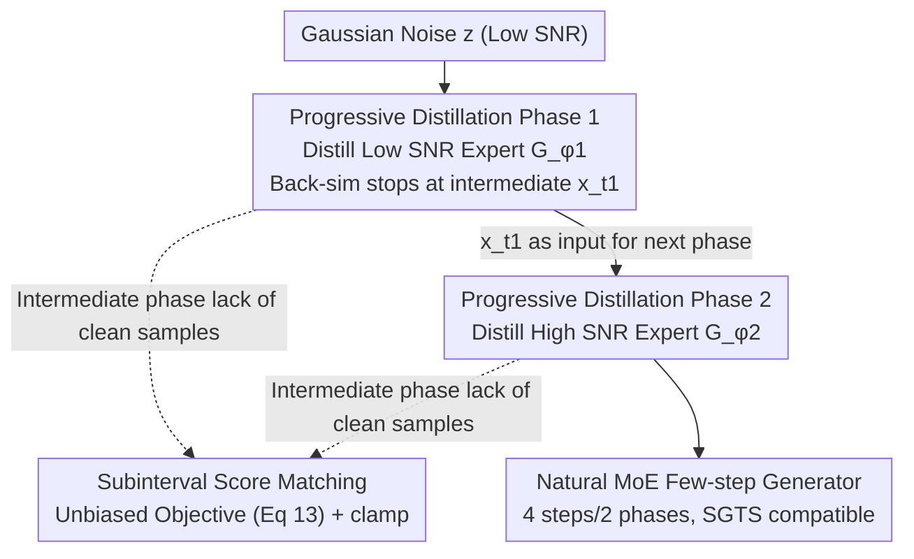

# Phased DMD: Few-step Distribution Matching Distillation via Score Matching within Subintervals

**Conference**: CVPR 2026  
**Paper**: [CVF Open Access](https://openaccess.thecvf.com/content/CVPR2026/html/Fan_Phased_DMD_Few-step_Distribution_Matching_Distillation_via_Score_Matching_within_CVPR_2026_paper.html)  
**Code**: https://x-niper.github.io/projects/Phased-DMD/  
**Area**: Diffusion Model Distillation / Model Acceleration  
**Keywords**: Diffusion Model Distillation, Few-step Generation, Distribution Matching Distillation, SNR Subintervals, Mixture-of-Experts (MoE)

## TL;DR
Addressing the dilemma where 1-step DMD distillation suffers from insufficient capacity and poor diversity, while direct multi-step expansion leads to VRAM explosion or performance degradation back to 1-step levels when using Stochastic Gradient Truncation (SGTS), this paper proposes Phased DMD. By partitioning the SNR range into subintervals and distilling one expert per phase moving progressively towards higher SNR (with intermediate phases stopping at intermediate timesteps rather than clean samples), the authors derive an unbiased subinterval score matching objective for scenarios lacking clean samples. This naturally produces few-step MoE generators that improve motion dynamics, visual fidelity, and generation diversity on large models such as Qwen-Image-20B and Wan2.2-28B.

## Background & Motivation
**Background**: Step distillation methods based on Variational Score Distillation (VSD), such as diff-instruct, DMD, and SID, can distill score models into single-step generators. Notably, DMD does not require a one-to-one correspondence with the teacher's sampling trajectories.

**Limitations of Prior Work**: 1-step distilled models have limited network capacity, leading to a decline in diversity and performance drops in complex tasks (e.g., intricate text rendering, dynamic scene generation). Directly expanding DMD to multiple steps causes the computational graph depth to increase linearly with the number of steps, resulting in high VRAM overhead and training instability, making it difficult to scale to large models and video tasks.

**Key Challenge**: While multi-step iteration is needed for capacity and diversity, back-simulation across multiple steps brings VRAM and stability disasters. Existing mitigation techniques—like the Stochastic Gradient Truncation Strategy (SGTS) in DMD2/Self-Forcing, which randomly terminates at some step and only backpropagates the gradient for the last step—collapse into 1-step distillation when $j=1$. Consequently, few-step generators trained with SGTS see their diversity and video motion dynamics pulled down to the level of 1-step models.

**Goal**: To control VRAM via gradient truncation while avoiding 1-step degradation, preserving generation diversity and motion dynamics, and achieving scalable distillation for large generative models and video tasks.

**Key Insight**: Diffusion theory indicates the existence of infinite score estimators across different Signal-to-Noise Ratios (SNR). Low SNR stages establish structure and dynamics, while high SNR stages refine details. Recent works have utilized Mixture-of-Experts (MoE) to assign experts to different SNRs to increase capacity. Based on this, the authors propose a "phased" distillation process based on SNR.

**Core Idea**: Replace "all-in-one multi-step distillation" with "phased progressive distillation via SNR subintervals." Only one expert is distilled per phase, and back-simulation stops at an intermediate SNR instead of a clean state. An unbiased subinterval training objective is derived for intermediate stages where clean samples are unavailable.

## Method

### Overall Architecture
Phased DMD decomposes N-step distillation into several phases, starting from noise $z$ (low SNR) and progressively pushing the generator toward higher SNR. Phase $k$ trains only one expert $G_{\phi_k}$, which maps the distribution $p(x_{t_{k-1}})$ to $p(x_{t_k})$. Back-simulation $x_{t_k}=\text{pipeline}_k(z)$ stops at an intermediate time $t_k$ (not the clean sample $x_0$), where the generator minimizes the reverse KL divergence. Since clean samples are unavailable for intermediate stages, the pseudo-score estimator $F_{\theta_k}$ is trained using a "subinterval score matching" objective. At the start of each phase, $F_{\theta_k}$ is initialized from the frozen teacher $T_{\hat\theta}$. This process naturally yields a few-step MoE generator (e.g., 4 steps / 2 phases when aligned with the dual-expert architecture of Wan2.2) and can be combined with SGTS:

### Key Designs

**1. Progressive Distribution Matching: Pushing the generator toward higher SNR in phases with intermediate supervision to avoid 1-step degradation**

Addressing the pain point that SGTS collapses into 1-step distillation, Phased DMD does not distill the entire trajectory at once. Instead, it operates in phases: each phase distills an expert responsible for a specific SNR subinterval, gradually moving toward higher SNR. The key modification is the endpoint of back-simulation—where previous works generated $x_0$ and then added noise back to $x_t$, this work changes the back-simulation to output an **intermediate sample** $x_{t_k}=\text{pipeline}_k(z)$. Then, noise is added based on $s=t_k$, with $t$ sampled from the subinterval $(t_k, 1)$. The generator objective for phase $k$ is:
$$\nabla_{\phi_k} D_{KL}\approx \mathbb E\big[w_{t|t_k}\big(T_{\hat\theta}(x_t,t)-F_{\theta_k}(x_t,t)\big)\tfrac{dG}{d\phi_k}\big],\quad w_{t|t_k}=\tfrac{\alpha_t\alpha_{t|t_k}}{\alpha_t\sigma_t+\sigma_t^2}.$$
Because the intermediate phase stops at $t_k$ and does not rely on the clean state $x_0$, the path to SGTS-style "$j=1$ degradation" is eliminated. Each phase contains only one sampling step with a gradient, keeping VRAM requirements comparable to 1-step distillation. This progressive idea is analogous to ProGAN, but differs from "progressive distillation," which aims to halve sampling steps each phase. Sampling $t$ from $(t_k, 1)$ instead of $(t_k, t_{k-1})$ proved more compatible with this architecture.

**2. Subinterval Score Matching: Scaling to "clean-sample-free" scenarios with an unbiased objective to preserve DMD theory**

The central challenge of the progressive framework is that clean samples $x_0$ are unavailable for all stages except the last. The standard DMD objective for training pseudo-score models (which depends on $x_0$) fails. DMD convergence relies on two assumptions: A1 (pseudo-score convergence) and A2 (unbiased pseudo-score). A2 requires the coefficients of the pseudo and true scores to be aligned. Based on this, the authors derive an unbiased objective for the diffusion model $\psi$ on the subinterval $t\sim T(s, 1)$:
$$\mathbb E\Big[\big\|\psi(x_t,t)-\big(\tfrac{\alpha_s^2\sigma_t+\alpha_t\sigma_s^2}{\alpha_s^2\sigma_{t|s}}\epsilon-\tfrac{1}{\alpha_s}x_s\big)\big\|^2\Big].$$
Since $\sigma_{t|s}\to 0$ as $t\to s$ causes numerical instability, a clamp term $\text{clamp}(\tfrac{1}{\sigma_{t|s}^2})$ (limited to $[0, 10]$) is added to the loss. A 1D toy experiment ($x_0\in\{-1,0,1,2\}$, 4-layer MLP) verified that training on the subinterval $(0.5, 1]$ with this unbiased objective yields sampling trajectories nearly identical to the full-interval standard objective, while a biased objective ($\|\psi(x_t,t)-(\epsilon-x_s)\|^2$) fails. $F_{\theta_k}$ is trained on $(t_k, 1]$ with this objective during each phase, satisfying A2.

**3. Natural MoE Few-step Generator: Generating multi-experts via phases by design**

Since each phase independently trains an expert for a specific SNR subinterval, Phased DMD **naturally produces a few-step MoE generator regardless of whether the teacher is an MoE model**, increasing capacity without increasing inference cost. This aligns with diffusion characteristics: the low SNR phase establishes composition/motion structure, after which the expert is frozen, and the high SNR expert is trained longer to refine lighting and texture without disrupting the layout (Fig 7). This also mitigates diversity/motion decay caused by the mode-seeking tendency of reverse KL. Additionally, the framework can be combined with SGTS to train a 4-step generator in 2 phases, simplifying overall complexity.

### Loss & Training
Data-free distillation without GAN or regression losses. Experiments used 64 GPUs with FSDP and gradient checkpointing, adding context parallelism for video tasks. Batch size 64; pseudo-score model LR $4\times10^{-7}$ (full parameter); generator LR $5\times10^{-5}$ (LoRA, rank=64, $\alpha=8$); AdamW optimizer. Euler solver for back-simulation. Pseudo-score model updated 5 times per generator update. Wan2.2 dual-expert alignment used 4 steps / 2 phases.

## Key Experimental Results

> Metric descriptions: **OF** = average optical flow magnitude via UniMatch (motion intensity, higher is stronger); **DD** = Dynamic Degree via VBench; **FID/FVD** = Distribution distance between distilled and base models (lower is closer to base); **DINOv3** = Average pairwise cosine similarity of DINOv3 features for different seeds of the same prompt (lower is more diverse); **LPIPS** = Average pairwise perceptual distance (higher is more diverse).

### Main Results (Video Generation, Distilling Wan2.2-T2V/I2V-A14B, 4 steps vs. Base 40 steps)

| Task | Method | OF↑ | DD↑ | FID↓ | FVD↓ |
|------|------|------|------|------|------|
| T2V | Base (40 steps) | 10.26 | 79.55% | 0.0 | 0.0 |
| T2V | DMD2 | 3.23 | 65.45% | 55.70 | 763.1 |
| T2V | **Phased DMD** | **9.30** | **82.27%** | **47.24** | **700.9** |
| I2V | Base (40 steps) | 9.32 | 82.27% | 0.0 | 0.0 |
| I2V | DMD2 | 7.87 | 80.00% | 18.45 | 370.0 |
| I2V | **Phased DMD** | **9.84** | **83.64%** | **17.47** | **334.7** |

Key Point: The motion intensity of DMD2 (OF 3.23) degrades significantly compared to the base (10.26), a manifestation of the SGTS 1-step collapse. Phased DMD restores OF to 9.30 and DD even slightly exceeds the base, while FID/FVD are closer to the base, demonstrating superior preservation of motion dynamics and quality.

### Diversity Analysis (T2I, 8 seeds per prompt)

| Method | Wan2.1 DINOv3↓ | Wan2.1 LPIPS↑ | Wan2.2 DINOv3↓ | Wan2.2 LPIPS↑ |
|------|------|------|------|------|
| Base | 0.708 | 0.607 | 0.732 | 0.531 |
| Vanilla DMD | 0.825 | 0.522 | — | — |
| DMD2 | 0.826 | 0.521 | 0.828 | 0.447 |
| **Phased DMD** | **0.782** | **0.544** | **0.768** | **0.481** |

Key Point: The base model has the highest diversity. Phased DMD outperforms vanilla DMD and DMD2 on both metrics, better preserving the base model's generation diversity. Improvements on Qwen-Image were smaller, attributed by authors to the limited diversity of that base model.

### Key Findings
- The root cause of motion/diversity degradation is the 1-step collapse of SGTS: Phased DMD eliminates this path by ensuring intermediate stages do not rely on $x_0$, leading to a recovery in OF/DD/diversity.
- The "unbiasedness" of the subinterval objective is essential: 1D toy experiments show that using a biased objective leads to trajectory deviation, validating the necessity of the A2 assumption.
- MoE is a byproduct of the phased approach, not extra parameterization: For Wan2.2-T2V-A14B (already an MoE), both standard DMD and Phased DMD result in two-expert models with identical parameter budgets; the performance gain stems from the distillation paradigm.
- Some VBench metrics are deemed less reliable, as they consistently ranked the base model lowest (contrary to human preference).

## Highlights & Insights
- Integrates "phased progressive training by SNR" with "MoE capacity enhancement": Each phase's expert naturally acts as an MoE component without increasing inference cost—a clever adaptation of ProGAN concepts to diffusion distillation.
- The theoretical core is the unbiased subinterval score matching objective (Eq 11/13 + clamp), providing theoretical consistency for phased training where clean samples are missing, giving it an advantage over similar methods like TDM.
- "Intermediate supervision" is a transferable concept: Any scenario requiring multi-step distillation while avoiding 1-step collapse or VRAM issues can benefit from stopping back-simulation at intermediate SNRs and calculating KL there.

## Limitations & Future Work
- Gains depend on base model diversity: Improvements are less pronounced for models like Qwen-Image that have inherently limited output variety.
- Primarily improves structural aspects (composition, motion, camera control); pure detail/texture gains were not the primary focus.
- High training costs (64 GPUs, dual-experts, 4-step/2-phase) create a high barrier to reproduction. Future work includes combining with other objectives like Fisher divergence from SiD or introducing pre-generated trajectory data.
- Dependence on metrics like VBench, whose reliability is questioned by the authors, necessitates cautious interpretation of quantitative results.

## Related Work & Insights
- **vs. Single-step DMD / DMD2**: These use 1-step distillation or SGTS-based few-step distillation, leading to 1-step collapse and loss of diversity/motion. Phased DMD avoids this through intermediate supervision.
- **vs. TDM**: Both expand DMD to few-step, but TDM lacks theoretical support for its pseudo-flow training. Phased DMD derives an unbiased objective and naturally produces MoE.
- **vs. MoE Diffusion Models**: Previous work assigned experts to SNRs to increase capacity; this work "distills" that property—the distillation process itself yields the MoE.
- **vs. ProGAN / Progressive Distillation**: Borrows the progressive training concept from ProGAN but differs from progressive distillation's goal of halving steps per phase.

## Rating
- Novelty: ⭐⭐⭐⭐⭐ The combination of phased training, unbiased subinterval objectives, and natural MoE is a paradigm-level improvement for DMD few-step distillation.
- Experimental Thoroughness: ⭐⭐⭐⭐ Covers T2I/T2V/I2V across multiple large models with toy experiments. Some metrics are noted as questionable by the authors.
- Writing Quality: ⭐⭐⭐⭐ Clear motivation and theoretical derivation, though dense formulas and complex figures present a learning curve.
- Value: ⭐⭐⭐⭐⭐ Highly practical for scalable few-step distillation of large video/image models.

<!-- RELATED:START -->

## Related Papers

- [\[CVPR 2026\] Adaptive Video Distillation: Mitigating Oversaturation and Temporal Collapse in Few-Step Generation](adaptive_video_distillation_mitigating_oversaturation_and_temporal_collapse_in_f.md)
- [\[CVPR 2026\] Dataset Distillation by Influence Matching](dataset_distillation_by_influence_matching.md)
- [\[CVPR 2026\] DMGD: Train-Free Dataset Distillation with Semantic-Distribution Matching in Diffusion Models](dmgd_train-free_dataset_distillation_with_semantic-distribution_matching_in_diff.md)
- [\[ICLR 2026\] Distillation of Large Language Models via Concrete Score Matching](../../ICLR2026/model_compression/distillation_of_large_language_models_via_concrete_score_matching.md)
- [\[CVPR 2026\] Beyond Soft Label: Dataset Distillation via Orthogonal Gradient Matching](beyond_soft_label_dataset_distillation_via_orthogonal_gradient_matching.md)

<!-- RELATED:END -->
