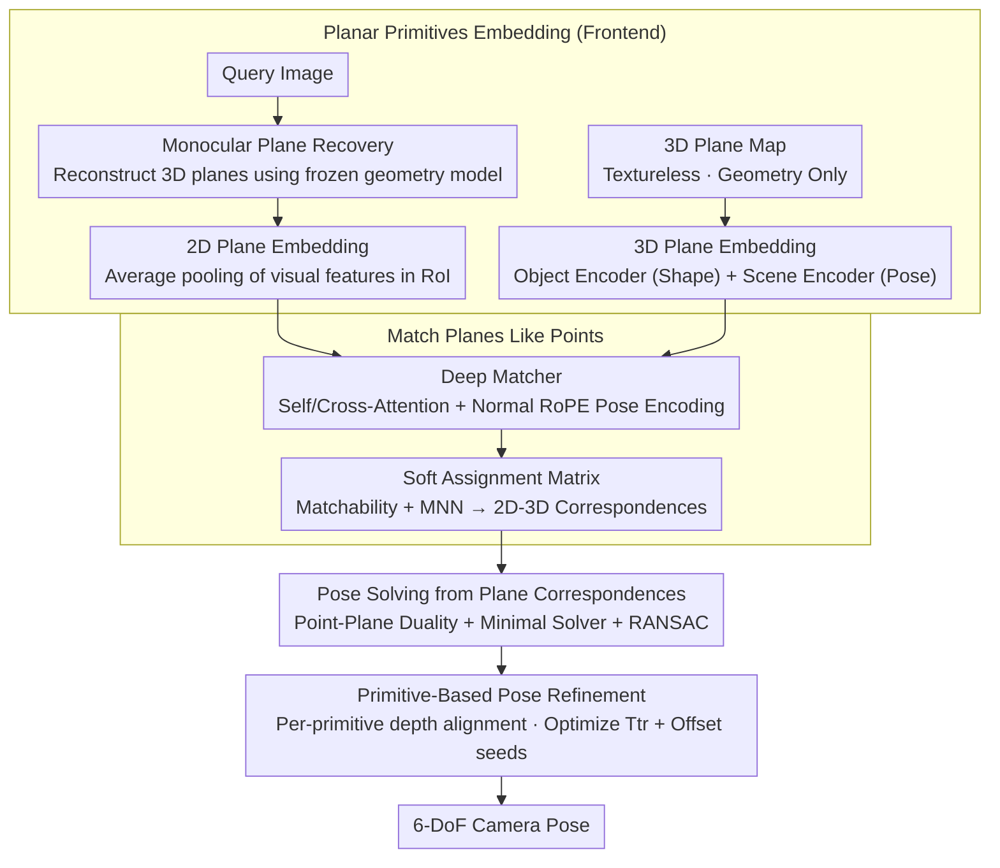

# PlanaReLoc: Camera Relocalization in 3D Planar Primitives via Region-Based Structure Matching

**Conference**: CVPR 2026  
**arXiv**: [2603.20818](https://arxiv.org/abs/2603.20818)  
**Code**: [https://github.com/3dv-casia/PlanaReLoc](https://github.com/3dv-casia/PlanaReLoc) (Available, code release June, dataset already released)  
**Area**: Model Compression  
**Keywords**: Camera Relocalization, Planar Primitives, Structure Matching, 6-DoF Pose Estimation, Lightweight Map

## TL;DR

PlanaReLoc is proposed as the first camera relocalization paradigm based on planar primitives and 3D planar maps. By associating planar regions of a query image with map planar primitives in a unified embedding space via a deep matcher, it achieves lightweight 6-DoF camera relocalization without requiring real-textured maps, pose priors, or per-scene training.

## Background & Motivation

**Background**: Structure-based camera relocalization is a core task in visual localization, aiming to estimate the 6-DoF camera pose of a query image relative to a known 3D map. Mainstream methods primarily rely on point correspondences—establishing 2D-3D relationships between image feature points and 3D map points, then solving the pose via PnP+RANSAC.

**Limitations of Prior Work**: (1) Point-based methods rely heavily on reliable local feature extraction and matching, which frequently fail in texture-sparse, repetitive-texture, or significant lighting-change scenarios; (2) Building and maintaining detailed 3D point cloud maps incurs high storage costs and sensitivity to noise; (3) Real texture/color maps are required for visual matching, making it infeasible in scenarios with only structural information (e.g., CAD models, scanned meshes); (4) Many methods require per-scene training, leading to poor generalization.

**Key Challenge**: Point features are fragile during acquisition and matching, whereas the abundant planar structures (walls, floors, table tops, doors, etc.) in indoor structured environments are underutilized. As fundamental entities in projective geometry, planes contain richer structural and semantic information than points.

**Goal**: To verify whether planar primitives can replace traditional point features as more reliable primitives for establishing query-to-map correspondences in camera relocalization.

**Key Insight**: Planar primitives are region-based representations. Each plane contains not only geometric information (normal vector, distance to origin) but also semantic information (e.g., wall vs. floor) and topological information (spatial relationships between adjacent planes). This rich region-level representation is naturally suited for cross-modal matching (2D image planes vs. 3D map planes) as it does not rely on pixel-level textures.

**Core Idea**: Replace point features with planar primitives to establish a complete plane-centric relocalization paradigm encompassing plane detection, cross-modal plane matching, and pose solving.

## Method

### Overall Architecture

PlanaReLoc addresses whether "planes" can serve as basic units to establish correspondences between query images and 3D maps in structured indoor scenes. The pipeline follows the traditional "feature matching" framework but switches primitives from points to planes in four steps. **Planar Primitives Embedding (Frontend)**: The query side uses a frozen monocular geometric model to reconstruct the image into 3D planar primitives with parameters (normal, offset), followed by average pooling of visual features within the 2D Region of Interest (RoI) to obtain query embeddings. The map side planes, having geometry but no texture, use an object encoder (for shape) and a scene encoder (for spatial pose) to generate map embeddings. **Match Planes Like Points**: Both embeddings are fed into a Transformer stack for self-attention and cross-attention, combined with a RoPE pose encoding based on plane normals to output a soft assignment matrix. Correspondences are filtered via matchability scores and mutual nearest neighbor (MNN) criteria. **Pose Solving from Plane Correspondences**: A minimal solver is derived using the point-plane dual relationship in projective geometry, integrated with RANSAC to handle outliers for the initial 6-DoF pose. **Primitive-Based Pose Refinement**: Through per-primitive depth alignment, a pose increment and plane offset seeds are jointly optimized to tighten the pose. This process avoids pixel textures, enabling use even with textureless geometric maps.

### Key Designs

**1. Planar Primitives Embedding (Frontend): Projecting disparate 2D image planes and 3D map planes into a comparable embedding space.**

The challenge is that a wall region in a 2D image and the same wall in a 3D model share no pixel-level similarity, causing point matching to fail. PlanaReLoc bypasses texture by compressing both sides into embeddings. The query side uses a frozen monocular model to reconstruct 3D planar primitives from the image. Each query primitive carries metric-scale planar parameters $\pi^q$ and a 2D segmentation mask $\Omega^q$; query 2D plane embeddings $f^q$ are obtained by average pooling within each mask. The map side uses an object encoder for shape embeddings and a scene encoder for spatial embeddings, fused with a learnable $\alpha$ into map embeddings $f^m$. Matching is based on geometry rather than visual appearance.

**2. Match Planes Like Points: Relational reasoning via Transformer + Normal RoPE instead of contrastive learning.**

Planes have few instances (tens to hundreds) per scene and are category-agnostic entities with repetitive patterns (e.g., parallel walls). Contrastive loss struggles with "hard negatives." Hence, PlanaReLoc follows point matchers (like LightGlue) using $N$ Transformer layers with self and cross-attention to refine representation through "structural context." A key contribution is the Normal RoPE pose encoding $a_{ij}=q_i^\top\,\mathrm{RoPE}(n_j-n_i)\,k_j$ injected into single-modality self-attention, encoding relative rotation. This disambiguates repeating structures by their unique relative spatial relationships with other planes in the scene.

**3. Pose Solving from Plane Correspondences: Point-Plane Duality + Minimal Solver.**

Establishing poses from correspondences requires robustness to outliers and noise. PlanaReLoc utilizes the **dual relationship** in 3D projective space: under transformation, normals change by rotation $n^m=Rn^q$, while offsets depend on both rotation and translation $d^m=d^q-t^\top R n^q$. Rotation is uniquely determined by **two pairs of non-parallel** plane correspondences via RANSAC. Translation is solved using **at least three** non-parallel pairs through weighted least squares, simultaneously estimating a scale factor $s$ to compensate for monocular metric ambiguity.

**4. Primitive-Based Pose Refinement: Per-primitive depth alignment.**

Initial poses are further refined using **depth alignment**. Each query plane generates a depth patch based on its parameters and 2D region, which is warped to its rendered depth $D$ under the initial pose $P_0$. The optimization minimizes the difference between warped projected depth and rendered depth. The variables include a pose increment $T_{tr}$ and offset seeds $\{\delta_i\}$ for each plane, effectively correcting noisy planar parameters while refining the pose.

### Loss & Training

The matching network does **not** use contrastive loss. Instead, it maximizes the log-likelihood of the assignment matrix, supervising both correct correspondences and "unmatchable" predictions:

$$\mathcal{L}_{\text{match}} = -\Big[\tfrac{1}{|\mathcal{M}^*|}\!\!\sum_{(i,j)\in\mathcal{M}^*}\!\!\log A_{ij} + \tfrac{1}{2|\mathcal{U}^q|}\!\sum_{i\in\mathcal{U}^q}\!\log(1-\sigma_i^q) + \tfrac{1}{2|\mathcal{U}^m|}\!\sum_{j\in\mathcal{U}^m}\!\log(1-\sigma_j^m)\Big]$$

Where $A_{ij}$ is the soft assignment matrix element, $\sigma$ is the matchability score, and $\mathcal{U}^q/\mathcal{U}^m$ are unmatchable sets. Ground-truth (GT) correspondences are generated online by projecting map planes onto training images and matching masks by IoU. Supervision is applied at every Transformer layer. The model is trained once on ScanNet and generalizes to all test scenes without per-scene fine-tuning.

## Key Experimental Results

### Main Results (ScanNet Dataset, across hundreds of scenes)

| Method | Type | Median Translation Error (cm) ↓ | Median Rotation Error (°) ↓ | 5cm/5° Recall ↑ | Requires Texture Map |
|------|------|-------------------|-------------------|---------------|------------|
| HLoc + SuperPoint | Point-based | ≈5-8 | ≈1.5-3.0 | High | Yes |
| ACE | Scene Coord Reg | ≈3-5 | ≈1.0-2.0 | High | Per-scene train |
| FocusTune | Fine-tuning | Moderate | Moderate | Moderate | Yes |
| **Ours** | **Plane-based** | **Competitive** | **Competitive** | **Competitive** | **No** |

Note: The advantage of PlanaReLoc lies in achieving competitive accuracy in a minimalist setting **without real texture maps, pose priors, or per-scene training**.

### Ablation Study (12Scenes Dataset)

| Configuration | Median Trans. Error ↓ | Median Rot. Error ↓ | Explanation |
|------|--------------|--------------|------|
| Full PlanaReLoc | Lowest | Lowest | Complete model with structural context |
| w/o Structural Context | +15-25% | +10-20% | Single plane matching without adjacency |
| w/o Semantic Attributes | +10-15% | +8-12% | Matching using only geometry |
| w/o Pose Refinement | +20-30% | +15-25% | Using only RANSAC initial pose |
| Reduce Map Plane Density | Slight increase | Slight increase | Robustness to sparse primitives |

### Key Findings

- **Planar primitives are highly effective relocalization primitives in structured environments**: Floors and walls provide stable 2D-3D correspondences.
- **Significant map size reduction**: Planar maps are 1-2 orders of magnitude smaller than 3D point cloud maps.
- **The absence of texture requirement is a core advantage**: PlanaReLoc works directly with CAD models or depth scans where point-based methods fail.
- **Structural context significantly improves matching accuracy**: Essential for disambiguating scenes with few planes (<20).

## Highlights & Insights

- **Paradigm Innovation**: Proposes a completely new plane-centric paradigm from primitive selection to pose solving rather than modifying point-matching frameworks.
- **Strong Practicality**: Ideal for industrial scenarios where 3D maps come from CAD models or LiDAR scans (accurate geometry, no texture).
- **Lightweight**: Small map storage and fewer matching candidates (tens of planes vs. thousands of points) lead to high computational efficiency.
- **Ingenious Cross-Modal Matching**: Connects visually disparate 2D image regions and 3D geometry through a unified embedding space independent of visual similarity.

## Limitations & Future Work

- **Restricted to Structured Environments**: Inapplicable to natural outdoor scenes (e.g., forests, hills) lacking large planes.
- **Plane Detection Quality Bottleneck**: Heavily dependent on the precision and recall of the underlying DL-based plane detector.
- **Degenerate Cases**: Pose solving fails when fewer than 3 planes are visible or all planes are near-parallel, requiring fallback to point features.
- **Large-scale Scalability**: Matching efficiency needs optimization as plane counts scale from hundreds to thousands (e.g., via spatial indexing).

## Related Work & Insights

- **vs HLoc (Sarlin et al. 2019)**: PlanaReLoc simplifies map requirements by an order of magnitude compared to HLoc's hierarchical point matching.
- **vs ACE (Brachmann et al. 2023)**: Unlike ACE, PlanaReLoc generalizes directly without requiring minutes of per-scene training.
- **vs PlaneLoc etc.**: While prior works used planes as auxiliary constraints, PlanaReLoc is the first end-to-end relocalization method entirely centered on planes.
- **Insight**: Integrating planar primitives with line features could provide robust relocalization in semi-structured environments.

## Rating

- **Novelty**: ⭐⭐⭐⭐⭐ A complete first-of-its-kind plane-centric relocalization paradigm.
- **Experimental Thoroughness**: ⭐⭐⭐⭐ Evaluated across hundreds of scenes with multi-dataset validation.
- **Writing Quality**: ⭐⭐⭐⭐ Clear motivation with comprehensive technical details.
- **Value**: ⭐⭐⭐⭐ High industrial value for lightweight mapping and textureless localization.

<!-- RELATED:START -->

## Related Papers

- [\[CVPR 2026\] Dataset Distillation by Influence Matching](dataset_distillation_by_influence_matching.md)
- [\[CVPR 2026\] Phased DMD: Few-step Distribution Matching Distillation via Score Matching within Subintervals](phased_dmd_few-step_distribution_matching_distillation_via_score_matching_within.md)
- [\[CVPR 2026\] Mining Attribute Subspaces for Efficient Fine-tuning of 3D Foundation Models](mining_attribute_subspaces_for_efficient_fine-tuning_of_3d_foundation_models.md)
- [\[CVPR 2026\] 4D-RGPT: Toward Region-level 4D Understanding via Perceptual Distillation](4d_rgpt_toward_region_level_4d_understanding_via_perceptual_distillation.md)
- [\[CVPR 2026\] Beyond Soft Label: Dataset Distillation via Orthogonal Gradient Matching](beyond_soft_label_dataset_distillation_via_orthogonal_gradient_matching.md)

<!-- RELATED:END -->
