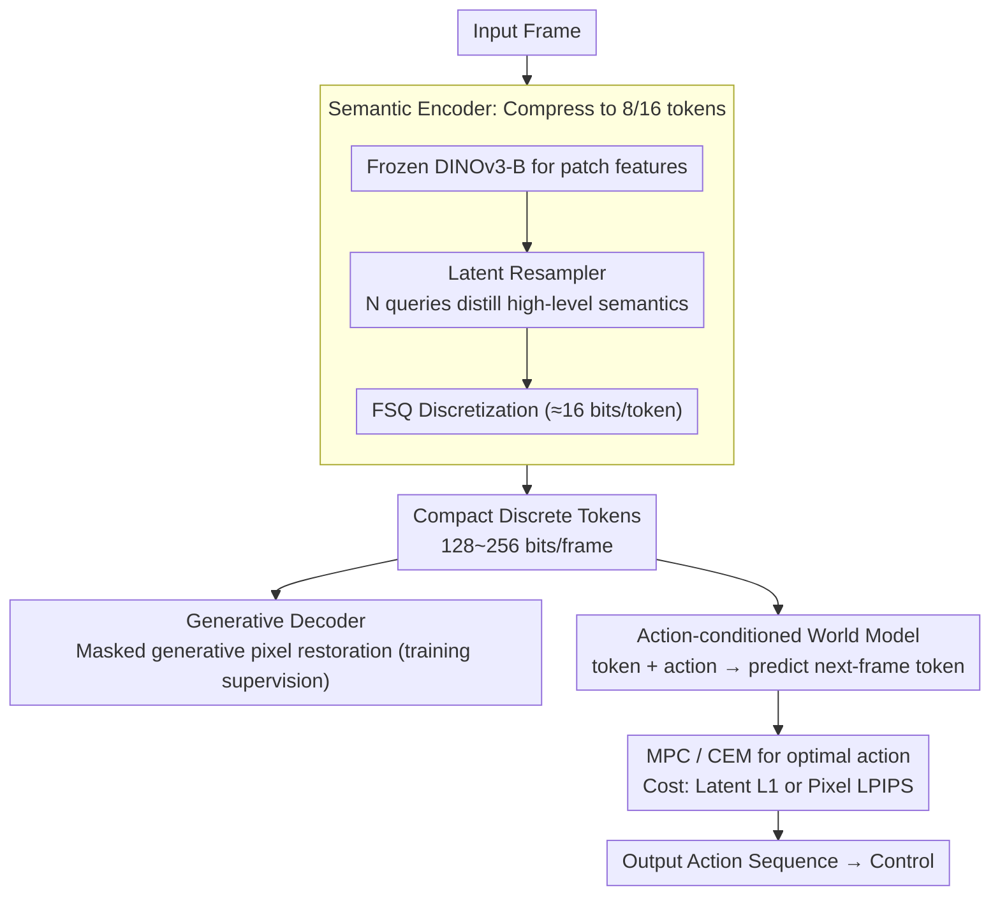

# Planning in 8 Tokens: A Compact Discrete Tokenizer for Latent World Model

**Conference**: CVPR2026  
**arXiv**: [2603.05438](https://arxiv.org/abs/2603.05438)  
**Code**: [kdwonn/CompACT](https://kdwonn.github.io/CompACT)  
**Area**: Model Compression / World Models / Representation Learning  
**Keywords**: Compact discrete tokenizer, world models, latent space planning, extreme compression, semantic encoding, generative decoding

## TL;DR

CompACT is proposed to compress each image into only 8 discrete tokens (approx. 128 bits). By freezing a pretrained visual encoder to preserve planning-critical semantic information and employing generative decoding to supplement perceptual details, it accelerates world model-based planning by ~40x without compromising accuracy.

## Background & Motivation

1.  **Planning bottleneck in world models**: Existing world models (e.g., NWM) encode each frame into hundreds of tokens (SD-VAE requires 784). The quadratic complexity of Attention leads to planning latencies as high as 3 mins/episode, making them unsuitable for real-time control.
2.  **Token count determines computational cost**: MPC planning requires massive forward inferences (~1920 rollouts), where the number of tokens directly limits throughput.
3.  **Reconstruction fidelity $\neq$ Planning requirements**: Traditional tokenizers prioritize high-frequency details like texture and lighting, whereas planning tasks only require high-level semantics such as spatial layouts and object relationships.
4.  **Iteration overhead of diffusion models**: Continuous latent spaces necessitate hundreds of denoising steps, further slowing down planning.
5.  **Limitations of Prior Work**: 1D tokenizers like FlexTok support variable lengths but still target reconstruction fidelity rather than planning-oriented optimization.
6.  **Information theory support for extreme compression**: The authors prove from a mutual information perspective that the minimum entropy for a sufficient representation in planning satisfies $H(\mathbf{a}^*)$, which is much smaller than $H(\mathbf{o})$, theoretically requiring only about a hundred bits.

## Method

### Overall Architecture

CompACT addresses the slow planning speed of world models. Key Insight: "Reconstruction fidelity $\neq$ planning requirements"—planning only needs high-level semantics like spatial layouts. The pipeline consists of three steps: (a) Training the CompACT tokenizer to compress a frame into 8/16 discrete tokens; (b) Training an action-conditioned world model in this minimal latent space; (c) Performing MPC (CEM optimization) in the latent space during inference. The compression to 8 tokens is supported by the theory that the minimum entropy for planning $H(\mathbf{a}^*)$ is significantly lower than the complete observation entropy $H(\mathbf{o})$.

The CompACT tokenizer includes an encoder (Design 1, compressing frames to discrete tokens) and a decoder (Design 2, treating pixel reconstruction from 8 tokens as an under-determined problem solved via generative modeling). The downstream world model and planning constitute Design 3. The data flow is as follows:

### Key Designs

**1. Semantic Encoder: Frozen foundation model distilling planning-oriented semantics**

To compress a frame into 8 tokens without losing planning information, CompACT uses a frozen DINOv3-B to extract patch features (fine-tuning actually degrades rFID from 2.40 to 5.22 by destroying learned semantic abstractions). A Latent Resampler with $N$ learnable query tokens ($N=8$ or $16$) distills high-level semantics via cross-attention. These are discretized using Finite Scalar Quantization (FSQ, levels $[8,8,8,5,5,5]$, ~16 bits/token), resulting in 128~256 bits for the entire frame. Since foundation models already extract high-level features, the cross-attention naturally discards low-level details.

**2. Generative Decoder: Masked generative modeling for under-determined reconstruction**

Reconstructing pixels from 8/16 tokens is ill-posed for standard feed-forward networks (rFID drops from 2.40 to 28.80 in ablation). CompACT uses MaskGIT VQGAN (196 tokens/frame) as the target tokenizer and employs masked generative modeling to recover perceptual details. During training, target tokens are randomly masked and recovered conditioned on compact tokens; the loss is $\mathcal{L}_{\text{tok}} = -\mathbb{E}[\log p(\mathbf{z}^\psi | \mathbf{z}, M(\mathbf{z}^\psi))]$. Inference uses iterative unmasking, avoiding the hundreds of steps required by continuous diffusion models.

**3. Action-conditioned world model in compact latent space**

The world model predicts the next frame directly within the 8/16 token latent space. For navigation, an autoregressive DiT with a fixed history window and random history masking (inspired by diffusion forcing) is used. For robotics, a block-causal transformer predicts multiple frames in parallel. The world model loss is $\mathcal{L}_{\text{world}} = -\mathbb{E}[\log p(\mathbf{z}_{t+1} | \mathbf{z}_t, \mathbf{a}_t, M(\mathbf{z}_{t+1}))]$. During planning, CEM searches for the optimal action sequence. Costs can be calculated in pixel space (LPIPS) or latent space (L1)—the latter reduces latency from 5.78s to 2.15s.

## Key Experimental Results

### Main Results (ImageNet Validation Set)

| Tokenizer | Type | #tok | rFID↓ | IS↑ |
|---|---|---|---|---|
| SD-VAE | Continuous | 1024 | 0.64 | 223.8 |
| MaskGIT-VQGAN | Discrete | 256 | 1.83 | 186.7 |
| FlexTok | Discrete | 16 | 5.60 | 114.9 |
| **Ours (CompACT)** | **Discrete** | **16** | **2.40** | **209.0** |
| **Ours (CompACT)** | **Discrete** | **8** | **3.21** | **207.5** |

### Navigation Planning (RECON Benchmark)

| Tokenizer | #tok | ATE↓ | RPE↓ | Latency(s)↓ |
|---|---|---|---|---|
| SD-VAE | 784 | 1.262 | 0.354 | 178.78 |
| FlexTok | 64 | 1.484 | 0.400 | 16.68 |
| FlexTok | 16 | 1.625 | 0.446 | 14.48 |
| **Ours (CompACT)** | **16** | **1.330** | **0.390** | **5.78** |
| **Ours (CompACT)** | **8** | **1.373** | **0.401** | **4.83** |

CompACT-16 is **~31x** faster, and CompACT-8 is **~37x** faster than SD-VAE, with comparable accuracy.

### Ablation Study

- **Without generative decoding** (single-step feed-forward): rFID surged from 2.40 to 28.80.
- **Unfrozen DINOv3 fine-tuning**: rFID degraded to 5.22, and planning ATE degraded from 1.330 to 1.472.
- **History masking**: Disabling it degraded ATE from 1.330 to 1.480.
- **Latent space cost function**: ATE slightly increased (1.379 vs 1.330), but latency dropped from 5.78s to 2.15s (overall ~80x over SD-VAE).

### Action-conditioned Video Prediction (RoboNet)

| Model | #tok | APE↓ | Latency(s)↓ |
|---|---|---|---|
| MaskGIT-VQGAN | 256 | 0.3383 | 3.826 |
| **Ours (CompACT)** | **16** | **0.1122** | **0.740** |

APE decreased by 3x and speed increased by 5.2x, validating the preservation of action-relevant info.

## Highlights

1.  **Extreme Compression Ratio**: Encoding a frame into 8 tokens / 128 bits represents a ~100x compression relative to SD-VAE while maintaining planning accuracy.
2.  **Counter-intuitive Insight on Frozen Encoders**: Not fine-tuning DINOv3 yields better results; fine-tuning leads to semantic degradation.
3.  **Information Theory Support**: Strictly proves from a mutual information perspective that the minimum information for planning is far less than full image entropy.
4.  **Modular Token Attention**: Each token spontaneously attends to semantically consistent regions (objects, end-effectors, etc.) without explicit supervision.
5.  **Cross-backbone Generalization**: Effective across SigLIP-2, MAE, and DINOv3, showing the method is not dependent on a specific visual foundation model.

## Limitations & Future Work

1.  **Preliminary Closed-loop Validation**: Only tested on RoboMimic Lift (56% success rate); lacks validation for complex contact or long-horizon tasks.
2.  **Decoder Dependency**: Final reconstruction quality is capped by the target tokenizer (MaskGIT VQGAN).
3.  **Scale and Domain**: Not yet verified in large-scale autonomous driving or gaming scenarios.
4.  **No closed-loop IDM integration**: The inverse dynamics model (IDM) does not yet utilize real-time observations and proprioception.
5.  **Heuristic Discretization**: FSQ level selection is currently empirical and lacks an adaptive mechanism.

## Related Work

| Method | Features | Difference from CompACT |
|---|---|---|
| NWM (Bar et al.) | SD-VAE 784 tokens + Diffusion | High latency ~180s; CompACT is 40x faster |
| FlexTok | Variable length 1D tokenizer | Focused on reconstruction; at 16 tokens, rFID 5.60 vs CompACT 2.40 |
| IRIS / iVideoGPT | Discrete tokens + Conditional compression | Dependent on previous frames; less suitable for long-horizon planning |
| DINO-WM | DINO features for world models | Still uses many tokens; no extreme compression |
| TA-TiTok | 32-token compact tokenizer | Not optimized for planning; no world model validation |

## Rating

- Novelty: ⭐⭐⭐⭐ — The combination of extreme compression, frozen encoders, and generative decoding is novel; provides theoretical depth via information theory.
- Experimental Thoroughness: ⭐⭐⭐⭐ — Comprehensive reconstruction, planning, and ablation results, though closed-loop verification is relatively light.
- Writing Quality: ⭐⭐⭐⭐⭐ — Logical flow from motivation to experiments is very clear; Proposition 1 and ablation designs are refined.
- Value: ⭐⭐⭐⭐ — Provides a practical path for real-time world model planning; 40x acceleration is engineering-significant.

<!-- RELATED:START -->

## Related Papers

- [\[CVPR 2026\] WPT: World-to-Policy Transfer via Online World Model Distillation](wpt_world-to-policy_transfer_via_online_world_model_distillation.md)
- [\[ICCV 2025\] Bridging Continuous and Discrete Tokens for Autoregressive Visual Generation](../../ICCV2025/model_compression/bridging_continuous_and_discrete_tokens_for_autoregressive_visual_generation.md)
- [\[CVPR 2026\] CORE: Compact Object-centric REpresentations as a New Paradigm for Token Merging in LVLMs](core_compact_object-centric_representations_as_a_new_paradigm_for_token_merging_.md)
- [\[CVPR 2026\] Generative Video Compression with One-Dimensional Latent Representation](generative_video_compression_with_one-dimensional_latent_representation.md)
- [\[AAAI 2026\] CTPD: Cross Tokenizer Preference Distillation](../../AAAI2026/model_compression/ctpd_cross_tokenizer_preference_distillation.md)

<!-- RELATED:END -->
