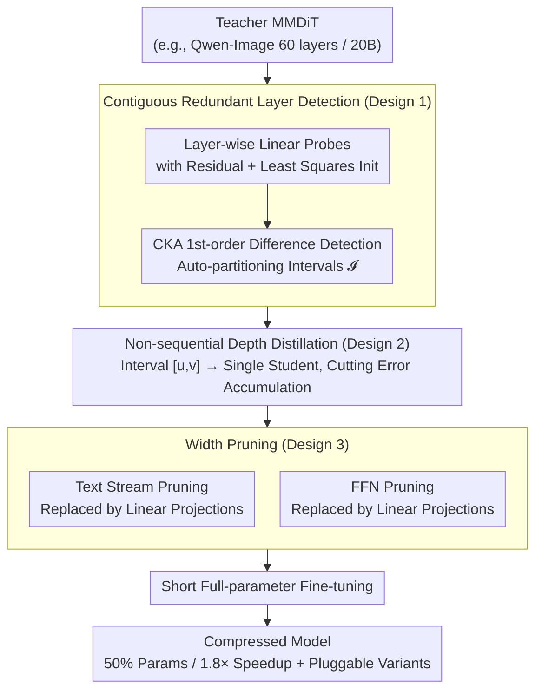

# PPCL: Pluggable Pruning with Contiguous Layer Distillation for Diffusion Transformers

**Conference**: CVPR 2026  
**arXiv**: [2511.16156](https://arxiv.org/abs/2511.16156)  
**Code**: [GitHub](https://github.com/OPPO-Mente-Lab/Qwen-Image-Pruning)  
**Area**: Model Compression / Diffusion Models  
**Keywords**: diffusion transformer, structured pruning, contiguous layer redundancy, knowledge distillation, MMDiT

## TL;DR

The PPCL framework is proposed for structured pruning of ultra-large Multi-Modal Diffusion Transformers (MMDiT, 8–20B parameters). It identifies substitutability via Linear Probes and automatically locates contiguous redundant layer intervals using CKA first-order differences. By employing non-sequential alternating distillation for dual-axis (depth and width) pruning, the method achieves a 50% parameter reduction and 1.8× inference acceleration on Qwen-Image 20B, with an average performance drop of only 2.61%.

## Background & Motivation

**Background**: Recent text-to-image (T2I) diffusion models have transitioned from UNet architectures to Multi-Modal Diffusion Transformers (MMDiT). While SDXL has 2.6B parameters, models like FLUX.1 (12B) and Qwen-Image (20B, 60-layer MMDiT blocks) offer significantly improved generation quality at the cost of high inference overhead.

**Limitations of Prior Work**: (a) Existing structured pruning methods (e.g., TinyFusion, SnapFusion) target UNet architectures and are difficult to migrate to the dual-stream structure of MMDiT; (b) Current methods evaluate redundancy independently per layer (e.g., sensitivity analysis), ignoring functional coupling between adjacent layers in DiTs; (c) In traditional sequential distillation, compression errors from early layers propagate and accumulate, causing the student model representation to deviate significantly from the teacher.

**Key Challenge**: The authors experimentally find that DiT redundancy exhibits **depth continuity**—removing continuous layers has a smaller impact on performance than removing an equivalent number of non-continuous layers. Existing pruning methods do not exploit this property.

**Goal**: Systematically identify contiguous redundant layer intervals in MMDiT and design a distillation scheme that prevents error accumulation to maintain quality under high compression ratios.

**Key Insight**: Traditional layer importance evaluation is replaced with "layer substitutability"—if the input-output mapping of a layer can be approximated by a linear transformation, the layer is functionally redundant relative to its neighbors.

**Core Idea**: Redundant layers in MMDiTs are distributed contiguously along the depth. These can be automatically located and removed as sections via Linear Probes and CKA differences, combined with non-sequential distillation to eliminate error accumulation.

## Method

### Overall Architecture

PPCL decomposes the compression of large MMDiTs into two orthogonal axes: **depth and width pruning**, while utilizing **non-sequential distillation** to suppress error accumulation. The depth axis identifies "which layers to remove": Linear Probes are trained per layer for the teacher model, and CKA first-order differences automatically delineate **contiguous redundant layer intervals** $\mathcal{I} = \{[u_i, v_i]\}$ (Design 1). Each interval is then replaced and independently distilled into a single student layer (Design 2). The width axis further slims the remaining layers by replacing highly similar text streams and over-parameterized FFNs with lightweight linear projections (Design 3). After both processes, a short full-parameter fine-tuning is conducted. Since each depth interval is trained independently, the model allows "pluggable" variants where intervals can be toggled during inference without retraining.

### Key Designs

**1. Contiguous Redundant Layer Detection: Quantifying substitutability via Linear Probes and CKA differences**

The first step in depth pruning is determining which layer segments can be removed. PPCL uses "substitutability" as the core criterion: if a layer's mapping can be approximated by a linear transformation, it is redundant. A **linear probe with a residual structure** $l_i$ is assigned to each teacher layer $T_i$. It is initialized using a least-squares closed-form solution $W_i^* = (T_i(T_{i-1}^D) - T_{i-1}^D)(T_{i-1}^D)^\top(T_{i-1}^D(T_{i-1}^D)^\top)^{-1}$ and fine-tuned with an alignment loss $\mathcal{L}_{fit}(i) = \|l_i(T_{i-1}^D) + T_{i-1}^D - T_i(T_{i-1}^D)\|_2^2$. This ensures each probe's training input matches the layer's actual input, allowing independent evaluation across layers.

To determine if **multiple contiguous layers** can be replaced, the authors leverage the property that the composition of linear transformations remains linear. They compute the CKA similarity between the teacher outputs and a proxy model where contiguous layers are replaced by linear probes. The first-order difference is defined as $\Delta(u,k) = -(\text{cka}(u,k) - \text{cka}(u,k-1))$. The inflection point $v$ where $\Delta$ stops decreasing marks the right boundary of the redundant interval.

**2. Non-sequential Depth Pruning Distillation: Breaking the error accumulation chain**

Each identified interval $[u,v]$ is replaced by a **single student layer** $S^u$. Traditional sequential distillation accumulates error because each student layer receives the output of the previous student layer. PPCL's "non-sequential" (teacher-student alternating) approach forces each interval to **take input directly from the teacher**. Student layer $S^u$ receives the output from teacher layer $T_{u-1}^D$ and aligns with the output of teacher layer $T_v^D$. The loss is defined as $\mathcal{L}_{depth}^{[u,v]} = \|\text{Norm}(S^u(T_{u-1}^D)) - \text{Norm}(T_v^D)\|_2^2$. This independent optimization prevents error propagation. This component reduced performance degradation from 14.5% to 5.22% in ablation studies.

**3. Width Pruning: Compressing Text Streams and FFNs**

Additional redundancy within layers is addressed. **Text stream pruning** replaces redundant text tokens (except QKV projections) with lightweight linear projections $l_p^z$ and $l_p^h$, as CKA analysis shows high similarity across layers for these tokens. **FFN pruning** targets over-parameterized FFNs. Layers with minimal MSE when replaced by linear projections are substituted with $l_q^{img}$ and $l_q^{txt}$. The width distillation loss combines layer-wise alignment $\mathcal{L}_{width}^j$ and linear projection alignment $\mathcal{L}_{linear}^j$.

### Training Strategy

- **Data**: 100k images sampled from LAION-2B-en with detailed captions generated by Qwen2.5-VL.
- **Three-stage Training**: Depth pruning (6k steps) → Width pruning (2k steps) → Full-parameter fine-tuning (1k steps) using 8 × H20 GPUs.
- **Optimizer**: AdamW ($\beta_1$=0.9, $\beta_2$=0.95, weight decay=0.02) with BF16 mixed precision and gradient checkpointing.

## Key Experimental Results

### Main Results: Comparison on FLUX.1-dev

| Method | Params(B) | VRAM(%) | Latency(ms) | DPG↑ | GenEval↑ | B-VQA↑ | UniDet↑ | Avg Drop(%)↓ |
|---|---|---|---|---|---|---|---|---|
| Base model | 12 | 100 | 715 | 83.8 | 0.665 | 0.640 | 0.426 | 0 |
| TinyFusion | 8 | 74.4 | 534 | 77.2 | 0.511 | 0.584 | 0.369 | 13.80 |
| HierarchicalPrune | 8 | 74.4 | 543 | 75.7 | 0.503 | 0.579 | 0.371 | 13.38 |
| Dense2MoE | 12 | 100 | 312 | 73.6 | 0.403 | 0.473 | 0.311 | 21.52 |
| FLUX.1 Lite | 8 | 78.8 | 572 | 82.1 | 0.623 | 0.547 | 0.379 | 6.09 |
| Chroma1-HD | 8.9 | 82.5 | 1714 | 84.0 | 0.593 | 0.621 | 0.339 | 1.02 |
| **PPCL(8B)** | **8** | **74.4** | **535** | **80.0** | **0.605** | **0.615** | **0.391** | **4.03** |
| **PPCL(6.5B)** | **6.5** | **69.2** | **428** | **81.2** | **0.593** | **0.581** | **0.398** | **0.07** |

### Main Results: Comparison on Qwen-Image

| Method | Params(B) | VRAM(%) | Latency(ms) | DPG↑ | GenEval↑ | LongText-EN↑ | LongText-ZH↑ | Avg Drop(%)↓ |
|---|---|---|---|---|---|---|---|---|
| Base model | 20 | 100 | 2625 | 88.9 | 0.870 | 0.943 | 0.946 | 0 |
| TinyFusion(14B) | 14 | 79.4 | 1789 | 80.7 | 0.739 | 0.859 | 0.857 | 8.75 |
| HierarchicalPrune(14B) | 14 | 79.4 | 1786 | 83.3 | 0.766 | 0.884 | 0.881 | 6.49 |
| **PPCL(14B)** | **14** | **79.4** | **1792** | **87.9** | **0.847** | **0.929** | **0.946** | **0.42** |
| **PPCL(12B)** | **12** | **71.4** | **1514** | **83.6** | **0.801** | **0.893** | **0.917** | **3.03** |
| **PPCL(10B+FT)** | **10** | **66.9** | **1462** | **86.7** | **0.828** | **0.902** | **0.931** | **3.29** |

### Ablation Study (Qwen-Image, pruned to ~10-12B)

| Configuration | LongText↑ | DPG↑ | GenEval↑ | Avg | Params(B) | Avg Drop(%)↓ |
|---|---|---|---|---|---|---|
| Original (20B) | 0.942 | 0.885 | 0.854 | 0.894 | 20 | 0 |
| Baseline (CKA+Sequential) | 0.625 | 0.763 | 0.728 | 0.706 | 12 | 18.2 |
| +LP (Linear Probe) | 0.712 | 0.795 | 0.776 | 0.761 | 12 | 14.5 |
| +LP-a (CKA Threshold) | 0.664 | 0.778 | 0.712 | 0.718 | 12 | 19.7 |
| +DP (Non-sequential) | 0.905 | 0.836 | 0.801 | 0.848 | 12 | 5.22 |
| +WP-text (Text Pruning) | 0.915 | 0.846 | 0.819 | 0.860 | 11 | 3.79 |
| +Fine-tuning | 0.916 | 0.867 | 0.828 | 0.870 | 10 | 2.61 |

### Key Findings

- **Contiguous vs. Non-contiguous removal**: On the Qwen-Image 60-layer model, contiguous removal consistently outperformed non-contiguous removal, validating the depth continuity hypothesis of redundancy.
- **Impact of Non-sequential Distillation**: Switching from sequential to non-sequential distillation reduced performance drop significantly (from 14.5% to 5.22%).
- **Pluggability**: PPCL(14B) and PPCL(12B) variants can be derived from the 10B model by swapping student layers back to original teacher layers without retraining.

## Highlights & Insights

- **Contiguous redundancy is an inherent DiT property**: Unlike CNNs where redundancy is scattered, MMDiT layers transition smoothly in representation space, forming functional units that can be removed as blocks.
- **Linear Probes as substitutability metrics**: Compared to direct removal, linear probes provide a stable quantification of linear approximation and cover all layers in a single training pass.
- **Non-sequential distillation is crucial**: Breaking the error accumulation chain contributes more to quality preservation (9pp improvement) than the redundancy detection method itself.

## Limitations & Future Work

- The CKA first-order difference heuristic lacks a rigorous theoretical foundation.
- INT4 quantization performs poorly after PPCL pruning because pruning reduces the network's redundancy and narrows the tolerance for quantization errors.
- Training requires 8 × H20 GPUs; scalability to 100B+ models remains to be verified.

## Related Work & Insights

- **vs. TinyFusion**: TinyFusion uses differentiable gates but ignores layer continuity and suffers from error accumulation in sequential distillation.
- **vs. HierarchicalPrune**: HPP uses coarser importance evaluation resulting in visual artifacts; PPCL maintains significantly better quality at identical compression ratios.
- **vs. Chroma1-HD**: While Chroma1-HD has a low performance drop on FLUX.1, it increases latency by 2.4×, failing to achieve acceleration.

## Rating

- Novelty: ⭐⭐⭐⭐ 
- Experimental Thoroughness: ⭐⭐⭐⭐ 
- Writing Quality: ⭐⭐⭐⭐ 
- Value: ⭐⭐⭐⭐⭐ 

<!-- RELATED:START -->

## Related Papers

- [\[CVPR 2026\] ResCa: Residual Caching for Diffusion Transformers Acceleration](resca_residual_caching_for_diffusion_transformers_acceleration.md)
- [\[CVPR 2026\] BinaryAttention: One-Bit QK-Attention for Vision and Diffusion Transformers](binaryattention_one-bit_qk-attention_for_vision_and_diffusion_transformers.md)
- [\[CVPR 2026\] Trainable Log-linear Sparse Attention for Efficient Diffusion Transformers](trainable_log-linear_sparse_attention_for_efficient_diffusion_transformers.md)
- [\[AAAI 2026\] Distillation Dynamics: Towards Understanding Feature-Based Distillation in Vision Transformers](../../AAAI2026/model_compression/distillation_dynamics_towards_understanding_feature-based_di.md)
- [\[CVPR 2026\] Mitigating The Distribution Shift of Diffusion-based Dataset Distillation](mitigating_the_distribution_shift_of_diffusion-based_dataset_distillation.md)

<!-- RELATED:END -->
