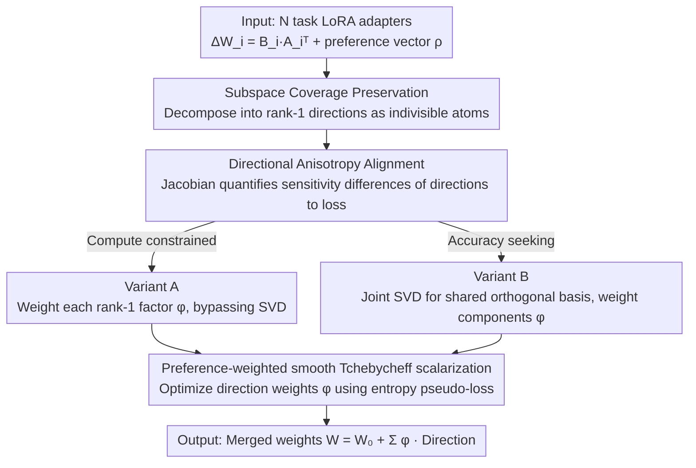

markdown

# Preference-Aligned LoRA Merging: Preserving Subspace Coverage and Addressing Directional Anisotropy

**Conference**: CVPR 2026  
**arXiv**: [2603.26299](https://arxiv.org/abs/2603.26299)  
**Code**: [https://github.com/wooseong97/TARA-Merge](https://github.com/wooseong97/TARA-Merge)  
**Area**: Model Compression/Model Merging  
**Keywords**: LoRA Merging, subspace coverage, anisotropy, multi-objective optimization, model merging

## TL;DR

This paper revisits the LoRA merging problem from the perspectives of subspace coverage and directional anisotropy. It proposes the TARA-Merging framework, which preserves LoRA directions and performs direction-level reweighting using a preference-weighted cross-entropy pseudo-loss, consistently outperforming existing merging methods across 8 vision and 6 NLI benchmarks.

## Background & Motivation

1.  **Background**: LoRA has become the standard for fine-tuning large models. Merging multiple task-specific LoRA adapters into a single universal model (model merging) is an effective alternative for building multi-task systems without expensive joint training.
2.  **Limitations of Prior Work**: Existing merging methods suffer from two types of issues: (1) General methods (Task Arithmetic, TIES, DARE) ignore the low-rank structure of LoRA, and operating directly in the full parameter space leads to severe cross-task interference; (2) LoRA-aware methods (KnOTS, LoRA-LEGO) utilize the LoRA structure but typically address only either coverage or anisotropy.
3.  **Key Challenge**: Update directions of LoRA adapters span different subspaces and contribute unevenly. Naive merging weakens directions critical for certain tasks while overemphasizing relatively unimportant ones.
4.  **Goal**: (a) Subspace coverage—whether the diversity of individual task LoRA directions is preserved after merging; (b) Anisotropy—the sensitivity of different LoRA directions to task losses is non-uniform, requiring fine-grained direction-level control.
5.  **Key Insight**: Effective rank (erank) analysis reveals that LoRA-aware rank-1 stacking preserves approximately 70% of independent task dimensions, whereas interpolation-based merging (e.g., Task Arithmetic) causes severe subspace collapse. Directional sensitivity analysis (Jacobian analysis) shows that sensitivity distributions under different preferences are highly inconsistent.
6.  **Core Idea**: While preserving LoRA rank-1 directions to maintain subspace coverage, directional weights are optimized via preference-weighted smooth Tchebycheff scalarization of the entropy pseudo-loss to address anisotropy.

## Method

### Overall Architecture

The TARA framework takes $N$ task LoRA adapters $\{\Delta W_i = B_i A_i^\top\}$ and a user preference vector $\boldsymbol{\rho}$ as input. The method decomposes each LoRA into rank-1 directions ($\mathbf{b}_{ij}\mathbf{a}_{ij}^\top$) to preserve subspace coverage. Anisotropy analysis demonstrates that different directions have non-uniform sensitivity to loss, requiring per-direction weighting. Based on this, two variants for constructing directions and assigning weights are provided (Variant A weights rank-1 factors directly; Variant B weights components on a shared orthogonal basis from joint SVD). Weights $\phi$ for both variants are optimized using a preference-weighted smooth Tchebycheff scalarization objective (entropy pseudo-loss). The final output is the merged model weights $W = W_0 + \sum_i\sum_j \phi_{ij} \mathbf{b}_{ij}\mathbf{a}_{ij}^\top$.

### Key Designs

**1. Subspace Coverage Analysis and Preservation: Preserving directional diversity of each LoRA prior to merging**

Existing universal merging methods (e.g., Task Arithmetic) interpolate $\Delta W$ directly in the full parameter space, mixing internal low-rank structures of LoRA. This averages out critical task directions, termed "representation capacity loss" by the authors. To quantify this, TARA uses entropy-based effective rank (erank) to measure remaining effective dimensions: rank-1 components of each task are vectorized and stacked. Erank is measured for three stacking modes: independent task summation, LoRA-agnostic $\Delta W$ stacking, and LoRA-aware rank-1 stacking. Results show rank-1 stacking preserves ~70% of independent dimensions, while $\Delta W$ stacking suffers severe subspace collapse due to interpolation interference. This comparison determines TARA's optimization unit: instead of operating on the merged dense matrix, each rank-1 direction $\mathbf{b}_{ij}\mathbf{a}_{ij}^\top$ is preserved as an indivisible atom, solving the coverage problem before merging occurs.

**2. Directional Anisotropy Alignment: Equal-norm directional updates do not equal proportional loss changes**

Preserving directional diversity is insufficient—different rank-1 directions exhibit vastly different sensitivities to task losses. Assigning them equal weights wastes capacity. TARA utilizes the Jacobian of the task loss $J_{i,k} = \langle \nabla f_i(W), S_k \rangle_F$ to characterize this, where $S_k$ is a rank-1 LoRA direction. A larger condition number $\kappa(J)$ indicates more non-uniform sensitivity (stronger anisotropy). Furthermore, the paper defines a directional sensitivity misalignment metric:

$$\xi(\boldsymbol{\rho}_1, \boldsymbol{\rho}_2) = 1 - |\cos(\mathbf{h}(\boldsymbol{\rho}_1), \mathbf{h}(\boldsymbol{\rho}_2))|$$

where $h_k(\boldsymbol{\rho}) = \langle g(\boldsymbol{\rho}; W), S_k \rangle_F$ is the direction-level sensitivity under preference $\boldsymbol{\rho}$. Experiments show high $\xi$ values across different preferences, indicating inconsistent sensitivity distributions. This directly motivates the per-direction reweighting of $\phi_{ij}$.

**3. Two Merging Variants: Balancing speed and precision based on compute budget**

To implement the above insights, TARA provides two variants. Variant A is the most straightforward, assigning a learnable weight $\phi_{ij}$ to each task's rank-1 factor:

$$W_A = W_0 + \sum_i\sum_j \phi_{ij}\, \mathbf{b}_{ij}\mathbf{a}_{ij}^\top$$

It bypasses SVD, making it suitable for compute-constrained scenarios. Variant B performs a joint SVD after horizontally concatenating all adapters to obtain a shared orthogonal basis $\{u_k\}$, then weights each task's component on this basis:

$$W_B = W_0 + \sum_i\sum_k \phi_{ik}\,\sigma_k u_k v_{ki}^\top$$

The shared orthogonal basis decorrelates directions from different tasks, explicitly separating overlaps and interference, resulting in higher precision at the cost of the joint SVD computation. Both variants use the same smooth Tchebycheff scalarization objective for weight optimization.

### Loss & Training

Weight optimization is unsupervised: following the AdaMerging style, the model's prediction entropy $f_i$ on unlabeled data serves as a proxy for task loss, bypassing label dependency. Multiple task losses are aggregated into a single objective via smooth Tchebycheff scalarization combined with user preferences $\boldsymbol{\rho}$:

$$\Psi(\phi, \boldsymbol{\rho}) = \alpha \log\!\Big(\sum_i \exp\big(\rho_i\,|f_i - z_i|\,/\,\alpha\big)\Big)$$

where anchor $z_i$ is the entropy loss using only task $i$'s individual adapter. Larger $\rho_i$ values prioritize the corresponding task in the merge. Training uses AdamW with a learning rate of 0.001, direction weights initialized to 0.4, 500 iterations, and a batch size of 16.

## Key Experimental Results

### Main Results

| Method | Cars | DTD | EuroSAT | GTSRB | MNIST | RESISC45 | SUN397 | SVHN | Avg (Norm. %) |
| :--- | :--- | :--- | :--- | :--- | :--- | :--- | :--- | :--- | :--- |
| TA | 82.1 | 74.3 | 48.7 | 41.8 | 53.4 | 71.5 | 96.6 | 42.0 | 63.8 |
| TIES | 81.0 | 72.5 | 53.8 | 37.4 | 69.0 | 65.3 | 94.8 | 45.3 | 64.9 |
| AdaMerging | 79.5 | 73.5 | 70.9 | 39.7 | 63.0 | 69.0 | 97.8 | 66.6 | 70.0 |
| KnOTS-TIES | 82.7 | 73.7 | 49.3 | 48.9 | 68.9 | 70.9 | 95.5 | 53.8 | 68.0 |
| LoRA-LEGO | 81.1 | 73.0 | 54.4 | 40.3 | 48.6 | 71.5 | 97.3 | 37.1 | 62.9 |
| **TARA-A** | 82.2 | 76.0 | 74.9 | 43.5 | 76.3 | 70.2 | 98.0 | 70.8 | **74.0** |
| **TARA-B** | 86.2 | 78.4 | 76.8 | 42.9 | 82.7 | 75.4 | 98.6 | 69.7 | **76.3** |

### Ablation Study (NLI Tasks, LLaMA-3 8B)

| Method | MNLI | QNLI | SNLI | RTE | SICK | SCITAIL | Avg (Norm. %) |
| :--- | :--- | :--- | :--- | :--- | :--- | :--- | :--- |
| TA | 67.3 | 87.3 | 41.8 | 95.7 | 77.9 | 76.9 | 74.6 |
| AdaMerging | 47.5 | 92.9 | 41.3 | 102.6 | 93.8 | 94.2 | 78.7 |
| KnOTS-TIES | 41.1 | 83.4 | 56.6 | 87.2 | 87.9 | 94.8 | 75.2 |
| **TARA-A** | 51.7 | 92.6 | 41.4 | 102.6 | 95.3 | 94.4 | **79.7** |
| **TARA-B** | 46.8 | 94.1 | 41.4 | 103.4 | 98.1 | 97.8 | **80.3** |

### Key Findings

*   **TARA-B achieves best results across vision and NLI**: Average 76.3% on 8 vision tasks (vs. AdaMerging 70.0%) and 80.3% on 6 NLI tasks (vs. AdaMerging 78.7%), demonstrating the importance of simultaneously addressing coverage and anisotropy.
*   **LoRA-LEGO performs worse than vanilla baselines**: Preserving rank-1 directions without sensitivity-based weighting is insufficient (62.9% vs. 63.8% for TA). Both issues must be addressed.
*   **Generalization to unseen tasks**: After merging on 6 known tasks, TARA-B (52.2%) significantly outperforms TA (42.9%) and KnOTS-TIES (41.8%) in Avg Acc on 2 unseen tasks.
*   **Joint task evaluation**: TARA-B achieves 49.3% Hits@1 (vs. TA 43.5%, AdaMerging 48.1%).

## Highlights & Insights

*   **Unification of two orthogonal perspectives**: Decomposing the LoRA merging problem into "coverage" and "anisotropy" provides a clear and elegant theoretical framework. Prior methods (e.g., KnOTS for coverage, AdaMerging for global weights) addressed only half the problem.
*   **Discovery of directional sensitivity misalignment**: Jacobian analysis quantifies the inconsistency in LoRA directional sensitivity distributions across different preferences, providing solid motivation for direction-level weighting.
*   **Efficiency advantage of LoRA-level operations**: Compared to full-parameter merging, LoRA-level operations significantly reduce memory and computation, enabling gradient-based merging to scale to foundation-model sizes.

## Limitations & Future Work

*   Variant B requires joint SVD of all adapters, which may incur high computational overhead when the number of tasks $N$ is large or LoRA rank is high.
*   Experiments were primarily validated on ViT-B/32 and LLaMA-3 8B; effectiveness on larger models (e.g., 70B+ scale) is unknown.
*   Preference vectors $\boldsymbol{\rho}$ require manual specification; automatic preference discovery would be more practical.
*   The handling of conflicting gradients between tasks (e.g., via PCGrad-style projections) was not considered.

## Related Work & Insights

*   **vs. AdaMerging**: AdaMerging learns layer-wise weights but ignores sensitivity differences within LoRA directions. TARA is more fine-grained at the directional level, while using the same entropy minimization proxy.
*   **vs. KnOTS**: KnOTS addresses coverage via SVD subspace alignment but ignores anisotropy. TARA-B introduces additional direction-level weight optimization on top of SVD.
*   **vs. LoRA-LEGO**: LoRA-LEGO preserves modularity via clustering, but the clustering process may lose critical directional information. TARA preserves all original directions.

## Rating

*   Novelty: ⭐⭐⭐⭐ The identification of the two analysis perspectives and the unified framework design are original, though the implementation is relatively direct.
*   Experimental Thoroughness: ⭐⭐⭐⭐⭐ Extremely comprehensive across vision and NLI tracks, including joint evaluation, generalization testing, and preference sensitivity analysis.
*   Writing Quality: ⭐⭐⭐⭐ Clear theoretical derivation, though the heavy notation can be demanding.
*   Value: ⭐⭐⭐⭐ Actual advancement in the LoRA merging field with open-source code ready for use.

<!-- RELATED:START -->

## Related Papers

- [\[CVPR 2026\] Bridging Domains through Subspace-Aware Model Merging](bridging_domains_through_subspace-aware_model_merging.md)
- [\[ACL 2026\] Evolutionary Negative Module Pruning for Better LoRA Merging](../../ACL2026/model_compression/evolutionary_negative_module_pruning_for_better_lora_merging.md)
- [\[ICLR 2026\] Null-Space Filtering for Data-Free Continual Model Merging: Preserving Stability, Promoting Plasticity](../../ICLR2026/model_compression/null-space_filtering_for_data-free_continual_model_merging_preserving_stability_.md)
- [\[ACL 2026\] LoRA on the Go: Instance-level Dynamic LoRA Selection and Merging](../../ACL2026/model_compression/lora_on_the_go_instance-level_dynamic_lora_selection_and_merging.md)
- [\[ICML 2026\] FRISM: Fine-Grained Reasoning Injection via Subspace-Level Model Merging for Vision–Language Models](../../ICML2026/model_compression/frism_fine-grained_reasoning_injection_via_subspace-level_model_merging_for_visi.md)

<!-- RELATED:END -->
