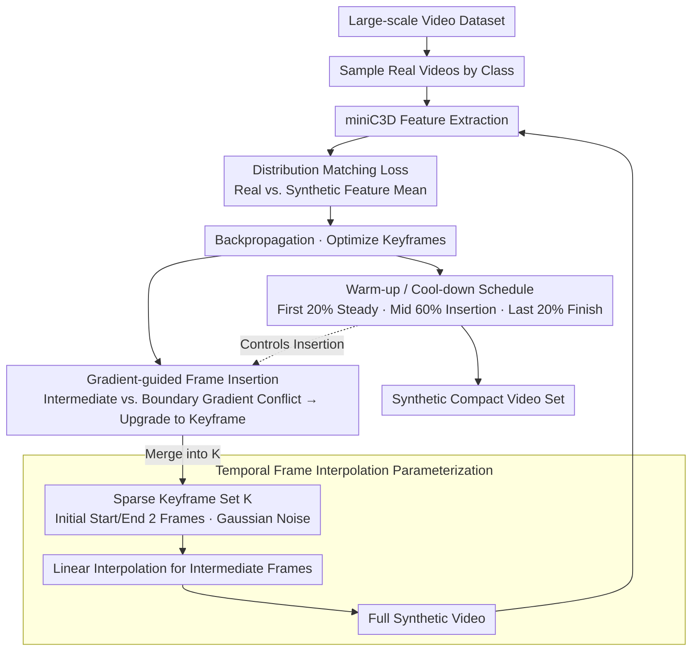

# PRISM: Video Dataset Condensation with Progressive Refinement and Insertion for Sparse Motion

**Conference**: CVPR 2026  
**arXiv**: [2505.22564](https://arxiv.org/abs/2505.22564)  
**Code**: None (No public code mentioned)  
**Area**: Model Compression  
**Keywords**: Video Dataset Condensation, Keyframe Insertion, Gradient Guidance, Spatio-temporal Coupling, Storage Efficiency

## TL;DR

This paper proposes PRISM, a monolithic video dataset condensation method. Starting from only two temporal anchors (first and last frames), it adaptively inserts keyframes by detecting gradient direction conflicts. This approach achieves SOTA storage efficiency while maintaining content-motion coupling integrity—reaching 17.9% accuracy on miniUCF 1VPC with 20MB, which is 5x less than the 94MB required by previous methods.

## Background & Motivation

1. **Background**: Dataset distillation/condensation aims to synthesize a compact set much smaller than the original dataset, allowing models trained on it to approach the performance of those trained on full data. This field is well-studied for images (DC, DSA, DM, MTT, etc.) but remains nearly blank for videos—with only one prior work by Wang et al.

2. **Limitations of Prior Work**: The sole prior work decomposes video into two stages: "static content" (frozen pre-trained images) and "dynamic motion" (auxiliary signals). This separation strategy is fundamentally flawed as content and motion are **inseparable** in real-world actions. For example, a frame of hands together in a clapping motion is identical in static content to a frame where hands begin to separate, but they belong to different motion trajectories.

3. **Key Challenge**: Video data possesses massive temporal redundancy (high similarity between adjacent frames), yet previous methods use a fixed number of frames (e.g., 16 frames) to represent each synthetic video, wasting storage on simple motions while potentially being insufficient for complex ones.

4. **Goal**: (a) Design a monolithic video condensation method that maintains content-motion coupling integrity; (b) Adaptively allocate representation capacity—using more frames only where needed, while linear interpolation suffices for simple motions.

5. **Key Insight**: The authors assume that simple or low-speed motion can be effectively approximated by linear interpolation. Thus, one only needs to identify frames where linear interpolation **fails** (i.e., non-linear spatio-temporal transition points) and upgrade them to keyframes. These frames are identified via gradient direction conflicts—if the gradient of an intermediate frame opposes the gradients of the two bounding keyframes, optimizing the keyframes cannot reduce the loss of that intermediate frame.

6. **Core Idea**: Begin with minimal temporal anchors (first and last frames), identify frames failing linear interpolation by detecting negative gradient cosine similarity during training, and adaptively insert keyframes to achieve "frame-on-demand" video condensation.

## Method

### Overall Architecture

PRISM takes a large-scale video dataset as input and outputs a synthesized compact video set. Each synthetic video is parameterized by a sparse keyframe set $\mathcal{K}$, initially containing only the first and last frames. During training, intermediate frames are generated via linear interpolation; the full video is then fed into a 3D CNN to extract features for distribution matching with real videos. When a gradient conflict is detected, a new keyframe is inserted at that position. Training follows a three-stage schedule: warm-up (stabilizing anchors, 20% iterations) → progressive insertion (60%) → cool-down (fully optimizing selected frames, 20%). All keyframes are initialized from Gaussian noise, reflecting a monolithic synthesis philosophy.

### Key Designs

**1. Temporal Frame Interpolation Parameterization: Compressing the video into a few trainable keyframes, with others generated by interpolation**

Previous methods separated "static content" and "dynamic motion" into two branches for separate optimization, resulting in decoupling. PRISM changes the representation: each synthetic video is parameterized only by a sparse set of keyframes $\mathcal{K}_c^j = \{s_{c,k_1}, ..., s_{c,k_n}\}$. Initially, $n=2$ (first and last frames). Non-keyframes are not stored but are linearly interpolated on the fly: $s_{c,t} = \alpha_t s_{c,k_i} + (1-\alpha_t) s_{c,k_{i+1}}$, where weights $\alpha_t = (k_{i+1}-t)/(k_{i+1}-k_i)$ represent the relative position of $t$ between endpoints. Only keyframes are trainable parameters; intermediate frames are indirectly updated through them. This naturally couples content and motion: moving a keyframe simultaneously changes all dependent interpolated frames, ensuring the entire video is optimized as a whole.

**2. Gradient-guided Frame Insertion: Locating "interpolation failure" points via gradient conflict and upgrading them to keyframes**

Initial anchors only represent uniform linear motion; complex actions require more anchors. PRISM's criterion comes from a straightforward observation: if the loss gradient $\nabla \mathcal{L}(s_{c,t})$ of an intermediate frame $s_{c,t}$ is in the opposite direction of its bounding keyframes' gradients, continuing to optimize the endpoints will only push the intermediate frame further from the target. Thus, for each candidate intermediate frame, the cosine similarities $\cos_i^t$ and $\cos_{i+1}^t$ with adjacent keyframe gradients are calculated. When both fall below a threshold $\epsilon$ (default 0), a "gradient conflict" is detected, and the frame is upgraded from an interpolated frame to a direct trainable keyframe. Lemma 1 provides theoretical grounding: under gradient conflict, no convex combination update of the endpoints can reduce the loss of that intermediate frame. Using cosine similarity (7.5% on HMDB51 1VPC) outperforms L2 pixel distance (6.0%) because direction reflects semantic motion transitions rather than being distracted by lighting or texture changes.

**3. Warm-up and Cool-down Buffering: Providing a "stabilize first, finish later" window for insertion decisions**

At the start of training, gradients are noisy, leading to incorrect frame selection; frames inserted near the end lack sufficient iterations to be optimized. PRISM addresses this with three stages: the first 20% of iterations forbid insertion (warm-up) to stabilize the initial anchors as reliable references; the middle 60% allow progressive insertion; the final 20% again forbid insertion (cool-down) to fully optimize selected keyframes. These buffers control "when to start" and "when to stop" inserting. Ablations show accuracy drops of over 0.7% without warm-up and over 1.0% without cool-down.

### Loss & Training

The optimization objective is distribution matching: $$\min_{\mathcal{K}} \sum_c \|\frac{1}{|\mathcal{B}_c^{real}|}\sum_x f_\theta(x) - \frac{1}{|\mathcal{B}_c^{syn}|}\sum_s f_\theta(s)\|^2$$, where $f_\theta$ is miniC3D (4-layer Conv3D). The training uses SGD with momentum 0.95 and $\epsilon=0$. Synthetic videos are initialized from Gaussian noise. Videos are $112 \times 112$ with 16 frames at a sampling interval of 4.

## Key Experimental Results

### Main Results

| Dataset | VPC | PRISM | Wang et al. | DM | Herding | PRISM Storage | Prev. Best Storage |
|---------|-----|-------|-------------|-----|---------|---------------|--------------------|
| miniUCF | 10  | 31.0  | -           | 30.0| **33.7**| **324MB**     | 1150MB             |
| miniUCF | 5   | **28.0**| 27.2      | 25.7| 26.3    | **133MB**     | 455MB              |
| miniUCF | 1   | **17.9**| 17.5      | 15.3| 13.2    | **20MB**      | 94MB               |
| HMDB51  | 10  | **12.8**| -         | 12.1| 10.8    | **287MB**     | 1150MB             |
| HMDB51  | 5   | **10.5**| 8.2       | 8.0 | 9.0     | **137MB**     | 455MB              |
| HMDB51  | 1   | **7.5** | 6.0       | 6.1 | 3.0     | **22MB**      | 94MB               |

PRISM leads significantly at VPC 1 and 5, with storage requirements only 1/3 to 1/5 of previous methods.

### Ablation Study

| Ablation Item | miniUCF (1VPC) | HMDB51 (1VPC) | Note |
|---------------|----------------|---------------|------|
| Full PRISM    | 17.9           | 7.5           | Baseline |
| No Insertion  | 15.8           | 6.1           | Max drop -2.1, mechanism is critical |
| Random Insert | 16.8           | 6.8           | Gradient vs. Random +1.1 |
| L2 vs. Cosine | 15.7           | 6.0           | Direction vs. Distance +2.2 |
| No warm-up    | 16.1           | 6.8           | Unstable early insertions |
| No cool-down  | 16.9           | 6.3           | Insufficiently trained late frames |
| Init 2 frames | 17.9           | 7.5           | Optimal |
| Init 8 frames | 15.3           | 5.6           | More initial frames are worse |

### Key Findings

- **"Starting with less" is better than "starting with more"**—Initializing with 2 frames is optimal, while 8 frames perform worst. Too many initial frames generate conflicting gradient signals, interfering with the early learning of motion trajectories.
- **Storage efficiency does not grow linearly**—Thanks to adaptive insertion, when VPC increases from 1 to 10, storage grows only by 15x (rather than 10x), as more videos share similar motion complexity.
- **Cross-architecture generalization is an unexpected benefit**—Sparse keyframes reduce overfitting to the specific inductive biases of the training backbone.
- **Semantic quality verified by action retrieval**—On HMDB51, R@1 improved from 22.6% to 38.0%, showing that adaptively inserted frames indeed capture semantically important spatio-temporal cues.

## Highlights & Insights

- **"Start from noise, add frames on demand"**—A fundamental challenge to dense optimization paradigms. Similar to NAS ideas but applied to the temporal dimension.
- **Lemma 1 provides theoretical grounding**—Gradient conflict implies that endpoint updates inevitably increase intermediate frame loss, moving beyond ad hoc heuristics.
- **Monolithic vs. Decomposition**—The clap motion example precisely illustrates why separating content and motion fails. This insight can be extended to other spatio-temporal representation learning tasks.
- **Initialization from Gaussian noise** challenges the common assumption that synthetic data should start from real frames—suggesting that initialization source is less critical if the optimization objective is well-designed.

## Limitations & Future Work

- **Limited handling of extreme motion abruptness**—The linear interpolation assumption may fail in very rapid scene changes, where non-linear interpolation might be needed.
- **Unstable optimization for long sequences (>16 frames)**—Currently only verified on 8/16 frames; longer videos may require segmented processing.
- **Limited Verification**—Only tested on action recognition and retrieval; effectiveness for tasks requiring fine-grained spatio-temporal details (e.g., video generation) is unknown.
- **Fixed Backbone**—Applicability to larger 3D backbones (e.g., Video Swin, TimeSformer) has not been explored.
- **Diminishing returns on larger datasets**—On Kinetics-400 at VPC 5, DM (9.1%) > PRISM (8.1%), possibly because the 8-frame 64x64 resolution setting limits the potential of adaptive insertion.

## Related Work & Insights

- **vs. Wang et al.**: A two-stage decomposition method relying on frozen pre-trained images and motion as auxiliary signals. Ours optimizes everything from scratch monolithically, avoiding content-motion decoupling.
- **vs. DM (Images for Video)**: DM initializes from real frames and optimizes them as independent images. In extremely low-data settings on Kinetics-400, it can outperform PRISM, suggesting real initialization is more stable under high compression.
- **Relation to Image Dataset Distillation**: While the distribution matching objective is from DM, the innovation lies in the sparse representation and adaptive insertion. Future work could combine gradient matching or trajectory matching with PRISM's insertion strategy.

## Rating

- Novelty: ⭐⭐⭐⭐⭐ First monolithic video condensation method; gradient-guided insertion is theoretically grounded and effective.
- Experimental Thoroughness: ⭐⭐⭐⭐ Four datasets, multiple VPCs, cross-architecture, storage analysis, and comprehensive ablations; lacks large model experiments.
- Writing Quality: ⭐⭐⭐⭐ Clear motivation, good integration of theory and experiments, well-designed visuals.
- Value: ⭐⭐⭐⭐ Established a new paradigm for video condensation; 5x storage savings are practically significant.

<!-- RELATED:START -->

## Related Papers

- [\[CVPR 2026\] F²HDR: Two-Stage HDR Video Reconstruction via Flow Adapter and Physical Motion Modeling](f2hdr_two-stage_hdr_video_reconstruction_via_flow_adapter_and_physical_motion_mo.md)
- [\[AAAI 2026\] Post Training Quantization for Efficient Dataset Condensation](../../AAAI2026/model_compression/post_training_quantization_for_efficient_dataset_condensation.md)
- [\[ECCV 2024\] Leveraging Hierarchical Feature Sharing for Efficient Dataset Condensation](../../ECCV2024/model_compression/leveraging_hierarchical_feature_sharing_for_efficient_dataset_condensation.md)
- [\[CVPR 2026\] Progressive Supernet Training for Efficient Visual Autoregressive Modeling](progressive_supernet_training_for_efficient_visual_autoregressive_modeling.md)
- [\[CVPR 2025\] Enhancing Dataset Distillation via Non-Critical Region Refinement](../../CVPR2025/model_compression/enhancing_dataset_distillation_via_non-critical_region_refinement.md)

<!-- RELATED:END -->
