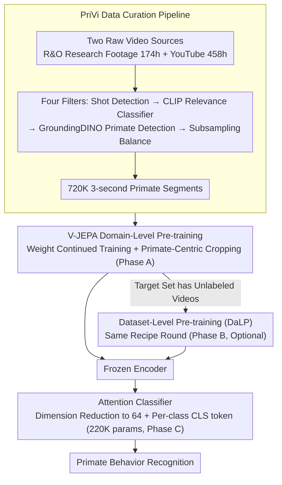

# PriVi: Towards a General-Purpose Video Model for Primate Behavior in the Wild

**Conference**: CVPR 2026  
**arXiv**: [2511.09675](https://arxiv.org/abs/2511.09675)  
**Code**: [https://privi.eckerlab.org](https://privi.eckerlab.org) (Data + Models + Code)  
**Area**: Model Compression  
**Keywords**: Primate behavior recognition, self-supervised pre-training, V-JEPA, domain-level pre-training, data curation pipeline

## TL;DR
PriVi constructs a large-scale primate video pre-training dataset of 424 hours and performs **domain-level pre-training** (non-target dataset level) on V-JEPA. It demonstrates for the first time that domain-level pre-training for video models can generalize across datasets, outperforming specialized models with full fine-tuning on four primate behavior recognition benchmarks using a frozen classifier with only 220K parameters.

## Background & Motivation

1. **Background**: Primate behavior analysis is crucial for cognitive science, evolutionary biology, and conservation ecology. Computer vision methods have the potential to assist behavior analysis, but existing methods primarily rely on human-centric pre-trained models (e.g., Kinetics) and train specialized models for single datasets, which limits generalization.

2. **Limitations of Prior Work**: (a) Pre-training data is human-centric, constituting "out-of-distribution" data for non-human animals like primates; (b) Existing methods typically train models separately for each target dataset (dataset-level pre-training), failing to share knowledge across datasets; (c) Labels are scarce (expert annotation is expensive and limited), requiring methods that can operate with few labels.

3. **Key Challenge**: Language models have demonstrated that domain-level pre-training (pre-training on similar but non-target data) can improve downstream performance, but video models have lacked similar results. The core challenge is the absence of large-scale, diverse primate video datasets and scalable data curation methods.

4. **Goal**: (a) How to curate large-scale primate video datasets without seed datasets and text annotations; (b) Whether domain-level pre-training is effective for video models; (c) How to design a lightweight classifier to efficiently recognize behaviors on frozen features.

5. **Key Insight**: Shifting from "model-centric" to "data-centric," the core hypothesis is that pre-training on sufficiently diverse data within the same domain can provide cross-dataset universal representations, which is more effective than pre-training on each small dataset individually.

6. **Core Idea**: Build a large-scale primate video dataset, PriVi, using a scalable data curation pipeline. Obtain universal primate representations through V-JEPA domain-level pre-training and achieve SOTA on four behavior benchmarks via frozen evaluation.

## Method

### Overall Architecture
The core problem PriVi aims to address is whether, instead of training a specialized video model for each small dataset, we can follow the approach of language models: pre-train once on a vast amount of data in the primate **domain** to obtain a set of cross-dataset universal representations. This is achieved through three steps: first, an automated data curation pipeline gathers 424 hours of primate video; next, V-JEPA is continued on this data to obtain domain-level representations (Phase A); if the target dataset contains unlabeled videos, an additional round of dataset-level pre-training (DaLP) can be performed (Phase B, optional); finally, the encoder is **frozen**, and an extremely lightweight attention classifier is trained on its output features to recognize specific behaviors (Phase C). The entire pipeline relies on "data" rather than "model architecture"—the architecture largely follows V-JEPA, while the novelty resides in the data and the evaluation approach.

### Key Designs

**1. PriVi Data Curation Pipeline: Filtering messy videos into a clean training pool without seed datasets or text annotations**

The biggest obstacle for primate videos is the lack of existing large-scale datasets, and internet videos are "dirty," containing shot cuts, irrelevant frames, and empty shots. Existing automated pipelines often require a high-quality seed dataset as a retrieval anchor or text annotations for alignment—neither of which is available for primate scenarios. PriVi minimizes manual effort (annotating only 2500 images to train a relevance classifier) and lets a funnel-like pipeline clean the data automatically. Data comes from two sources: **R&O research footage** (174 hours) from 11 behavioral ecology projects, and **YouTube** raw videos (458 hours) scraped via primate-related playlists. Raw material passes through four stages: shot detection to discard frequent cuts, a 2-layer MLP relevance classifier on CLIP embeddings (recall 82.8%, precision 90.3%) to filter irrelevant content, GroundingDINO zero-shot primate detection to discard empty segments, and subsampling balance based on the source dataset proportions for R&O subsets. The funnel yields 720K 3-second segments. Since each filter is zero-shot or requires minimal annotation, this pipeline can be adapted to any data-scarce niche domain like marine biology or agriculture.

**2. V-JEPA Domain-Level Pre-training: Primate-centric cropping to focus compute on subjects**

After gathering data, the next step is to "pull" V-JEPA's general video knowledge into the primate domain. PriVi does not train from scratch but continues training V-JEPA ViT-L weights (pre-trained on VideoMix2M) for 75K steps (approx. 8 epochs), with a batch size of 80 and a fixed learning rate of $1.5 \times 10^{-5}$—since the original weights' learning rate had already annealed via cosine decay, restarting a decay was unnecessary. The critical component is the cropping strategy: the random crop center during training is aligned with the primate bounding boxes from the zero-shot detector rather than distributed randomly. This forces the model to spend its representation capacity on individual animals rather than learning background elements like trees and grass. Because this is "continued training" and uses subject-centric cropping to skip background learning, the entire domain-level pre-training takes only 11 hours on 4 A100 GPUs, making the computational cost negligible.

**3. Attention Classifier: Reducing features to 64D with 220K parameters to prevent overfitting on small datasets**

The bottleneck of frozen evaluation is the classification head: the original V-JEPA attention classifier has 12M parameters, and V-JEPA2 has 49M. This parameter scale is designed for large-scale human behavior datasets and is severely over-parameterized for animal behavior datasets with only a few thousand annotations, leading to rapid overfitting. PriVi takes the opposite approach by slimming the classification head to 220K parameters. Specifically, the $N$ patch tokens from the encoder are reduced from $D=1024$ to $D'=64$, then concatenated with $C$ learnable CLS tokens (one per class), followed by 3 layers of self-attention. Finally, each CLS token passes through a linear projection + softmax/sigmoid to yield class probabilities. While reducing to 64D seems like a loss of information, it was the key to success—assigning an independent CLS token to each class ensures that classes do not compete for capacity, avoiding single-point bottlenecks. This design quantitatively demonstrates that "good representations are more important than large classification heads" by beating a 167M parameter model with just 220K parameters.

### Loss & Training Strategy

Pre-training follows V-JEPA's masked prediction loss $L_{JEPA} = \|P(E(\text{Mask}(X))) - \text{Mask}^C(\bar{E}(X))\|_1$, where the predictor reconstructs target encodings of masked regions from visible patches. The downstream classifier uses Cross-Entropy (EQL loss is used for long-tail datasets like BaboonLand to alleviate class imbalance), training for 1–40 epochs depending on dataset size.

## Key Experimental Results

### Main Results

| Method | ChimpACT mAP | PanAf500 B-Acc | BaboonLand B-Acc | ChimpBehave B-Acc |
|------|-------------|---------------|-----------------|------------------|
| X3D | 27.05 | 50.35 | 31.41 | 62.8 |
| VideoMAEv2 | - | - | - | 74.8 |
| VideoPrism-g | 31.5 | - | - | - |
| V-JEPA (Human Data) | 36.33 | 56.69 | 26.99 | 68.41 |
| **Ours** | **39.25** | **62.75** | **33.99** | **71.30** |
| **Ours + DaLP** | **40.00** | **62.96** | **38.57** | **75.14** |

Ours surpasses existing methods across all four datasets, including specialized models with full fine-tuning (e.g., ChimpVLM with 167M parameters).

### Ablation Study

| Configuration | ChimpACT mAP | PanAf500 B-Acc |
|------|-------------|---------------|
| V-JEPA Baseline | 32.00 | 71.95 |
| + DaLP: ChimpACT | 35.86 | - |
| YT-Random (Unfiltered) | 33.87 | 71.61 |
| YT-Filtered (Filtered) | 37.88 | 76.33 |
| R&O Only | 33.01 | 73.85 |
| **Ours (YT-F + R&O)** | **38.75** | **79.95** |
| No Primate Cropping | 32.62 | 72.93 |
| No Dim Reduction (37.84M params) | 30.15 | 62.52 |

### Key Findings
- **YouTube Relevance Filtering is Essential**: YT-Filtered shows a significant performance gain over YT-Random, validating the importance of data curation.
- **Domain-Level > Dataset-Level Pre-training**: Ours outperforms pre-training solely on target datasets across both benchmarks, with no cross-dataset negative transfer.
- **Primate-Centric Cropping is Critical**: Removing it leads to a 6.13-point drop in ChimpACT mAP.
- **Dimensionality Reduction Helps**: The 37.84M parameter model without dimensionality reduction performed the worst (30.15 mAP), suggesting fewer parameters are better for small datasets.
- **Strong Performance with Few Labels**: With only 10% of training data, PriVi loses only 4.4% accuracy (PanAf500), still outperforming full-training X3D.
- Both data components (YT-Filtered and R&O) contribute, with their combination providing further gains.

## Highlights & Insights
- **First proof of effective domain-level pre-training for video models**: Previously only validated for language models. This implies similar pre-training datasets can be built for other specialized domains (e.g., marine life, agriculture).
- **Extremely lightweight frozen classifier**: Using only 220K parameters while outperforming 167M parameter fully fine-tuned models proves that superior representations matter more than large heads.
- **Practicality of the data curation pipeline**: Requires no seed datasets or text annotations and only 2500 labeled images, making it easily transferable to other animals or domains.
- **64D dimensionality reduction design**: Counter-intuitive but effective—for small datasets, reducing classification head parameters is the key to preventing overfitting.

## Limitations & Future Work
- PriVi covers only 11 research contexts with limited primate diversity (mainly macaques and chimpanzees).
- Evaluations were conducted only on chimpanzee and baboon datasets; other primates remain unverified.
- 3-second segments may be insufficient for long-term behaviors (e.g., social interaction sequences).
- Vision-Language Models (e.g., CLIP fine-tuning) were not explored as alternatives.
- 14% of R&O data is not publicly available due to privacy concerns.

## Related Work & Insights
- **vs VideoPrism**: VideoPrism-g achieved only 31.5 mAP on ChimpACT, while PriVi reached 40.0. This suggests domain-specific data is more effective than general large-scale data.
- **vs ChimpVLM**: ChimpVLM, a fully fine-tuned 167M parameter VLM, reached 61.94 B-Acc on PanAf500; PriVi achieved 62.96 with a 220K frozen classifier. This shows good pre-training data > large model fine-tuning.
- **vs AlphaChimp**: On ChimpACT without GT detections, SAM3 + PriVi (30.76 mAP) outperformed AlphaChimp (25.35), demonstrating the practical value of combining zero-shot detection with frozen features.

## Rating
- Novelty: ⭐⭐⭐⭐ First to verify the effectiveness of video domain-level pre-training; practical data curation pipeline.
- Experimental Thoroughness: ⭐⭐⭐⭐⭐ Very comprehensive, covering four datasets, classifier ablation, data ablation, low-label experiments, and cross-shot generalization.
- Writing Quality: ⭐⭐⭐⭐ Clear structure and sufficient experiments, though some notations and formulas could be further simplified.
- Value: ⭐⭐⭐⭐ High impact for animal behavior analysis; methodology is generalizable to other professional vision fields.

<!-- RELATED:START -->

## Related Papers

- [\[ICML 2025\] LightGTS: A Lightweight General Time Series Forecasting Model](../../ICML2025/model_compression/lightgts_a_lightweight_general_time_series_forecasting_model.md)
- [\[CVPR 2026\] Ultra-Fast Neural Video Compression](ultra-fast_neural_video_compression.md)
- [\[CVPR 2026\] Generative Video Compression with One-Dimensional Latent Representation](generative_video_compression_with_one-dimensional_latent_representation.md)
- [\[CVPR 2026\] UniComp: Rethinking Video Compression Through Informational Uniqueness](unicomp_rethinking_video_compression_through_informational_uniqueness.md)
- [\[CVPR 2026\] Content-Adaptive Hierarchical Hyperprior for Neural Video Coding](content-adaptive_hierarchical_hyperprior_for_neural_video_coding.md)

<!-- RELATED:END -->
