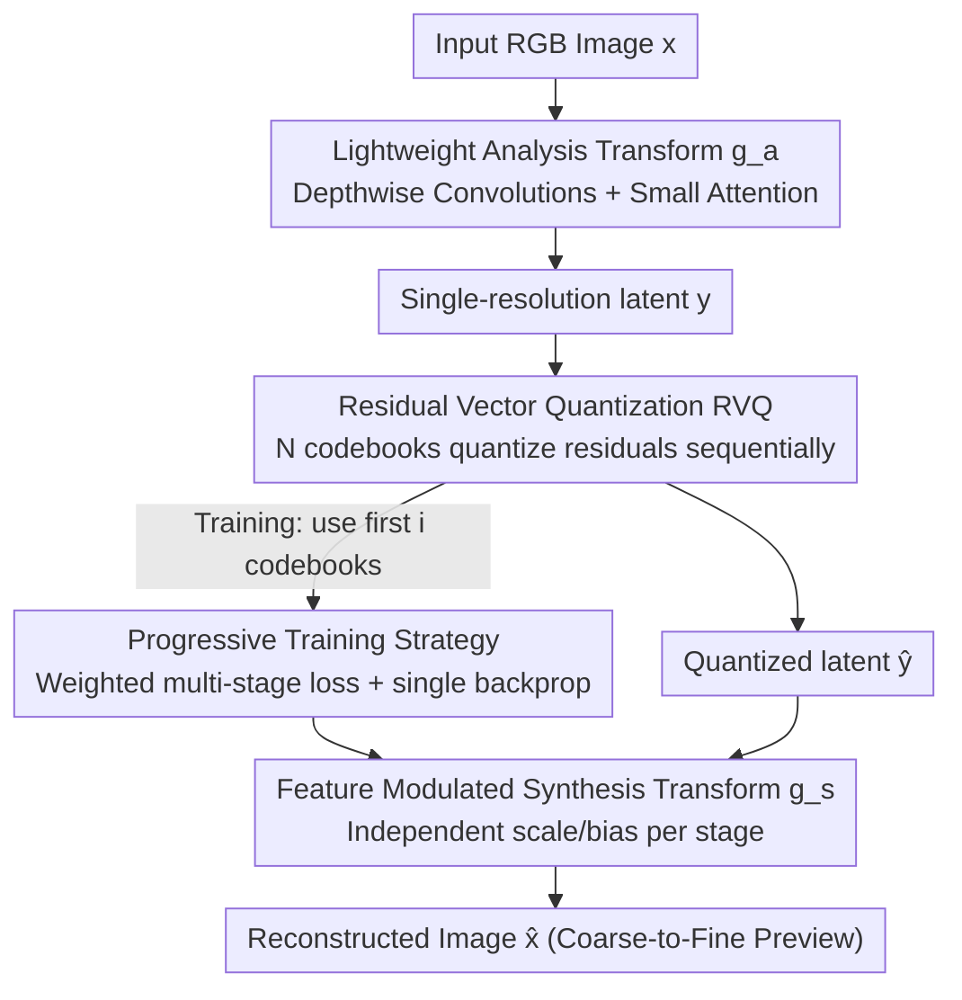

# ProGIC: Progressive and Lightweight Generative Image Compression with Residual Vector Quantization

**Conference**: CVPR 2026  
**arXiv**: [2603.02897](https://arxiv.org/abs/2603.02897)  
**Code**: None (Supplementary material includes mobile demo; repository not public)  
**Area**: Model Compression / Generative Image Compression  
**Keywords**: Generative Image Compression, Residual Vector Quantization, Progressive Decoding, Lightweight Backbone, Low Bitrate

## TL;DR
ProGIC represents image latents as the sum of sequentially quantized residuals through Residual Vector Quantization (RVQ). This enables coarse-to-fine progressive previews from partial bitstreams. Combined with a lightweight backbone consisting of depthwise separable convolutions and small attention modules, it achieves 57.57% (DISTS) and 58.83% (LPIPS) BD-rate savings on Kodak compared to MS-ILLM. It performs encoding and decoding over 10 times faster and is capable of running on CPU-only mobile devices.

## Background & Motivation

**Background**: Generative Image Compression (GIC) improves perceptual quality at low bitrates by "synthesizing plausible details." There are three main technical routes: GAN-based (HiFiC, MS-ILLM), VQ-based (mapping low-quality features to high-quality codebooks), and recent Diffusion-based methods (DiffEIC, OSCAR, which leverage pretrained Stable Diffusion). These significantly outperform MSE-optimized traditional or learned codecs (JPEG, VVC, DCVC-RT) in perceptual quality, as the latter exhibit blurring and blocking at low bitrates.

**Limitations of Prior Work**: There are two unavoidable obstacles to the deployment of GIC. First, bandwidth is extremely scarce in low-bitrate scenarios, creating a demand for "usable previews in a short time." However, most existing GIC models require the **entire bitstream** to decode a coherent image—they do not support progressive decoding. The few non-generative codecs that support progressivity do not optimize for perceptual quality. Second, these scenarios often involve edge or mobile devices, but diffusion-based models have parameters ranging from tens of millions to billions and suffer from slow inference (OSCAR requires >80GB VRAM and encounters OOM on DIV2K/CLIC).

**Key Challenge**: It is difficult to simultaneously achieve progressive usability, high perceptual quality, and low computational overhead. Previous VQ-based methods often used a **single codebook**, which has limited representation capacity; meanwhile, multi-codebook designs (multi-scale architectures) naturally fail to support recovery from partial bitstreams. In other words, "progressivity" and "high quality/lightweight" are decoupled in existing structures.

**Goal**: To build a flexible GIC model tailored for both bandwidth-constrained and compute-constrained environments—one that supports progressive previews from partial bitstreams, is lightweight enough for CPUs/phones, and matches SOTA perceptual quality.

**Key Insight**: The authors draw inspiration from **Residual Vector Quantization (RVQ)** used in discrete audio representation (SoundStream, DAC). RVQ uses a sequence of codebooks to progressively encode the residuals from the previous stages; the outputs of all stages are summed to obtain increasingly refined latents. A crucial observation is that the "stage-wise accumulation" structure of RVQ is inherently compatible with "progressive decoding"—using only the first $i$ codebooks yields the reconstruction of the $i$-th stage.

**Core Idea**: Model the image latent as the sum of a "base vector + a sequence of residual vectors" (single-resolution RVQ) to enable coarse-to-fine previews from partial bitstreams. This is paired with a lightweight backbone (depthwise separable convolution + small attention) to achieve progressivity, perceptual quality, and low computational cost simultaneously.

## Method

### Overall Architecture
ProGIC is an end-to-end codec consisting of "Analysis Transform → RVQ Quantization → Synthesis Transform." The input RGB image $\bm{x}\in\mathbb{R}^{3\times H\times W}$ is first downsampled by a factor of 8 via pixel-unshuffle, then further downsampled 2× by the analysis transform $g_a(\cdot)$ to encode a single-resolution latent $\bm{y}$ (final size $\tfrac{H}{16}\times\tfrac{W}{16}$). $\bm{y}$ is passed to the RVQ to be quantized stage-by-stage using $N$ codebooks to obtain $\hat{\bm{y}}$. The synthesis transform $g_s(\cdot)$ then decodes $\hat{\bm{y}}$ back into an image $\hat{\bm{x}}$. The primary computational overhead lies in $g_a$ and $g_s$ (RVQ itself performs inexpensive lookups and additions), so the backbone is designed to be lightweight. Furthermore, "feature modulation" is injected into $g_s$ to adapt the same decoder to different progressive stages.

### Key Designs

**1. Single-resolution Residual Vector Quantization (RVQ): Native Support for Progressive Decoding**

To resolve the conflict between the weak representation of single codebooks and the lack of progressivity in traditional multi-scale multi-codebook designs, ProGIC represents the latent as an accumulation of residuals. The first codebook $\bm{C}_1$ quantizes the original latent to obtain the base vector $\hat{\bm{y}}_1=Q(\bm{y},\bm{C}_1)$, with the residual $\bm{r}_1=\bm{y}-\hat{\bm{y}}_1$. Each subsequent codebook quantizes the current residual. The residual of the $i$-th stage is $\bm{r}_i=\bm{y}-\hat{\bm{y}}_1-\sum_{j=1}^{i-1}\hat{\bm{r}}_j$, which is quantized as $\hat{\bm{r}}_i=Q(\bm{r}_i,\bm{C}_{i+1})$. The final quantized latent is:

$$\hat{\bm{y}}=\hat{\bm{y}}_1+\sum_{i=1}^{N-1}\hat{\bm{r}}_i.$$

Unlike multi-scale designs, RVQ always operates on a **single-resolution** latent for refinement, ensuring efficiency. Crucially, this additive structure inherently supports progressivity—using only the first $i$ codebooks produces a coarser reconstruction of the $i$-th stage. With $N$ codebooks and $2^L$ vectors per book, the bitrate is $\text{BPP}=\tfrac{N\times L}{16\times 16}$. Using $N=5$ and $2^L=1024$, a **single model** can cover 5 BPP levels $\{0.039, 0.078, 0.117, 0.156, 0.195\}$. The authors also found that range coding these indices only saves 0.9% in bitrate (as the distribution lacks statistical redundancy), so **entropy coding is omitted** to reduce latency.

**2. Lightweight Backbone + Small Attention: Compensating Spatial Aggregation for Small $M$**

Since RVQ consumes negligible computation, the complexity resides in $g_a/g_s$. The authors adopt the lightweight backbone from DCVC-RT: stacking "depthwise convolution blocks + Feed-Forward Networks (FFN)" $M$ times (encoder uses $M$ blocks, decoder uses more layers), which is much less complex than ResBlocks. They also replace WSiLU with ReLU to accelerate CPU computation. However, a small $M$ leads to **insufficient spatial aggregation**. Simply increasing $M$ significantly raises complexity. Instead, an **attention module** (ELIC-style, but with $k=3$ depthwise blocks to reduce costs) is inserted after the $g_a$ downsampling layer and before the $g_s$ upsampling layer. This restores spatial aggregation and captures long-range dependencies with minimal overhead, yielding an 11.41% BD-rate reduction in abaltions.

**3. Feature Modulation: Adapting the Decoder to Progressive Stages**

Different progressive stages (defined by the number of codebooks $i$) provide latents with different levels of precision. Using the same decoder parameters for all stages leads to sub-optimal performance. Before the residual connection of each depthwise block and FFN in $g_s$, the authors apply an affine modulation—multiplying by a scale and adding a bias—where **each progressive stage $i$ uses its own independent scale/bias parameters**. This informs the decoder of the current stage, allowing it to adapt to the latent distribution. This adds almost no FLOPs but consistently improves quality (contributing a 2.42% BD-rate reduction).

### Loss & Training
Progressive decoding is implemented via a training strategy: in each iteration, $i$ is sampled from $\{1,\dots,N\}$. For each $i$, the reconstruction $\hat{\bm{x}}_i$ is calculated using the first $i$ codebooks. The losses from all stages are accumulated for a **single backpropagation**. The total loss follows the standard GIC combination—L1 reconstruction + LPIPS perceptual (VGG) + adaptive PatchGAN adversarial + codebook loss (commitment + updates):

$$\mathcal{L}=\sum_{i=1}^{N}\lambda_i\Big(\lVert\bm{x}-\hat{\bm{x}}_i\rVert_1+\lambda_{\text{per}}\mathcal{L}_{\text{per}}+\lambda_{\text{adv}}\mathcal{L}_{\text{adv}}+\lambda_{\text{cb}}\mathcal{L}_{\text{cb}}^i\Big).$$

Stage weights $\lambda_i$ are controlled by a ratio $p$: $\lambda_i=\tfrac{p}{N-1}$ for $i<N$, and $\lambda_N=1-p$, ensuring $\sum_i\lambda_i=1$. A smaller $p$ favors final reconstruction quality, while a larger $p$ prioritizes intermediate previews. Experiments use $p=0.5$. Training is performed on ImageNet with 1% of images sampled per epoch ($256\times256$ crops + flips), using Adam optimizer ($\beta_1{=}0.5, \beta_2{=}0.9$). The learning rate is $10^{-4}$, decaying to $10^{-5}$ after 1.5M steps, for a total of 2M steps with a batch size of 16. Peak VRAM on an A100 is only 12.4GB.

## Key Experimental Results

### Main Results
BD-rate on the Kodak dataset (using MS-ILLM as the 0% baseline; more negative is better) and complexity (A100 GPU, encoding/decoding time per image). BD-rate is measured by LPIPS:

| Method | Enc.(ms) | Dec.(ms) | FLOPs(G) | Params(M) | Kodak BD-rate↓ | CLIC2020 BD-rate↓ |
|------|---------|---------|----------|-----------|----------------|-------------------|
| MS-ILLM (Baseline) | 165.38 | 147.79 | 599.52 | 181.40 | 0.00% | 0.00% |
| HiFiC | 526.51 | 1408.60 | 599.51 | 181.60 | 45.82% | 86.45% |
| Control-GIC | 103.56 | 436.26 | 5816.37 | 130.36 | 33.36% | 136.25% |
| DiffEIC | 210.18 | 4661.74 | 57339.93 | 1379.50 | -37.71% | 4.34% |
| OSCAR | 53.04 | 167.56 | 6485.61 | 1009.30 | -37.31% | – |
| **ProGIC-s (Small)** | **6.13** | **7.66** | 108.28 | 14.44 | -52.73% | -42.76% |
| **ProGIC (Base)** | 7.64 | 10.99 | 333.38 | 33.11 | **-58.83%** | **-51.13%** |

ProGIC is the best across all evaluated datasets and metrics: LPIPS BD-rate reductions are approx. -58.83%/-45.53%/-51.77%/-51.13% on Kodak/Tecnick/DIV2K/CLIC2020 (DISTS BD-rate is -57.57% on Kodak). Parameters are only 33M (base) or 14M (small), a fraction of the diffusion-based OSCAR (1009M) and DiffEIC (1379M). Decoding is 10× faster than OSCAR and even faster than the non-generative DCVC-RT. Visually, ProGIC faithfully restores structures like faces and branches, whereas OSCAR "hallucinates" non-existent details—explaining ProGIC's superior DISTS (sensitive to structural/textural differences).

On CPU (Laptop AMD Ryzen 7840HS, in ms):

| Method | 256² Enc./Dec. | 512² Enc./Dec. |
|------|----------------|----------------|
| MS-ILLM | 121 / 368 | 507 / 1352 |
| OSCAR | 805 / 2530 | 3429 / 9519 |
| **ProGIC** | 76 / 124 | 297 / 515 |
| **ProGIC-s** | **34 / 50** | **107 / 184** |

ProGIC-s is significantly faster than competitors on CPU, even surpassing traditional VVC (VTM). It achieves usable latency on 2021/2022 mobile CPUs (Snapdragon 870, Dimensity 8000) for 256² images (approx. 0.56s enc / 0.68s dec).

### Ablation Study
Tested on Kodak using DISTS index after 1M training steps; "Base" is the lightweight backbone, "ProgDTD" is a retrained non-generative progressive baseline:

| Configuration | BD-rate↓ | Enc.(ms) | Dec.(ms) | Description |
|------|---------|----------|----------|------|
| MS-ILLM | 0.0% | 165.38 | 147.79 | Baseline |
| Base + ProgDTD (PSNR) | 487.18% | 39.31 | 52.46 | Non-generative, poor quality |
| Base + ProgDTD (LPIPS) | -10.28% | 38.37 | 51.38 | Better than MS-ILLM, proves backbone strength |
| Base + RVQ (LPIPS) | -48.10% | 6.23 | 9.33 | RVQ adds -37.82%, 5× faster than ProgDTD |
| + Attention | -56.00% | 7.70 | 10.61 | Attention adds -11.41% |
| + Attention + Modulation | -57.57% | 7.70 | 10.62 | Modulation adds -2.42%, total -14.90% |
| + Entropy Coding | -49.0% (gain only 0.90%)| – | – | Redundancy is low, so abandoned index coding |

### Key Findings
- **RVQ is the core contributor**: Switching from ProgDTD to RVQ under the same LPIPS objective improved BD-rate from -10.28% to -48.10% (+37.82%) and increased decoding speed by 5×. It enhances perceptual quality while reducing latency.
- **Attention > Feature Modulation**: Attention alone provides -11.41% whereas modulation contributes -2.42%. Together they yield -14.90% with almost no latency penalty, proving spatial aggregation is the main bottleneck for small $M$.
- **Codebook Number $N$ Trade-off**: Increasing $N$ expands the bitrate range but can degrade low-bitrate preview quality. $N=5$ was found to be the most balanced for "progressive quality vs bitrate range."
- **Ineffectiveness of Entropy Coding**: VQ indices have near-zero statistical redundancy. Range coding only saves 0.9% bitrate, so it is omitted to reduce latency—a practical difference compared to continuous quantization.

## Highlights & Insights
- **Migration of RVQ from audio to image compression for "native progressivity"**: Single-resolution progressive residual accumulation expands representation capacity (better than single codebooks) while making "first $i$ codebooks = $i$-th preview" a natural extension. This unifies "multi-rate" and "progressive decoding."
- **Competitive GIC without expensive tokenizers**: While diffusion-based methods stack computation on large pretrained models, ProGIC achieves better BD-rates and 10× speed with 14–33M parameters and single-resolution latents.
- **Feature modulation as a low-cost adaptation trick**: Stage-independent scales and biases incur near-zero FLOPs but allow the decoder to sense the current stage. This can be transferred to any "single-model multi-rate/multi-task" scenario.
- **Insights on omitting entropy coding**: VQ indices lack redundancy, making entropy coding gains negligible. This serves as a reminder to avoid blindly applying entropy modeling from continuous quantization to VQ-based compression.

## Limitations & Future Work
- **Bitrate range vs Preview quality**: The conflict remains where increasing $N$ harms low-bitrate preview quality. $N=5$ is a compromise; wider ranges with high preview quality require new ideas.
- **Code not public**: Only a mobile demo was provided in the supplementary material, resulting in a high barrier to reproduction.
- **Perceptual focus vs Fidelity**: Evaluation emphasizes LPIPS/DISTS. PSNR/MS-SSIM/CLIP-IQA are in the supplement, and pixel-level fidelity degradation at ultra-low bitrates is less transparent.
- **Generative risks**: Although it has fewer hallucinations than OSCAR, "synthesized details" driven by GAN/perceptual losses remain a risk in medical or forensic scenarios. Distortion controllability was not discussed.

## Related Work & Insights
- **vs MS-ILLM / HiFiC (GAN-based)**: Uses similar adversarial losses for perceptual quality, but ProGIC uses RVQ to split latents into residual accumulations for "progressive decoding + multi-rate single model" with parameters and latency down by an order of magnitude.
- **vs DiffEIC / OSCAR (Diffusion-based)**: Diffusion methods generate details using SD at the cost of huge models (e.g., OSCAR >1B parameters, >80GB VRAM). ProGIC is faster, smaller, and avoids hallucinations while achieving better BD-rates.
- **vs Control-GIC / DLF (VQ Multi-codebook/Multi-granularity)**: These often use multi-scale codebooks for multi-bitrate support but **lack progressive decoding**. ProGIC's single-resolution RVQ builds progressivity directly into the architecture.
- **vs ProgDTD (Non-generative Progressive)**: ProgDTD supports progressivity but does not optimize for perception. ProGIC's RVQ achieves 37.82% better BD-rate and 5× faster speed.
- **vs SoundStream / DAC (Audio RVQ Source)**: ProGIC transplants the RVQ idea from discrete audio representation to image compression and adds "feature modulation + small attention" to adapt it for images and progressive decoding.

## Rating
- Novelty: ⭐⭐⭐⭐ Adapting RVQ to image compression and demonstrating its native progressive support is a clever combination of single-resolution residual accumulation and feature modulation, though individual components are existing technologies.
- Experimental Thoroughness: ⭐⭐⭐⭐⭐ Evaluated across 4 datasets, multiple metrics, and three levels of complexity (GPU, Laptop CPU, Mobile). Comprehensive ablations (RVQ, attention, modulation, entropy coding, $N$, $p$).
- Writing Quality: ⭐⭐⭐⭐ Clear motivation, good diagrams, and rigorous formulas. Minor typos (e.g., 58.85% in text vs 58.83% in table), but overall very readable.
- Value: ⭐⭐⭐⭐⭐ 14–33M parameters, CPU/mobile-ready, 10× speedup, and outperforming diffusion SOTA in BD-rate makes it highly valuable for low-bitrate edge deployment.

<!-- RELATED:START -->

## Related Papers

- [\[CVPR 2026\] Differentiable Vector Quantization for Rate-Distortion Optimization of Generative Image Compression](differentiable_vector_quantization_for_rate-distortion_optimization_of_generativ.md)
- [\[CVPR 2026\] RDVQ: Differentiable Vector Quantization for Rate-Distortion Optimization of Generative Image Compression](rdvq_differentiable_vq_image_compression.md)
- [\[CVPR 2026\] CADC: Content Adaptive Diffusion-Based Generative Image Compression](cadc_content_adaptive_diffusion-based_generative_image_compression.md)
- [\[CVPR 2026\] Grid Distillation: Compositional Image Distillation via Structured Generative Grids](grid_distillation_compositional_image_distillation_via_structured_generative_gri.md)
- [\[ICML 2026\] RQ-MoE: Residual Quantization via Mixture of Experts for Efficient Input-Dependent Vector Compression](../../ICML2026/model_compression/rq-moe_residual_quantization_via_mixture_of_experts_for_efficient_input-dependen.md)

<!-- RELATED:END -->
