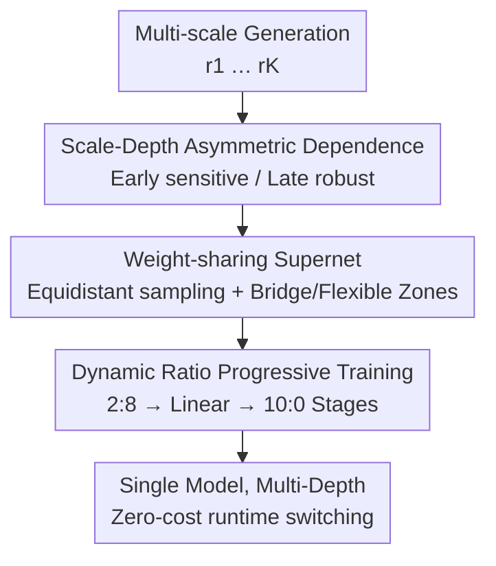

# Progressive Supernet Training for Efficient Visual Autoregressive Modeling

**Conference**: CVPR 2026  
**Paper**: [CVF Open Access](https://openaccess.thecvf.com/content/CVPR2026/html/Chen_Progressive_Supernet_Training_for_Efficient_Visual_Autoregressive_Modeling_CVPR_2026_paper.html)  
**Code**: TBD  
**Area**: Model Compression / Efficient Inference / Visual Autoregressive Generation  
**Keywords**: Visual Autoregressive, supernet, elastic depth, KV cache, progressive training

## TL;DR
VARiant identifies a "scale-depth asymmetric dependence" in Visual Autoregressive (VAR) models: early low-resolution scales are highly dependent on network depth, while later high-resolution scales are robust to depth reductions. Based on this, a 30-layer VAR is trained as a **weight-sharing elastic depth supernet** (early scales use the full network; late scales use 2–16 layer subnets). Using a three-stage dynamic ratio progressive training to break the fixed-ratio Pareto frontier, d16/d8 subnets achieve near-lossless performance on ImageNet (FID 2.05/2.15 vs. 1.95) while saving 40–65% GPU memory.

## Background & Motivation
**Background**: VAR transforms image generation from "next-token" to "next-scale", predicting multi-scale token maps $R=(r_1,\dots,r_K)$ in parallel from coarse to fine. This reduces generation to ~10 steps, an order of magnitude faster than diffusion (50 steps) or traditional AR (100–384 steps), with superior quality.

**Limitations of Prior Work**: The next-scale paradigm suffers from a critical memory issue—generating finer scales requires retaining tokens from all previous scales. The KV cache grows **quadratically** with resolution, becoming a deployment bottleneck. Existing mitigations have trade-offs: Distilled Decoding reduces steps to 1–2 but degrades quality; token/cache compression (FastVAR, HACK) can save 50–70% but requires fine-grained operations and complex implementation; multi-model collaboration (CoDe) assigns different scales to small and large models but requires **deploying two independent models simultaneously**, increasing system complexity and memory footprints.

**Key Challenge**: Reducing memory requires cutting computation (depth or tokens), but VAR scales do not have equal computational requirements. Uniformly reducing depth severely degrades quality at certain scales. Current solutions for scale-differentiated depth allocation rely on multi-model deployment, trading flexibility for system complexity.

**Goal**: Achieve scale-level elastic depth adjustment within a **single model**—allowing differentiated resource allocation to save memory without multi-model complexity, while ensuring both the full network and subnets reach their respective optima.

**Key Insight**: Empirical evidence (Sec 3.2.1) measuring how network depth affects generation quality across scales reveals a strong **scale-depth asymmetric dependence**. Applying a 50% depth subnet to low-res scales $r_1$–$r_3$ causes FID to skyrocket from 1.95 to 12.91 (+10.95), losing global semantics. Conversely, using it only for high-res scales $r_7$–$r_{10}$ yields an FID of 5.42 (+3.47), despite these scales accounting for 87% of inference latency.

**Core Idea**: Low-resolution scales handle global layout/semantics and require deep networks; high-resolution scales refine local textures and are robust to depth reduction. Thus, VAR is trained as a weight-sharing supernet where **early scales use the full network and late scales use shallow subnets**, enabling zero-cost runtime depth switching.

## Method

### Overall Architecture
VARiant trains a $D=30$ layer VAR as a supernet supporting multiple depths. During inference, the $K$ scales are split into two zones based on asymmetric dependence: the **Bridge Zone** ($r_1$–$r_N$) always utilizes the full $D$ layers to preserve global semantics, while the **Flexible Zone** ($r_{N+1}$–$r_K$) selects from a set of discrete subnet depths $I_d$ (e.g., 16/8/4/2 layers). Subnets **share weights with the full network**, making depth a real-time adjustable hyperparameter. Training employs a three-stage dynamic ratio progressive strategy to ensure all configurations converge optimally.

### Key Designs

**1. Scale-Depth Asymmetric Dependence: Locating depth reduction targets**
This empirical foundation identifies which VAR scales tolerate depth reduction. Using a 50% depth subnet on ImageNet-256 at different intervals shows: $r_1$–$r_3$ (early) leads to FID 12.91 (semantic collapse), $r_4$–$r_6$ (mid) leads to 8.5, and $r_7$–$r_{10}$ (late) leads to 5.42 despite covering 87% of latency and reducing FLOPs by 46.7%. Conclusion: Early stages require the representation capacity of deep networks for global structure; late stages are inherently robust to depth reduction.

**2. Weight-sharing Supernet: Equidistant sampling + Cross-scale depth allocation**
To avoid multi-model deployment, depth is made an intra-model hyperparameter. **Equidistant Layer Sampling**: For total depth $D$ and target $d$, layers are selected via $I_d=\{\lfloor i\cdot(D-1)/(d-1)\rfloor\mid i=0,\dots,d-1\}$, ensuring subnets are **nested** ($I_{0.25D}\subset I_{0.5D}\subset\{0,\dots,D-1\}$). **Cross-scale Depth Allocation**: The active layers at step $k$ are $I_k=\{0,\dots,D-1\}$ if $k\le N$ (Bridge Zone) and $I_d$ if $k>N$ (Flexible Zone). This facilitates **implicit knowledge transfer** between subnets and the full network and **cross-scale gradient propagation** for skipped layers via the Bridge Zone.

**3. Dynamic Ratio Progressive Training: Breaking the fixed-ratio Pareto frontier**
Weight sharing causes optimization conflicts: training only subnets degrades the full network, while training only the full network leaves subnets under-optimized. A fixed sampling ratio $p$ results in a trade-off: $p=0.1$ gives best full-net FID (1.96) but poor subnet FID (2.68); $p=1.0$ yields subnet FID 2.15 but degrades the full network to 2.32. To resolve this, a three-stage dynamic ratio $\rho = \text{Subnet}:\text{Full Network}$ is used:
$$\text{Phase 1 (Joint, }\rho=2{:}8\text{)}\;\to\;\text{Phase 2 (Prog. Transition, }p(ep)=0.2+0.8\cdot\tfrac{ep-E_1}{E_2-E_1}\text{)}\;\to\;\text{Phase 3 (Subnet Tuning, }\rho=10{:}0\text{)}$$
Phase 1 solidifies the foundation for all layers. Phase 2 smoothly transitions gradient contributions. Phase 3 specializes the subnets while the Bridge Zone maintains the full-network quality.

### Loss & Training
The objective is scale-wise cross-entropy: $L=\sum_{k=1}^{K}\mathrm{CE}(p_\theta(r_k\mid r_{<k},I_k),r^*_k)$. Based on a pre-trained VAR-d30, the supernet provides 2/4/8/16/30 layer configurations. Stage 1 (5 epochs), Stage 2 (15 epochs), Stage 3 (5–15 epochs). Optimizer: AdamW, LR $1\times10^{-6}$, Batch Size 1024, 8×H100.

## Key Experimental Results

### Main Results
ImageNet 256×256 class-conditional generation using a single 2.0B model. Efficiency measured on a single L20 (batch 64):

| Method | Steps | Speedup↑ | Latency↓ | Memory↓ | KV cache↓ | Params | FID↓ | IS↑ |
| :--- | :---: | :---: | :---: | :---: | :---: | :---: | :---: | :---: |
| DiT-XL/2 | 50 | – | 19.20s | – | – | 675M | 2.26 | 239 |
| LlamaGen-XXL | 384 | – | 74.27s | – | – | 1.4B | 2.34 | 254 |
| VAR-d30 (Base) | 10 | 1.0× | 3.62s | 39265MB | 28677MB | 2.0B | **1.95** | 301 |
| VAR-CoDe (Dual) | 6+4 | 2.9× | 1.27s | 19943MB | 8156MB | 2.0+0.3B | 2.27 | 297 |
| VARiant-d16 | 6+4 | 1.7× | 2.12s | 28644MB | 16092MB | 2.0B | 2.05 | 314 |

*Note: Further results for d8 (2.6× speedup, 65% memory saving, FID 2.15) and d2 (3.5× speedup, 80% memory saving, FID 2.67) are provided in the text.*

### Ablation Study (Fixed vs. Progressive)
| Training Ratio (Sub:Full) | Full-Net FID | Subnet FID | Note |
| :--- | :---: | :---: | :--- |
| 1:9 ($p=0.1$) | **1.96** | 2.68 | Subnet gradient starvation |
| 10:0 ($p=1.0$) | 2.32 | 2.15 | Full-net stagnation |
| Progressive (Ours) | ≈1.95 | ≈2.05 | Breaks the Pareto frontier |

### Key Findings
- **Late scales are the primary pruning targets**: Depth reduction in high-res scales yields massive gains (87% latency coverage) with minimal quality loss.
- **Fixed ratios are suboptimal**: Any constant $p$ forces a compromise; dynamic ratios allow both configurations to reach peak performance.
- **Gradient Bridge is essential**: The Bridge Zone provides consistent gradients to all layers, ensuring full-network stability during Phase 3.

## Highlights & Insights
- **Scale-depth asymmetry is a clean, actionable observation**: It transforms the "where to prune" question into a quantifiable scale-level rule.
- **NAS principles applied to the scale axis**: Unlike traditional elastic depth (per sample/layer), this is per **generation scale**, allowing a single model to serve multiple efficiency-quality targets with zero runtime switching cost.
- **Gradient re-distribution over time**: The three-stage schedule recognizes that training needs shift from broad foundation-building to specialized sub-path optimization.

## Limitations & Future Work
- Primarily validated on **ImageNet class-conditional generation** with VAR-d30; generalization to T2I, higher resolutions, or video variants (Infinity) is unproven.
- Hyperparameters like the Bridge/Flexible boundary $N$ and Stage 3 duration are empirically set; optimal values might vary across datasets.
- **Quality trade-offs in d2**: The extreme efficiency mode shows noticeable quality degradation (FID 2.67).
- Reduces memory and latency but not total parameter count (still a 2.0B model file).

## Related Work & Insights
- **vs. CoDe**: VARiant achieves comparable or better quality using a single model (d4/d8) versus CoDe’s dual-model (2.0+0.3B) setup, reducing system complexity.
- **vs. Distilled Decoding**: Distillation sacrifices quality for steps; VARiant sacrifices late-stage depth, retaining better visual fidelity.
- **vs. Token Compression (FastVAR, HACK)**: These methods are orthogonal; VARiant’s depth-based approach is simpler to deploy and can likely be combined with token-level pruning.

## Rating
- Novelty: ⭐⭐⭐⭐ Asymmetric dependence observation + scale-axis elastic supernet.
- Experimental Thoroughness: ⭐⭐⭐⭐ Strong ablations on schedules and scale zones, though limited to ImageNet.
- Writing Quality: ⭐⭐⭐⭐ Clear progression from observation to architecture.
- Value: ⭐⭐⭐⭐⭐ Highly practical for VAR deployment, offering 40–80% memory savings.

<!-- RELATED:START -->

## Related Papers

- [\[CVPR 2026\] Balanced Dataset Distillation via Modeling Multiple Visual Pattern Distribution](balanced_dataset_distillation_via_modeling_multiple_visual_pattern_distribution.md)
- [\[CVPR 2026\] VVS: Accelerating Speculative Decoding for Visual Autoregressive Generation via Partial Verification Skipping](vvs_accelerating_speculative_decoding_for_visual_autoregressive_generation_via_p.md)
- [\[ICLR 2026\] PTQ4ARVG: Post-Training Quantization for AutoRegressive Visual Generation Models](../../ICLR2026/model_compression/ptq4arvg_post-training_quantization_for_autoregressive_visual_generation_models.md)
- [\[ICCV 2025\] FastVAR: Linear Visual Autoregressive Modeling via Cached Token Pruning](../../ICCV2025/model_compression/fastvar_linear_visual_autoregressive_modeling_via_cached_token_pruning.md)
- [\[CVPR 2026\] QVGGT: Post-Training Quantized Visual Geometry Grounded Transformer](qvggt_post-training_quantized_visual_geometry_grounded_transformer.md)

<!-- RELATED:END -->
