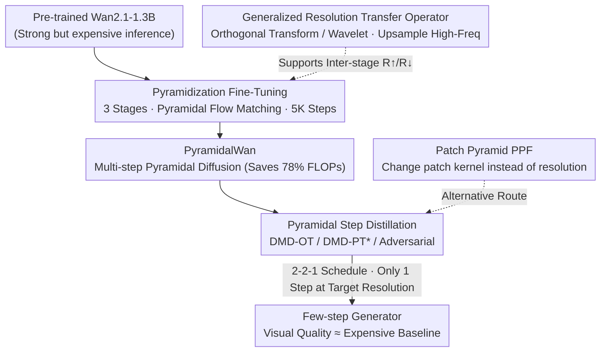

# PyramidalWan: On Making Pretrained Video Model Pyramidal for Efficient Inference

**Conference**: CVPR 2026  
**Paper**: [CVF Open Access](https://openaccess.thecvf.com/content/CVPR2026/html/Korzhenkov_PyramidalWan_On_Making_Pretrained_Video_Model_Pyramidal_for_Efficient_Inference_CVPR_2026_paper.html)  
**Code**: [Project Page](https://qualcomm-ai-research.github.io/PyramidalWan)  
**Area**: Model Compression / Video Diffusion Acceleration  
**Keywords**: Video Diffusion, Pyramidal Flow Matching, Step Distillation, DMD, Efficient Inference

## TL;DR
An **already pretrained** video diffusion model (Wan2.1-1.3B) is converted into a "pyramidal" model via extremely low-cost fine-tuning—where high-noise stages are computed at low resolutions and low-noise stages at high resolutions—slashing inference FLOPs by ~78% with almost no drop in visual quality. On top of this, customized step distillation (DMD / adversarial) designed for the pyramidal structure enables generation with only 1 step run at the target resolution and a few steps at other stages, achieving both generation speed and visual quality close to the expensive baseline.

## Background & Motivation
**Background**: Current video diffusion models (Wan, CogVideo, etc.) have strong visual quality, but multi-step denoising inference is extremely expensive. Two dominant paths for cost reduction exist: **step distillation** (distilling dozens of teacher steps into a few student steps) and **architectural optimization** (quantization, sparsification, etc.). Recently, a third paradigm has emerged: processing the model at **different resolutions for different noise levels**, known as "pyramidal" models.

**Limitations of Prior Work**: The theoretical foundation of the pyramidal paradigm is established by PyramidalFlow, but existing open-source pyramidal video models are **trained from scratch**. Due to limitations in compute scale, their visual quality significantly lags behind state-of-the-art (SOTA) systems. In other words, while the computational savings of pyramidal structures are real, their visual quality cannot yet compete with top-tier models.

**Key Challenge**: Training a competitive pyramidal video model from scratch is too costly, while a vast number of powerful, pre-trained diffusion models already exist in the industry. The question becomes: **Is it possible to "pyramidize" an existing strong model through very cheap fine-tuning without retraining, while maintaining visual quality?**

**Key Insight**: The authors exploit a physical observation—**spectral autoregression**: in spectral decomposition, natural signals naturally have small amplitudes in high-frequency components, which are **the first to be drowned out by noise** during forward diffusion. Since high-frequency information is already absent in high-noise stages, there is no need to compute at high resolutions (= preserving high frequencies) during these stages; instead, the resolution can be reduced to save tokens. This is the fundamental physical basis for the computational savings of pyramidal structures.

**Core Idea**: Starting from Wan2.1-1.3B, the forward and reverse video diffusion processes are decomposed into three spatio-temporal resolution stages using the PyramidalFlow framework. A lightweight fine-tuning of 5K steps with a pyramidal flow matching loss is conducted to achieve "pyramidization". Building on this, various step distillation strategies are systematically studied and adapted to further compress inference to "only 1 step at the target resolution."

## Method

### Overall Architecture
The method is split into two layers. **The first layer is "pyramidization"**: Taking the pre-trained Wan2.1-1.3B, the diffusion process is sliced into $S=3$ spatio-temporal stages with resolutions $81\times448\times832$, $41\times224\times416$, and $21\times112\times208$ (downsampled simultaneously along the temporal, height, and width axes). Stage $i=0$ is the original (highest) resolution processing the cleanest inputs, and stage $i=S-1$ is the lowest resolution processing the noisiest inputs. Full-parameter fine-tuning is performed for 5K steps with a pyramidal flow matching loss (plus a distillation loss to align the student with the teacher), yielding the multi-step pyramidal model **PyramidalWan**, which alone saves 78% of computations. **The second layer is "step distillation"**: Distribution Matching Distillation (DMD) and adversarial distillation are adapted to the pyramidal structure to distill the multi-step teacher into a "2-2-1" few-step generator (2, 2, and 1 steps for low, medium, and high resolutions, respectively, where **only 1 step is required at the target resolution**). There is also a theoretical support piece—the **generalized resolution transfer operator**, which allows arbitrary orthogonal transformations (e.g., wavelets) for inter-stage up/downsampling, and provides an alternative pipeline called the **Patch Pyramid (PPF)**, which reduces tokens by modifying the patch kernel size instead of the resolution.

### Key Designs

**1. Pyramidization Fine-Tuning: Moving High-Noise Stages to Low Resolutions with Flow Matching**

The pain point is that pyramidal models could previously only be trained from scratch and struggled to compete with SOTA visual quality. The authors show that this can leverage pre-trained weights for "free": in the PyramidalFlow framework, each stage $i$ defines two boundary noise levels $\sigma_c^{(i)}<\sigma_n^{(i)}$, corresponding to the cleanest and noisiest ends within that stage. The noisy signal at any intermediate global noise level $\sigma$ is obtained by linear interpolation:

$$x_\sigma^{(i)}=(1-\rho)\,y_c^{(i)}+\rho\,y_n^{(i)},\qquad \rho=\frac{\sigma-\sigma_c^{(i)}}{\sigma_n^{(i)}-\sigma_c^{(i)}}$$

where $\rho$ is the "local noise level" within the stage. The critical constraint of the framework is an inter-stage distribution equivalence relation $\mathcal{R}^\uparrow_{\mathcal{N}}(y_c^{(i+1)})\stackrel{d}{=}y_n^{(i)}$—which means that the cleaner boundary sample from the previous stage, after "upsampling + adding a small amount of non-independent correction noise," equals the noisier boundary sample of the current stage (the correction noise is used to decorrelate adjacent pixels after upsampling). This constraint ensures that each natural noise level $\varsigma$ (natural noise level) is the **only** conditioning value throughout the entire pyramid, independent of the stage index, allowing the denoising network to seamlessly transition across stages. The fine-tuning objective is to let the student $F_\theta$ predict the derivative of the noisy signal with respect to the global noise level (retaining Wan's original flow matching property):

$$\mathcal{L}_{\text{pyr}}(\theta)=\sum_i \mathbb{E}\Big\lVert F_\theta\big(x_\sigma^{(i)},\varsigma\big)-\tfrac{d x_\sigma^{(i)}}{d\sigma}\Big\rVert^2$$

An operational detail is crucial: there are two ways to construct the "clean signal" $x_0^{(i)}$ within a stage—**①** repeatedly downsampling in the VAE latent space, or **②** downsampling in the RGB pixel space first and then encoding with VAE. The authors found that training with ② (pixel-space downsampling) yields significantly better visual quality, which is consistent with the findings of SwD. This step is effective because it does not alter Wan's original denoising capability, but merely redistributes where computational resources are spent based on noise levels. Thus, 5K steps of lightweight fine-tuning are sufficient.

**2. Pyramidal Step Distillation: Distilling the Expensive Teacher into "Only 1 Step at Target Resolution"**

Although pyramidal diffusion already saves 78% of computation, it is still multi-step. The authors adopt Distribution Matching Distillation (DMD) and adversarial distillation into the pyramidal framework, distinguishing between two types of teachers. **(a) Original Teacher (DMD-OT)**: Directly using the non-pyramidal original Wan as the teacher, the student predicts the clean signals at each stage in a single step, then re-noises them according to the teacher's forward process, uses a fake score network to estimate scores, and updates with the DMD gradient. The sample weight $w_{\text{dmd}}=\sigma\cdot\lVert F-\tfrac{d\hat x}{d\sigma}\rVert_1^{-1}$ biases towards samples that are well-denoised by the teacher after re-noising. However, since the original Wan cannot generate videos at the lowest resolution ($i=S-1$), the teacher is first briefly fine-tuned on multi-resolution videos using flow matching before distillation. **(b) Pyramidal Teacher (DMD-PT)**: When the teacher itself is a pyramidal model, DMD needs to be re-derived—because standard DMD relies on estimating noise $\varepsilon$, whereas boundary samples in PyramidalFlow are linear combinations of $\hat y_c,\hat y_n$. By using the identity $\mathcal{R}^\uparrow\!\circ\!\mathcal{R}^\downarrow\!\circ\!\mathcal{R}^\uparrow\!\circ\!\mathcal{R}^\downarrow=\mathcal{R}^\uparrow\!\circ\!\mathcal{R}^\downarrow$, the authors derive a **closed-form expression** for $\varepsilon$, thereby providing the pyramidal DMD gradient $\nabla_\xi\mathcal{L}_{\text{dmd-pyr}}$ with normalized weights $\tilde\beta,\tilde\gamma$. Interestingly, a simplified version (theoretically unjustifiable) that crudely sets weights as $\tilde\beta_1=\tilde\gamma_1=1,\ \tilde\beta_2=\tilde\gamma_2=0$ performs empirically better, denoted as **-PT\***. Inference uses a **2-2-1 schedule** (2, 2, and 1 steps for low, medium, and high resolutions). The key is that **only 1 step is run at the target/highest resolution**—which is precisely the most expensive step, resulting in massive gains.

**3. Generalized Resolution Transfer Operator: Generalizing Up/Downsampling to Arbitrary Orthogonal Transforms**

The original PyramidalFlow's stage transitions only utilized average pooling ($\mathcal{R}^\downarrow$) and nearest-neighbor upsampling ($\mathcal{R}^\uparrow$), with a derived correction noise added after upsampling to decorrelate. The pain point is that this locks the method to the two simplest resampling operators. The authors generalize $\mathcal{R}^\downarrow,\mathcal{R}^\uparrow,\mathcal{R}^\uparrow_{\mathcal{N}}$ to **any orthogonal-transform-based resampling** (e.g., wavelets), pointing out that the average pooling + nearest-neighbor upsampling used in the original work is actually a **specific scaled case of the Haar wavelet operator**, naturally fitting within this unified framework. The core of this generalization lies in **sampling the missing high-frequency components** from Gaussian noise before upsampling. This ensures correct decorrelation and maintains the distribution equivalence of Eq.(5), even when upsampling involves pixel-to-pixel interactions (unlike nearest-neighbor, which is pixel-independent). This is a theoretical contribution that opens the design space of the pyramidal framework from "two fixed operators" to "a family of operators."

**4. Patch Pyramid (PPF): An Alternative Route of Modifying Patch Kernels instead of Resizing Resolution**

Instead of modifying the input resolution of the denoising Transformer, PPF **adjusts the kernel size of the patchifier/unpatchifier according to the noise level**: larger kernels in early (high-noise) stages $\rightarrow$ fewer tokens $\rightarrow$ the heavy Transformer blocks process fewer tokens. The efficiency gains are identical to those of pyramidal flow matching with resolution changes, but the benefit is **bypassing the mathematical derivation of stage transitions**, allowing diffusion training/distillation/inference to run just like the original Wan. The authors' empirical finding is that under a limited training budget, PPF for diffusion-style fine-tuning **cannot beat** PyramidalFlow (even struggling to converge on video), but it remains a strong candidate for **distilling into a few-step generator**—and this work **first** proves that patch pyramid models can be successfully distilled into few-step video generators (even if the PPF diffusion checkpoint that initializes it has poor visual quality, the mode-seeking reverse KL objective of DMD can still recover it).

### Loss & Training
- **Pyramidal Flow Matching Loss** $\mathcal{L}_{\text{pyr}}$ (Eq.7) is used for pyramidal fine-tuning, with local noise $\rho\sim\text{Uni}(0,1)$; it can be superimposed with a distillation loss $\mathcal{L}_{\text{dist}}$ that aligns the student's partially denoised latents to the teacher's prediction.
- **DMD Distillation**: Uses DMD gradients + a flow matching loss $\mathcal{L}_{\text{fm}}$ for the fake score network + a supervised term $\mathcal{L}_{\text{teach}}$ with a weight of 0.01 to stabilize training. DMD-PT/PT\* uses LoRA adapters to prevent divergence.
- **Adversarial Distillation**: Uses a frozen diffusion backbone as a feature extractor $F^\dagger$ + a trainable discriminator head $D_\varphi$ (lightweight dual-branch spatial/temporal convolutions) with Hinge loss. The generator loss is $\mathcal{L}_G=\lambda_{\text{adv}}\!\cdot$Adv $+\lambda_{\text{rec}}\!\cdot$Rec, with an empirical optimum of $\lambda_{\text{adv}}=1,\lambda_{\text{rec}}=2$.
- **Data/Compute**: Trained on 80K videos synthesized by Wan2.1-14B (synthetic data yielded better performance than real videos); the pyramidal models are fine-tuned on only 2×H100 for 5K steps (batch size of 6/GPU, 2 samples per stage). The resolution is fine-tuned from 480×832 to 448×832 to ensure height and width are both divisible by 64, making them compatible with the patch layer of Wan's lowest stage.

## Key Experimental Results

### Computational Cost and Latency

| Inference Method | Schedule (Steps from Low to High Resolution) | TFLOPs ↓ |
|---|---|---|
| Original Diffusion | 0-0-50 | 2×12,592 |
| Pyramidal Diffusion | 20-20-10 | 2×2,821 (~4.5× more efficient) |
| Original Step Distillation | 0-0-2 | 504 |
| Pyramidal Step Distillation | 2-2-1 | 282 |
| Pyramidal Step Distillation | 1-1-1 | 267 |

Single-denoising forward latency: PyramidalWan is 631.77ms for the high-resolution stage, 33.76ms for the medium, and 7.62ms for the low; the 2-2-1 schedule is **43%** faster than 0-0-2, and only 13% slower than 0-0-1.

### Main Results (VBench / VBench-2.0)

| Model | Schedule | VBench Total ↑ | VBench Semantic | VBench-2.0 Total ↑ |
|---|---|---|---|---|
| Wan2.1-1.3B | 50 steps | 82.49 | 78.57 | 56.02 |
| **PyramidalWan** | 20-20-10 | 82.83 | **80.70** (Highest Semantic) | 54.93 |
| Wan-DMD | 2 steps | 83.28 | 80.41 | 56.67 |
| Wan-DMD | 1 step | 79.45 | 74.75 | 53.17 (Visual quality collapses at 1 step) |
| **PyramidalWan-DMD-OT** | 2-2-1 | 82.86 | 79.80 | 55.36 |
| **PyramidalWan-DMD-PT\*** | 2-2-1 | 82.72 | 79.75 | 51.75 |

The multi-step version of PyramidalWan matches the 50-step original Wan in VBench while achieving the highest semantic score, yet saves ~4.5× FLOPs. In the most challenging scenario where "only 1 step is run at the target resolution," few-step pyramidal models bridge the gap where original single-step distillation collapsed: under the 2-2-1 schedule, all models achieve VBench total scores comparable to diffusion models, only slightly lower than Wan-DMD with 2 steps.

### User Study (700 Pairwise Preferences)

| Baseline | Ours % | No Preference % | Baseline % | p-value |
|---|---|---|---|---|
| Wan (50 steps) | 29.1 | 29.1 | 41.7 | <0.001 |
| Wan-DMD (2 steps) | 33.1 | 35.4 | 31.4 | <0.001 |

The authors selected the "visually most pleasing" **DMD-PT\*** (despite its lower VBench-2.0 score) for the user study. A binomial test rejects the hypothesis that the baseline is strictly preferred: humans perceive no significant quality difference compared to the expensive baseline, compensating for the gap in automated VBench-2.0 scores.

### Ablation Study

| Model | VBench ↑ | VBench-2.0 ↑ | Description |
|---|---|---|---|
| PyramidalWan-DMD-PT\* | 82.72 | 51.75 | Simplified DMD objective, empirically best |
| PyramidalWan-DMD-PT\* w/o $\mathcal{L}_{\text{teach}}$ | 82.44 | 52.36 | Removing supervised term increases VBench-2.0 but decreases dynamic degree (motion) |
| PyramidalWan-DMD-PT | 82.56 | 50.67 | Full (non-simplified) DMD-PT objective performs worse |

Note: Removing the distillation loss from PyramidalWan causes VBench-2.0 to drop from 54.93 to 54.02.

### Key Findings
- **The "1-step" Target Resolution is the Sweet Spot for Cost-Performance**: The highest resolution step is by far the most expensive (631ms vs 7.6ms). Squeezing it to 1 step while running more steps in other stages is why the 2-2-1 schedule delivers the highest gain.
- **Simplified Version Performs Better**: The theoretically unjustified DMD-PT\* (keeping only first-order terms) empirically outperforms the full DMD-PT. The authors openly admit they lack an explanation for this, leaving it to future work.
- **Trade-off of Removing the Supervised Term**: Removing $\mathcal{L}_{\text{teach}}$ improves the VBench-2.0 score but noticeably reduces the motion (Dynamic Degree) in the videos, indicating that this term is helpful in maintaining motion amplitude.
- **PPF Struggles to Converge on Video Diffusion**, but can be rescued by distillation—revealing that few-step distillation is much more tolerant of initialization quality than diffusion training.

## Highlights & Insights
- **"Free Lunch" Pyramidization of Pre-trained Weights**: Previous pyramidal models trained from scratch could not beat SOTA. This paper demonstrates that 5K steps of lightweight fine-tuning can pyramidize a strong model without losing visual quality, transitioning this path from a "research toy" into a "production-ready" standard—this is the most practical insight.
- **Mating Spectral Autoregression with Resolution Allocation**: High frequencies are drowned out by noise early on $\rightarrow$ high-noise stages do not need high resolutions $\rightarrow$ allocating computation based on noise levels perfectly aligns physical intuition with engineering payload.
- **Closed-form Noise Estimation Compatible with Pyramidal Teachers**: Leveraging the idempotency of $\mathcal{R}^\uparrow\!\circ\!\mathcal{R}^\downarrow$ to derive a closed-form solution for $\varepsilon$ is the key technical insight for bringing DMD into the pyramidal framework, transferable to other "distillation with resolution switching" scenarios.
- **Divergence Between Quantitative Metrics and Human Perception**: DMD-PT\* achieves lower VBench-2.0 scores but ties with the expensive baseline in user studies. This warns that video generation evaluation should not rely solely on automated metrics.

## Limitations & Future Work
- The authors acknowledge: The model **still lags behind** expensive baselines on **some quantitative metrics (especially VBench-2.0's Creativity and Controllability)**; narrowing this gap is clear future work.
- There is a lack of theoretical explanation for why the simplified DMD-PT\* is better, and the method relies heavily on empirical tuning in multiple places ($\lambda$, LoRA safety against divergence, pixel-space downsampling, etc.).
- Experiments are highly bound to a single backbone (Wan2.1-1.3B) and a single scale, without verifying whether pyramidization is equally lossless on larger models or other architectures.
- Only text-to-video with a fixed 3 stages was tested; the robustness of custom resolution gradients, longer videos, and variable stage numbers remains unexplored.

## Related Work & Insights
- **vs PyramidalFlow [18]**: This paper adopts its framework but differs in: (a) training from scratch $\rightarrow$ **low-cost fine-tuning of pre-trained models** without quality loss; (b) switching stages along a single axis (spatial or temporal) $\rightarrow$ **simultaneous** $\mathcal{R}^\uparrow/\mathcal{R}^\downarrow$ along **all three spatio-temporal axes**; (c) generalizing the transition operators from average pooling/nearest-neighbor to **any orthogonal transform**.
- **vs PPF (Pyramidal Patchification Flow) [21]**: PPF alters the patch kernel instead of the resolution to bypass stage transition derivations. This work empirically shows that PPF struggles to converge on video diffusion compared to pyramidal flow matching, but **first** distills PPF into a few-step video generator.
- **vs SwD [33] / Neodragon [19]** (concurrent work): Both investigate pyramidal step distillation, but SwD does not consider a pyramidal teacher, and Neodragon does not explore PPF training. This paper fills both voids.
- **vs Conventional Step Distillation (DMD / Adversarial / Consistency Models)**: Conventional distillation can compress multi-step to 2 steps, but **collapses at a single step**. The proposed pyramidal model bridges this gap with the "only 1 step at target resolution + a few steps at lower resolutions" combination.

## Rating
- Novelty: ⭐⭐⭐⭐ The combination of "low-cost pyramidization of pre-trained models" + "closed-form derivation of DMD for pyramidal teachers" + "orthogonal transform generalization of transition operators" is highly solid, though the underlying baselines (PyramidalFlow / DMD) are existing frameworks.
- Experimental Thoroughness: ⭐⭐⭐⭐ Dual benchmarks of VBench/VBench-2.0 + 700 user studies + complete FLOPs/latency/ablation analyses; however, restricted to a single backbone and scale.
- Writing Quality: ⭐⭐⭐⭐ Derivations are complete and motivation is clear; dense formulas and stage notations ($\sigma/\rho/\varsigma$) may be slightly daunting.
- Value: ⭐⭐⭐⭐ Provides a practical pyramidization + distillation pipeline for "how to efficiently run existing video models on edge devices," offering high engineering reference value.

<!-- RELATED:START -->

## Related Papers

- [\[CVPR 2026\] Otil: Accelerating Diffusion Model Inference via Communication-Efficient Multi-GPU Parallelism](otil_accelerating_diffusion_model_inference_via_communication-efficient_multi-gp.md)
- [\[CVPR 2026\] PriVi: Towards a General-Purpose Video Model for Primate Behavior in the Wild](privi_towards_a_general-purpose_video_model_for_primate_behavior_in_the_wild.md)
- [\[CVPR 2026\] DeltaQuant: 4-bit Video Diffusion Models with Spatiotemporal Delta Smoothing](deltaquant_4-bit_video_diffusion_models_with_spatiotemporal_delta_smoothing.md)
- [\[CVPR 2026\] Adaptive Video Distillation: Mitigating Oversaturation and Temporal Collapse in Few-Step Generation](adaptive_video_distillation_mitigating_oversaturation_and_temporal_collapse_in_f.md)
- [\[NeurIPS 2025\] Toward Efficient Inference Attacks: Shadow Model Sharing via Mixture-of-Experts](../../NeurIPS2025/model_compression/toward_efficient_inference_attacks_shadow_model_sharing_via_mixture-of-experts.md)

<!-- RELATED:END -->
