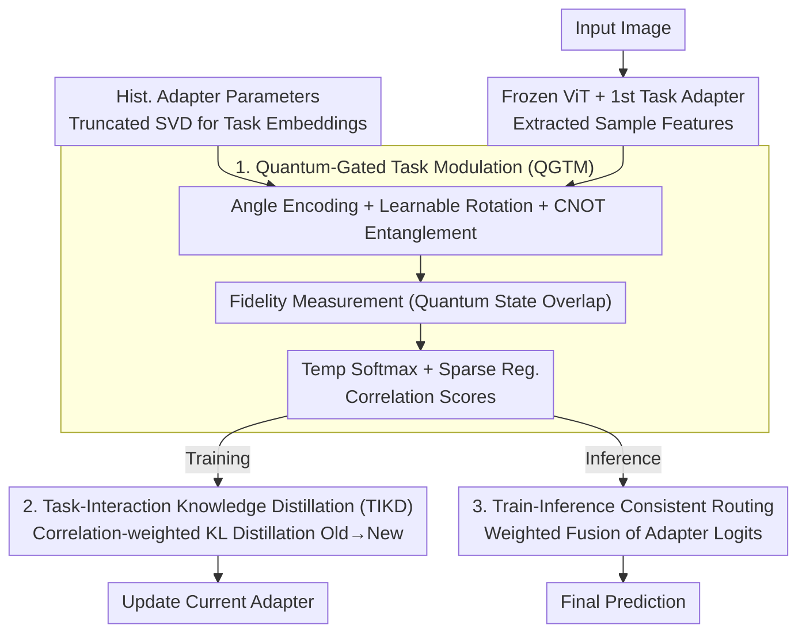

# QKD: Quantum-Gated Task-interaction Knowledge Distillation for Class-Incremental Learning

**Conference**: CVPR 2026  
**arXiv**: [2604.11112](https://arxiv.org/abs/2604.11112)  
**Code**: [https://github.com/Frank-lilinjie/CVPR26-QKD](https://github.com/Frank-lilinjie/CVPR26-QKD)  
**Area**: Physics  
**Keywords**: Class-incremental learning, quantum computing, knowledge distillation, pre-trained models, adapters

## TL;DR
QKD introduces quantum gating to class-incremental learning, modeling sample-task correlations in high-dimensional Hilbert space via parameterized quantum circuits. This guides cross-task knowledge distillation and inference-time adapter fusion, achieving SOTA performance across five benchmarks.

## Background & Motivation

**Background**: Class-incremental learning (CIL) based on Pre-trained Models (PTM) typically freezes the backbone and learns lightweight adapters for each task. Prompt-based methods rely on similarity-based retrieval, while Adapter-based methods assign independent adapters to each task.

**Limitations of Prior Work**: Local similarity retrieval in prompt-based methods yields noisy matches when task subspaces overlap. Adapter-based methods treat adapters as independent subspaces, neglecting cross-task correlations, and heuristic routing/fusion during inference cannot handle entangled subspaces.

**Key Challenge**: There is a lack of an explicit, learnable task interaction mechanism—specifically, how to quantify the correlation between the current sample and each historical task for both training-time knowledge transfer and inference-time adapter selection.

**Goal**: Design a unified learnable mechanism to dynamically quantify sample-task correlations, serving both knowledge distillation during training and adaptive routing during inference.

**Core Idea**: Map sample features and task embeddings into a quantum Hilbert space, leveraging quantum superposition and interference to naturally encode complex multi-way task dependencies.

## Method

### Overall Architecture
QKD addresses the issue where historical adapter subspaces overlap and entangle in PTM-based CIL. Existing methods either rely on cosine similarity for local retrieval (causing mismatches during overlap) or treat adapters as independent boxes (relying on heuristic voting during inference)—lacking a **learnable mechanism to quantify the exact correlation between a sample and each historical task**. QKD utilizes a quantum gating module to compute these correlation scores, ensuring that training and inference **share the same set of scores**.

Specifically, the ViT backbone is frozen, and a lightweight adapter is trained for each new task. For each learned adapter, a compact task embedding is generated using truncated SVD. When an image is input, its sample features are extracted (using the frozen ViT and the first task's adapter). The Quantum Gating Task Modulation (QGTM) module feeds the "sample features + task embeddings" into a parameterized quantum circuit. Measurement yields a set of normalized correlation scores $\{s_t\}$. During training, these scores serve as weights to selectively distill output distributions from old adapters into the new adapter using KL divergence. During inference, the **same set of scores** is used for weighted fusion of the classification logits from all adapters. A single quantum gating mechanism bridges knowledge transfer and adaptive routing.

### Key Designs

**1. Quantum-Gated Task Modulation (QGTM): Quantifying Sample-Task Correlation as Quantum State Fidelity**

When task subspaces are highly overlapped, cosine similarity only considers local angles, and MLPs struggle to fit such multi-way entangled geometric relationships. QGTM uses quantum circuits to encode these relationships: For the $t$-th adapter, its layer-wise parameters are stacked into a matrix, and truncated SVD extracts the principal subspace, aggregated with an all-ones vector into a task embedding state $|\phi_t\rangle$. Sample features are normalized and angle-encoded; $R_y$ rotations inject classical values into quantum states, followed by a learnable rotation gate $R_y(\theta)$ and a CNOT chain for entanglement (stacked across $l_q$ layers) so that correlations between any two feature dimensions are expressed in the superposition state. After obtaining the sample state $|\psi\rangle$, the **fidelity (quantum state overlap) between it and each task state is measured** as $p_t=|\langle\psi|\phi_t\rangle|^2$ for geometric correlation. A sparse regularization term $\mathcal{L}_s=\|\alpha\|_1$ encourages the gate to focus on the most relevant tasks. Finally, scores are normalized via temperature softmax: $s_t=\mathrm{softmax}_t\big(p_t/\tau\big)$. This is effective because Hilbert space dimensions grow exponentially with qubits, and superposition naturally encodes entangled structures where multiple tasks are partially relevant—geometries that classical cosine or MLPs cannot represent.

> ⚠️ Specific gate sequences for QGTM follow the definitions in the original paper.

**2. Task-Interaction Knowledge Distillation (TIKD): High-Correlation Tasks Teach More, irrelevant Tasks Stay Quiet**

Once correlation scores are obtained, how are they applied during training? Naive methods distill all old adapters equally, but irrelevant tasks introduce noise. TIKD computes the output logits $z^{(i)}$ from each old adapter and $z^{(\text{new})}$ from the new adapter for a sample $x$. Using the $s_t$ from quantum gating as weights, a weighted sum of KL divergence terms is performed: $\mathcal{L}_{\text{QKD}}=\sum_i s_i\,\mathrm{KL}\big(\sigma(z^{(i)})\,\|\,\sigma(z^{(\text{new})})\big)$. This forces the new adapter to align its prediction distribution with highly relevant old tasks. Consequently, relevant tasks contribute more transferable knowledge while irrelevant ones are suppressed toward zero—selectively inheriting what should be inherited rather than averaging the entire history.

**3. Train-Inference Consistent Routing: Reusing Gating Scores for Inference Fusion**

Many adapter-based methods suffer from inconsistency between training-time alignment and inference-time heuristic routing (e.g., majority voting or fixed weights), leading to performance drops. QKD reuses the same quantum gating for inference: for a test sample, the same QGTM calculates $s_t$ for all tasks, which is then used directly for the weighted fusion of classification logits. Since the routing mechanism and training-time distillation rely on the **exact same correlation metric**, the optimization objective and execution logic are naturally aligned, eliminating the consistency gap.

### A Complete Example
Suppose tasks 1 (Bird), 2 (Car), and 3 (Airplane) have been learned. Now, for an "Airliner" image: QGTM extracts sample features, passes them through the quantum circuit with the three task embeddings, and measures correlation scores, e.g., $s=[0.1,\ 0.15,\ 0.75]$. It is most relevant to "Airplane," followed by "Bird," and nearly irrelevant to "Car." During training for the new task containing this image, TIKD aligns the new adapter's distribution primarily with the airplane adapter (weight 0.75) via KL divergence, with minimal reference to the others. During inference, the same $[0.1, 0.15, 0.75]$ weights fuse the three adapters' logits, ensuring the airplane adapter dominates the final prediction.

> ⚠️ Scores in this example are illustrative and not from actual experiments.

### Loss & Training
Total loss: $\mathcal{L}_{\text{total}}=\mathcal{L}_{\text{CE}}+\lambda_{\text{kd}}\mathcal{L}_{\text{QKD}}+\lambda_{\text{s}}\mathcal{L}_{\text{s}}$, comprising classification cross-entropy, correlation-weighted KL distillation, and sparse regularization $\|\alpha\|_1$. Only the current adapter and quantum gating network are updated; old adapters remain frozen. Quantum circuit parameters and adapter parameters are trained jointly end-to-end.

## Key Experimental Results

### Main Results

| Dataset | QKD Final Accuracy | Prev. SOTA | Gain |
|--------|---------------|----------|------|
| CIFAR-100 | SOTA | EASE | +Gain |
| CUB-200 | SOTA | MOE-Adapters | +Gain |
| ImageNet-R | SOTA | - | - |

### Ablation Study

| Configuration | Accuracy | Description |
|------|--------|------|
| Quantum Gating | Optimal | Full Model |
| Replace with Cosine | Decrease | Insufficient expressivity |
| Replace with MLP | Decrease | Poor capture of complex dependencies |
| w/o TIKD | Decrease | Missing cross-task knowledge transfer |

### Key Findings
- Quantum gating consistently outperforms cosine similarity and MLP alternatives, proving the superior geometric expressivity of the quantum Hilbert space.
- TIKD becomes more effective as the number of tasks increases, indicating that selective knowledge transfer is critical as subspace overlap intensifies.
- Train-Inference consistent routing is vital; inconsistency leads to significant performance degradation.

## Highlights & Insights
- **Practical Application of Quantum Computing**: It is not "quantum for the sake of quantum"; the geometric properties of Hilbert space are genuinely suited for modeling multi-way task dependencies.
- **Train-Inference Consistency**: The elegant design uses the same set of correlation scores for both distillation and routing.

## Limitations & Future Work
- Quantum circuits are currently simulated on classical computers; efficiency on actual quantum hardware remains unclear.
- SVD computation for task embeddings scales with the number of tasks.
- Future work could explore deeper quantum circuits or integration with real quantum hardware.

## Related Work & Insights
- **vs EASE**: EASE uses class prototype similarity for cross-task alignment, which has limited expressivity.
- **vs MOE-Adapters**: MoE uses majority voting for fusion, lacking sample-level adaptivity.

## Rating
- Novelty: ⭐⭐⭐⭐⭐ First introduction of quantum computing to CIL with strong theoretical motivation.
- Experimental Thoroughness: ⭐⭐⭐⭐ Tested on 5 datasets; ablations prove quantum gating is superior to classical alternatives.
- Writing Quality: ⭐⭐⭐⭐ Clear introduction to quantum background.
- Value: ⭐⭐⭐⭐ Provides a new toolset for CIL.

<!-- RELATED:START -->

## Related Papers

- [\[AAAI 2026\] Compensating Distribution Drifts in Class-incremental Learning of Pre-trained Vision Transformers](../../AAAI2026/model_compression/compensating_distribution_drifts_in_class-incremental_learning_of_pre-trained_vi.md)
- [\[NeurIPS 2025\] Mixture of Noise for Pre-Trained Model-Based Class-Incremental Learning](../../NeurIPS2025/model_compression/mixture_of_noise_for_pre-trained_model-based_class-incremental_learning.md)
- [\[ICML 2026\] AREA: Attribute Extraction and Aggregation for CLIP-Based Class-Incremental Learning](../../ICML2026/model_compression/area_attribute_extraction_and_aggregation_for_clip-based_class-incremental_learn.md)
- [\[ICCV 2025\] Integrating Task-Specific and Universal Adapters for Pre-Trained Model-based Class-Incremental Learning](../../ICCV2025/model_compression/integrating_task-specific_and_universal_adapters_for_pre-trained_model-based_cla.md)
- [\[CVPR 2025\] CL-LoRA: Continual Low-Rank Adaptation for Rehearsal-Free Class-Incremental Learning](../../CVPR2025/model_compression/cl-lora_continual_low-rank_adaptation_for_rehearsal-free_class-incremental_learn.md)

<!-- RELATED:END -->
